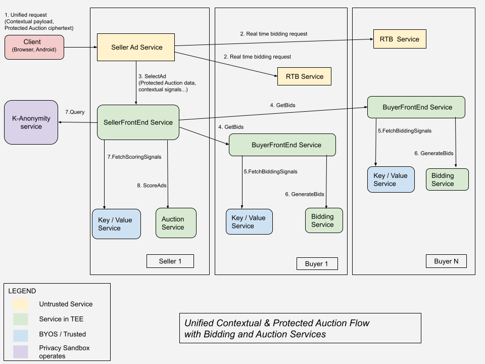
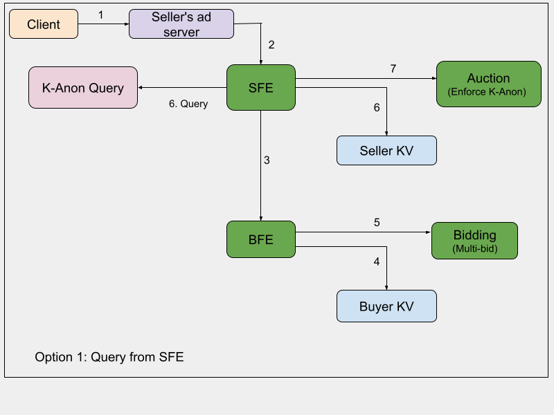
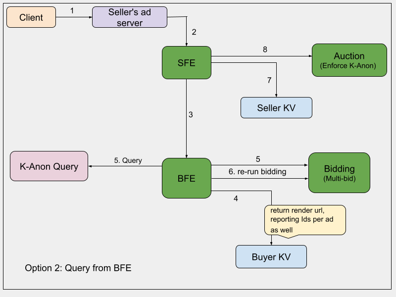
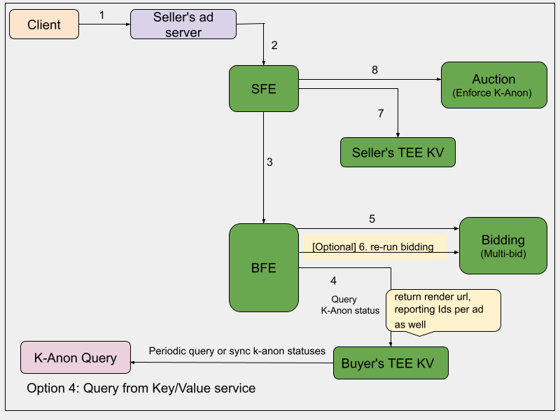

**Authors:**  
[Priyanka Chatterjee][1], Google Privacy Sandbox 
[Salman Malik][2], Google Privacy Sandbox 

# Bidding-Auction services and K-Anonymity integration

This explainer covers the design of [Bidding and Auction Services](https://github.com/privacysandbox/protected-auction-services-docs/blob/main/bidding_auction_services_api.md) integration with [K-Anonymity Server](https://github.com/WICG/turtledove/blob/main/FLEDGE_k_anonymity_server.md) for Protected Auctions.
Protected Auctions covers privacy safe targeting solutions on web browsers and Android apps with [Protected Audience (PA)](https://github.com/WICG/turtledove/blob/main/FLEDGE.md) and
[Protected App Signals (PAS)](https://github.com/privacysandbox/protected-auction-services-docs/blob/main/bidding_auction_services_protected_app_signals.md). The explainer includes a system architecture update for server-side auctions.

## Background

[K-Anonymity](https://github.com/WICG/turtledove/blob/main/FLEDGE_k_anonymity_server.md) protection ensures an ad is served to at least `k` unique users within a period of time, before it is rendered to the user's device. This is primarily to mitigate cross site (or app) leaks with Protected Auctions (Protected Audience, Protected App Signals) and ensuring that an ad or an ad component is shown on at least a minimum number of unique devices. The [K-Anonymity Server](https://github.com/WICG/turtledove/blob/main/FLEDGE_k_anonymity_server.md) is operated by the Privacy Sandbox and the `k`-threshold is determined by the platforms (web browsers and Android OS). There are three service endpoints for K-Anonymity, Sign, Join and Query.

Protected Auctions K-Anonymity introduces the concept of the following:

*   K-anonymity threshold: The value of `k`, that the number of unique devices an ad or ad component is shown.
*   K-anonymity duration: The duration over which K-Anonymity server will maintain a count of the ad or ad component, such that when responding to a `Query` of K-Anonymity status of the ad (or ad component), the count is compared to the `k`-threshold value.
*   Ghost winner: The highest scored ad, if that ad doesn't pass the k-threshold constraint. If the highest-scored ad is k-anonymous, then there is no ghost winner. The ghost winning ad is `Join`ed to increment the counter but not shown on the user's device.

[Bidding and Auction Services](https://github.com/privacysandbox/protected-auction-services-docs/blob/main/bidding_auction_services_api.md) provide a way to run scalable server-side auctions in Trusted Execution Environments (TEE).

## High-level design

In case of server-side Protected Auctions, k-anonymity <code>[Sign and Join](https://github.com/WICG/turtledove/blob/main/FLEDGE_k_anonymity_server.md#system-design)</code> will happen from the client (web browser and Android apps).

*   Client calls the `Sign` endpoint after ad rendering if there is a Protected Auction winner. After signing, the client sends _key-hashes_ received from B&A services for `Join`. The `Sign` call binds each ad with an anonymized token and returns them in response. 
    *   If there is no winning ad to be rendered, the ghost winner is still joined from the device to increment k-anonymity counter.
        *   *Even if a winning ad is rendered, clients still perform a <code>Join</code> for the ghost winner so that the ghost winner's join count increments.*
*   Clients would call <code>Join</code> to increment the counter corresponding to the key hashes of winner and ghost winner (if available) after ad rendering. This can be done periodically, joining all candidates for <code>Join</code> together, or after every ad render event so that auction latency is not impacted.  See [here](https://wicg.github.io/turtledove/#k-anonymity) for details around how clients call the Join API using the hash.
*   Note the following why Signing and Joining is not done from TEE based B&A services:
    *   Join API requires a stable client identifier. This would require sending the stable client identifier over to B&A, that is best avoided for privacy and security reasons.
    *   There are threat vectors around potentially abusing and incrementing the join count of attributes (e.g. render url, ...) to be K-Anonymous. 
*   K-Anonymity Query should happen from B&A for server side auctions and as well as from browser for Chrome on-device auctions. The primary reason why Query needs to happen from B&A is because of [payload optimization](https://github.com/privacysandbox/protected-auction-services-docs/blob/main/bidding-auction-services-payload-optimization.md). The buyer inputs for DSPs do not include ads (adRenderIds) that are sent server side from client, hence the K-Anon status queried from clients can not be sent in the umbrella request payload to B&A.  
    *   The count of an ad will accumulate across on-device and B&A auctions.<em> </em>

<strong>Refer [design options and architecture](#design-options-and-architectures) section for more details. </strong>

## K-Anonymity specifications for Protected Auctions

### Protected Audience

For detailed explanation, refer to the [Protected Audience specification](https://wicg.github.io/turtledove/#k-anonymity).

*   The tuple of interest group owner, name, ad render URL, and `reportWin` UDF URL  - need to be jointly k-anonymous for an ad to be rendered on user's device and reporting URL for the winning buyer to include winning interest group or reporting ID information.
*   **Reporting requirements**
    *   **Event-level reporting:**
        *   The `browserSignals` argument to `reportWin()` (fetched from reporting UDF URL) can include interest group owner name if and only if the elements in the tuple are jointly k-anonymous. Read the [spec](https://wicg.github.io/turtledove/#dictdef-reportingbrowsersignals) to learn more about the  `browserSignals` argument for `reportWin()` and `reportResult()`. Note the following:
            *   `reportResult()`
                *   See [here](https://wicg.github.io/turtledove/#dom-reportingbrowsersignals-buyerandsellerreportingid) for the conditions when buyerAndSellerReportingId is set.
                *   See [here](https://wicg.github.io/turtledove/#dom-reportingbrowsersignals-selectedbuyerandsellerreportingid) for the conditions when selectedBuyerAndSellerReportingId is set.
            *   reportWin()
                *   See [here](https://wicg.github.io/turtledove/#dom-reportwinbrowsersignals-interestgroupname) for the conditions when the Interest Group name is set.
                *   See [here](https://wicg.github.io/turtledove/#dom-reportwinbrowsersignals-buyerreportingid) for the conditions when buyerReportingId is set.
                *   See [here](https://wicg.github.io/turtledove/#dom-reportwinbrowsersignals-kanonstatus) for the specifications on K-Anon status of an ad.
            *  _Note: Given the count of an ad accumulates across on-device and B&A Auctions, the [reportWin() UDF URL used to build K-Anonymity key-hashes must exactly match the reportWin() UDF url Chrome browser has information about][3]._ 
    *   **Event-level forDebuggingOnly:**
        *   Loss pings for the ghost winner won't be sent.
    *   **Private Aggregation:**
        *   Contributions will be sent by the client to ad tech's Private Aggregation service for ghost winners only for `reserved.loss` event type, where `bid-reject-reason = 8` (below k-anonymity threshold). Read the [spec](https://wicg.github.io/turtledove/#determine-a-signals-numeric-value) for more details. Only the bucket and value will be sent back to the client for the ghost winner, contributions are sent for reserved.loss event type.

*   **Multi-seller auction requirements:**
    *   Device-orchestrated component auctions:
        *   Key-hashes and other required data for the winner and/or ghost winner need to be sent back from each component-level auction in encrypted response from B&A. 
    *   Winners and ghost winners from component-level auctions are scored during the top-level auction. 
    *   There is a k-anonymity check at component-level auctions, there is no need for an additional k-anonymity check at the top-level auction.
    *   After the top-level auction:
        *   The highest-scoring winner (that already passed the K-Anonymity threshold during component-level auction) is the final winner.
        *   The highest-scoring ghost winner (that already didn't meet K-Anon threshold during component level auction) is the final ghost winner.
          * _Note: This ghost winner must also score higher than the k-anon winner in the top level auction._

### Protected App Signals

*   The tuple of owner/buyer, ad render URL, reporting UDF URL need to be k-anonymous for an ad to win an auction.
    *   _Note: Currently reporting IDs are not in scope for PAS. If and when they are in scope, those would also need to be jointly k-anonymous._

## Requirements for adtechs

### Requirements for DSPs

Following are the requirements for DSPs.

#### Win reporting UDF URL

<strong>Buyers (DSPs) should ensure <code>biddingLogicURL</code> (for Chrome on-device auctions) and <code>reportWin()</code> UDF URL for B&A are the same.</strong>

*   This is strongly suggested so the k-anonymity counters associated with an ad increments across on-device, B&A and [mixed mode](https://github.com/privacysandbox/protected-auction-services-docs/blob/main/protected_audience_auctions_mixed_mode.md) auctions, which is important for the utility of Protected Audience ads.
*   Eventually in the future, if multiple versions for `reportWin()` needs to be supported, that support should be added for on-device auctions as well, so that versions can be included along with K-Anonymity. At this point, supporting multiple versions of reporting UDF is not in scope of Protected Auctions.
*   If buyers host `generateBid()` and `reportWin()` at different endpoints such that sellers do not get access to buyer's `generateBid()` in Auction Service, the endpoint for `reportWin()` UDF should still remain the same for on-device and B&A auctions for K-Anonymity constraints.

#### Multi-bid generation

Buyers are recommended to return multiple bids per interest group (custom audience) execution at buy-side auction, so that there are higher chances of a bid/ad passing K-Anonymity threshold during K-Anonymity check after ad scoring. The [multi-bid limit][4] would be controlled by the seller and passed in <code>[SelectAdRequest][5]</code> for every ad selection request.

### Requirements for SSPs

#### Multi-bid limit

With K-Anonymity integration, each `generateBid()` can return multiple bids instead of one, this is referred to as multi-bid generation.

SSPs are required to enforce a limit on the number of bids returned by each `generateBid()` execution. 

For Protected Audience, the limit would be enforced on `generateBid()` execution per-interest group. For Protected App Signals (PAS), the limit would be enforced per-buyer `generateBid()` execution.

#### Query API key

The requests to K-Anonymity Query service need to be authenticated with an API key to protect K-Anonymity Query service against abuse.

An API key will be provided to each SSP during Protected Auction services onboarding / enrollment so that TEE based SFE instances can call K-Anonymity Query service.
The SSP would be required to configure the API key in the TEE based SFE's config.

## Design options and architectures

### Multi-bid generation strategy and re-running `generateBid()`

[Multi-bid generation][6] strategy allows a buyer to generate multiple bids for each `generateBid()` execution. This increases the chances of a bid from the buyer to pass the K-Anonymity threshold and limit utility impact. B&A server-side auctions would facilitate multi-bid generation by default where the multi-bid limit can be [configured by the seller][4] per request.

Chrome on-device auctions allow buyers to generate multiple bids during the first buy-side auction. Chrome also re-runs `generateBid()` for buyers with only k-anonymous ads for every IG with only non-k-anonymous bids. Note that `generateBid()` is re-run for an interest group at most twice.

With server-side B&A auctions, re-running `generateBid()` is not preferred to keep overall auction latency low; see [Option 2][7] for more details.

### K-Anonymity Query Integration design

#### [Preferred] Option 1: Query from SellerFrontEnd, parallelize with trustedScoringSignals lookup

**_B&A has implemented this option._**

##### Architecture

##### Establish connection with K-Anonymity Query service

*   SFE ingests K-Anon Query service configuration at startup and pre-warms the connection to the Query endpoint.
    *   K-Anonymity Query service address would be a build time service configuration in SFE. SFE communicating with the K-Anonymity server should contain and use a Privacy Sandbox-issued root of trust (`roots.pem`) file, burned into the trusted server image, that would ensure a secure communication channel.
    *   SFE will send a gRPC request to the Query endpoint. 

##### Cache key-hashes and K-Anon statuses

*   SFE caches K-Anonymity query values in-memory.
    *   Maintain two separate caches, one cache for key-hashes that are K-Anonymous and other cache for key-hashes that are non K-Anonymous:
    *   K-Anonymous key-hashes are cached with a 24 hours TTL.
        *   *Note: K-Anon server resets K-Anonymity status of key-hashes every 30 days since a <code>Join</code>. Therefore, this is a rolling window that gets extended with every <code>Join</code> up-to 90 days. Considering that if B&A or browser caches K-Anonymous key-hashes for 1 day while those become non K-Anonymous in K-Anonymity server, this is not considered a privacy degradation.*
    *   Non-K-Anonymous key-hashes are cached with shorter ~3 hours TTL
        *   <em>Note: Since the K-Anonymity pipeline runs hourly, a non-K-Anonymous key-hash can not be K-Anonymous in less than 1 hour. Therefore, in this case, the TTL should be strictly greater than 1 hour.</em>
    *   Cache update: After retrieving the k-anon status of key-hashes, SFE will schedule a thread to update the cache. This way the main thread in SFE that is running the auction is not blocked and can continue to send ads for scoring to auction service and then process the auction results.
    *   Look-aside: The caches will be look-aside i.e. the caller will be responsible for taking an action in case of a cache miss and the cache itself will not do a lookup to k-anon service on the caller’s behalf. This is to make sure that the caller can run batch queries (instead of point queries for each hash) to k-anon service where the caller will first determine all the hashes that are not present in the cache and then send them for query to the k-anon service.
        *   Look-through cache can be an alternative to better batch the key-hashes if the k-anon status resolution can be delayed. In this case, periodic queries to the k-anon service can be sent. However, this may have a negative impact on adtech’s utility and hence not preferred.
    *   <em>Cache eviction policy: </em>SFE will evict the least recently used (LRU) key-hash from the cache when the cache is full and more hashes need to be stored.
        *   Other alternatives are FIFO (but it suffers from Belady’s [anomaly](https://en.wikipedia.org/wiki/B%C3%A9l%C3%A1dy%27s_anomaly) which can cause more cache misses upon cache size changes) or random.
    *   Metrics will be added for cache hit and miss that will be available in cloud monitoring / telemetry dashboards. 
    *   <em>Note: </em>
        *   <em>VM instance restarts or service deployment / upgrades would lead to loss of state. In case of cold cache, there would be a <code>Query</code> lookup for all key-hashes corresponding to bids in the request path.</em> 

##### Handle multi-bids and K-Anonymity check

*   Buyers participating in an auction, returns bids (`AdWithBid`) in GetBids response to SFE. This option facilitates [multi-bid generation][8] only.
    *   This option can not allow a way to re-run generateBid() with interest groups that include only those ads that are K-Anonymous. This is because the K-Anon statuses of ads are not known on the buyer side at that point but instead later looked up from SFE.
*   Upon receiving `GetBidsResponse` from buyers participating in the auction:
    *   SFE looks up `trustedScoringSignals` from seller Key/Value service.
    *   In parallel to seller Key/Value service lookup, SFE looks up in-memory cache for the key-hashes corresponding to bids / render URLs. 
        *   For the key-hashes that had a cache miss or in case of cold caches, sends an async request to QuerySets endpoint batching those key-hashes.
            *   A timeout of less than 50 ms would be enforced on `Query` requests. `Query` calls won't be retried.
            *   If `Query` call is timed out, bids would be considered non K-Anonymous, this is so that K-Anonymity counters can be bootstrapped for ghost winners. 
        *   Key-hashes of the k-anonymity keys are calculated as in the [Protected Audience spec](https://wicg.github.io/turtledove/#compute-the-key-hash-of-reporting-id) for `Query` from B&A and `Join` from clients.
    *   Batch query service responds with only those sets (`adRenderUrls`) that are K-Anonymous.
    *   SFE sends all bids, including those that are not K-Anonymous to the Auction service. 
        *   For the `renderUrls` / key-hashes that are K-Anonymous, SFE sets a K-Anonymity field for those to `true`, otherwise that is set to `false` in `AdWithBid`.
        *   All render URLs / bids whether or not they are K-anonymous are sent to Auction Service so that ghost winners can be determined which are sent back to device for joining and incrementing the K-Anonymity counter, so that these ads can be K-Anonymous eventually. See [this section][9] for more details around K-Anonymity check.

##### Pros
*   This option is optimized for latency. There is incremental latency because the `Query` call would be parallelized with `trustedScoringSignals` lookup. 
*   The multi-bid generation strategy can keep latencies lower by not [re-running generateBid()][8], while ensuring no considerable impact on utility. Note the [multi-bid limit][4] is controlled by the seller.

##### Cons
*   Batching key-hashes corresponding to interest groups can have privacy impact if K-Anon  
    server is compromised and logs are shared with ad techs.
    *   However, given K-Anonymity service is considered trusted and has a high security bar, there is a low likelihood of such abuse attack. The privacy characteristics of batching interest groups is comparable with batched `trustedBiddingSignals` lookup and batched `trustedScoringSignals` lookup from BYOS Key/Value service that Protected Audience auctions depend on.

### Alternate Query integration design options

Following are alternate design options on K-Anonymity Query service integration and caching K-Anonymity statuses. With these options, the [handling of multi-bid response and K-Anonymity check][10] should remain the same as [Option 1][11].

#### Option 2: Query from BuyerFrontEnd in request path

_To keep the architecture diagram simple, the call from the seller's ad server to RTB buyers is not shown in the following diagram. The existing steps in the B&A architecture are numbered and new flows are annotated. The specific changes would be in step 4, 5, 6 for the above architecture._

In this architecture, BFE can depend on K-Anon Query service to fetch K-Anon statuses of ads and maintain two in-memory caches of K-Anonymous and non-K-Anonymous key hashes. 

*   B&A could extract the `adRenderUrls`, reporting IDs from `trustedBiddingSignals`. In parallel:
    *   Run the initial `generateBid()` call to get the non-K-anonymous bids. Buyers have the option to return multiple bids.
    *   Query the k-anonymity status of key-hashes in case of cache miss.

##### Pros
*   This closely matches the behavior on-device, re-running an auction when a bid is not k-anonymous

##### Cons
*   This would deviate from B&A's [payload optimization](https://github.com/privacysandbox/protected-auction-services-docs/blob/main/bidding-auction-services-payload-optimization.md#payload-optimization-guide-for-buyers--dsps) strategies. Ad render URLs need to be sent back from the K/V Service instead of reconstructing them in `generateBid()` for the final bids after buyside auction.
*   To ensure there is no impact to latency when parsing `trustedBiddingSignals`, this would require a considerable spec change for `trustedBiddingSignals` response.
*   If the Query service latency is longer than `generateBid()` execution latency, this may be slow for uncached ads.
*   Re-running `generateBid()` can lead to increase in latency.

_Note: We are seeking feedback from the ecosystem on this design option._

#### Option 3: Periodically query from BuyerFrontEnd

*   In a periodic background thread, BFE would prefetch all ads (`adRenderUrls`) from a buyer-owned creative server.
*   Then BFE would prefetch K-Anon statuses for ads owned by the buyer, maintain / update K-Anon cache with TTL in `O(hours)`. The cache could be in-memory or distributed / global.
    *   If the cache is distributed / global, that will additionally require encryption of data at rest.
    *   BFE would send the batch query in a periodic background thread, every few hours depending on desired freshness of query data. 
*   [Multi-bid generation][6] (and re-running `generateBid()` if preferred by the buyer) can happen similarly to other options. 
*   Then add the K-Anon status for each ad/bid in the `AdWithBid` object and return in `GetsBidResponse` to SFE.

##### Pros
*   The batch queries would be in the non-request path, hence ensuring high privacy protection.

##### Cons
*   This is complex.
*   In case of in-memory cache, every BFE instance sending a request to the `Query` endpoint would be too much traffic and too expensive.
*   If only a BFE few instances query and cache the data distributedly, there is additional overhead of encrypting the data when storing in the cache and decrypting after reading from the cache.
*   Cache coherence would be a potential problem.
*   Would impact the cost of B&A servers. 

_Based on the complexity and other tradeoffs, this option is not preferred._

#### Option 4: Lookup cached K-Anon statuses of ads from buyer's TEE Key/Value service

_To keep the architecture diagram simple, the call from the seller's ad server to RTB buyers is shown in the following diagram. The existing steps in the B&A architecture are numbered and new flows are annotated. The specific changes would be in step 4, 5, 6 for the above architecture._

Buyer's TEE Key/Value service can query K-Anonymity service or sync encrypted K-Anonymity statues and cache the K-Anon values for ads. This would be feasible because the buyer's TEE Key/Value service may be able to load or generate all render URLs for the buyer and hence cache the K-Anon statues corresponding to those render URLs.

With this option, BFE can lookup K-Anon statuses from buyer's TEE Key/Value Service along with `trustedBiddingSignals`, to ensure no incremental step for looking up K-Anon statuses or incurring incremental latency in the flow.

[Multi-bid generation][6] and [re-running generateBid()][12] (if preferred by the buyer) can happen similarly to other options. 

_NOTE: This should also work for key-hashes with respect to reporting IDs, since K/V loads IGs that include per ad reporting IDs._

##### Pros
*   No privacy risk with this option.

_This option may be available eventually._

#### Re-running `generateBid()`

Re-running `generateBid()` can be provided as an option to buyers with [Option 2][7], [Option 3][13] and [Option 4][14], in addition to multi-bid generation, note that in this case `generateBid()` will be run at most twice. If all the bids from the initial `generateBid()` execution for an interest group are not k-anonymous, `generateBid()` can be re-ran with k-anonymous ads only in that interest group, and the non-k-anonymous ads / bids are filtered out before the second `generateBid()` execution. Therefore, to facilitate re-running of `generateBid()` with interest groups compromising K-Anonymous ads only, the K-Anonymity status of ads need to be known.

Following is the flow of re-running `generateBid()`:
*   BFE fetches `trustedBiddingSignals` and render URLs, reporting IDs from BYOS / TEE / hybrid KV and calls Bidding Service for first buy-side auction. The render URLs and reporting IDs for the IGs should be sent back as separate key/value pairs so that they can be efficiently extracted from the JSON. This would require a spec change for `trustedBiddingSignals`. 
*   BFE sends an asynchronous request to Bidding Service for the first buy-side auction; multiple bids are allowed to be generated per `generateBid()` execution during the first buy-side auction. In parallel, BFE computes required key-hashes required for querying K-Anonymous statuses.
*   BFE checks the in-memory cache for the key hashes. In case of cache miss, queries the K-Anonymous status of the ads.
    *   With [Option 2][7], BFE sends a Query gRPC request in the critical path to lookup K-Anon status for those key-hashes.
    *   With [Option 3][13], BFE queries K-Anon status of key hashes periodically off the critical path. 
    *   With [Option 4][14], BFE retrieves the K-Anonymous status of ads from the TEE based Key/Value service.
*   BFE checks K-Anon status for the bids available after the first buy-side auction. If none of them are K-Anon, calls Bidding Service again, filtering those bids from IGs. Therefore, the second buy-side auction can only produce K-Anon bids. Also, note that the second buy-side auction only allows generation of 1 bid / IG. Also, an IG can filter out all ads and produce no bid.
    *   Filtering mechanism: Since BFE knows about the K-Anon status of ads, BFE only includes ads with `kanon_status  = true` in IGs and sends that to the second buyside auction.
*   There is no subsequent buyside auction. Return those bids with K-Anon status to the seller (SFE).
*   In Auction Service, bids from both first and second buy-side auctions are scored in isolation but in parallel. Therefore, one of such bids could turn out to be a ghost winner. 

### Algorithm for winner and ghost winner selection

_Note:_
*   _Auction service scores all bids in isolation but in parallel. In the case of Android, Protected App Signal and Protected Audience bids are scored in Auction service at the same time (but in isolation)._
*   _A highest scoring bid wins the auction, not necessarily a higher bid wins the auction; a lot of the factors are at play to determine the winning bid during auction._
*   _Reporting URLs for the winner should be generated in the Auction Service and sent back to the client (as done today)._

Auction Service receives a K-Anonymity boolean (`k_anon_bool`) corresponding to all bids in `ScoreAdsRequest`. In Auction Service, all bids are scored in parallel, and following is the algorithm to determine a K-Anonymous winner and a non-K-Anonymous ghost winner:
*   Sort the list of tuples `{score, bid, k_anon_bool}` in descending order of scores. 
*   Ignore the bids with zero or negative scores.
*   If the first bid in the sorted list (highest scored bid) is K-Anonymous, then that is the winner and there is no ghost winner.
*   If the first bid in the sorted list (highest scored bid) is not K-Anonymous, then it is the ghost winner. In this case, search for the first bid in the list that is K-Anonymous and that is considered as the winner. 
*   If there are more than one highest scored bids (same score) in the sorted list, randomly choose one of the tied highest scored bids.
    *   If the randomly chosen one is K-Anon bid, that is considered as the winner and there is no ghost winner.
    *   If the randomly chosen one is a non K-Anon bid, that is the ghost winner. In this case, a winner is chosen randomly from the other tied highest scored bids.
*   If all bids fail K-Anon constraint, select the highest scored bid that is not K-Anonymous as the ghost winner. There is no winner that can be selected in this case.
*   *Note: The ghost winner's bid doesn't qualify as <code>highestScoringOtherBid</code>.*

The key-hashes corresponding to winner and ghost winners (if any) will be sent back to the client in the encrypted response from SFE, refer [API][15]. The client would call the K-Anon Join service for the key-hashes corresponding to winning ad and ghost winners (if any) after ad rendering. 

### Multi-seller auctions

In case of multi-seller auction, if and only if there is a ghost winner after component-level auction, the associated data for the ghost winner will be returned from each component-level auction such that the ghost winning bid can be scored during the top-level auction. There is no K-Anonymity check after the top-level auction.

Winners and ghost winners from component-level auctions are scored during the top-level auction. After the top-level auction, there would still be one winner and at most one ghost winner.
*   The highest scored winner (that already passed the K-Anonymity threshold) is the final winner.
*   The highest-scoring ghost winner (that already didn't meet K-Anon threshold) is the final ghost winner.

### Private Aggregation

Contributions for the ghost winner are sent to the Aggregation service by the client. The contributions are only sent for `reserved.loss` event type and `bid_rejection_reason = 8` (also reserved when K-Anonymity constraint is not met). For the ghost winners, the event type and rejection reason will not be sent to the client from B&A, instead the client (web browser, Android app) will use those reserved values. Only the bucket (bytestring) and the value (integer) will be sent back to the client for the ghost winner.

The Private Aggregation signals corresponding to the ghost winner that is sent back to the client in encrypted response payload.

#### Private Aggregation with multiseller auctions

Private Aggregate reporting with multi-seller auctions: The contributions (bucket, value) for ghost winner (if available) after component level auction, will be sent back to the client.

*   Device-orchestrated component auction (web only): 
    *   The `{bucket, value}` for the ghost winner will be returned to the browser.
    *   After the top level auction, the browser will send contributions only for the highest scored ghost winner to the ad techs's Private Aggregation service.
*   Server-orchestrated component auction:
    *   The `{bucket, value}` for the ghost winner will be returned to the top-level seller. 
    *   After the top-level auction in Auction Service, B&A will return contributions only for the highest-scoring ghost winner in `AuctionResult` ciphertext. The client will send contributions to ad tech's Aggregation Service only for the highest scoring ghost winner.

### Auction Result

B&A returns chaff when there is no real winner. Following are the cases when chaff will continue to be returned as K-Anonymity is enabled. The chaffed response payload implies that it is padded even if the payload includes ghost winner or no real / ghost winner:
*   Winner, no ghost winner => no chaff
*   Winner and a ghost winner => no chaff
*   Ghost winner only (all bids fail K-Anon constraint) => no chaff 
*   Neither winner nor ghost winner (all bid_scores &lt;= 0)  => chaff (this exists today)

## API updates

### Public API

See [here](https://github.com/privacysandbox/bidding-auction-servers/blob/2f61bc7746419b9dfba132aa0f5210fd366e402e/api/bidding_auction_servers.proto#L435-L585) for the specific updates to the interface between client (Chrome, Android) and B&A services. The following protocol buffer messages are added to [SelectAdResponse](https://github.com/privacysandbox/bidding-auction-servers/blob/2f61bc7746419b9dfba132aa0f5210fd366e402e/api/bidding_auction_servers.proto#L925).[AuctionResult](https://github.com/privacysandbox/bidding-auction-servers/blob/2f61bc7746419b9dfba132aa0f5210fd366e402e/api/bidding_auction_servers.proto#L311).

#### Multi-bid limit API

A limit enforced by sellers on the number of bids returned by each generateBid() execution. See [here][4] for more details.

Sellers would pass the multi-bid limit in SelectAdRequest.AuctionConfig.PerBuyerConfig. See [here](https://github.com/privacysandbox/bidding-auction-servers/blob/2f61bc7746419b9dfba132aa0f5210fd366e402e/api/bidding_auction_servers.proto#L774) for the API update.

#### KAnonJoinCandidate

See [here](https://github.com/privacysandbox/bidding-auction-servers/blob/2f61bc7746419b9dfba132aa0f5210fd366e402e/api/bidding_auction_servers.proto#L439) for the API.

B&A would set these in the Auction Result ciphertext that is passed to the client through the seller's ad server.

*   B&A would return _KAnonJoinCandidates_, a set of  key hashes for the winning ad and / or ghost winner.  The key-strings are constructed such that they are the same for both Query and Join. 
*   Chaffed Auction Result: Join candidates for K-Anonymity for the winner. This should include key hashes corresponding to the winning ad only. 

#### KAnonGhostWinner

See [here](https://github.com/privacysandbox/bidding-auction-servers/blob/2f61bc7746419b9dfba132aa0f5210fd366e402e/api/bidding_auction_servers.proto#L499) for the API. 

Data for the ghost winner is sent back to the client, including information of [private aggregation signals ](https://github.com/privacysandbox/bidding-auction-servers/blob/2f61bc7746419b9dfba132aa0f5210fd366e402e/api/bidding_auction_servers.proto#L532) and [multiseller auctions][16] for the ghost winner. This should also include key-hashes corresponding to the ghost winning ad.

_Note: The [enforce_kanon](https://github.com/privacysandbox/bidding-auction-servers/blob/2f61bc7746419b9dfba132aa0f5210fd366e402e/api/bidding_auction_servers.proto#L141) flag will be controlled by the client (Chrome, Android) and included in the encrypted B&A request payload for every request. If that is set to true, K-Anonymity check will be enforced on the traffic, otherwise it won't be._

### Internal API

*Note: The enforce_kanon flag will be passed in request payload of all RPC communications between TEE based microservices in B&A (SFE -> BFE, BFE -> Bidding, SFE -> Auction).*

#### SFE &lt;> BFE 

SFE will send per buyer multi bid limits in request to each buyer’s BFE. This will then also be relayed over to the Bidding service.

See [here](https://github.com/privacysandbox/bidding-auction-servers/blob/2f61bc7746419b9dfba132aa0f5210fd366e402e/api/bidding_auction_servers.proto#L1046) for the API updates.

#### BFE &lt;> Bidding

See [here](https://github.com/privacysandbox/bidding-auction-servers/blob/2f61bc7746419b9dfba132aa0f5210fd366e402e/api/bidding_auction_servers.proto#L1314) for the updates in GenerateBidsRequest.

See [here](https://github.com/privacysandbox/bidding-auction-servers/blob/2f61bc7746419b9dfba132aa0f5210fd366e402e/api/bidding_auction_servers.proto#L1427) for the updates in GenerateProtectedAppSignalsBidsRequest.

#### SFE &lt;> Auction 

See [here](https://github.com/privacysandbox/bidding-auction-servers/blob/2f61bc7746419b9dfba132aa0f5210fd366e402e/api/bidding_auction_servers.proto#L1592) for the updates in ScoreAdsRequest.AdWithBidMetadata.

See [here](https://github.com/privacysandbox/bidding-auction-servers/blob/2f61bc7746419b9dfba132aa0f5210fd366e402e/api/bidding_auction_servers.proto#L1701) for the updates in ScoreAdsRequest.ProtectedAppSignalsAdWithBidMetadata.

See [here](https://github.com/privacysandbox/bidding-auction-servers/blob/2f61bc7746419b9dfba132aa0f5210fd366e402e/api/bidding_auction_servers.proto#L1914) for the updates in ScoreAdsResponse.

## Seeking feedback from ecosystem

We are rolling out B&A and K-Anonymity integration with [Option 1][11] for Protected Audience and Protected App Signals. We are seeking feedback from the ecosystem on [alternate query integration options][17].

We are also seeking feedback on whether multi-bid generation should be sufficient, see [this][10] section for more details why re-running generateBid() is not feasible with [Option 1][11]. We think with an adtech controlled [multi-bid limit][4], [multi-bid generation strategy][8] can ensure good utility while ensuring incremental latency.  However, if a buyer (DSP) prefers re-running generateBid() along with multi-bid generation, we can potentially provide that option. 

[1]: https://github.com/chatterjee-priyanka
[2]: https://github.com/salmanmlk
[3]: #win-reporting-udf-url
[4]: #multi-bid-limit
[5]: #multi-bid-limit-api
[6]: #multi-bid-generation
[7]: #option-2-query-from-buyerfrontend-in-request-path
[8]: #multi-bid-generation-strategy-and-re-running-generatebid
[9]: #algorithm-for-winner-and-ghost-winner-selection
[10]: #handle-multi-bids-and-k-anonymity-check
[11]: #preferred-option-1-query-from-sellerfrontend-parallelize-with-trustedscoringsignals-lookup
[12]: #re-running-generatebid
[13]: #option-3-periodically-query-from-buyerfrontend
[14]: #option-4-lookup-cached-k-anon-statuses-of-ads-from-buyers-tee-keyvalue-service
[15]: #api-updates
[16]: #multi-seller-auctions
[17]: #alternate-query-integration-design-options
