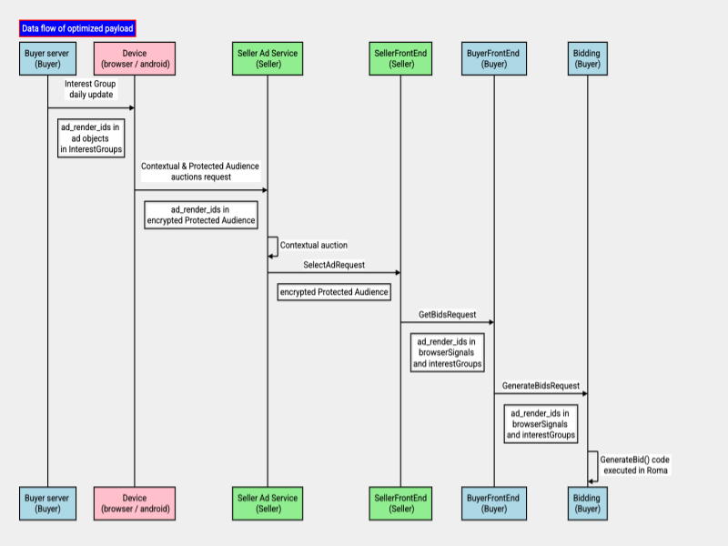

> FLEDGE has been renamed to Protected Audience API. To learn more about the name change, see the [blog post](https://privacysandbox.com/intl/en_us/news/protected-audience-api-our-new-name-for-fledge)

**Author:** <br>
[Priyanka Chatterjee][1], Google Privacy Sandbox

# Bidding and Auction services payload optimization

The [Bidding and Auction (B&A) services][2] outlines a way to allow Protected Audience 
auctions to take place in a [trusted execution environment][3] (TEE) on a [supported
cloud platform][4].

The seller's code in a publisher's web page or Android app sends a unified
contextual and Protected Audience auction HTTPS request (unified request)
to the seller's ad service. The request includes contextual payload and
encrypted [Protected Audience][5] data.

This document provides guidance for optimization of the Protected Audience data
payload size for DSPs and buyers. This guidance is needed for the following
reasons:

* With Bidding and Auction services, sending interest group information to server
  side from the client is expensive, because this impacts overall auction latency
  and increases network cost for sellers and buyers. To mitigate this issue, the
  compressed request payload size must be small (less than 50 KB). 
  
* The seller or client may impose a per-buyer payload size limit for
  [`ProtectedAudienceInput`][6]. 
  
Note: The `ProtectedAudienceInput` request payload is compressed and then encrypted
on the client. The payload is decrypted and decompressed in the Bidding and Auction
service.

_Payload optimization is not impacted by K-anonymity integration. The details about
K-anonymity integration with Bidding and Auction services will be published
separately._

## Higher payload driving factors

`ProtectedAudienceInput` payload sizes can be large due to the following reasons:
 * `ads` in [interest groups][6]
 * `adComponents` in interest groups
 * `userBiddingSignals` in interest groups
 * `browserSignals` generated by the browser that are required for [generateBid()][7]
 
## Options for payload optimization

Following are the proposals to optimize compressed ProtectedAudienceInput for DSPs
and buyers. 



_The above diagram illustrates the data flow when `ad_render_id`s are sent to Bidding
and Auction services using `browserSignals` and `interestGroups` instead of ad objects._

### Optimization of ads in interest groups using ad render id

Summary: Send ad render id instead of ad objects to `generateBid()`.

#### Step 1:
**Buyer generates an identifier for each ad.**

* Generate an ad render id, such as an ID for ad render url. 

* For component ads, similarly generate render identifiers.

* It is recommended that ad render id (or ad component render id) be a string of length
  8 bytes or less.
  
_Note: The ad render id (or ad component render id) size limit is open for feedback from
ad techs._

#### Step 2: 
**Buyer passes ad render id information to the client during interest group daily fetch.**

Buyer can pass the following information to the [interest group][6] when clients fetch interest
groups daily from buyers' servers.

* An optional ad render id field will be available in the [ad object][8] in [interest group][6]
  object. 

* An additional field will be available in interest groups that can help ad techs tell the
  client how to send the ad render id to the Bidding and Auction service. Refer to [step 3][9]
  for details.
  
_Note: The [Chrome integration][10] design proposal and [Turtledove][11] design proposal will be
updated with more details about this step.._

#### Step 3:
**Client sends ad render ids to the Bidding and Auction service.**

Clients will provide a field in [interest group][6] to help ad techs provide their preference
between the following two options:

##### Option 1: 
**Client sends ad render ids (instead of ad objects) and ad render ids in browser signals
for bidding in an InterestGroup.**

* The client would send ad render ids (and ad component render ids) instead of ad objects
  in an [InterestGroup][12].
  
* The client sends ad render ids instead of ad objects in `prevWins` of browser signals in
  an [InterestGroup][12].
  
* The remaining data is passed by the client as described in an `InterestGroup`.

Pros: The winning render URL is validated on the client so that they belong to the interest
group that the client has information about. In this case, the winning render URLs always
pass validation to the client. Ad techs don't need to ensure that the client is always in
sync with their servers.

Cons: The payload size will be slightly higher compared to [Option 2][13].

##### Option 2:
**Client doesn't send ad render ids; browsers send ad render ids only in browser signals for
bidding in an InterestGroup.**

* The client doesn't send an ad render id in an `InterestGroup`. Some ad techs can select this
  option to further optimize their payloads.
  
  * _Note: In this case, the client will not send any ad information to Bidding and Auction
    services._
    
* The client sends ad render ids instead of ad objects in `prevWins` of browser signals in an
  `InterestGroup`. 
  
  Pros: Smaller `ProtectedAudienceInput` payloads.
 
  Cons: The URL of the winning ad candidate sent to the client is validated such that they
  belong to the interest group that the client has information about. Ad techs need to ensure
  that the winning ad candidate is dynamically generated from the version of interest group
  data sent to the user's device.
  
##### Specification for browser signal

Browser signals are sent to Bidding and Auction services by the browser. This information is
not relevant for Android app advertising.

Refer below for the spec of browser signal for bidding required for `generateBid()` for Protected
Audience API for web advertising. The only difference here is that instead of an ad object,
an ad render id is passed in `prevWins`.

```
{ 'topWindowHostname': 'www.example-publisher.com',
  'seller': 'https://www.example-ssp.com',
  'topLevelSeller': 'https://www.another-ssp.com',
  'joinCount': 5,
  'bidCount': 24,
  'recency': 1684134092,
  'prevWins': [[time1,ad_render_id1],[time2,ad_render_id2],...],
  'wasmHelper': ... /* a WebAssembly.Module object based on interest group's biddingWasmHelperURL */
  'dataVersion': 1, /* Data-Version value from the trusted bidding signals server's response(s) if available */
}
```

_Note: An ad object includes an ad render url and ad metadata. To ensure the request payload
size is kept small, these are not sent from the client to the Bidding and Auction service's
InterestGroup._

#### Step 4: 
**`generateBid()` can ingest the ad render ids in interest groups and `browserSignals`.**

B&A would pass ad render ids and ad component render ids to [generateBid()][7].

* The Bidding and Auction service passes ad render ids and ad component render ids in `interestGroup`
  to `generateBid()` if that information is received from the client in [Step 3][9].
  
  * If ad render id (or ad component render ids) information is not available, no ad information is
    passed to `generateBid()`. This is valid if the buyer selects [Option 2][13] in [Step 3][9]. 
    
* `generateBid()` must be updated so that it can ingest ad render ids (or ad component render ids) in
   the `interestGroup` field.
   
   * Note: This is not required if the buyer selects [Option 2][13] in [Step 3][9]. 

* `generateBid()` needs to be updated so that it can ingest ad render id in `prevWins` in
  `browserSignals`.
  
  * _This is not relevant for Android app advertising._
  
* The trusted bidding signals fetched from the buyer's Key / Value service must include ad render
  id and ad metadata information.
  
* `generateBid()` must recreate the ad render urls for final bids.

   * `generateBid()` can maintain a URL template with the base URL. The variable part of the URL
      must be recreated using the information in `interestGroup` and `trustedBiddingSignal`
      arguments. 
      
   * When a buyer selects [Option 2][13] in [Step 3][9], ad render ids are not available in the
     `interestGroup` argument of `generateBid(). In this case, the buyer generates the URL dynamically
     based on the information available in `trustedBiddingSignal`.
     
### Optimization of user bidding signals

Summary: If an ad tech requires user bidding signals, they can use trusted bidding signal keys to
lookup user bidding signals from Key / Value services.

This is optional for [alpha testing][14], but recommended for further optimization.

Pros: Smaller [`ProtectedAudienceInput`][5] payload.

Cons: Ad techs may require additional trusted bidding signal keys for the lookup server side.

Steps:

* Ad techs can append additional bidding signal keys so that user bidding signals can be made available
  in bidding signals. This can help reduce [ProtectedAudienceInput][5] payload further.
  
* During the alpha phase, clients pass the user bidding signals in `InterestGroup` if that information
  is available.
  
### Higher priority interest groups sent from the device

Summary: Prioritize interest groups sent from the device.

Chrome allows buyers to set a priority value (floating point number) per [interest group][6], however this
is optional for buyers today. 

This step is optional for [alpha testing][14].

Pros: Fit higher priority interest groups in the per buyer limit.

Steps:

* Buyer may set priority value per [interest group][7] that is sent to clients during daily fetch. 

* The client can sort interest groups for buyers based on the priority value, and drop lower priority
  interest groups to meet the per-buyer payload size limit that may be set by the seller or the client.
  
## Related material

* [Bidding and Auction services high-level design and API explainer][15]
* [Bidding and Auction Services System Design explainer][16]
* [Bidding and Auction Services Multi Seller Auctions][17]
* [Bidding and Auction services AWS cloud support and deployment guide](https://github.com/privacysandbox/fledge-docs/blob/main/bidding_auction_services_aws_guide.md)
* [Protected Audience services](https://github.com/privacysandbox/fledge-docs/blob/main/trusted_services_overview.md)
* [Chrome client design for Bidding and Auction services integration](https://github.com/WICG/turtledove/blob/main/FLEDGE_browser_bidding_and_auction_API.md)


[1]: https://github.com/chatterjee-priyanka
[2]: https://github.com/privacysandbox/fledge-docs/blob/main/bidding_auction_services_api.md
[3]: https://github.com/privacysandbox/fledge-docs/blob/main/trusted_services_overview.md#trusted-execution-environment
[4]: https://github.com/privacysandbox/fledge-docs/blob/main/bidding_auction_services_api.md#supported-public-cloud-platforms
[5]: https://github.com/privacysandbox/fledge-docs/blob/main/bidding_auction_services_api.md#protectedaudienceinput
[6]: https://github.com/WICG/turtledove/blob/main/FLEDGE.md#11-joining-interest-groups
[7]: https://github.com/privacysandbox/fledge-docs/blob/main/bidding_auction_services_api.md#generatebid
[8]: https://github.com/WICG/turtledove/pull/558/files
[9]: #step-3
[10]: https://github.com/WICG/turtledove/blob/main/FLEDGE_browser_bidding_and_auction_API.md
[11]: https://github.com/WICG/turtledove/blob/main/FLEDGE.md
[12]: https://github.com/privacysandbox/fledge-docs/blob/main/bidding_auction_services_api.md#buyerinput
[13]: #option-2
[14]: https://github.com/privacysandbox/fledge-docs/blob/main/bidding_auction_services_api.md#alpha-testing
[15]: https://github.com/privacysandbox/fledge-docs/blob/main/bidding_auction_services_api.md
[16]: https://github.com/privacysandbox/fledge-docs/blob/main/bidding_auction_services_system_design.md
[17]: https://github.com/privacysandbox/fledge-docs/blob/main/bidding_auction_services_multi_seller_auctions.md


