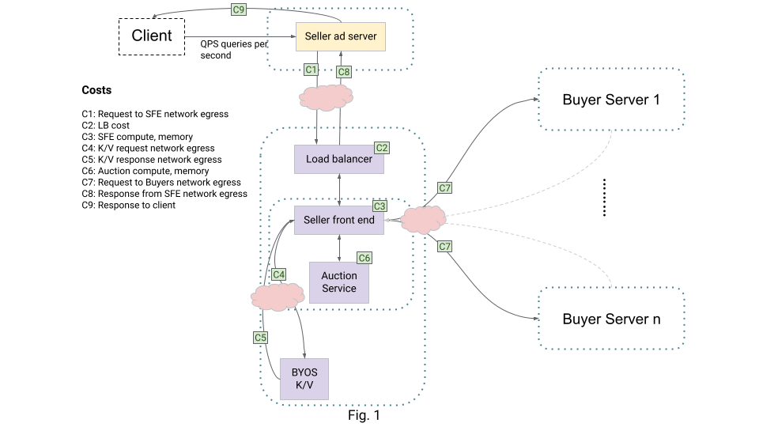
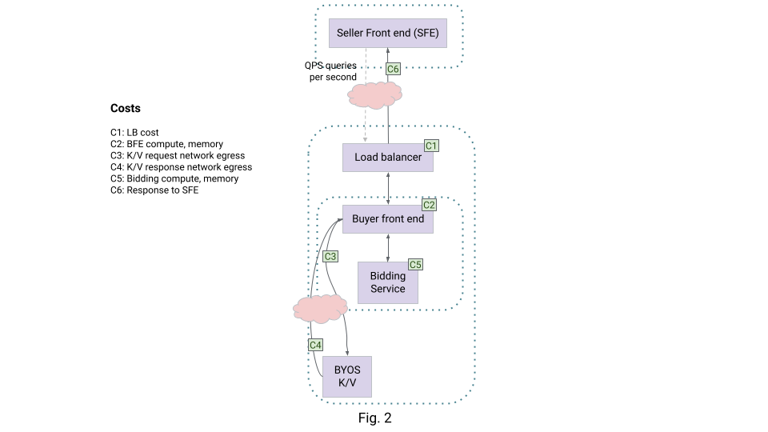
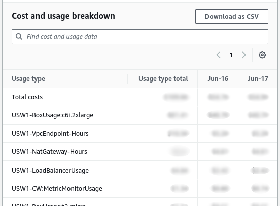
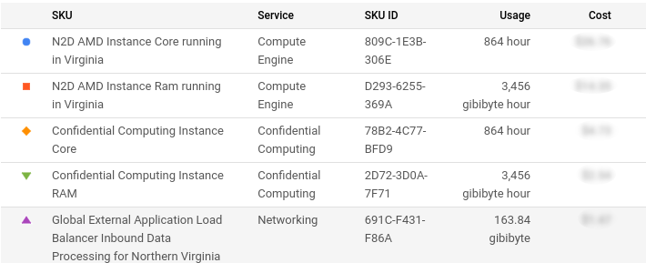

# Bidding and Auction Cost

**Authors:** 
<br> [Akshay Pundle][31], Google Privacy Sandbox 
<br> [Dave Garred][32], Google Privacy Sandbox
<br> Itay Sharfi, Google Privacy Sandbox

# Background

[Bidding and Auction Services][3] run in supported [Trusted Execution
Environments (TEE)][4] provided by AWS and GCP. In this document, the Privacy
Sandbox team explores the various factors that affect the cost of such a
deployment and how these can be mitigated.

There are different tradeoffs when provisioning this system like [QPS][5],
acceptable latency, regional failover etc. Providing estimates for all
combinations is impossible, and a lot depends upon the choice the ad tech makes,
the tradeoffs that are considered etc.

A framework has been developed to understand the costs of operating a
privacy-preserving advertising system. This framework will help ad tech
companies understand the source of costs and make informed decisions about how
to operate their businesses.

The cost components described depend on the underlying cost structures provided
by cloud providers. The Privacy Sandbox team takes into account our current
understanding of these, but the underlying cost structures can change over time,
which would also change the cost components described in this document.

The cost components described below scale with the throughput of the system.
Provisioned costs (e.g. number of VMs) depend on how many resources are
provisioned. Costs like network and load balancer cost scale with actual usage
and are proportional to the volume of traffic processed by the ad tech.

The cost depends on system performance which will need to be empirically
measured. Ad techs can follow instructions in the [Cost Estimation][6] section
or participate in our [Alpha and Beta tester programs][7] to collect such data
and create detailed cost estimates.

While it is impossible for the Privacy Sandbox team to collect representative
data since it does not operate a production system with live traffic, it can
measure resource consumption for a parameterized system with synthetic requests
and setup. Ad tech can use these to arrive at ballpark cost estimates.

Typical cloud costs fall into the following categories.

## Network

Network costs can be a significant component of operating costs. Services are
usually operated inside a Virtual Private Cloud (VPC). Typically, network egress
from a VPC is charged. This means that you would pay for outbound traffic from
the services that go outside the VPC boundary, like going to the internet or to
another region but not for traffic inside the VPC. Traffic inside VPC is usually
free. Internal network components (like load balancers) that charge for data
processing will still incur cost on internal traffic. For this reason, we use a
service mesh for internal traffic (implemented in GCP. AWS implementation in
progress). This does not incur cost for traffic inside the VPC. Some network
components like NAT ([AWS][8], [GCP][9] have hourly charges, and ingress and
egress data charges based on usage.

## Infrastructure

Infrastructure costs include Virtual Machine (VM) costs and other services used.
VM cost depends on CPU, memory usage etc. These costs typically balance QPS,
application latency and availability needs.

## Load balancer

Load balancers typically charge for data processed. This includes inbound and
outbound data. If a load balancer is used on internal traffic, this processing
is still usually chargeable.

NAT gateways are also chargeable. These are used to make outbound connections
out of the VPC and typically also charge for processed data.

## TEE overhead

Cloud operators may charge an overhead for TEE enclave usage. The way these
charges are levied is different and operators should use their setup to
determine how TEE costs affect the overall cost.

GCP: [Confidential Compute charges][10]

AWS: [Enclave pricing][11]

# Seller costs

<figure id = "image-1">
  
  <figcaption><b>Figure 1.</b> Fig.1 - Seller costs</figcaption>
</figure>

## High level cost breakdown

Seller costs breakdown in the following way, as depicted in Fig. 1 above.

**C1: Request to SellerFrontEnd (SFE) network egress**: This additional cost is
incurred by the Seller ad server sending the Protected Audience auction request
to the SFE.

**C2: LB cost**: A load balancer (LB) forwards incoming requests to the SFE
instances. This cost depends on the total processed bytes by the LB and may also
include components based on usage time.

**C3: SFE compute and memory**: SFE processing consumes CPU and memory.

**C4: K/V request network egress**: Requests sent to the [BYOS K/V server][12]
will result in network egress cost, accrued on the SFE side. NAT costs may also
be accrued since a connection across the VPC boundary will be needed. This cost
is 0 for TEE K/V (since it is in the same VPC).

**C5: K/V response network egress**: This cost is accrued on the BYOS K/V side.
This system will send the response back to the SFE, which will result in network
egress cost. This cost is 0 for TEE K/V (since it is in the same VPC).

**C6: Auction compute and memory**: Auction processing consumes CPU and memory,
bulk of which comes from running the scoreAds scripts.

**C7: Request to Buyers network egress **: SFE sends requests to buyers to get
the bids. All these requests are subject to network egress / NAT costs.

**C8: Response from SFE network egress**: This is the network egress cost of
sending the SFE responses back to the seller trusted server.

**C9: Response to client**: This additional cost is incurred by the Seller ad
server sending any additional data (from B&A request processing) back to the
client.

## Details

### Seller untrusted server

In the [unified request (contextual and Protected Audience)][13] flow, the
unified request is sent to the Seller ad server that runs outside the TEE. This
is an untrusted server managed by the SSP. This is the same server that
initiates an [Real-time Bidding (RTB)][14] request today, which will also
forward the appropriate remarketing requests to the SFE server, so this wouldn't
incur any additional cost to run. There may be additional processing costs 
including packaging and sending the request to SFE, handling the response, 
and additional traffic and processing to the Buyer RTB servers. Costs for these 
should be estimated by the ad techs.

If the seller ad server is not on the same cloud provider as the seller
frontend, the server will incur additional network costs (C1 and C8 in Fig. 1).
C1 is the cost of sending the remarketing request (along with the encrypted
payload) to the SFE. This cost is affected by the total payload which depends on
factors like the number of buyers in the request, payload per buyer (including
per buyer signals) etc. This cost can be bounded by enforcing [per-buyer
limits][15] on payload. Buyers can minimize their payload through methods
described in [Bidding and Auction Payload Optimization][16]. C8 is the cost of
additional payload sent back to the client. This payload depends on the response
size, which should be experimentally verified.

These costs (C1 and C8) will not be there if the Seller ad server is in the same
VPC as the SFE.

The SSP can decide which requests are valuable for remarketing, and only these
requests could be sent to the SFE. The SSP costs mentioned from here onward
depend on the number of requests the SFE services. Therefore, if the SSP's
untrusted server throttles requests, the remarketing costs will go down.

### Seller Front End (SFE) and Auction services

SSPs run SFE and Auction servers inside the TEE.

The SFE servers are in charge of orchestrating the auction (including sending
requests to buyers, getting their bids, fetching real-time signals from the
seller key value server etc.). The auction servers are responsible for fetching
and running the ScoreAds functions.

#### VM costs

Each of these services require CPU and memory. From Fig. 1, the costs for these
are (C3 and C6 for SFE and Auction respectively).

These costs depend on factors like the total throughput required, throughput per
[vCPU][17] of each of the servers, how the servers are provisioned, what latency
is acceptable, complexity of scoring scripts, etc.

**Total required throughput**: Desired throughput of request being processed.
The required resources scale proportionally to this. Peak QPS may be much more
than avg. QPS. Provisioning sufficiently taking into account peak QPS will be
essential since cold boots take time. Provisioning servers for peak QPS would
incur more cost.

**Throughput per vCPU of each of the servers**: Needs to be experimentally
determined by ad tech

**Latency**: If degraded latency is acceptable, servers may be underprovisioned.
If this tradeoff is made, at high QPS, the servers could start to lag and
latency could be higher.

**Other factors**: The SFE and Auction services do some additional processing
like uncompressing and decrypting (and compressing and encrypting) payloads,
fetching key-values, ad tech code scripts etc. These add processing overhead
which should be negligible, but needs to be determined experimentally by the ad
tech.

**Complexity of** [**User-defined Functions**][18] **scripts (Auction server)**:
Running scoreAds functions requires CPU and memory. To keep costs lower, the
scripts can be made simpler / more efficient.

For the auction servers, the above factors are all linked together in the
following way:

The total processing required per request is the sum total of the script
execution and other overhead like encryption/decryption, compression etc. The
ScoreAds scripts are executed in parallel per ad. We get the following
relations:

<table>
  <tr>
    <td><p>Total processing = Per request Overhead + (#candidate ads) * (scoreAds time per ad) [vCPU-seconds]</p><p>Throughput Per vCPU = 1 / (Total processing) [requests / vCPU-second]</p><p>vCPUs needed = Total required throughput / Throughput Per vCPU [vCPUs]</p></td>
  </tr>
</table>

The cost will scale according to the number of needed vCPUs calculated above.

Processing latency depends on the number of workers made available for parallel
executions.

<table>
  <tr>
    <td><p>Processing latency = Overhead + (#candidate ads) * (scoreAds time per ad) / #workers [vCPU-seconds]</p></td>
  </tr>
</table>

#### Network costs

**SFE to BFE**: The SFE initiates calls to the Buyer Front End (BFE) servers.
This payload counts towards the SFE network egress cost and scales with the
number of buyers and the payload per buyer. Payload per buyer depends on the
number of interest groups and other associated data being sent. This cost is C7
in Fig. 1.

**Response from SFE to Seller ad server**

The response from SFE to Seller ad server will incur network egress costs. These
will depend on the payload sent back, which will contain information about the
winning bid and [other reporting information][19]. This cost is C8 in Fig. 1.

**SFE to BYOS KV servers**

SFE will look for signals from KV servers. These request costs will also incur
network egress and NAT charges. Responses will be charged on the BYOS KV server
side. These two costs are C4 and C5 in Fig. 1.

**Communication with Auction servers**

Since the SFE and auction servers will be in the same private subnet, these
calls will not incur any network cost.

### Load balancer and Network address translation (NAT)

The SFE will have a load balancer for incoming requests. These will incur
processing costs (C2 In Fig. 1) depending on the total bytes routed. The total
bytes over a period of time depend on QPS and request payload size. The request
payload depends on a number of factors mentioned in the Seller untrusted section
above.

A NAT is used to make outbound connections to the internet from within the VPC.
This is needed for sending requests to the BYOS K/V (if it is outside the VPC)
and to the buyer servers. NAT traffic is typically charged for bytes processed.
The cost can be estimated by estimating the traffic, and can be controlled by
limiting it.

### Key/Value server costs

The BYOS K/V server will accrue cost towards network egress of the responses.
This cost will depend on a few factors:

1. Whether BYOS K/V is run in the same VPC, or not. If the K/V server is not
  running in the same VPC as the SFE, it will incur network egress cost. The
  cost will depend on the total data being returned. This, in turn, depends on
  the QPS and amount of data returned per lookup. This cost is C5 in Fig. 1, and
  was briefly mentioned in the "SFE to BYOS KV servers" section. Other BYOS K/V
  server costs are left to the ad tech to determine.
1. The cost will also depend on the infrastructure of the BYOS K/V server. For
  example, if the BYOS K/V runs on cloud and uses a load balancer, it will incur
  processing cost for all the bytes processed.

The compute costs for the BYOS K/V server are ad tech dependent, based on their
implementation, deployment and usage. These should be determined experimentally
by the ad tech.

# Buyer costs

The buyer runs Bidding Front End (BFE) service and Bidding service. The BFE
fetches signals from the buyer BYOS KV server, orchestrates calls to the Bidding
service and returns responses to the SFE.

The Bidding servers generate the bids and are also responsible for loading the
buyer bidding scripts.

<figure id = "image-2">
  
  <figcaption><b>Figure 2.</b> Fig. 2 - Buyer Costs</figcaption>
</figure>

## High level cost breakdown

Buyer costs breakdown in the following way, as depicted in Fig. 2 above.

**C1: LB cost**: A load balancer (LB) forwards incoming requests to the BFE
instances. This cost depends on the total processed bytes by the LB and may
include a component based on usage time.

**C2: BFE compute, memory**: Buyer Front End (BFE) processing consumes CPU and
memory.

**C3: K/V request network egress**: Requests sent to the BYOS K/V server will
result in network egress cost. NAT costs may also be accrued since a connection
across the VPC boundary will be needed.

**C4: K/V response network egress**: This cost is accrued on the BYOS K/V side.
This system will send the response back to the BFE, which will result in network
egress cost.

**C5: Bidding compute and memory**: Bidding service running the generateBid
scripts consumes CPU and memory.

**C6: Response to SFE**: The response back to the SFE will cause network egress
cost for the buyer..

## Load balancer

The BFE will have a load balancer for incoming requests. These will incur
processing costs (C1 in Fig. 2) depending on the total bytes routed. This will
depend on QPS and request payload size. The payload sizes will depend on various
factors like number of IGs, Ads per IG, size of buyer signals etc. To reduce the
payload size, refer to the [Bidding and Auction Payload Optimization][16]
explainer.

## Infrastructure

Buyers run BFE and Bidding servers inside the TEE.

The BFE servers are in charge of orchestration and the bidding server runs the
buyer JS scripts to generate the bids.

#### VM costs

Each of these services require CPU and memory. From Fig. 2, the costs for these
are C2 and C5. These costs depend on factors like the total throughput required,
throughput per vCPU of each of the servers, how the servers are provisioned,
what latency is acceptable, complexity of scoring scripts etc.

**Total throughput required**: Desired throughput of request being processed.
The required resources scale proportionally to this.

**Throughput per vCPU of each of the servers**: Needs to be experimentally
determined

How the servers are provisioned: Peak QPS may be much more than avg. QPS.
Provisioning servers for peak QPS would require more cost.

**Latency**: If degraded latency is acceptable, servers may be underprovisioned.
If this tradeoff is made, at high QPS, the servers could start to lag and
latency could be higher.

**Other factors**: There is additional overhead to the processing done by the
BFE and Bidding services (e.g. uncompressing and decrypting payloads, fetching
key-values, ad tech code scripts, sending responses etc.). This overhead needs
to be determined experimentally by ad techs.

**Complexity of scripts (Bidding server)**: Running generateBid functions
required CPU and memory. The more time they run for, the more resources they
consume. To keep costs lower, the scripts can be made simpler / more efficient.

For the bidding servers, the above factors are all linked together in the
following way:

The total processing required per request is the sum total of the script
execution and other overhead like encryption/decryption, compression etc. The
GenerateBid scripts are executed in parallel per ig. We get the following
approximate relations:

<table>
  <tr>
    <td><p>Total processing = Overhead + (#IGs) * (generateBid time per IG) [ vCPU-seconds]</p><p>Throughput Per vCPU = 1 / (Total processing) [requests / vCPU-second]</p><p>vCPUs needed = Total required throughput / Throughput Per vCPU [vCPUs]</p></td>
  </tr>
</table>

The cost will scale according to the number of needed vCPUs calculated above.

Processing latency depends on the number of workers made available for parallel
executions.

<table>
  <tr>
    <td><p>Processing latency = Overhead + (#candidate ads) * (scoreAds time per ad) / #workers [vCPU-seconds]</p></td>
  </tr>
</table>

## Network

**Response from BFE to SFE**

The response from BFE to SFE will incur network egress costs. This cost is C6 in
Fig. 2. The costs will depend on the payload sent back, which will contain
information about the winning bid and other reporting information (e.g. debug
loss reports etc.). Larger win and loss reports will increase the payload back,
and hence increase this cost.

**BFE to BYOS KV servers**

BFE will seek signals from KV servers. BFE sends requests to the BYOS KV server
which cause network egress and NAT cost. This is C3 in Fig. 2. The response cost
(C4 in Fig. 2) will be charged on the BYOS KV server side

**Communication with Bidding servers**

The BFE and Bidding servers will be in the same private subnet, so these calls
will not incur any network cost.

### Key Value server costs

The BYOS KV server will accrue cost towards network egress of the responses.
This cost will depend on the total data being returned. This, in turn, depends
on the QPS and amount of data returned per lookup. This cost is C4 in Fig. 2,
and was briefly mentioned in the "BFE to BYOS KV servers" section. Other BYOS
K/V server costs are left to the ad tech to determine.

# Cost estimation

Both GCP and AWS itemize all costs needed for a B&A environment, and this can be
used to build a quite accurate estimate of running costs. In reality estimating a
range of cost for ad techs running these servers is made difficult by a number
of factors including:

- Deployment model for each ad tech
- Estimation of compute capacity for each service.
- Estimation of payload size, including for downstream services.
- Estimation of response size.
- Identifying where pricing applies and the correct line item that should be
  applied.

## Cost test environment

To overcome these obstacles, running B&A in a test environment over a short
period of time may be used to extrapolate monthly or annual costs (or to verify
calculated estimates). Guides are available for deploying an environment in
[GCP][20] and [AWS][21]. The test environment should replicate, as closely as
possible, the architecture that will be used in production. This includes:

- Network configuration and load balancers.
- Correct proportion and sizing of frontend to backend instances.
- Request payloads and header information that are similar in size and
  composition to production payloads.
- The Javascript module (aka "ad tech code") that is used in the backend service
  should provide a similar latency and response size.

Correct sizing and quantity of the host instances will be a significant factor
in the total cost of the environment. Load testing should be used to identify
the optimal allocation of vCPUs to frontend servers (SFE / BFE) and the backend
counterparts (Auction / Bidding).

To facilitate identifying the billing costs attributed by the test environment,
each component should be [labeled (GCP)][22] or [tagged (AWS)][23] with unique
key value sets. These are needed to isolate the costs involved in the test
environment from those of any other resources in use within the same project
(GCP) or account (AWS). The [reference environment provided in the code
base][24] provides examples of how this can be done, the keys used there are
environment and operator.

Some networking costs in GCP can not be labeled, particularly [Cloud NAT][25]
which is used for outbound calls from the B&A servers. Placing the test
environment in a region by itself can be used to isolate these costs.

## Running a cost test

Tests may be performed with any load test utility that supports gRPC (e.g.
[GHZ][26] and [wrk2][27]. Tests should provide a constant stream of calls to the
test environment at a steady rate for the period of the test. Each test run
should cover a minimum of 24 hours within the daily billing period of the cloud
service that is being used.

- AWS: midnight UTC - midnight UTC
- GCP: midnight PST - midnight PST

```
RATE=60
HOURS=48
TOTAL_CALLS=$(( HOURS*60*60*RATE ))
ghz \
    -r $RATE \
    --total=$TOTAL_CALLS \
    --call=privacy_sandbox.bidding_auction_servers.SellerFrontEnd/SelectAd \
    --data-file ~/tmp/test-payload.txt \
    sfe-service.seller1-frontend.com:443
```

_Example command line call to start a two-day test run at 60 QPS_

## Compiling costs for the test

After the test is completed the results may be found in the billing explorer of
the respective cloud provider ([GCP Billing][28], [AWS Cost Explorer][29]. These
results are generally indicative of the total cost for running the environment
and may be extrapolated to find a monthly or annual cost. Note that some costs
are monthly or may not be obvious in the results found in the billing search.
These are usually minor (e.g., most DNS usage) but can be much larger depending
on how the infrastructure is configured and used (i.e., S3 or other storage
charges).

### AWS

In AWS, billing data is collected from AWS Cost Explorer using a daily usage
report. This breaks down cost by component and can be exported in csv-format. An
example from one run is shown below.

<figure id = "image-3">
  
  <figcaption><b>Figure 3.</b> AWS Cost breakbown</figcaption>
</figure>

_Sample data export from AWS Cost Explorer for a two-day experiment_

### GCP

A similar tool is provided by GCP in the Reports section of the Billing
interface breaking out the costs into [individual SKUs][30]. To identify the
test data, the correct date range and include filters for the desired GCP labels
(for NAT costs, the region filter may be used when the test environment is the
only NAT user in the region).

<figure id = "image-4">
  
  <figcaption><b>Figure 4.</b> GCP Cost breakbown</figcaption>
</figure>

_Sample data export from GCP Billing Reports for a one-day experiment_

### Extrapolating monthly or annual cost

These captured billing costs can be extrapolated to find the expected monthly or
annual operating costs. This cost is (roughly) linearly representative of a
single day of operation for the architecture in question computing the total
number of inbound requests.

Since production level traffic will be higher than the test run, the "scaled up"
daily cost must be calculated for the expected QPS. In the simplest case, the
total cost for the test environment can be multiplied by a factor of
production-to-test QPS.

$$Cost_{production} = Cost_{test} \times \frac{Rate_{production}}{Rate_{test}}$$

_Calculating "scaled up" daily operating cost for a production system_

This estimated "scaled up" daily production cost can then be multiplied to
obtain the monthly or annual production costs.

Note that this linearity exists since most of the cost is based on data transfer
bytes or processing, both of which are roughly linear with the rate of requests.
Some additional savings will be seen in actual production costs that are not
seen here such as the NAT uptime in a GCP environment, however these costs tend
to be relatively minor (NAT uptime is $0.0014 per hour).

Note that this assumes a production architecture similar to that under test.
More complex architectures to handle higher loads, such as a fan-out load
balancing scheme, may yield different results.

# Future work

Enabling accurate cost estimation is an important area that the Privacy Sandbox
team wants to support ad tech partners. To this effect, we have the current
plan:

- Publish a load generator tool that can be used by ad techs for cost analysis
  in conjunction with methods mentioned above
- Work with ad tech partners to measure and optimize cost

[1]: http://goto.google.com/relevance-cost
[2]: http://go/cma-notice
[3]: https://github.com/privacysandbox/fledge-docs/blob/main/bidding_auction_services_api.md
[4]: https://github.com/privacysandbox/fledge-docs/blob/main/trusted_services_overview.md#trusted-execution-environment
[5]: https://en.wikipedia.org/wiki/Queries_per_second
[6]: #cost-estimation
[7]: https://github.com/privacysandbox/fledge-docs/blob/main/bidding_auction_services_api.md#alpha-testing
[8]: https://aws.amazon.com/vpc/pricing/
[9]: https://cloud.google.com/nat/pricing/
[10]: https://cloud.google.com/compute/confidential-vm/pricing
[11]: https://docs.aws.amazon.com/enclaves/latest/user/nitro-enclave.html#nitro-enclave-pricing
[12]: https://github.com/WICG/turtledove/blob/main/Proposed_First_FLEDGE_OT_Details.md#trusted-signals
[13]: https://github.com/privacysandbox/fledge-docs/blob/833e9d819b8e3288dde5abebe3d59077aac3daba/bidding_auction_services_api.md#unified-request
[14]: https://en.wikipedia.org/wiki/Real-time_bidding
[15]: https://github.com/privacysandbox/fledge-docs/blob/main/bidding_auction_services_api.md#sellers-ad-service
[16]: https://github.com/privacysandbox/fledge-docs/blob/main/bidding-auction-services-payload-optimization.md
[17]: https://en.wikipedia.org/wiki/Central_processing_unit#Virtual_CPUs
[18]: https://github.com/privacysandbox/fledge-docs/blob/main/key_value_service_user_defined_functions.md
[19]: https://github.com/privacysandbox/bidding-auction-servers/blob/main/api/bidding_auction_servers.proto#L131C9-L131C22
[20]: https://github.com/privacysandbox/fledge-docs/blob/main/bidding_auction_services_gcp_guide.md
[21]: https://github.com/privacysandbox/fledge-docs/blob/main/bidding_auction_services_aws_guide.md
[22]: https://cloud.google.com/resource-manager/docs/creating-managing-labels
[23]: https://docs.aws.amazon.com/tag-editor/latest/userguide/tagging.html
[24]: https://github.com/privacysandbox/bidding-auction-servers/tree/main/production/deploy
[25]: https://cloud.google.com/nat/docs/overview
[26]: https://ghz.sh/
[27]: https://github.com/giltene/wrk2/
[28]: https://pantheon.corp.google.com/billing/
[29]: https://console.aws.amazon.com/cost-management/home#/cost-explorer/
[30]: https://cloud.google.com/skus
[31]: https://github.com/akshaypundle
[32]: https://github.com/dave-garred
