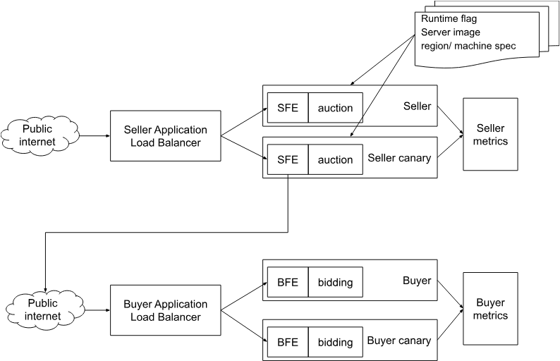
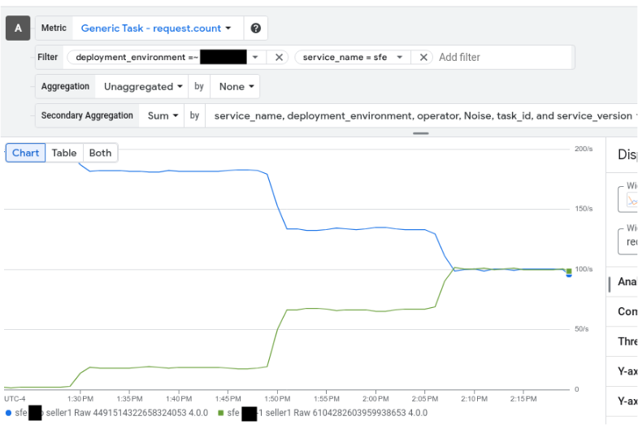

# Bidding and Auction services experiment

**Authors:**<br>
[Xing Gao](https://github.com/xinggao01), Google Privacy Sandbox<br>

This document proposes a cloud architecture to enable experiment with Bidding and Auction services.


To learn more about Protected Audience services and Bidding and Auction services, read the following:
* [Protected Audiences Services Overview](https://github.com/privacysandbox/fledge-docs/blob/main/trusted_services_overview.md)
* [Bidding and Auction Services System Design](https://github.com/privacysandbox/fledge-docs/blob/main/bidding_auction_services_system_design.md)

The current design only enables experiments with multiple instances (separate servers) using randomly split traffic.

Specifically, A/B testing that diverts traffic based on request data is not covered.

## Supported Features
1. Trusted server image agnostic: all the setup is in the cloud deployment configuration
2. Experiment arms can be switched on/off, and traffic can be adjusted dynamically to split the traffic
3. Runtime flags, server images, region and machine specs of control and experiment arms can be configured
4. Server metrics of control and experiment arms can be compared for evaluation

## Architecture Overview

This architecture uses a cloud load balancer for the front-end server to split traffic between two or more B&A server stacks. The example below shows a production and canary setup. The configuration on the seller and buyer side servers is similar.

The configurations, including runtime flags, server images, regions, and machine specs, apply to each arm. The front-end server (i.e., SFE, BFE) only communicates with the back-end server (i.e., auction, bidding) within the same arm.

<figure id = "buyer-gcp-diagram">
  
  <figcaption><b>Figure 1.</b> B&A Experiment Example</figcaption>
</figure>

## Deploy Example in GCP
In the examples below, we demonstrate deploying a configuration for a seller. The process for configuring a buyer is similar.

Please also see the [example config in the published repo](https://github.com/privacysandbox/bidding-auction-servers/blob/532e2938d0f82687ceda629ba50eaeae2a3a4102/production/deploy/gcp/terraform/environment/demo/seller/seller.tf#L55).

### Use Case 1: Try out a new B&A version with Feature X enabled on 5% of traffic
Configure two traffic arms, with 5% directed to the experiment arm. Enable the feature flag for Feature X only in the experiment arm, leaving the control arm unaffected.

```terraform
  seller_traffic_splits = {
    # control arm
    "${local.environment}" = {
      image_tag             = "prod_4.0"
      traffic_weight        = 1000
      region_config         = local.default_region_config
      runtime_flag_override = {}
    }

    # experiment arm
    "feature_x" = {
      image_tag      = "prod_4.0"
      traffic_weight = 50
      region_config  = local.default_region_config
      runtime_flag_override = {
           FEATURE_X = "true"
      }
    }
  }
```
### Use Case 2: Try out a new server version on 5% of traffic
Configure two arms, split traffic between them, and use different image tags for each arm to test the new server version on 5% of traffic.

```terraform
  seller_traffic_splits = {
    # control arm
    "${local.environment}" = {
      image_tag             = "prod_4.0"
      traffic_weight        = 1000
      region_config         = local.default_region_config
      runtime_flag_override = {}
    }

    # experiment arm
    "new_version" = {
      image_tag      = "prod_4.1"
      traffic_weight = 50
      region_config  = local.default_region_config
      runtime_flag_override = {}
    }
  }
```
### Use Case 3: Run multiple experiments simultaneously
Configure multiple arms, split traffic between them, and assign different flag values to each experiment arm to run several experiments at the same time.

```terraform
  seller_traffic_splits = {
    # control arm
    "${local.environment}" = {
      image_tag             = "prod_xxx"
      traffic_weight        = 1000
      region_config         = local.default_region_config
      runtime_flag_override = {}
    }

    # experiment arm 1
    "experiment_1" = {
      image_tag      = "prod_xxx"
      traffic_weight = 50
      region_config  = local.default_region_config
      runtime_flag_override = {
           FEATURE_Y = 1
      }
    }

    # experiment arm 2
    "experiment_2" = {
      image_tag      = "prod_xxx"
      traffic_weight = 50
      region_config  = local.default_region_config
      runtime_flag_override = {
           FEATURE_Y = 2
      }
    }
  }
```

## Update Traffic Split Dynamically in GCP
The traffic weight split can be updated dynamically while the servers are serving requests. Here's an example using the gcloud command to ramp up traffic from a 100:1 split to 100:100:

<figure id = "buyer-gcp-diagram">
  
  <figcaption><b>Figure 2.</b> Update Traffic Split Dynamically in GCP</figcaption>
</figure>

The gcloud command used:
```bash
$ gcloud compute url-maps edit seller1-$ENV-xlb-grpc-map

// modify the weight and save
defaultRouteAction:
  weightedBackendServices:
  - backendService: https://www.googleapis.com/compute/v1/projects/bas-dev-383721/global/backendServices/seller1-$ENV-xlb-backend-service
    weight: 1000
  - backendService: https://www.googleapis.com/compute/v1/projects/bas-dev-383721/global/backendServices/seller1-$ENV-1-xlb-backend-service
    weight: 500
```


## Deploy Example in AWS (comming soon)
