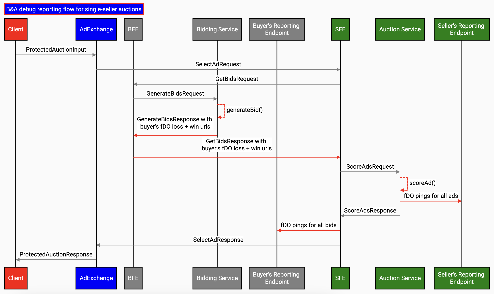
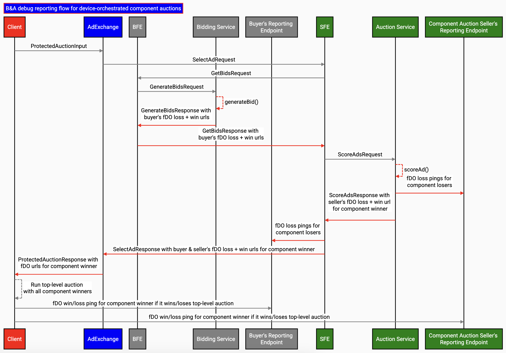
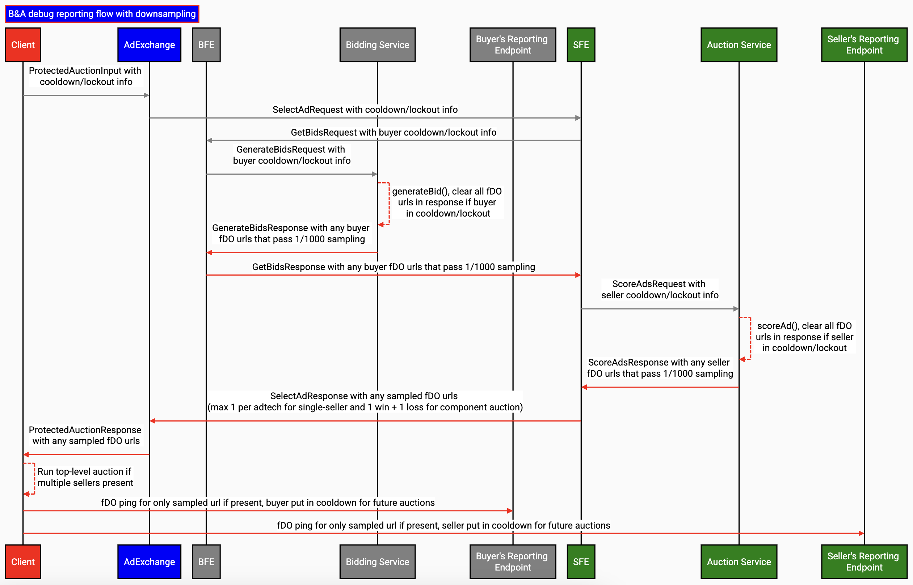

# Protected Audience forDebuggingOnly API with Bidding & Auction Services

**Author:** <br>
[Rashmi Rao][0], Google Privacy Sandbox <br>
[Prakhar Mittal][1], Google Privacy Sandbox

[Bidding and Auction Services](https://github.com/privacysandbox/fledge-docs/blob/main/bidding_auction_services_api.md) (B&A) outlines a way to allow Protected Audience auctions to take place in a [Trusted Execution Environment](https://github.com/privacysandbox/fledge-docs/blob/main/trusted_services_overview.md#trusted-execution-environment) (TEE) hosted on a [supported cloud platform](https://github.com/privacysandbox/fledge-docs/blob/main/bidding_auction_services_api.md#supported-public-cloud-platforms). 

This explainer describes the system design for `forDebuggingOnly` (fDO) using the Bidding and Auction Services. For [high-level design](https://github.com/privacysandbox/fledge-docs/blob/main/bidding_auction_services_api.md#unified-contextual-and-fledge-auction-flow-with-bidding-and-auction-services), [ad tech specifications](https://github.com/privacysandbox/fledge-docs/blob/main/bidding_auction_services_api.md#specifications-for-adtechs), [API](https://github.com/privacysandbox/fledge-docs/blob/main/bidding_auction_services_api.md#service-apis), refer to the [Bidding and Auction Services explainer](https://github.com/privacysandbox/fledge-docs/blob/main/bidding_auction_services_api.md#unified-contextual-and-fledge-auction-flow-with-bidding-and-auction-services). 


# Overview 

The seller and the winning buyer each have an opportunity to generate URLs for event-level debug reporting within the `generateBid()` and `scoreAd()` [User-defined Functions (UDF)](https://github.com/privacysandbox/protected-auction-services-docs/blob/ec0a88b2fb7f98489304d7a80a04519d68517d52/roma_bring_your_own_binary.md) respectively by using `forDebuggingOnly.reportAdAuctionLoss()` and `forDebuggingOnly.reportAdAuctionWin()` APIs. 

The `forDebuggingOnly` support with Bidding and Auction Services is planned to be available in multiple phases.


<table>
  <tr>
   <td><strong>Reporting support with Bidding and Auction services</strong>
   </td>
   <td><strong>Timeline</strong>
   </td>
  </tr>
  <tr>
   <td>Debug reporting for single-seller auctions
   </td>
   <td>Launched
   </td>
  </tr>
  <tr>
   <td>Debug reporting for device-orchestrated multi-seller auctions
   </td>
   <td>Launched (Jan 2025)
   </td>
  </tr>
  <tr>
   <td>Downsampled debug reporting
   </td>
   <td>Apr 2025
   </td>
  </tr>
</table>


This document details the design to generate and ping fDO URLs with the Bidding and Auction Services for single-seller and device-orchestrated multi-seller auctions. 

**Note:** <code>forDebuggingOnly</code> (fDO) API is only supported for Protected Audience auctions initiated from Chrome. </em>


# Background

During the auction, untrusted bidding logic of a DSP and untrusted decision logic of a SSP are run in sandbox environments and hence limit their ability to generate auction performance reports to their respective DSP or SSP. fDO APIs _([proposed in the first Origin Trial of Protected Audience](https://github.com/WICG/turtledove/blob/main/Proposed_First_FLEDGE_OT_Details.md#reporting))_ allow the ad tech to accurately measure their key business metrics and performance while running Protected Audience auctions on the Bidding and Auction Services. 

Bidding and Auction Services enable processing Protected Audience auctions on the server. Sellers use a `scoreAd()` UDF to score ads in the Auction Service and buyers use a `generateBid()` UDF for generating the bids in the Bidding Service. The flow of Bidding and Auction Services is as described in the [high-level design](https://github.com/privacysandbox/protected-auction-services-docs/blob/main/bidding_auction_services_api.md#high-level-design). This design details the support for 

`forDebuggingOnly.reportAdAuctionLoss()` and `forDebuggingOnly.reportAdAuctionWin()` APIs in `scoreAd()` and `generateBid()` on B&A for single-seller auctions.


## `forDebuggingOnly.reportAdAuctionLoss()` JS API

This API allows ad techs to generate the fDO URL for losing interest groups:


```
function forDebuggingOnly.reportAdAuctionLoss(url) {
  // …
}
```


## `forDebuggingOnly.reportAdAuctionWin()` JS API

This API allows ad techs to generate the fDO URL for winning interest group:


```
function forDebuggingOnly.reportAdAuctionWin(url) {
  // …
}
```


# Design

B&A will allow the ad tech to register their win and loss auction fDO URLs with a fixed set of placeholders. The placeholder data is replaced by corresponding values after the auction.

Allowed placeholder keywords:

*   `"${winningBid}"`
*   `"${winningBidCurrency}"`
*   `"${madeWinningBid}"`
*   `"${rejectReason}"`
*   `"${highestScoringOtherBid}"`
*   `"${highestScoringOtherBidCurrency}"`
*   `"${madeHighestScoringOtherBid}"`

Learn more about the keywords from [this](https://github.com/WICG/turtledove/blob/main/Proposed_First_FLEDGE_OT_Details.md#reporting) guide. 


## Detailed flow

*   Adtech can register win and loss auction fDO URLs during execution of `generateBid()` and `scoreAd()` worklets. Adtech can only set at max one win and loss URL per bid.
*   Flow for DSP:
    *   Bidding Service gets the fDO URLs in the response from Roma after executing `generateBid()` UDF. 
    *   The bids along with the fDO URLs are dropped when the bid value is 0.
    *   For valid bids, the URLs are exported as a part of `AdWithBid` from Roma, then sent to the BFE in `GenerateBidsResponse`, then forwarded to the SFE in `GetBidsResponse`.
    *   After the winner is determined in the Auction Service, it sends the data required for replacing the placeholders in the fDO URLs to the SFE.
    *   In the SFE:
        *   The placeholders are replaced with appropriate values.
        *   For single-seller auctions:
            *   The URLs registered via `forDebuggingOnly.reportAdAuctionWin()` for the winning bid and `forDebuggingOnly.reportAdAuctionLoss()` for all the losing bids are pinged asynchronously from the SFE.
        *   For [device-orchestrated multi-seller auctions](https://github.com/privacysandbox/protected-auction-services-docs/blob/main/bidding_auction_services_multi_seller_auctions.md#device-orchestrated-component-auctions):
            *   The URLs registered via `forDebuggingOnly.reportAdAuctionWin()` and `forDebuggingOnly.reportAdAuctionLoss()` for the winning bid are sent to the client in the encrypted B&A response. The appropriate debug ping will be sent from the device depending on whether the bid wins or loses in the top-level auction.
            *   The URLs registered via `forDebuggingOnly.reportAdAuctionLoss()` for all the losing bids are pinged asynchronously from the SFE.
*   Flow for SSP:
    *   Auction Service gets the fDO URLs in the response from Roma after executing `scoreAd()` UDF.
    *   After the winner is determined in the Auction Service:
        *   The placeholders are replaced with appropriate values.
        *   For single-seller auctions:
            *   The URLs registered via `forDebuggingOnly.reportAdAuctionWin()` for the winning ad and `forDebuggingOnly.reportAdAuctionLoss()` for all the losing ads are pinged asynchronously from the Auction Service.
        *   For [device-orchestrated multi-seller auctions](https://github.com/privacysandbox/protected-auction-services-docs/blob/main/bidding_auction_services_multi_seller_auctions.md#device-orchestrated-component-auctions):
            *   The URLs registered via `forDebuggingOnly.reportAdAuctionWin()` and `forDebuggingOnly.reportAdAuctionLoss()` for the winning ad are sent to the SFE which forwards them to the client in the encrypted B&A response.
            *   The URLs registered via `forDebuggingOnly.reportAdAuctionLoss()` for all the losing ads are pinged asynchronously from the Auction Service.
*   If there is any failure to ping the fDO URL, the URL is dropped.






## Enrollment check

Ad techs are required to [enroll the site](https://github.com/privacysandbox/attestation#the-privacy-sandbox-enrollment-attestation-model) of the fDO endpoint. The list of enrolled ad techs will be fetched from a public endpoint in Bidding Service and Auction Service. If the generated fDO URLs are not found to be enrolled, they will be dropped.


## Downsampling

The device will include the `enable_sampled_debug_reporting` field in the [ProtectedAuctionInput](https://github.com/privacysandbox/bidding-auction-servers/blob/ee8da16f9a0f282a528e3dc4b31330bbf98372f1/api/bidding_auction_servers.proto#L97) to indicate if the device is subjected to downsampling. If this flag is enabled, all URLs registered via `forDebuggingOnly` APIs will be sampled as described in the [explainer](https://github.com/WICG/turtledove/blob/main/FLEDGE.md#712-downsampling), and the final fDO pings will happen from the device.

[ProtectedAuctionInput](https://github.com/privacysandbox/bidding-auction-servers/blob/ee8da16f9a0f282a528e3dc4b31330bbf98372f1/api/bidding_auction_servers.proto#L97) will also include the `in_cooldown_or_lockout` field to indicate if the ad tech is in cooldown or the device is in lockout for downsampling. If this is true, all fDO URLs will be dropped and no fDO pings will be sent. This status will also be passed to `generateBid()` and `scoreAd()` via `browserSignals.forDebuggingOnlyInCooldownOrLockout` so that they can skip generating unnecessary fDO URLs and save execution time.



## Note for ad techs

*   The seller and buyer can enable fDO by setting [enableSellerDebugReportingUrlGeneration](https://github.com/privacysandbox/bidding-auction-servers/blob/722e1542c262dddc3aaf41be7b6c159a38cefd0a/production/deploy/gcp/terraform/environment/demo/seller/seller.tf#L82C1-L82C5) and [enableBuyerDebugReportingUrlGeneration](https://github.com/privacysandbox/bidding-auction-servers/blob/722e1542c262dddc3aaf41be7b6c159a38cefd0a/production/deploy/gcp/terraform/environment/demo/buyer/buyer.tf#L92) respectively to `true`. 
*   There are two configurations that ad techs can use to limit the size of the fDO.
    *   Buyer can set the [MAX_ALLOWED_SIZE_DEBUG_URL_BYTES and MAX_ALLOWED_SIZE_ALL_DEBUG_URLS_KB](https://github.com/privacysandbox/bidding-auction-servers/blob/722e1542c262dddc3aaf41be7b6c159a38cefd0a/production/deploy/gcp/terraform/environment/demo/buyer/buyer.tf#L125C1-L127C1) in the Terraform configuration for Bidding service. 
    *   Seller can set the[ MAX_ALLOWED_SIZE_DEBUG_URL_BYTES and MAX_ALLOWED_SIZE_ALL_DEBUG_URLS_KB ](https://github.com/privacysandbox/bidding-auction-servers/blob/722e1542c262dddc3aaf41be7b6c159a38cefd0a/production/deploy/gcp/terraform/environment/demo/seller/seller.tf#L126C1-L127C5) in the Terraform configuration for Auction Service. 

    Any fDO URL exceeding `MAX_ALLOWED_SIZE_DEBUG_URL_BYTES` will be dropped. Once the cumulative size of the fDO URLs to be sent from one B&A service to another exceeds `MAX_ALLOWED_SIZE_ALL_DEBUG_URLS_KB`, the remaining fDO URLs will be dropped and not sent. 

    It is recommended to set the [MAX_ALLOWED_SIZE_DEBUG_URL_BYTES](https://github.com/privacysandbox/bidding-auction-servers/blob/722e1542c262dddc3aaf41be7b6c159a38cefd0a/production/deploy/gcp/terraform/environment/demo/buyer/buyer.tf#L125C1-L127C1) to 64 KB and [MAX_ALLOWED_SIZE_ALL_DEBUG_URLS_KB](https://github.com/privacysandbox/bidding-auction-servers/blob/722e1542c262dddc3aaf41be7b6c159a38cefd0a/production/deploy/gcp/terraform/environment/demo/buyer/buyer.tf#L125C1-L127C1) to 3 MB to not incur a network traffic and processing overhead.

    [0]: https://github.com/rashmijrao
    [1]: https://github.com/mittalprakhar
