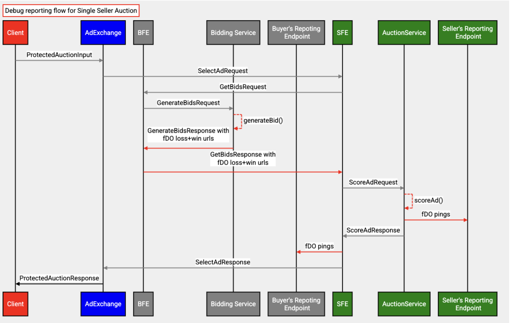

# Protected Audience forDebuggingOnly API with Bidding & Auction Services

[Bidding and Auction Services](https://github.com/privacysandbox/fledge-docs/blob/main/bidding_auction_services_api.md) (B&A) outlines a way to allow Protected Audience auctions to take place in a [Trusted Execution Environment](https://github.com/privacysandbox/fledge-docs/blob/main/trusted_services_overview.md#trusted-execution-environment) (TEE) hosted on a [supported cloud platform](https://github.com/privacysandbox/fledge-docs/blob/main/bidding_auction_services_api.md#supported-public-cloud-platforms). 

This explainer describes the system design for `forDebuggingOnly` (fDO) using the Bidding and Auction Services. For [high-level design](https://github.com/privacysandbox/fledge-docs/blob/main/bidding_auction_services_api.md#unified-contextual-and-fledge-auction-flow-with-bidding-and-auction-services), [ad tech specifications](https://github.com/privacysandbox/fledge-docs/blob/main/bidding_auction_services_api.md#specifications-for-adtechs), [API](https://github.com/privacysandbox/fledge-docs/blob/main/bidding_auction_services_api.md#service-apis), refer to the [Bidding and Auction Services explainer](https://github.com/privacysandbox/fledge-docs/blob/main/bidding_auction_services_api.md#unified-contextual-and-fledge-auction-flow-with-bidding-and-auction-services). 


# Overview 

The seller and the winning buyer each have an opportunity to generate URLs for event-level debug reporting within the `generateBid()` and `scoreAd()` [User-defined Functions (UDF)](https://github.com/privacysandbox/protected-auction-services-docs/blob/ec0a88b2fb7f98489304d7a80a04519d68517d52/roma_bring_your_own_binary.md) respectively by using `forDebuggingOnly.reportAdAuctionLoss()` and `forDebuggingOnly.reportAdAuctionWin()` APIs. 

The `forDebuggingOnly` support with Bidding and Auction Services is planned to be available in multiple phases.


<table>
  <tr>
   <td><strong>Reporting support with Bidding and Auction services</strong>
   </td>
   <td><strong>Timeline</strong>
   </td>
  </tr>
  <tr>
   <td>Debug reporting for single-seller auctions
   </td>
   <td>Launched
   </td>
  </tr>
  <tr>
   <td>Debug reporting for device-Orchestrated multi-seller auctions
   </td>
   <td>Launched (Jan 2025)
   </td>
  </tr>
  <tr>
   <td>Downsampled debug reporting
   </td>
   <td>Apr 2025
   </td>
  </tr>
</table>


This document details the design to generate and ping fDO URLs with the Bidding and Auction Services for single-seller and device-orchestrated multi-seller auctions. 

_Note: <code>forDebuggingOnly</code> (fDO) API is only supported for Protected Audience auctions initiated from Chrome. </em>


# Background

During the auction, untrusted bidding logic of a DSP and untrusted decision logic of a SSP are run in sandbox environments and hence limit their ability to generate auction performance reports to their respective DSP or SSP. fDO APIs _([proposed in the first Origin Trial of Protected Audience](https://github.com/WICG/turtledove/blob/main/Proposed_First_FLEDGE_OT_Details.md#reporting))_ allow adtech to accurately measure their key business metrics and performance while running Protected Audience auctions on the Bidding and Auction Services. 

Bidding and Auction Services enable processing Protected Audience auctions on the server. Sellers use a `scoreAd()` UDF to score ads in the Auction Service and buyers use a `generateBid()` UDF for generating the bids in the Bidding Service. The flow of Bidding and Auction Services is as described in the [high-level design](https://github.com/privacysandbox/protected-auction-services-docs/blob/main/bidding_auction_services_api.md#high-level-design). This design details the support for 

`forDebuggingOnly.reportAdAuctionLoss()` and `forDebuggingOnly.reportAdAuctionWin()` APIs in `scoreAd()` and `generateBid()` on B&A for single-seller auctions.


## `forDebuggingOnly.reportAdAuctionLoss()` JS API

This API allows ad techs to generate the fDO URL for losing interest groups:


```
function forDebuggingOnly.reportAdAuctionLoss(url){
  // …
}
```


## `forDebuggingOnly.reportAdAuctionWin()` JS API

This API allows ad techs to generate the fDO URL for winning interest group:


```
function forDebuggingOnly.reportAdAuctionWin(url){
  // …
}
```


 


# Design

B&A will allow adtech to register their win and loss auction fDO URLs with a fixed set of placeholders. The placeholder data is replaced by corresponding values after the auction.

Allowed placeholder keywords:


*   `"${winningBid}"` 
*   `"${winningBidCurrency}"` 
*   `"${madeWinningBid}"` 
*   `"${highestScoringOtherBid}"` 
*   `"${highestScoringOtherBidCurrency}"`
*   `"${madeHighestScoringOtherBid}"`

Learn more about the keywords from [this](https://github.com/WICG/turtledove/blob/main/Proposed_First_FLEDGE_OT_Details.md#reporting) guide. 


## Detailed flow


*   Adtech can register win and loss auction fDO URLs during execution of `generateBid()` and `scoreAd()` worklets. Adtech can only set at max one win and loss URL per bid.
*   Flow for DSP:
    *   Bidding Service gets the fDO urls in the response from Roma after executing `generateBid()` UDF. 
    *   The bids along with the reporting URLs are dropped when the bid value is 0.
    *   For valid bids, the URLs are exported as a part of `AdWithBid` from [Roma](https://github.com/privacysandbox/protected-auction-services-docs/blob/ec0a88b2fb7f98489304d7a80a04519d68517d52/roma_bring_your_own_binary.md) and sent to the BFE, then forwarded to the SFE in `GetBidsResponse`.
*   Flow for SSP:
    *   Auction Service gets the fDO urls in the response from Roma after executing `scoreAd()`  UDF.
    *   After the winner is determined in the Auction Service:
        *   The placeholder data is replaced in the URLs
        *   For single seller auctions:
            *   The URL registered via `forDebuggingOnly.reportAdAuctionWin()` for the winning ad / bid and `forDebuggingOnly.reportAdAuctionLoss()` for all the losing ads / bids are pinged asynchronously from the Auction Service.
        *   For [device orchestrated multi seller auctions](https://github.com/privacysandbox/protected-auction-services-docs/blob/main/bidding_auction_services_multi_seller_auctions.md#device-orchestrated-component-auctions):
            *   The URL registered via `forDebuggingOnly.reportAdAuctionWin()` and `forDebuggingOnly.`reportAdAuctionLoss`()` for the winning Ad  are sent to SFE that are forwarded to the client in encrypted B&A response. URLs registered via `forDebuggingOnly.reportAdAuctionLoss()` for all the losing ads / bids are pinged asynchronously from the Auction Service.
*   The data required for replacing the placeholders in the fDO URLs for the buyers is sent to SFE from Auction Service.
*   In SFE, for each buyer’s fDO URL:
    *   The placeholders are replaced. 
    *   The url registered via `forDebuggingOnly.reportAdAuctionWin()` for the winning bid and `forDebuggingOnly.reportAdAuctionLoss()` for all the losing bids are pinged asynchronously.

If there is any failure to ping the fDO URL, the URL is dropped.




## Enrollment check

Ad techs are required to [enroll the site](https://github.com/privacysandbox/attestation#the-privacy-sandbox-enrollment-attestation-model) of the fDO endpoint. The list of enrolled ad techs will be fetched from a public endpoint in Bidding Service and Auction Service. If the generated fDO URLs are not found to be enrolled, they will be dropped.


## Downsampling

The device will include a field in the [ProtectedAuctionInput](https://github.com/privacysandbox/bidding-auction-servers/blob/ee8da16f9a0f282a528e3dc4b31330bbf98372f1/api/bidding_auction_servers.proto#L97) to indicate if the device is subjected to downsampling. If this flag is enabled, all URLs registered via `forDebuggingOnly` APIs will be sampled as described in the [explainer](https://github.com/WICG/turtledove/blob/main/FLEDGE.md#712-downsampling), and the final ping will happen from the device. [ProtectedAuctionInput](https://github.com/privacysandbox/bidding-auction-servers/blob/ee8da16f9a0f282a528e3dc4b31330bbf98372f1/api/bidding_auction_servers.proto#L97) will also include a field to indicate if the device is in lockout or the AdTech is in cooldown.
This will be set in the `browserSignals.forDebuggingOnlyInCooldownOrLockout` input to `generateBid()`. 


## Note for ad techs


*   The seller and buyer can enable fDO by setting [enableSellerDebugReportingUrlGeneration](https://github.com/privacysandbox/bidding-auction-servers/blob/722e1542c262dddc3aaf41be7b6c159a38cefd0a/production/deploy/gcp/terraform/environment/demo/seller/seller.tf#L82C1-L82C5) and [enableBuyerDebugReportingUrlGeneration](https://github.com/privacysandbox/bidding-auction-servers/blob/722e1542c262dddc3aaf41be7b6c159a38cefd0a/production/deploy/gcp/terraform/environment/demo/buyer/buyer.tf#L92) respectively to `true`. 
*   There are two configurations that ad techs can use to limit the size of the fDO.
    *   Buyer can set the [MAX_ALLOWED_SIZE_DEBUG_URL_BYTES and MAX_ALLOWED_SIZE_ALL_DEBUG_URLS_KB](https://github.com/privacysandbox/bidding-auction-servers/blob/722e1542c262dddc3aaf41be7b6c159a38cefd0a/production/deploy/gcp/terraform/environment/demo/buyer/buyer.tf#L125C1-L127C1) in the Terraform configuration for bidding service. 
    *   Seller can set the[ MAX_ALLOWED_SIZE_DEBUG_URL_BYTES and MAX_ALLOWED_SIZE_ALL_DEBUG_URLS_KB ](https://github.com/privacysandbox/bidding-auction-servers/blob/722e1542c262dddc3aaf41be7b6c159a38cefd0a/production/deploy/gcp/terraform/environment/demo/seller/seller.tf#L126C1-L127C5)in the Terraform config for Auction Service. 

    Any fDO url exceeding `MAX_ALLOWED_SIZE_DEBUG_URL_BYTES` will be dropped. Once the cumulative size of the fDO urls exceeds `MAX_ALLOWED_SIZE_ALL_DEBUG_URLS_KB`, the remaining fDO urls will be dropped. 


    It is recommended to set the [MAX_ALLOWED_SIZE_DEBUG_URL_BYTES](https://github.com/privacysandbox/bidding-auction-servers/blob/722e1542c262dddc3aaf41be7b6c159a38cefd0a/production/deploy/gcp/terraform/environment/demo/buyer/buyer.tf#L125C1-L127C1) to 64kb and [MAX_ALLOWED_SIZE_ALL_DEBUG_URLS_KB](https://github.com/privacysandbox/bidding-auction-servers/blob/722e1542c262dddc3aaf41be7b6c159a38cefd0a/production/deploy/gcp/terraform/environment/demo/buyer/buyer.tf#L125C1-L127C1) to 3Mb to not incur a network traffic and processing overhead.
