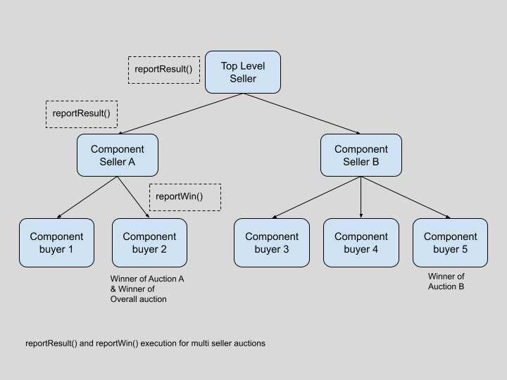
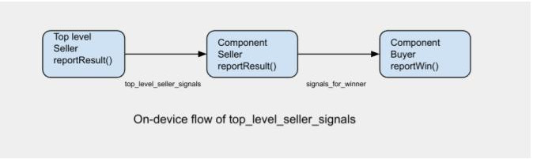
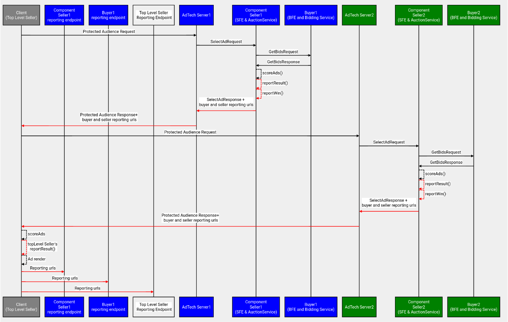
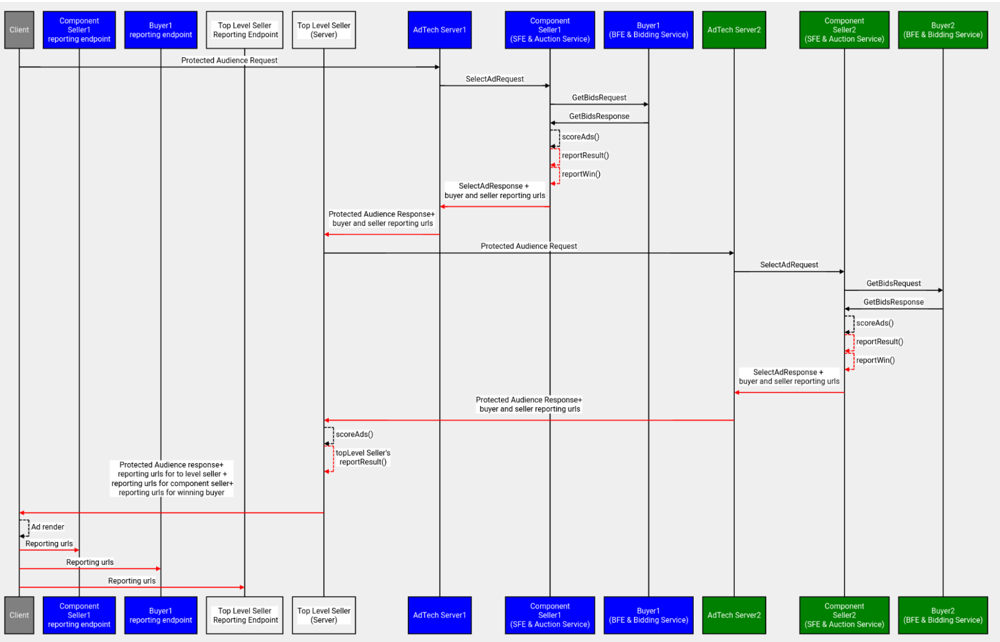

> _FLEDGE has been renamed to Protected Audience API. To learn more about the name change, read the [blog post](https://privacysandbox.com/intl/en_us/news/protected-audience-api-our-new-name-for-fledge)._

**Author:**  
[Rashmi Rao](https://github.com/rashmijrao), Google Privacy Sandbox

## Protected Audience  Event Level Reporting for Multi Seller Bidding & Auction Services

[Bidding and Auction services](https://github.com/privacysandbox/fledge-docs/blob/main/bidding_auction_services_api.md) outline a way to allow Protected Audience auctions to take place in a [trusted execution environment](https://github.com/privacysandbox/fledge-docs/blob/main/trusted_services_overview.md#trusted-execution-environment) (TEE) hosted on a [supported cloud platform](https://github.com/privacysandbox/fledge-docs/blob/main/bidding_auction_services_api.md#supported-public-cloud-platforms). 

This explainer describes the system design for event level reporting using the Bidding and Auction services specifically in multi seller scenarios. For single-seller event level reporting refer to  [this explainer](https://github.com/privacysandbox/fledge-docs/blob/main/bidding_auction_event_level_reporting.md#protected-audience-event-level-reporting-with-bidding-and-auction-services).

 For detailed design of multi seller auction support on Bidding and Auction Services refer to this [explainer](https://github.com/privacysandbox/fledge-docs/blob/main/bidding_auction_services_multi_seller_auctions.md#multi-seller-auction).

For [high level design](https://github.com/privacysandbox/fledge-docs/blob/main/bidding_auction_services_api.md#unified-contextual-and-fledge-auction-flow-with-bidding-and-auction-services), [ad tech specifications](https://github.com/privacysandbox/fledge-docs/blob/main/bidding_auction_services_api.md#specifications-for-adtechs), [API](https://github.com/privacysandbox/fledge-docs/blob/main/bidding_auction_services_api.md#service-apis), refer to the [Bidding and Auction services explainer](https://github.com/privacysandbox/fledge-docs/blob/main/bidding_auction_services_api.md#unified-contextual-and-fledge-auction-flow-with-bidding-and-auction-services). 

### Overview 

The seller and the winning buyer each have an opportunity to generate URLs for event-level reporting based on an auction outcome.

Reporting with Bidding and Auction services is planned to be supported in multiple phases.

<table>
  <tr>
   <td><strong>Reporting support with Bidding and Auction services</strong>
   </td>
   <td><strong>Timeline</strong>
   </td>
  </tr>
  <tr>
   <td>Win reporting for single seller auctions
   </td>
   <td>LAUNCHED
   </td>
  </tr>
  <tr>
   <td>Win reporting for device-orchestrated multi seller auctions.
   </td>
   <td>Beta 2
   </td>
  </tr>
  <tr>
   <td>Win reporting for server-orchestrated multi seller auctions.
   </td>
   <td>Beta 2
   </td>
  </tr>
  <tr>
   <td>Private Aggregation API 
   </td>
   <td>Scale Testing
   </td>
  </tr>
</table>

This document details the design to generate win reporting urls with the Bidding and Auction Services for multi seller auctions. The urls are sent back to the client (browser, Android) and pinged from the client after the ad is rendered.The design for single seller auctions is covered in a different [explainer](https://github.com/privacysandbox/fledge-docs/blob/main/bidding_auction_event_level_reporting.md#protected-audience-event-level-reporting-with-bidding-and-auction-services). 

Multi seller auctions are those auctions with participation from multiple sellers and their partner buyers, where the final winning ad candidate is decided by a top level auction. There multiple types of multi seller auctions:

*   [Device-orchestrated component auctions](https://github.com/privacysandbox/fledge-docs/blob/main/bidding_auction_services_multi_seller_auctions.md#device-orchestrated-component-auctions) - Only for browsers
*   [Server-orchestrated multi seller auctions](https://github.com/privacysandbox/fledge-docs/blob/main/bidding_auction_services_multi_seller_auctions.md#server-orchestrated-component-auctions) - For browsers and Android 
*   WaterFall meditation - Only for Android apps

This document will focus on device-orchestrated and server-orchestrated multi seller auctions.

### Background

##### Device-orchestrated component auctions

In [device-orchestrated component auctions](https://github.com/privacysandbox/fledge-docs/blob/main/bidding_auction_services_multi_seller_auctions.md#device-orchestrated-component-auctions), each component auction is orchestrated by the respective seller in the publisher web page, in the browser. Each component auction can be conducted with the Bidding and Auction services or on-device. The top-level Protected Audience auction is executed on the browser.

##### Server-orchestrated component auctions

In [server-orchestrated component auctions](https://github.com/privacysandbox/fledge-docs/blob/main/bidding_auction_services_multi_seller_auctions.md#server-orchestrated-component-auctions), the top-level seller makes one request for an auction from the publisher web page to its ad service. The top-level seller’s ad service orchestrates unified requests to other sellers for Component auctions that can run on Bidding and Auction services. Then, the top-level Protected Audience auction is executed in the top-level seller's TEE-based Auction service.

## Design

For a single-seller auction, reporting urls are generated for the winning buyer and seller (as explained [here](https://github.com/privacysandbox/fledge-docs/blob/main/bidding_auction_event_level_reporting.md#protected-audience-event-level-reporting-with-bidding-and-auction-services)).

For multi seller auctions, event level reporting urls are generated for the top-level seller, winning component seller and winning buyer.

 \

The inputs to each reportResult and reportWin function are expected to be different for each of them:

<table>
  <tr>
   <td><strong>Input Signals</strong>
   </td>
   <td><strong>Provided to</strong>

<strong>Top Level Seller’s reportResult</strong>
   </td>
   <td><strong>Provided to</strong>

<strong>Component Seller’s reportResult</strong>
   </td>
   <td><strong>Provided to Component Buyer’s reportWin</strong>
   </td>
  </tr>
  <tr>
   <td>Auction Signals
   </td>
   <td>Yes

(Top Level auction config)
   </td>
   <td>Yes \
(Component level auction config)
   </td>
   <td>Yes \
(Component level auction config)
   </td>
  </tr>
  <tr>
   <td>topWindowHostname
   </td>
   <td>Yes
   </td>
   <td>Yes
   </td>
   <td>Yes
   </td>
  </tr>
  <tr>
   <td>topLevelSeller
   </td>
   <td>Yes
   </td>
   <td>Yes
   </td>
   <td>Yes
   </td>
  </tr>
  <tr>
   <td>componentSeller
   </td>
   <td>Yes
   </td>
   <td>Yes
   </td>
   <td>Yes
   </td>
  </tr>
  <tr>
   <td>interestGroupOwner
   </td>
   <td>Yes
   </td>
   <td>Yes
   </td>
   <td>Yes
   </td>
  </tr>
  <tr>
   <td>renderURL
   </td>
   <td>Yes
   </td>
   <td>Yes
   </td>
   <td>Yes
   </td>
  </tr>
  <tr>
   <td>bid
   </td>
   <td>Yes

(modified bid)
   </td>
   <td>Yes \
(buyer bid)
   </td>
   <td>Yes \
(buyer bid)
   </td>
  </tr>
  <tr>
   <td>desirability
   </td>
   <td>Yes

(Top level score)
   </td>
   <td>Yes

(Component level score)
   </td>
   <td>No
   </td>
  </tr>
  <tr>
   <td style="background-color: null">topLevelSellerSignals
   </td>
   <td style="background-color: null">No
   </td>
   <td style="background-color: null">No
   </td>
   <td style="background-color: null">No
   </td>
  </tr>
  <tr>
   <td style="background-color: null">modifiedBid
   </td>
   <td style="background-color: null">No
   </td>
   <td style="background-color: null">Yes
   </td>
   <td style="background-color: null">No
   </td>
  </tr>
  <tr>
   <td>highestScoringOtherBid
   </td>
   <td>No
   </td>
   <td>Yes
   </td>
   <td>Yes
   </td>
  </tr>
  <tr>
   <td>madeHighestScoringOtherBid
   </td>
   <td>No
   </td>
   <td>No
   </td>
   <td>Yes
   </td>
  </tr>
  <tr>
   <td>adCost
   </td>
   <td>No
   </td>
   <td>No
   </td>
   <td>Yes
   </td>
  </tr>
  <tr>
   <td>interestGroupName
   </td>
   <td>No
   </td>
   <td>No
   </td>
   <td>Yes

(may be included if the tuple of interest group owner, name, bidding script URL, ad creative URL, and ad creative size were jointly k-anonymous once B&A supports K-anonymity).
   </td>
  </tr>
  <tr>
   <td>seller
   </td>
   <td>No
   </td>
   <td>No
   </td>
   <td>Yes
   </td>
  </tr>
  <tr>
   <td>joinCount
   </td>
   <td>No
   </td>
   <td>No
   </td>
   <td>Yes
   </td>
  </tr>
  <tr>
   <td>recency
   </td>
   <td>No
   </td>
   <td>No
   </td>
   <td>Yes
   </td>
  </tr>
  <tr>
   <td>modelingSignals
   </td>
   <td>No
   </td>
   <td>No
   </td>
   <td>Yes
   </td>
  </tr>
  <tr>
   <td style="background-color: null">signalsForWinner
   </td>
   <td style="background-color: null">No
   </td>
   <td style="background-color: null">No
   </td>
   <td style="background-color: null">Yes
   </td>
  </tr>
  <tr>
   <td style="background-color: null">perBuyerSignals
   </td>
   <td style="background-color: null">No
   </td>
   <td style="background-color: null">No
   </td>
   <td style="background-color: null">Yes
   </td>
  </tr>
</table>

On-device Protected Audience auctions support passing  output of the top level seller reportResult call as the [topLevelSellerSignals input](https://github.com/WICG/turtledove/blob/main/FLEDGE.md#51-seller-reporting-on-render) to the component seller's reportResult call. This creates a dependency in the reporting function execution for the component seller and buyer on the reportResult() execution of the top level seller for the topLevelSellerSignals.

This dependency may not be necessary and adtechs have not provided requirements for [supporting this](https://github.com/WICG/turtledove/issues/821).  This dependency is removed for reporting URL generation in Bidding and Auction Services and the topLevelSellerSignals will not be passed to the component seller’s reportResult.

The reporting URLs for the component auctions will be generated immediately after the component auction for both component level seller and buyer. The win reporting urls for the seller and buyer from the component auction are passed to the top level auction in the response from SFE for both [device orchestrated](https://github.com/privacysandbox/fledge-docs/blob/main/bidding_auction_services_multi_seller_auctions.md#device-orchestrated-component-auctions) and [server orchestrated](https://github.com/privacysandbox/fledge-docs/blob/main/bidding_auction_services_multi_seller_auctions.md#server-orchestrated-component-auctions) component auctions.

##### Device-orchestrated component auctions

The top-level seller will receive the reporting urls for all the component sellers and winning buyers in the response from the component auctions. After the top level  auction, the browser will run the top-level seller’s reportResult(). All the reporting urls will finally be pinged after the ad has rendered.

###### API changes:

For component auctions, the reporting urls will be populated in [component\_seller\_reporting\_urls](https://github.com/privacysandbox/bidding-auction-servers/blob/b27547a55f20021eb91e1e61b0d2175b4aee02ea/api/bidding_auction_servers.proto#L1173) instead of the [top\_level\_seller\_reporting\_urls](https://github.com/privacysandbox/bidding-auction-servers/blob/b27547a55f20021eb91e1e61b0d2175b4aee02ea/api/bidding_auction_servers.proto#L1178)

##### Server-orchestrated component auctions

The top-level seller will receive reporting urls for the component seller and winning buyer in the response from the component auctions. After the final top level auction in the top level seller's TEE based Auction service, the top level seller can run the reportResult() to generate a reporting url and return all the urls back to the client. The client will get the reporting urls for all the sellers and winning buyers and the top level seller in [AuctionResult](https://github.com/privacysandbox/bidding-auction-servers/blob/b222e359f09de60f0994090f7a57aa796e927345/api/bidding_auction_servers.proto#L208) ciphertext in the response. 

###### API changes:

For component auctions, the reporting urls will be populated in [component\_seller\_reporting\_urls](https://github.com/privacysandbox/bidding-auction-servers/blob/b27547a55f20021eb91e1e61b0d2175b4aee02ea/api/bidding_auction_servers.proto#L1173) ScoreAdsResponse instead of the [top\_level\_seller\_reporting\_urls](https://github.com/privacysandbox/bidding-auction-servers/blob/b27547a55f20021eb91e1e61b0d2175b4aee02ea/api/bidding_auction_servers.proto#L1178)

For top-level auctions, the reporting urls will be populated in [top\_level\_seller\_reporting\_urls](https://github.com/privacysandbox/bidding-auction-servers/blob/b27547a55f20021eb91e1e61b0d2175b4aee02ea/api/bidding_auction_servers.proto#L1178)

_Note: If the [top\_level\_seller field](https://github.com/privacysandbox/bidding-auction-servers/blob/b222e359f09de60f0994090f7a57aa796e927345/api/bidding_auction_servers.proto#L434) in the AuctionConfig of SelectAdRequest is set, it will be considered a component auction. This field will be set by the component seller's ad server,based on an agreement with the top-level seller._

Once the ad has been rendered on the client, all the reporting urls will be pinged. The clients will perform a check for [enrollment](https://github.com/privacysandbox/attestation/blob/main/how-to-enroll.md)_ _and [attestation](https://github.com/privacysandbox/attestation/blob/main/README.md#core-privacy-attestations). There will be additional validation to ensure that the reporting url domain matches the domain of the AdTech on Android.
