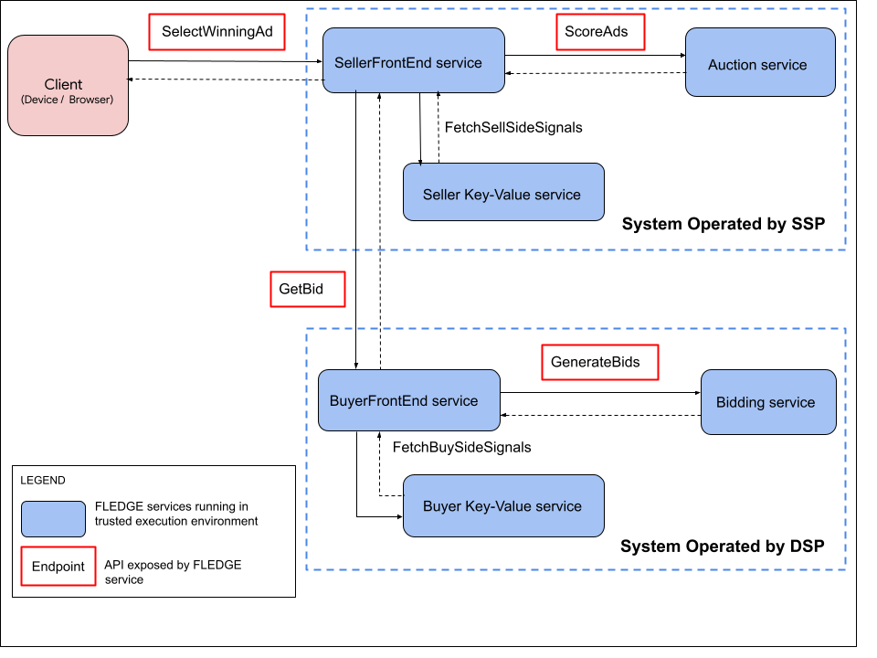

# Bidding and Auction Services API

[The Privacy Sandbox][4] aims to develop technologies that enable more private
advertising on the web and mobile devices. Today, real-time bidding and ad
auctions are executed on servers that may not provide technical guarantees of
security. Some users have concerns about how their data is handled to
generate relevant ads and in how that data is shared with ad providers.
FLEDGE ([Android][24], [Chrome][5]) provides ways to preserve privacy and limit
third-party data sharing by serving personalized ads based on previous mobile
app or web engagement.

For all platforms, FLEDGE may require [real-time services][6]. In the initial
[FLEDGE proposal][7], bidding and auction for remarketing ad demand is
executed locally. This can demand computation requirements that may be
impractical to execute on devices with limited processing power, or may be
too slow to render ads due to network latency.

The Bidding and Auction Services API proposal outlines a way to allow FLEDGE
computation to take place on cloud servers in a trusted execution
environment, rather than running locally on a user's device. Moving
computations to cloud servers can help optimize the FLEDGE auction, to free
up computational cycles and network bandwidth for a device. This is not a
requirement for Chrome at this point.

This contrasts with [Google Chrome's initial FLEDGE proposal][7], which
proposes bidding and auction execution to occur locally. There are other
ideas, similar to FLEDGE, that propose server-side auction and bidding, such
as [Microsoft Edge's PARAKEET][8] proposal. Unlike PARAKEET and Criteo's
Gatekeeper designs, this proposal does not involve any communication between
services that cannot be attested.

This document focuses on the API design for FLEDGE's bidding and auction
services. Based on adtech feedback, changes may be incorporated in the
design. A document that details system design for bidding and auction services
will also be published at a later date.

## Background

Read the [FLEDGE services overview][6] to learn about the environment, trust
model, server attestation, request-response encryption, and other details.

Each FLEDGE service is hosted in a virtual machine (VM) within a secure,
hardware-based trusted execution environment (TEE). Adtech platforms operate
and deploy FLEDGE services on a public cloud. Adtechs may choose the cloud
platform from one of the options that are planned. As cloud customers,
adtechs are the owners and only tenants of such VM instances.

## Bidding and Auction system architecture

The following is a high-level overview of the architecture of the Bidding and
Auction system.



_In this diagram, one seller and one buyer are represented in the service
 workflow. In reality, a single seller auction has multiple participating
 buyers_.

1. The client starts the auction process.
  - The client sends a `SelectWinningAd` request to the `SellerFrontEnd` service.
    This request includes the seller's auction configuration and input for each
    participating buyer.
1. The `SellerFrontEnd` service orchestrates `GetBids` requests to participating
   buyers’ `BuyerFrontEnd` services.
1. The `BuyerFrontEnd` services fetch real-time data from the buyer’s key-value
    service required for generating bids.
1. The `BuyerFrontEnd` service sends a `GenerateBids` request to the bidding
   service. The bidding service returns ad candidates with bid(s) for each IG.
1. The `BuyerFrontEnd` returns all bid(s) in IG (`AdWithBid`) to `SellerFrontEnd`.
1. Once `SellerFrontEnd` has received bids from all buyers, it requests real-time
   data for render_urls (corresponding to ad with bids) from the seller’s key/value
   service required to score the ads for auction.
  1. `SellerFrontEnd` sends a `ScoreAds` request to the `auction` service to
       score and select a winner. The Auction service selects the the winning ad and
       additional data.
1. `SellerFrontEnd` returns winning ad, server attestation metadata, other data for
    for reporting purposes back to the user's device. Ad is rendered on the device.

### Sell-side platform (SSP) system

The following are the FLEDGE services that will be operated by an SSP, also
referred to as a Seller. Server instances are deployed so that they are
co-located in a data center within a cloud region.

#### SellerFrontEnd service

The `SellerFrontEnd` service orchestrates calls to other adtechs. For a
single seller auction, this service sends requests to DSPs participating in
the auction for bidding. This service also fetches real-time seller signals
and adtech proprietary code required for the auction.

_Note: In this model and with the_ [_proposed APIs_][9], _a seller can have
 auction execution on a cloud platform only when all buyers participating in
 the auction also operate services for bidding on any supported cloud
 platform. If required for testing purposes, the client-facing API can be
 updated to support seller-run auctions in the cloud seamlessly, without
 depending on a buyer's adoption of services_.

#### Auction service

The `Auction` service only responds to requests from `SellerFrontEnd` service and
periodically fetches private keys from Key Management Systems; other than doesn't
have outbound network access. The proposal is that code blobs required for auction is
pulled from Cloud Storage (eg. S3 / Blobstore) instance in the private VPC network as
Bidding service and cached. The code is prefetched, updated and cached periodically.

For every ad auction request, the `Auction` service executes seller owned auction
code written in JavaScript and / or WebAssembly in a V8 sandbox instance within a TEE.
Execution of code in the sandbox within a TEE ensures that all input and output
(such as logging, file access, and disk access) is disabled, and the service has
no network or storage access. The scoring code is executed per ad within a V8 worker
process, where all scoreAd() execution for an auction request happens in parallel.
If the scoring code is in Javascript, the Javascript context is initialized before
every ScoreAd() execution; if WASM is provided with the Javascript depending on how
WASM is instantiated, the WASM can be precompiled and cached.

The hosting environment protects the confidentiality of the Seller's proprietary
code, if the execution happens only in the cloud.

#### Seller's key/value service

A key/value service is a critical dependency for the auction system. The
[FLEDGE key/value service][10] receives requests from the `SellerFrontEnd`
service in this architecture. The service returns real-time seller
data required for auction that corresponds to lookup keys available in buyers'
bids (such as `ad_render_urls` or `ad_component_render_urls`).

The seller’s key/value system may be BYOS Key/Value Service or Trusted Key/Value
Service depending on timeline.

### Demand-side platform (DSP) system

This section describes FLEDGE services that will be operated by a DSP, also
referred to as a buyer. Server instances are deployed such that they are
co-located in a data center within a given cloud region.

#### BuyerFrontEnd service

The front-end service of the system that receives requests to generate bids from
a `SellerFrontEnd` service. This service fetches real-time bidding signals, buyer
signals, and proprietary adtech code that is required for bidding.

_Note: With the proposed APIs, a `BuyerFrontEnd` service can also receive requests
directly from the client, such as an Android app or web browser. This is
supported during the interim testing phase so that buyers (DSPs) can test / roll out
servers independently without depending on seller (SSP) adoption_.

#### Bidding service

The Bidding service can only respond to requests from a `BuyerFrontEnd`
service, and periodically fetches private keys from Key Management Systems;
other than doesn't have outbound network access. Code blobs required for bidding will be
pulled from Cloud Storage (eg. S3 / Blobstore) instance in the private VPC network as Bidding
service and cached. The code is prefetched, updated and cached periodically.
 
For every bidding request, the service executes buyer owned bidding code written in
JavaScript and / or WebAssembly (WASM) in a V8 sandbox instance within a TEE. All input
and output (such as logging, file access, and disk access) are disabled, and the service
has no (public) network or storage access. The bidding code is executed per Custom Audience /
Interest Group within a V8 worker process, where all GenerateBid() execution for a bidding
request happens in parallel. If the bidding code is in Javascript, the Javascript context
is initialized before every GenerateBid() execution; if WASM is provided with the Javascript
depending on how WASM is instantiated, the WASM can be precompiled and cached.

This environment protects the confidentiality of a buyer's proprietary code, if
the execution happens only in the cloud.

#### Buyer’s key/value Service

A buyer's key/value service is a critical dependency for the bidding system.
The [FLEDGE key/value service][10] receives requests from the `BuyerFrontEnd`
service in this architecture. The service returns real-time buyer data required
for bidding, corresponding to lookup keys.

The buyer’s key/value system may be BYOS Key/Value Service or Trusted Key/Value
Service depending on timeline.

### Dependencies

Through techniques such as prefetching and caching, the following dependencies
are in the non-critical path of ad serving.

- A key management system required for FLEDGE service attestation. Learn more
  in the [FLEDGE Services public document][6].
- A [K-anonymity service][11] ensures the ad is served to K unique users. This
  service is a dependency for the `BuyerFrontEnd` service in this architecture.
  The details are not included in this document, but will be covered in a
  subsequent document.

## API

This API proposal for FLEDGE services is based on the gRPC framework.
[gRPC][12] is an open source, high performance RPC framework built
on top of HTTP2 that is used to build scalable and fast APIs. gRPC uses
[protocol buffers][13] as the [interface description
language][14] and underlying message interchange format.

FLEDGE services expose RPC API endpoints. In this document, the proposed API
definitions use [proto3][15].

All communications between FLEDGE services are RPC and are encrypted. All
client-to-server communication is also encrypted. Refer to the [FLEDGE services
explainer][6] for more information.

A client, such as an Android app or web browser, can call FLEDGE services using
RPC or HTTPS. A proxy service hosted in the same VM instance as the FLEDGE
service converts HTTPS requests to RPC. Details of this service are out of scope
of this document.

Requests to FLEDGE services and corresponding responses are encrypted. Every
request includes an encrypted payload (`request_ciphertext`) and a raw key
version (`key_id`) which corresponds to the public key that is used to encrypt
the request. The service that decrypts the request will have to use private
keys(corresponding to the same key version) to decrypt the request.

### Public APIs

A client such as an Android app or web browser can access public APIs. Clients
can send RPC or HTTPS to FLEDGE service.

#### Protocol buffer <-> JSON / YAML

Given gRPC APIs are defined as protocol buffers, following are some options to
convert protocol buffers to JSON or YAML.

[Proto3][15] has a built-in JSON serializer and parser. These libraries have
multi-language support and can be used to convert protocol buffer message
objects to JSON and vice-versa.

- C++:
  - [json_util.h][16]
    - `MessageToJsonString()`: Converts Protobuf message to JSON.
    - `JsonStringToMessage()`: Converts JSON to Protobuf message.
- Java:
  - [`JsonFormat.Printer`][17]: Converts Protobuf message to JSON format.
  - [`JsonFormat.Parser`][17]: Converts JSON to Protobuf message.

_Learn more about_ [_Proto3 to JSON mapping_][18].

YAML can also be used with HTTPS. The open source tool [gnostic][19] can
convert protocol buffers to and from YAML Open API descriptions.

Also, you may refer to the [protoc-gen-openapi plugin][20] to generate Open
API output corresponding to a proto definition.

**NOTE: There are references for Component Auctions in the API, however Bidding
& Auction services doesn't handle Component Auctions yet.**

#### SelectWinningAd

The Seller FrontEnd service (`SellerFrontEnd`) exposes an API endpoint
(`SelectWinningAd`). A client such as Android device or web browser sends a
`SelectWinningAd` RPC or HTTPS request to `SellerFrontEnd`. After processing
the request, the `SelectWinningAdResponse` includes the winning ad that would
be rendered on the user's device.

_Note: 
  * _Seller Key Value service endpoint (`scoring_signals_url`) __is not passed from the device
    to server side__; this endpoint is ingested from SellerFrontEnd service configuration at
    service startup_ to prewarm network client / connection.
  * _Buyer Key Value service endpoint (`bidding_signals_url`) __is not passed from the device__; this
    endpoint is ingested from BuyerFrontEnd service configuration at service startup to prewarm 
    network client / connection_.

_Note: The following API is designed for the desired end state, where sellers
 and all buyers operate auction and bidding services (respectively) in the
 cloud_.

Following is the `SelectWinningAd` API definition.

```
syntax = "proto3";

// Seller's FrontEnd service.
service SellerFrontEnd {
  // Selects a winning ad for the Publisher ad slot that would be
  // rendered on the user's device.
  rpc SelectWinningAd(SelectWinningAdRequest)
    returns (SelectWinningAdResponse) {
    option (google.api.http) = {
      post: "/v1/selectwinningad"
      body: "*"
    };
  }
}

// SelectWinningAdRequest is sent from user's device to the
// SellerFrontEnd Service.
message SelectWinningAdRequest {
  // Unencrypted request.
  message SelectWinningAdRawRequest {
    enum ClientType {
      UNKNOWN = 0;

      // An Android device with Google Mobile Services (GMS).
      // Note: This covers apps on Android and browsers on Android.
      ANDROID = 1;

      // An Android device without Google Mobile Services (GMS).
      ANDROID_NON_GMS = 2;

      // Any browser.
      BROWSER = 3;
    }

    // AuctionConfig required by the seller for an ad auction.
    // The auction config includes contextual signals and other data required
    // for auction. This config is passed from client to SellerFrontEnd service
    // in the umbrella request (SelectWinningAdRequest).
    message AuctionConfig {
      // Custom seller inputs for advertising on Android.
      message CustomSellerInputsForAndroid {
        // To be updated later if any custom fields are required to support
        // Android.
      }

      // Custom seller inputs for advertising on the web.
      message CustomSellerInputsForBrowser {
        // Optional. Component auction configuration can contain additional
        // auction configurations for each seller's "component auction".
        // Represents a serialized string that can be deserialized to a JSON object.
        string component_auctions = 1;

        // The Id is specified by the seller to support coordinated experiments
        // with the seller's Key/Value services.
        int32 experiment_group_id = 2;
      }
      
      // Optional. Custom seller inputs.
      oneof CustomSellerInputs {
        CustomSellerInputsForAndroid custom_seller_inputs_android = 1;

        CustomSellerInputsForBrowser custom_seller_inputs_browser = 2;
      }
     
      /*..........................Contextual Signals.........................*/
      // Contextual Signals refer to seller_signals and auction_signals
      // derived contextually.

      // Seller specific signals that include information about the context
      // (e.g. Category blocks Publisher has chosen and so on). This can
      // not be fetched real-time from Key-Value Server.
      // Represents a serialized string that is deserialized to a JSON object
      // before passing to Adtech script.
      string seller_signals = 3;

      // Information about auction (ad format, size). 
      // This information is required for both bidding and auction.
      // Represents a serialized string that is deserialized to a JSON object
      // before passing to Adtech script.
      string auction_signals = 4;
    }

    // Optional. Required by Android to identify an ad selection request.
    int64 ad_selection_request_id = 1;

    // BuyerInput per buyer.
    // The key in the map corresponds to buyer Id that can identify a buyer
    // participating in the auction. Buyer Id can be eTLD+1; i.e. domain address
    // (ETLD+1) of the global load balancer of Buyer Frontend Service.
    // The value corresponds to BuyerInput ingested by the buyer for bidding.
    map<string, BuyerInput> input_per_buyer = 2;

    // Includes configuration data required in Remarketing ad auction.
    // Some data in AuctionConfig is passed to BuyerFrontEnd. 
    AuctionConfig auction_config = 3;
    
    // Publisher website or app that is part of Buyer KV lookup url.
    string publisher_hostname = 4;

    // Type of end user's device / client, that would help in validating the
    // integrity of an attested client.
    // Note: Not all types of clients will be attested.
    ClientType client_type = 5;

    // Field representing Android client attestation data will be added later.
  }

  // Encrypted SelectWinningAdRawRequest.
  bytes request_ciphertext = 1;

  // Version of the public key used for request encryption. The service
  // needs use private keys corresponding to same key_id to decrypt
  // 'request_ciphertext'.
  string key_id = 2;
}

message SelectWinningAdResponse {
  // Unencrypted response.
  message SelectWinningAdRawResponse {
    // The ad that will be rendered on the end user's device.
    // Note: This could be an int32 instead given an ad can be uniquely identified
    // by the Buyer. In that case, the device would keep the mapping of the ad
    // identifier to ad_render_url.
    string ad_render_url = 1;

    // Score of the winning ad.
    float score = 2;

    // Custom Audience (a.k.a Interest Group) name.
    string custom_audience_name = 3;

    // Bid for the winning ad candidate, generated by a buyer participating in
    // the auction.
    float bid_price = 4;

    // The version of the binary running on the server and Guest OS of Secure
    // Virtual Machine. The client may validate that with the version
    // available in open source repo.
    string server_binary_version = 5;
  }
  
  // Encrypted SelectWinningAdRawResponse.
  bytes response_ciphertext = 1;
}
```

##### BuyerInput

`BuyerInput` data corresponding to each buyer participating in the auction
is passed in the umbrella request (`SelectWinningAdRequest`) from the client
to the `SellerFrontEnd` service.

```
syntax = "proto3";

// A BuyerInput includes data that a buyer (DSP) requires to generate bids.
message BuyerInput {
  // CustomAudience (a.k.a InterestGroup) includes name, the set of ads
  // corresponding to this audience, Buyer Key Value lookup keys, user bidding
  // signals and other optional fields.
  message CustomAudience {
    // Name or tag of Custom Audience (a.k.a Interest Group).
    string name = 1;

    // Keys to lookup from Buyer Key/Value service.
    // NOTE: CA / IG name would be another lookup key besides the keys in this
    // field when the Buyer KV lookup happens from BuyerFrontEnd. It is
    // recommended to a Buyer that CA / IG name is not added to
    // `bidding_signals_keys` so that less redundant data is shipped server
    // side. Client (Android or Browser) should be check and remove IG / CA name
    // from `bidding_signals_keys` so redundant / duplicate data is not sent
    // over the wire.
    repeated string bidding_signals_keys = 2;
  }
  
  // The Custom Audiences (a.k.a Interest Groups) corresponding to the buyer.
  repeated CustomAudience custom_audiences = 1;
  
  // First party user_id owned by the Buyer. 
  // This can be an additional bidding signal key for Buyer Key Value lookup.
  // E.g.- Buyer may use this to lookup user_bidding_signal from Key Value server
  // for each IG/CA.
  string buyer_1p_user_id = 2;

  // Buyer may provide additional contextual information that could help in
  // generating bids. This is derived from contextual response.
  // Represents a serialized string that is deserialized to a JSON object before
  // passing to Adtech script.
  string buyer_signals = 3;
  
  // Signals about the user's device.
  // Required for bidding.
  oneof DeviceSignals {
    // A JSON string constructed by Android containing contextual
    // information that SDK or app knows about and that adtech's bidding
    // code can ingest.
    string android_signals = 4;

    // A JSON string constructed by the browser, containing information that
    // the browser knows about and that adtech's bidding code can ingest.
    string browser_signals = 5;
  }
  
  // Custom buyer inputs for advertising on Android.
  message CustomBuyerInputsForAndroid {
    // To be updated later if any custom fields are required to support Android.
  }

  // Custom buyer inputs for advertising on browsers.
  message CustomBuyerInputsForBrowser {
    // The Id is specified by the buyer to support coordinated experiments with
    // the buyer's Key/Value services.
    int32 experiment_group_id = 1;
  }

  // Optional. Custom buyer input for app or web advertising.
  oneof CustomBuyerInputs {
    CustomBuyerInputsForAndroid custom_buyer_inputs_android = 6;

    CustomBuyerInputsForBrowser custom_buyer_inputs_browser = 7;
  }
}
```

#### GetBids

The `BuyerFrontEnd` service exposes an API endpoint `GetBids`. The
`SellerFrontEnd` service sends encrypted `GetBidsRequest` to the `BuyerFrontEnd`
service that include `BuyerInput` and other data. After processing the request,
`BuyerFrontEnd` returns `GetBidsResponse`, which includes bid(s) for each Interest Group.
Refer to [`AdWithBid`][22] for more information.

The communication between the `BuyerFrontEnd` service and the `SellerFrontEnd`
service is TEE to TEE communication and is end-to-end encrypted.

_Note: Temporarily, as adtechs test these systems, clients can call
 `BuyerFrontEnd` services directly using the API below_.

```
syntax = "proto3";

// Buyer’s FrontEnd service.
service BuyerFrontEnd {
  // Returns bids for each Interest Group / Custom Audience.
  rpc GetBids(GetBidsRequest) returns (GetBidsResponse) {
    option (google.api.http) = {
      post: "/v1/getbids"
      body: "*"
    };
  }
}

// GetBidsRequest is sent by the `SellerFrontEnd` Service to the `BuyerFrontEnd`
// service.
message GetBidsRequest{
  // Unencrypted request.
  message GetBidsRawRequest {
    // Whether this is a fake request from SellerFrontEnd service
    // and should be dropped.
    // Note: `SellerFrontEnd` service will send chaffs to a few other buyers
    // not participating in the auction. This is required for privacy reasons
    // to prevent seller from figuring the buyers by observing the network
    // traffic to `BuyerFrontEnd` Services, outside of TEE.
    bool is_chaff = 1;

    // Buyer Input for the Buyer that includes keys for Buyer Key Value lookup
    // and other signals for bidding.
    BuyerInput buyer_input = 2;

    // Information about auction (ad format, size) derived contextually.
    // Represents a serialized string that is deserialized to a JSON object
    // before passing to Adtech script.
    // Copied from Auction Config in SellerFrontEnd service.
    string auction_signals = 3;
    
    // Publisher website or app that is part of Buyer KV lookup url.
    string publisher_hostname = 4;
  }
  
  // Encrypted GetBidsRawRequest.
  bytes request_ciphertext = 1;

  // Version of the public key used for request encryption. The service
  // needs use private keys corresponding to same key_id to decrypt
  // 'request_ciphertext'.
  string key_id = 2;
}

// Response to GetBidsRequest.
message GetBidsResponse {
  // Unencrypted response.
  message GetBidsRawResponse {
    // Includes ad_render_url and corresponding bid value pairs for each IG. 
    // BuyerFrontEnd will return K-Anonymized ads to SellerFrontEnd for scoring.
    // Represents a JSON object.
    repeated AdWithBid bids = 1;
  }
  
  // Encrypted GetBidsRawResponse.
  bytes response_ciphertext = 1;
}
```

##### AdWithBid

The bid for an ad candidate, includes `ad`, `bid`, `render`,
`allow_component_auction` and `custom_audience_name`. This is returned
in [`GetBidsResponse`][23].

```
syntax = "proto3";

// Bid for an ad candidate.
message AdWithBid {
  // Metadata of the ad, this will be passed to Seller's scoring function.
  // Represents a serialized string that is deserialized to a JSON object
  // before passing to Adtech script.
  string ad = 1;
  
  // Bid price corresponding to an ad.
  float bid = 2;
  
  // Ad render url that identifies an ad creative.
  string render = 3;
  
  // Whether component auction is allowed.
  bool allow_component_auction = 4;

  // Name of the Custom Audience / Interest Group this ad belongs to.
  string custom_audience_name = 5;
}
```

### Internal APIs

Internal APIs refer to the interface for communication between FLEDGE services
within a SSP system or DSP system.

#### GenerateBids

The `Bidding` service exposes an API endpoint `GenerateBids`. The
`BuyerFrontEnd` service sends `GenerateBidsRequest` to the `Bidding` service,
that includes required input for bidding. The code for bidding is prefetched from
Cloud Storage and cached in Bidding service. After processing the request, the `Bidding`
service returns the `GenerateBidsResponse` which includes bids that correspond to each ad
(`AdWithBid`).

The communication between the `BuyerFrontEnd` service and `Bidding` service
occurs between each service’s TEE and request-response is end-to-end
encrypted. The communication also happens over private VPC network.

**Adtech's GenerateBid function should be as follows. Note "deviceSignals" refers to
"browserSignals" or "androidSignals".**
```
generateBid(interestGroup, auctionSignals, perBuyerSignals,
    trustedBiddingSignals, deviceSignals) {
  ...
  return {'ad': adObject,
          'bid': bidValue,
          'render': renderUrl,
          'allowComponentAuction': false};
 } 
 ```

```
syntax = "proto3";

// Bidding service operated by buyer.
service Bidding {
  // Generate bids for ads in Custom Audiences (a.k.a InterestGroups) and
  // filters ads.
  rpc GenerateBids(GenerateBidsRequest) returns (GenerateBidsResponse) {
    option (google.api.http) = {
      post: "/v1/generatebids"
      body: "*"
    };
  }
}

// Generate bids for all Custom Audiences (a.k.a InterestGroups) corresponding
// to the Buyer.
message GenerateBidsRequest {
  // Unencrypted request.
  message GenerateBidsRawRequest {
    // Custom Audience (a.k.a Interest Group) for bidding. 
    message CustomAudienceForBidding {
      // Unique string that identifies the Custom Audience (a.k.a Interest
      // Group) for a buyer.
      // The object "name" is part of InterestGroup JSON object that is an argument to
      // GenerateBid.
      string name = 1;
      
      // The object "ads" is part of top level InterestGroup JSON object that is an
      // argument to GenerateBid. This object contains multiple ad objects. Each ad 
      // contains "renderUrl" and "metadata" as objects.
      // This is a JSON string corresponding to JSON array.
      string ads = 2;
      
      // User bidding signal that may be ingested during bidding and/or filtering.
      // This is part of InterestGroup JSON object that is an argument to GenerateBid;
      // corresponding key in JSON is `userBiddingSignals`.
      // Represents a serialized string that is deserialized to a JSON object.
      string user_bidding_signals = 3;
      
      /*********************** Optional Fields **************************/
      // Optional. This field may be populated for browser but not required
      // for Android at this point.
      //
      // This field contains the various ad components (or "products") that
      // can be used to construct Ads Composed of Multiple Pieces. Each entry
      // is an object that includes both a rendering URL and arbitrary
      // metadata that can be used at bidding time.
      // NOTE: This should be fetched from Buyer Key Value server using
      // `bidding_signals_keys`.
      repeated string ad_components = 4;
    }
    
    // Custom Audience (a.k.a Interest Group) is an input to bidding code.
    repeated CustomAudienceForBidding custom_audience_for_bidding = 1;
    
    /********************* Common inputs for bidding ***********************/
   
    // Information about auction (ad format, size) derived contextually.
    // Copied from Auction Config in SellerFrontEnd service.
    // Represents a serialized string that is deserialized to a JSON object
    // before passing to Adtech script.
    string auction_signals = 2;

    // Optional. Buyer may provide additional contextual information that
    // could help in generating bids. Not fetched real-time.
    // Represents a serialized string that is deserialized to a JSON object before
    // passing to Adtech script.
    //
    // Note: This is passed in BuyerInput.
    string buyer_signals = 3;
    
    // Real Time signals fetched from buyer’s Key/Value service.
    string bidding_signals = 4;

    // Signals about client device.
    // Copied from Auction Config in SellerFrontEnd service.
    oneof DeviceSignals {
      // A JSON string constructed by Android containing information
      // that SDK or app knows about and that adtech's bidding code
      // can ingest.
      // The serialized string can be deserialized to a JSON object.
      string android_signals = 5;
      
      // A JSON string constructed by the browser, containing information that
      // the browser knows about and that adtech's bidding code can ingest.
      // The serialized string can be deserialized to a JSON object.
      string browser_signals = 6;
    }
  }
  
  // Encrypted GenerateBidsRawRequest.
  bytes request_ciphertext = 1;

  // Version of the public key used for request encryption. The service
  // needs use private keys corresponding to same key_id to decrypt
  // 'request_ciphertext'.
  string key_id = 2;
}

// Encrypted response to GenerateBidsRequest with bid prices corresponding
// to all eligible Ad creatives.
message GenerateBidsResponse {
  // Unencrypted response.
  message GenerateBidsRawResponse {
    // Bids corresponding to ads. Each AdWithBid object contains bid for ad per
    // IG (CA). Note GenerateBid() per IG returns bid for one ad per IG (though for 
    // component auction this would be slightly different).     
    repeated AdWithBid bids = 1;
  }
  
  // Encrypted GenerateBidsRawResponse.
  bytes response_ciphertext = 1;
}
```

#### ScoreAds

The `Auction` service exposes an API endpoint `ScoreAds`. The `SellerFrontEnd`
service sends a `ScoreAdsRequest` to the `Auction` service for running auction;
ScoreAdsRequest includes bids from each buyer and other required signals. The code for
auction is prefetched from Cloud Storage and cached in Auction service. After
all ads are scored, the `Auction` service picks the highest scored ad candidate
and returns the score and other related data for the winning ad in `ScoreAdsResponse`.

The communication between the `SellerFrontEnd` service and `Auction` service
occurs within each service’s TEE and request-response is end-to-end
encrypted. The communication also happens over private VPC network.

**Adtech's ScoreAd function should be as follows.**
*NOTE:
*1. AuctionConfig would include sellerSignals and auctionSignals, i.e.
    auctionConfig.sellerSignals and auctionConfig.auctionSignals can be derived in
    ScoreAd script.
*2. The object deviceSignals may include either browserSignals or androidSignals.
```
scoreAd(adMetadata, bid, auctionConfig, trustedScoringSignals, deviceSignals) {
  ...
  return {desirability: desirabilityScoreForThisAd,
          allowComponentAuction: false};
}
```

```
syntax = "proto3";

// Auction service operated by the seller.
service Auction {
  // Scores all top ad candidates returned by each buyer participating
  // in the auction.
  rpc ScoreAds(ScoreAdsRequest) returns (ScoreAdsResponse) {
    option (google.api.http) = {
      post: "/v1/scoreads"
      body: "*"
    };
  }
}

// Scores top ad candidates of each buyer.
message ScoreAdsRequest {
  // Unencrypted request.
  message ScoreAdsRawRequest {
    /**************** Inputs to JavaScript auction code module ****************/
    // Ad with bid.
    // This includes an ad object comprising ad render url and ad metadata, 
    // bid corresponding to the ad, the name of Custom Audience (a.k.a Interest
    // Group) the ad belongs to.
    // The ad (metadata) and bid will be converted to a JSON objects before passing
    // as inputs to the scoring function. The Custom Audience name is not
    // required as an input for scoring but is required to be returned in response back
    // to client.
    // Note: Every ad is scored in a different process in an isolated Sandbox
    // within the TEE. 
    // Note: The ad_render_url and CA/IG name in AdWithBid object is not passed to
    // ScoreAd() but kept in Auction grpc service for tracking which ad is being
    // scored and which IG/CA it belongs to.
    repeated AdWithBid ad_bids = 1;

    /*....................... Contextual Signals .........................*/
    // Contextual Signals refer to seller_signals and auction_signals
    // derived contextually.

    // Seller specific signals that include information about the context
    // (e.g. Category blocks Publisher has chosen and so on). This can
    // not be fetched real-time from Key-Value Server.
    // This is passed to ScoreAd() in AuctionConfig JSON object, the key in JSON
    // being "sellerSignals".
    // Note: This is passed by client in AuctionConfig in SelectWinningAdRequest
    // to SellerFrontEnd service. This data is copied from AuctionConfig.
    // The serialized string can be deserialized to a JSON object.
    string seller_signals = 2;

    // Information about auction (ad format, size). This information
    // is available both to the seller and all buyers participating in
    // auction.
    // This is passed to ScoreAd() in AuctionConfig JSON object, the key in JSON
    // being "auctionSignals".
    // Note: This is passed by client in AuctionConfig in SelectWinningAdRequest
    // to SellerFrontEnd service. This data is copied from AuctionConfig.
    // The serialized string can be deserialized to a JSON object.
    string auction_signals = 3;

    /*....................... Real time signals .........................*/
    // Real-time signals fetched from seller Key Value Service.
    // Represents a JSON string as fetched from Seller Key Value service.
    // Note: The keys used to look up scoring signals are ad_render_urls and
    // ad_component_render_urls that are part of the bids returned by buyers
    // participating in the auction.
    string scoring_signals = 4;

    // Publisher website or app required to construct device_signals for ScoreAd()
    // per ad / bid in the Auction service.
    string publisher_hostname = 5;
    
    // InterestGroupOwner (Buyer) that Seller has partnered with and can identify.
    // This is required to construct device_signals for ScoreAd() per ad / bid.
    string interest_group_owner = 6;

    /************************ Custom auction parameters ***********************/
    // Custom parameters for seller code execution.

    // Custom auction params for advertising on Android.
    message CustomAuctionParamsForAndroid {
      // To be updated later if any custom fields are required to support
      // Android.
    }

    // Custom auction params for advertising on web.
    message CustomAuctionParamsForBrowser {
      // Optional. Component auction configuration can contain additional
      // auction configurations for each seller's "component auction".
      // The serialized string can be deserialized to a JSON object.
      string component_auctions = 1;
    }

    // Optional. Custom parameters for auction.
    oneof CustomAuctionParams {
      CustomAuctionParamsForAndroid custom_auction_params_android = 7;

      CustomAuctionParamsForBrowser custom_auction_params_browser = 8;
    }
  }

  // Encrypted ScoreAdsRawRequest.
  bytes request_ciphertext = 1;

  // Version of the public key used for request encryption. The service
  // needs use private keys corresponding to same key_id to decrypt
  // 'request_ciphertext'.
  bytes key_id = 2;
}

// Encrypted response that includes winning ad candidate.
message ScoreAdsResponse {
  // Identifies the winning ad belonging to a Custom Audience / Interest Group.
  message AdScore {
    // Score of the ad determined during the auction. Any value that is zero or
    // negative indicates that the ad cannot win the auction. The winner of the
    // auction would be the ad that was given the highest score.
    // The output from ScoreAd() script is desirability that implies score for
    // an ad.
    float desirability = 1;
    
    // Ad creative render url.
    string render = 2;

    // Name of Custom Audience / Interest Group the ad belongs to.
    string custom_audience_name = 3;
    
    // Bid corresponding to the winning ad.
    float buyer_bid = 4;

    /***************** Only relevant to Component Auctions *******************/
    // Additional fields for Component Auctions.
   
    // Optional. Arbitrary metadata to pass to top level seller. 
    // This is also optional for Component Auctions.
    string  ad_metadata = 5;
 
    // Optional for Android, required for Web in case of component auctions.
    // If the bid being scored is from a component auction and this value is not
    // true, the bid is ignored. If not present, this value is considered false.
    // This field must be present and true both when the component seller scores
    // a bid, and when that bid is being scored by the top-level auction.
    bool allow_component_auction = 6;

    // Optional for Android, required for Web in case of component auctions.
    // Modified bid value to provide to the top-level seller script. If
    // present, this will be passed to the top-level seller's scoring function
    // instead of the original bid, if the ad wins the component auction and
    // top-level auction respectively.
    // This is optional, relevant for Component Auctions.
    float bid = 7;
  } 
 
  // The response includes the top scored ad along with other related data.
  // Unencrypted response.
  message ScoreAdsRawResponse {
    // Score of the winning ad in the auction.
    AdScore ad_score = 1;
  }
  
  // Encrypted ScoreAdsRawResponse.
  bytes response_ciphertext = 1;
}
```

[4]: https://privacysandbox.com
[5]: https://developer.chrome.com/docs/privacy-sandbox/fledge/
[6]: https://github.com/privacysandbox/fledge-docs/blob/main/trusted_services_overview.md
[7]: https://github.com/WICG/turtledove/blob/main/FLEDGE.md
[8]: https://github.com/microsoft/PARAKEET
[9]: #selectwinningad
[10]: https://github.com/WICG/turtledove/blob/main/FLEDGE_Key_Value_Server_API.md
[11]: https://github.com/WICG/turtledove/blob/main/FLEDGE_k_anonymity_server.md
[12]: https://grpc.io
[13]: https://developers.google.com/protocol-buffers
[14]: https://en.wikipedia.org/wiki/Interface_description_language
[15]: https://developers.google.com/protocol-buffers/docs/proto3
[16]: https://developers.google.com/protocol-buffers/docs/reference/cpp/google.protobuf.util.json_util
[17]: https://developers.google.com/protocol-buffers/docs/reference/java/com/google/protobuf/util/JsonFormat
[18]: https://developers.google.com/protocol-buffers/docs/proto3#json
[19]: https://github.com/google/gnostic
[20]: https://github.com/google/gnostic/tree/main/cmd/protoc-gen-openapi
[21]: #scoreads
[22]: #adwithbid
[23]: #getbid
[24]: https://developer.android.com/design-for-safety/privacy-sandbox/fledge
