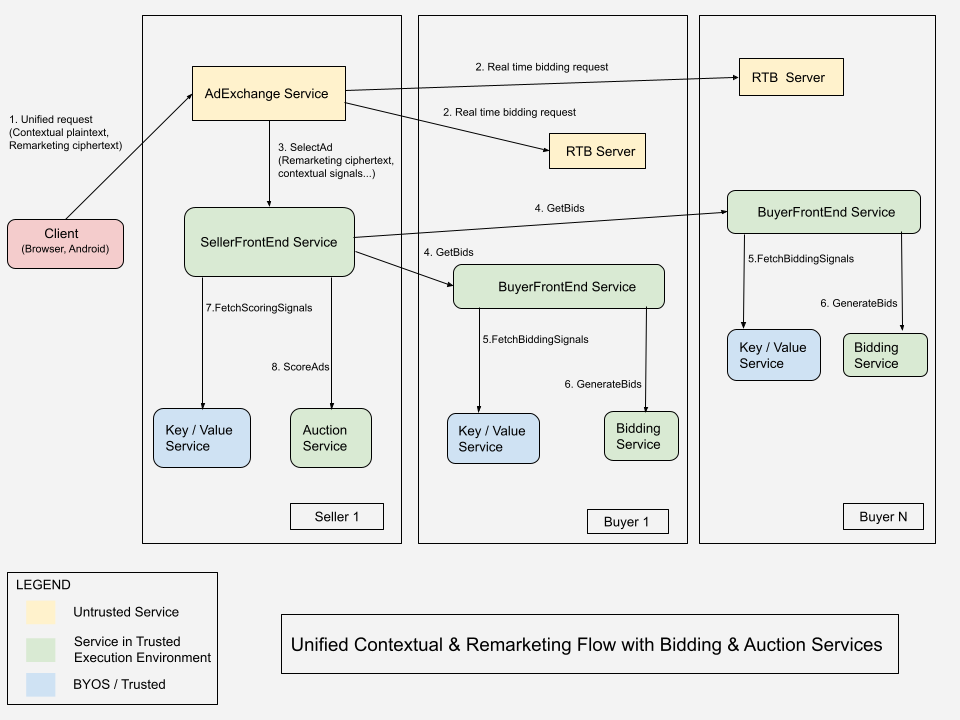

> FLEDGE has been renamed to Protected Audience API. To learn more about the name change, see the [blog post](https://privacysandbox.com/intl/en_us/news/protected-audience-api-our-new-name-for-fledge)

**Authors:** <br>
[Priyanka Chatterjee][26], Google Privacy Sandbox<br> 
Itay Sharfi, Google Privacy Sandbox

# Bidding and Auction services

[The Privacy Sandbox][4] aims to develop technologies that enable more private
advertising on the web and mobile devices. Today, real-time bidding and ad
auctions are executed on servers that may not provide technical guarantees of
security. Some users have concerns about how their data is handled to generate
relevant ads and in how that data is shared. Protected Audience API
([Android][24], [Chrome][5]) provides ways to preserve privacy and limit
third-party data sharing by serving personalized ads based on previous mobile
app or web engagement.

For all platforms, Protected Audience may require [real-time services][6].
In the initial [proposal by Chrome][7], bidding and auction for Protected
Audience ad demand is executed locally. This can demand computation requirements
that may be impractical to execute on devices with limited processing power, or
may be too slow to render ads due to network latency.

The Bidding and Auction Services proposal outlines a way to allow Protected
Audience computation to take place on cloud servers in a trusted execution
environment, rather than running locally on a user's device. Moving computations
to cloud in a [Trusted Execution Environment (TEE)][29] have the following
benefits:

  * Scalable auctions.
    * A scalable ad auction may include several buyers and sellers and that can
      demand more compute resources and network bandwidth.        

  * System health of the user's device.
    * Ensure better system health of user's device by freeing up computational
      cycles and network bandwidth.

  * Better latency of ad auctions.
    * Server to server communication on the cloud is faster than multiple
      device to server calls. 
    * Adtech code can execute faster on servers with higher computing power
      compared to a device.

  * Servers have better processing power.
    * Adtechs can run more compute intensive workloads on a server compared to
      a device for better utility.

  * [trusted execution environment][29] can protect confidentiality of adtech
    code and signals.

There are other ideas, similar to Protected Audience, that propose server-side
auction and bidding, such as [Microsoft Edge's PARAKEET][8] proposal.

This document focuses on [timeline and roadmap][127], [adtech onboarding guides][128],
[specifications for adtechs][129], [high level design][130], [API][131] for Bidding
and Auction services. 

Based on adtech feedback, further changes may be incorporated in the design.

### Chrome and Android announcement

Chrome and Android announced to integrate with Bidding and Auction services.
See [blog][27] for more details.

## Background

Read the [Protected Audience services overview][6] to learn about the
environment, trust model, server attestation, request-response encryption, and
other details.

Each Protected Audience service is hosted in a virtual machine (VM) within a
secure, hardware-based [trusted execution environment][29]. Adtech platforms
operate and deploy Protected Audience services on a public cloud. Adtechs may
choose the cloud platform from one of the options that are planned. As cloud
customers, adtechs are the owners and only tenants of such VM instances.

## Supported public cloud platforms

Bidding and Auction services will be available within the [Trusted Execution Environment][29](TEE)
on AWS and GCP in 2023. More cloud platforms may be supported eventually.

### AWS support
Bidding and Auction services will run in [Nitro Enclaves][30] on AWS. Refer
[here][52] for more details.

### GCP support
Bidding and Auction services will run in [Confidential Space][31]
([Confidential Computing][32]) on GCP. Refer [here][53] for more details.

_Note: SSP and DSP can operate Bidding and Auction services on different cloud
platforms that are supported. For multi seller auctions, SSPs can operate on
different cloud platforms._

Bidding and Auction services will not support a “Bring Your Own Server” model,
similar to what is made available to Protected Audience’s Key/Value server.
**Bidding and Auction services can only be deployed within approved TEE cloud
environments.** This is valid for Alpha, Beta, Scale testing programs and
through 3PCD.

## Types of auctions

Bidding and Auction services plan to support single-seller and all types of
multi-seller auctions including [Component Auctions][25]. Refer to the
[Multi seller auctions][55] explainer for more details.

## Related material

### Bidding and Auction services documents

All documents related to Bidding and Auction services are available [here][57].

  * [Payload optimization][51]
    This is a recommended read for buyers / DSPs.

  * [Multi seller auctions][55]
    This is a recommended read for sellers / SSPs.

  * [AWS deployment guide][52]
    This is a recommended read for adtechs who would opt for AWS.

  * [GCP deployment guide][53]
    This is a recommended read for adtechs who would opt for GCP.

  * [System design][56]
    This provides detailed design of Bidding and Auction services.    

### Server productionisation documents

All documents related to server productionisation are available [here][58]. 

### Browser - Bidding and Auction services integration 

Refer to the [browser API][54] for Bidding and Auction services integration.

*Note: For the web platform, request / response payload will be [Concise Binary Object
Representation (CBOR)][122] encoded. Refer to the [data format][132] section for more
details.*

### Android - Bidding and Auction services Integration 

Refer to the high level [Android's integration][99] document.

*Note: For Android, request / response payload will be binary protobuf. Refer to the
[data format][132] section for more details.*

## Open source repository

Bidding and Auction [services code and configurations](#service-code-and-framework) are
open sourced in [Github repo][59].

Adtechs will have to deploy the binaries and configurations to a supported
public cloud platform.

## Timeline and roadmap

Following are the timelines for Adtechs interested in testing Bidding and
Auction services.

### Open sourcing

Bidding and Auction services is open sourced to [Github repo][59]. There will be
releases every week or a continuous sync to Github setup.

### Alpha testing

Alpha Testing includes running services on non-production user opt-in traffic.
Alpha testing will be available starting July 2023. Alpha program is a **rolling
window**; when an adtech onboards, we will support the adtech with initial
integration. During Alpha, the Minimum Viable Product (MVP) of Bidding and
Auction services will be available. 

On a high level, there will be support for the following:
  * Bidding and Auction services running in [trusted execution environment][29].
  * Bidding and Auction services and [key management systems][10] integration.
  * Privacy and security protections:
    * Encryption of request / response payload between client and server and
      TEE based servers.
    * Padding of request / response payload between client and server.
  * [Adtech code blob fetch][64] from adtech provided endpoints.
  * Javascript and WASM support for [Adtech code execution in a sandbox][61].
  * AWS support for Bidding and Auction services.
  * GCP support for Bidding and Auction services.
  * Multi cloud regional support.
  * Support for [payload optimization][51].
  * Generation of event level reporting URLs and registered beacons for
    Fenced Frame reporting in Bidding and Auction services.
  * Bidding and Auction services supporting [Chrome][54] and [Android][99] APIs.
    * [Concise Binary Object Representation (CBOR)][122] encoded request / response
      payload to support [web platform][126].
  * Component ads.
  * Production binary build of servers will be used for Alpha testing. 
  * For debugging, debug binary build of servers will be available that can
    provide access to TEE server logs of different verbosity level. For GCP,
    these logs will be exported to [Cloud Logging][65].

### Beta testing

Beta testing includes running services on limited stable, production traffic.
Beta testing will be available starting October 2023.

During Beta, there will be support for the following additional features:
  * Data version header.
  * Multi seller auctions for web.
  * [Privacy safe debugging][60] and [monitoring support][62] for
    productionisation of servers. Refer [here][58] for up-to-date information.

### Scale testing

Available for full stable, production Scale testing starting February 2024. At
that point, there will be **General Availability (GA)** of all features.

At GA, there will be support for the following additional features:
  * [Adtech code blob fetch][64] from Cloud Storage buckets.
  * Multiple versions of adtech code blobs.
  * Multi seller auctions for Android / app.
  * [Priority vector][44] : This can help filter interest groups and reduce unnecessary 
    executions in Bidding service.
  * Support for bid currency.
  * Support for ad size.
  * Productionisation of servers. Refer [here][58] for up-to-date information.

There will be additional features supported in Bidding and Auction services beyond GA.
  * K-Anonymity Integration.
  * [Chaffing][63], anti-abuse mitigations will be available by 3PCD.
  * TEE key / value service integration.
  * Optimizations related to multi slot ads for web.


## Onboarding and alpha testing guide

Following is the guide for onboarding to Bidding and Auction services and
participating in Alpha testing.
 
### Guidance to sellers / SSPs:
  * Refer to [Spec for SSP][88] section.
  * Develop [ScoreAd][67]() for Protected Audience auction.
  * Develop [ReportResult][75]() for event level reporting.
  * Setup [Seller's Key/Value service][68].
  * [Chrome browser][54] will support a flag. Users' browsers that enable the
    flag can be targeted. 
  * Add support such that seller's code on publisher web page calls
    [browser API][54] to fetch encrypted [ProtectedAudienceInput][66]. Then
    includes encrypted ProtectedAudienceInput in the request to seller's ad
    server.
  * Add support in [Seller's ad server][20] to send [SelectAd][35] request to
    Bidding and Auction services for Protected Audience auctions.
  * Add support for [forwarding client metadata][90] in the request to Bidding
    and Auction services (SellerFrontEnd).
  * Review [Logging][93] section.
  * Bidding and Auction services code and configurations is open sourced to
    [Github repo][59].
     * Refer to the [README][104] for build / packaging information.
     * Refer to the [README for deployment on AWS][106] or [README for deployment on GCP][105]. 
     * Refer to [example config on AWS][101] or [example config on GCP][103] for the
       Terraform config required for cloud deployment. The config requires update of some parameter
       values (that vary per adtech) before deployment to cloud.
  * Deploy [SellerFrontEnd][21] and [Auction][23] server instances to your
    preferred [cloud platform that is supported][98].
  * Set up experiments for ad auctions and target user opt-in traffic. Include
    one or more partner buyers in the same experiment.
  * [Enroll with coordinators][85].
     * During Alpha, Google Privacy Sandbox Engineers will act as Coordinators and
       operate the [key management systems][10].

### Guidance to buyers / DSPs:
  * Refer to [Spec for DSP][89] section.
  * Develop [GenerateBid][69]() for bidding.
  * Develop [ReportWin][76]() for event level reporting.
  * Setup [Buyer's Key/Value service][70].
    * If your Key/Value server supports filtering of interest groups, refer to
      this [section][91] and [metadata forwarding][90].
  * [Optimise payload][51].
  * Review [Logging][93] section.
  * Bidding and Auction services code and configurations is open sourced to
    [Github repo][59].
    * Refer to the [README][104] for build / packaging information.
    * Refer to the [README for deployment on AWS][106] or [README for deployment on GCP][105]. 
    * Refer to [example config on AWS][100] or [example config on GCP][102] for the Terraform config
      required for cloud deployment. The config requires update of some parameter values (that vary
      per adtech) before deployment to cloud.
  * Deploy [BuyerFrontEnd][22] and [Bidding][42] server instances to your
    preferred [cloud platform that is supported][98].
  * [Enroll with coordinators][85].
      * During Alpha, Google Privacy Sandbox Engineers will act as Coordinators and
        operate the [key management systems][10].
  * Reach out to partner SSPs to include in experiments for Protected Audience
    auctions.
    * _Note: Buyers can also independently start integrating and testing the
    bidding flow before they are included in a seller supported ad auction
    experiments._

### Enroll with coordinators

Adtechs would have to enroll with two Coordinators running [key management systems][10] that
provision keys to Bidding and Auction services after server attestion. 

Adtechs should only enroll with the Coordinators for the specific cloud platform where
they plan to run Bidding and Auction services. 

#### Enrollment with AWS coordinators

An adtech should provide their **AWS Account Id** to both the Coordinators.

The Coordinators would create IAM roles. After adtechs provide the AWS account Id, they would
attach that information to the IAM roles and include in an allowlist. Then the Coordinators would 
let adtechs know about the IAM roles and that should be included in the B&A server Terraform
configs that fetch cryptographic keys from [key management systems][10]. 

Following config parameters in [buyer][100] or [seller][101] server configs would include the IAM
roles information provided by the Coordinators.
 * PRIMARY_COORDINATOR_ACCOUNT_IDENTITY
 * SECONDARY_COORDINATOR_ACCOUNT_IDENTITY

#### Enrollment with GCP coordinators

An adtech should provide [**IAM service account email**][107] to both the Coordinators.

The Coordinators would create IAM roles. After adtechs provide their service account email, the Coordinators
would attach that information to the IAM roles and include in an allowlist. Then the Coordinators would let 
adtechs know about the IAM roles and that should be included in the B&A server Terraform configs that 
fetch cryptographic keys from [key management systems][10]. 

Following config parameters in [buyer][102] or [seller][103] server configs would include the IAM roles
information provided by the Coordinators.
  * PRIMARY_COORDINATOR_ACCOUNT_IDENTITY
  * SECONDARY_COORDINATOR_ACCOUNT_IDENTITY

## Specifications for adtechs

### Near drop-in replacement

Bidding and Auction services integrate into [Protected Audience API for browsers][28] and 
can scale as a near drop-in replacement for adtechs who already adopted Protected Audience
API and are interested in exploring a server side solution.

  * Interest Groups (Custom Audience) creation and management can stay the same.
    * For [payload optimization][51], some additional fields will be supported
      in Interest Group.

  * Key-value services can stay nearly the same.
    * Seller's key-value service can stay the same.
    * Buyer's key-value service instances can stay the same; however to support
      [payload optimization][51], `trusted_bidding_signals` may need to include
      additional data.
      
  *  Code developed by adtechs following the guidance in [Protected Audience API for browsers][28]
     will mostly work with Bidding and Auction services. **The function signatures
     can stay exactly the same.**
    * Seller's code for [ScoreAd][67]() can stay the same.
    * Seller's code for [ReportResult][75]() can stay the same.
    * Buyer's code for [GenerateBid][69]() would mostly work. However, certain 
      updates will be required for [payload optimization][51].
    * Buyer's code for [ReportWin][76]() can stay the same.

### Spec for SSP

#### scoreAd()

The [Auction service][23] exposes an API endpoint ScoreAds. The [SellerFrontEnd service][21] sends a
ScoreAdsRequest to the Auction service for running an auction. ScoreAdsRequest includes bids from each buyer
and other required signals. The code for auction, i.e. `ScoreAd()` is prefetched from Cloud Storage, cached
and precompiled in Auction service. After all ads are scored, the Auction service picks the highest scored ad
candidate and returns the score and other related data for the winning ad in ScoreAdsResponse.

_Note: If an SSP develops `scoreAd()` following web platform's [Protected Audience API explainer][37], 
that should also work as-is for execution in the Auction service._

Adtech's scoreAd function signature is as follows.

```
scoreAd(adMetadata, bid, auctionConfig, trustedScoringSignals, bid_metadata) {
  ...
  return {desirability: desirabilityScoreForThisAd,
              allowComponentAuction: true_or_false};
}
```

##### Arguments

* `adMetadata`: Arbitrary metadata provided by the buyer.
* `bid`: A numerical bid value.
* `auctionConfig`: This would include `sellerSignals` (auctionConfig.sellerSignals) and
  `auctionSignals` (auctionConfig.auctionSignals).
* `trustedScoringSignals`: trustedScoringSignals fetched from seller's Key/Value service
    * Note: Only the signals required for scoring the ad / bid is passed to `scoreAd()`.
* `bid_metadata`: This refers to an object created in the Auction service based on the render_url
   of the bid and other information known to the Auction service. 

```
{ 'topWindowHostname': 'www.example-publisher.com',
  'interestGroupOwner': 'https://www.example-dsp.com',
  'renderUrl': 'https://cdn.com/render_url_of_bid',
  'adComponents': ['https://cdn.com/ad_component_of_bid',
                   'https://cdn.com/next_ad_component_of_bid',
                   ...],
 'dataVersion': 1, /* Data-Version value from the trusted scoring signals server's response */
}
```

#### Seller BYOS Key/Value service

The [SellerFrontEnd service][21] looks up `trustedScoringSignals` from seller's Key/Value service. The 
base url (domain) for Key/Value service is configured in [SellerFrontEnd service][21] so that the
connection can be prewarmed. All `render_urls` corresponding to all bids from buyers participating
in an auction are encoded, then batched and looked up in a single request. The lookup url and
response are in the same format as described in [Chrome Protected Audience explainer][40].

The lookup url is in the following format:

```
<base_url>?renderUrls=<url_1>..<url_n>&adComponentRenderUrls=<url1>,..<urln>

Where <base_url>, <url1>... are substituted
```

The response is in the following format:

```
{ 'renderUrls': {
      'https://cdn.com/render_url_of_some_bid': arbitrary_json,
      'https://cdn.com/render_url_of_some_other_bid': arbitrary_json,
      ...},
  'adComponentRenderUrls': {
      'https://cdn.com/ad_component_of_a_bid': arbitrary_json,
      'https://cdn.com/another_ad_component_of_a_bid': arbitrary_json,
      ...}
}
```

The `trustedScoringSignals` passed to `scoreAd()` is as follows:

```
{ 
  'renderUrl': {'https://cdn.com/render_url_of_bidder': arbitrary_value_from_signals},
  'adComponentRenderUrls': {
      'https://cdn.com/ad_component_of_a_bid': arbitrary_value_from_signals,
      'https://cdn.com/another_ad_component_of_a_bid': arbitrary_value_from_signals,
      ...}
}
```

#### reportResult()

Event level win reporting would work with Bidding and Auction services and function signatures
can be the same as described in web platform's [Protected Audience API explainer][43]. 

The reporting urls for the seller and registered ad beacons (for Fenced Frame reporting) would be
generated in Auction service and returned to the client in encrypted [AuctionResult][84]. The client
will ping the seller's reporting endpoint using the reporting url.

_Note: A detailed design covering reporting will be published separately._

```
reportResult(auctionConfig, reporting_metadata) {
  ...
  registerAdBeacon({"click", clickUrl,"view", viewUrl});
  sendReportTo(reportResultUrl);
  return signalsForWinner;
}

```

##### Arguments

* `auctionConfig`: This would include `sellerSignals` (auctionConfig.sellerSignals) and
  `auctionSignals` (auctionConfig.auctionSignals).
* `reporting_metadata`: This refers to an object created in the Auction service based
   on the information known to the Auction service.

#### Seller service configurations

Server configurations are based on [Terraform][16] and is open sourced to [Github repo][59]
for cloud deployment. 

The configurations include environment variables and parameters that may vary per seller.
These can be set by the seller in the configuration before deployment. The configurations also 
include urls that can be ingested when the service starts up for prewarming the connections.  

Refer to the [README for deployment on AWS][106] or [README for deployment on GCP][105]. Refer to
[example config on AWS][101] or [example config on GCP][103] for the Terraform config required
for deployment to the cloud. The config requires update of some parameter values (that vary
per adtech) before deployment to cloud.

Following are some examples of data configured in service configurations.

##### SellerFrontEnd service configurations

* _Seller Key/Value service endpoint (scoring_signals_url)_: This endpoint is configured in SellerFrontEnd
  service configuration and ingested at service startup to prewarm connections to seller's Key/Value service.

* _BuyerFrontEnd endpoint_: The domain address of BuyerFrontEnd services operated by Buyers that this Seller
  has partnered with. This is ingested at service startup to prewarm connection.

* _Auction service endpoint_:  The domain address of Auction service. This is ingested at service startup to
  prewarm connection.

* _Seller origin_: The origin of the seller.
     * _Note: The seller origin information is also passed by the seller's ad Service in SelectAd request and
       SellerFrontEnd validates that with the origin information configured._
       
* _Map of {InterestGroupOwner, BuyerFrontEnd endpoint}_: Map of InterestGroupOwner (buyer origin) to
  BuyerFrontEnd domain address.
  
* _Global timeout for Buyer_: This information can be used to set a timeout on each buyer; however, will be
  overridden by the `buyer_timeout_ms` passed by the seller's ad service to SellerFrontEnd in SelectAd request.

* _Private Key Hosting service_ and _Public Key Hosting service_ endpoints in [key management systems][10].

##### Auction service configurations

* _Cloud Storage endpoint_: The endpoint of Cloud Storage from where seller's code is hot reloaded by the
  Auction service. 
  
* Private Key Hosting service and Public Key Hosting service endpoints in [key management systems][10].

### Spec for DSP

#### generateBid()

The [Bidding service][42] exposes an API endpoint GenerateBids. The [BuyerFrontEnd service][22] sends
GenerateBidsRequest to the Bidding service, that includes required input for bidding. The code
for bidding, i.e. `generateBid()` is prefetched from Cloud Storage, cached and precompiled in Bidding service.
After processing the request, the Bidding service returns the GenerateBidsResponse which includes 
bids that correspond to each ad, i.e. [AdWithBid][49].

_Note: If a DSP develops `generateBid()` following web platform's [Protected Audience API explainer][41], 
that should also execute in Bidding service. However, certain updates will be required for [payload optimization][51]._

Adtech's generateBid function signature is as follows.

```
generateBid(interestGroup, auctionSignals, perBuyerSignals, trustedBiddingSignals,  deviceSignals) {
  ...
  return {'ad': adObject,
          'bid': bidValue,
          'render': renderUrl,
          'allowComponentAuction': false};
 } 
```

##### Arguments

* `interestGroup`: The InterestGroup (Custom Audience) object. Refer InterestGroup data structure to
  understand what is sent in this object from the client.
    * _Note: To reduce payload over the network and further optimize latency, our goal is to minimize
      the information sent in this object. We will work with Adtechs for the long term to reduce the
      amount of information sent in this object and try to find a solution to fetch those on the server
      side._

* `auctionSignals`: Contextual signal that is passed from seller's ad service to SellerFrontEnd in SelectAd
  request.

* `perBuyerSignals`: Contextual signal generated by the buyer during Real Time Bidding that is passed
  from seller's ad service to SellerFrontEnd in SelectAd request. 

* `trustedBiddingSignals`: Real time signals fetched by BuyerFrontEnd service from Buyer's Key/Value
  service. 
  * _Note: Only the `trustedBiddingSignals` required for generating bid(s) for the `interestGroup` are
    passed to `generateBid()`_.

* `deviceSignals`: This refers to `browserSignals` or `androidSignals`,  built by the client (browser,
   Android). This includes Frequency Cap (statistics related to previous win of ads) for the user's device.

#### reportWin()

Event level win reporting would work with Bidding and Auction services and function signatures
can be the same as described in web platform's [Protected Audience API explainer][43]. 

**ReportWin() will be executed in Auction service**, reporting url for the buyer and registered ad
beacons (for Fenced Frame reporting) would be generated in Auction service and returned to the client
in encrypted [AuctionResult][84]. The client will ping the buyer's reporting endpoint using the
reporting url.

_Note: A detailed design covering reporting will be published separately._

```
reportWin(auctionSignals, perBuyerSignals, signalsForWinner, reporting_metadata) {
  ...
  registerAdBeacon({"click", clickUrl,"view", viewUrl});
  sendReportTo(reportWinUrl);
  return;
}

```

##### Arguments

* `auctionSignals`: Contextual signal generated by the seller.
* `perBuyerSignals`: Contextual signal generated by the buyer.
* `signalsForWinner`: Object returned by seller's ReportResult().
* `reporting_metadata`: This refers to an object created in the Auction service
   based on the information known to the Auction service.   

#### Buyer BYOS Key/Value service

The [BuyerFrontEnd service][22] looks up biddingSignals from Buyer's BYOS Key/Value service. The base url
(domain) for Key/Value service is configured in BuyerFrontEnd service so that the connection can be
prewarmed. All lookup keys are batched together in a single lookup request. The lookup url and response
are in the same format as described in [Chrome Protected Audience explainer][40].

The lookup url is the following format:

```
<base_url>/getvalues?hostname=<publisher.com>&experimentGroupId=<kv_exp_id>&keys=<key_1>,..
<key_n>

Where <base_url>, <publisher.com>, <kv_exp_id>, key_1>,...<key_n> are substituted

Note: If keys are the same as InterestGroups names, then those are not looked up more than once.
```

The response is in the following format:

```
{ 'keys': {
      'key1': arbitrary_json,
      'key2': arbitrary_json,
      ...},
  'perInterestGroupData': {
      'name1': {
      },
      ...
  }
}
```

_Note: The `trustedBiddingSignals` passed to `generateBid()` for an Interest Group (Custom Audience) is
the value corresponding to each lookup key in the Interest Group but not the entire response.
Following is an example, if key1 is the lookup key in an interest group, then the following is passed
to `generateBid()` in `trustedBiddingSignals`._

```
  'key1': arbitrary_json
```

##### Filtering in buyer's Key/Value service

Filtering interest groups in buyer's Key/Value service can help reduce number
of interest groups for bidding; and therefore optimize latency and reduce cost of 
Bidding service.

To support filtering of interest groups in buyer's BYOS Key/Value service, metadata
received from the client will be forwarded in the HTTP request headers of the
`trustedBiddingSignals` lookup request.

Refer to [metadata forwarding][90] for more details.

#### Buyer service configurations

Server configurations are based on [Terraform][16] and is open sourced to [Github repo][59] for
cloud deployment. 

The configurations will include environment variables and parameters that may vary per buyer.
These can be set by the buyer in the configuration before deployment. The configurations also 
include urls that can be ingested when the service starts up for prewarming the connections.  

Refer to the [README for deployment on AWS][106] or [README for deployment on GCP][105]. Refer to 
[example config on AWS][100] or [example config on GCP][102] for the Terraform config required
for deployment to the cloud. The config requires update of some parameter values (that vary
per adtech) before deployment to cloud.

Following are some examples of data configured in service configurations. 

##### BuyerFrontEnd service configurations

* _Buyer's Key/Value service endpoint (bidding_signals_url)_: This endpoint is configured in BuyerFrontEnd
  service configuration and ingested at service startup to prewarm connections to buyer's Key/Value service.

* _Bidding service endpoint_: The domain address of Bidding service. This is ingested at service startup to
  prewarm connection.

* _Private Key Hosting service_ and _Public Key Hosting service_ endpoints in [key management systems][10].

##### Bidding service configurations

* _Cloud Storage endpoint_: The endpoint of Cloud Storage from where buyer's code is hot reloaded by the
  Bidding service.

* _Private Key Hosting service_ and _Public Key Hosting service_ endpoints in [key management systems][10].

### Metadata forwarding

#### Metadata added by client

Browser will forward the following metadata in the request headers of [unified request][83].

* `Accept-Language`
* `User-Agent`
* `IP / geo information`

#### Metadata forwarded by seller's ad service

Seller's ad service will forward the metadata in the following non-standard HTTP
headers in the request to SellerFrontEnd service.

* `X-Accept-Language`
* `X-User-Agent`
* `X-BnA-Client-IP`

_Note: If the seller's ad service uses a gRPC client to send request to SellerFrontEnd,
the standard `User-Agent` header may be altered by gRPC. Due to that reason, non-standard
HTTP headers are required so that it cannot be overridden or altered by the gRPC client._

Seller's ad service can do one of the following to forward the metadata: 
  * If the seller's ad service sends SelectAd as HTTPS to SFE, the header can 
    be [forwarded][46].
  * If the seller's ad service sends SelectAd as gRPC, metadata needs to be 
    [created and added][47].

 
#### Metadata forwarded by SellerFrontEnd service

SellerFrontEnd will [add metadata to gRPC][47] request sent to BuyerFrontEnd service.

* `X-Accept-Language`
* `X-User-Agent`
* `X-BnA-Client-IP`

SellerFrontEnd will [forward][46] the metadata in the request headers to seller's
Key/Value service. Seller's Key/Value service may ingest this information to
generate scoring signals. Seller's Key/Value service may use `X-BnA-Client-IP`
header to monitor requests from TEE based SellerFrontEnd service.

* `Accept-Language`
* `User-Agent`
* `X-BnA-Client-IP`

#### Metadata forwarded by BuyerFrontEnd service

BuyerFrontEnd will [forward][46] the metadata in the request headers to buyer's
Key/Value service. 

This may help with filtering of interest groups (custom audiences) in buyer's 
Key/Value service. Buyer's Key/Value service may use `X-BnA-Client-IP` header to 
monitor requests from TEE based BuyerFrontEnd service.

* `Accept-Language`
* `User-Agent`
* `X-BnA-Client-IP`


## High level design



_Note:_ 
* _All arrows in the diagram are bidirectional, implying request and response._
* _Based on feedback from Adtechs, we may incorporate further optimization in
  the flow while ensuring it is privacy safe._

Seller's code (in the Publisher web page or app) sends one [unified request][83]
for contextual and Protected Audience auctions to seller's ad service. 

Then the seller’s ad service makes two *sequential requests*.
  * [Existing flow] The seller may send real-time bidding (RTB) requests to
    a select partner buyers for contextual bids, then conducts the contextual
    auction.
  * [Server side Protected Audience flow] The seller sends a [SelectAd][35]
    request to SellerFrontEnd service to start the Protected Audience auction if
    seller determines there is incremental value in conducting the auction. The
    request payload includes encrypted [ProtectedAudienceInput][9], AuctionConfig
    and other required information. The encrypted [ProtectedAudienceInput][9] can 
    only be decrypted by an attested service running in [trusted execution environment][29],
    in this case the [SellerFrontEnd service][21].

_Unified Contextual and Protected Audience Auctions Flow_ is important to
optimize e2e auction latency.

### Unified request

A seller’s single request for the contextual and server-side Protected Audience
auction, from their code on a publisher site or app. The request includes
contextual payload and encrypted [ProtectedAudienceInput][9]. The seller's code
on the publisher site or app calls the client API to get the encrypted
[ProtectedAudienceInput][9] before sending the unified request.

### Components

#### Browser API for Bidding and Auction services

Refer to [browser API and integration][54] design.

#### Sell-side platform (SSP) system

The following are the Protected Audience services that will be operated by an SSP,
also referred to as a Seller. 

##### Seller's ad service

With the *Unified Contextual and Protected Audience Auction* flow, the seller's
ad service will receive one request from the client. The request would include
contextual request payload and encrypted [ProtectedAudienceInput][9] from the
client.

The encrypted [ProtectedAudienceInput][9] includes Interest Group (Custom
Audience) information on the user's device. The size of [ProtectedAudienceInput][9]
is required to be small; and there may be a per-buyer size limit set by the
client or the seller. Refer to [payload optimization][51] explainer for the
guidance around optimizing [ProtectedAudienceInput][9] payload size.

Refer to more details [here][77].

##### SellerFrontEnd service

The front-end service of the system that runs in the [trusted execution environment][29]
on a supported cloud platform. The service receives requests from [seller's ad service][20]
to initiate Protected Audience auction flow. Then the service orchestrates
requests (in parallel) to Buyers / DSPs participating in the auction for bidding. 

This service also fetches real-time scoring signals required for the auction and
calls [Auction service][23] for Protected Audience auction.

Refer to more details [here][78].

##### Auction service

The Auction service runs in the [trusted execution environment][29] on a supported
cloud platform. This service responds to requests from the [SellerFrontEnd service][21]
and doesn't have access to arbitrary untrusted endpoints. 

The Auction service prefetches [code blobs](#adtech-code) owned by seller from 
Cloud Storage (or an endpoint provided by the seller). The code is prefetched
at service startup, periodically thereafter and cached. More than one code
version can be supported to facilitate experimentation by adtechs.

SSP's code for scoring ads can be written in JavaScript and / or WebAssembly (WASM). 
The code runs in a custom V8 sandbox within the TEE that has tighter security
restrictions; that can not log information or has no disk or network access in 
production mode. For a ScoreAds request from SellerFrontEnd, SSP's scoring
code is executed per ad within a separate V8 worker thread but all execution can 
happen in parallel. Between two executions in the service, there is no state saved.

_Note: The hosting environment protects the confidentiality of the Seller's code,
if the execution happens only in the cloud._

Refer to more details [here][79].

##### Seller's Key/Value service

A seller's Key/Value service is a critical dependency for the auction system.
The Key/Value service receives requests from the [SellerFrontEnd service][21]. 
The service returns real-time seller data required for auction that corresponds
to lookup keys available in buyers' bids (such as `ad_render_urls`
or `ad_component_render_urls`).

_Note: The Seller Key/Value system may be BYOS Key/Value Service or trusted
Key/Value Service depending on the timeline._

#### Demand-side platform (DSP) system

This section describes Protected Audience services that will be operated by a
DSP, also called a buyer. 

##### BuyerFrontEnd service

The front-end service of the system that runs in the [trusted execution environment][29]
on a supported cloud platform. This service receives requests to generate bids
from a [SellerFrontEnd service][21]. This service fetches real-time bidding
signals that are required for bidding and calls Bidding service.

Refer to more details [here][80].

##### Bidding service

The Bidding service runs in the [trusted execution environment][29] on a supported
cloud platform. This service responds to requests from [BuyerFrontEnd service][22]
and doesn't have access to arbitrary untrusted endpoints. 

The Bidding service prefetches [code blobs](#adtech-code) owned by the buyer from
Cloud Storage (or an endpoint provided by the seller). The code is prefetched at
service startup, periodically thereafter and cached. More than one code version
can be supported to facilitate experimentation by adtechs.

Buyer's code for generating bids can be written in JavaScript and / or WebAssembly (WASM). 
The code runs in a custom V8 sandbox within the TEE that has tighter security restrictions; 
that can not log information or has no disk or network access in production. For a 
GenerateBids request from BuyerFrontEnd, buyer's code is executed per Interest Group
(Custom Audience) within a separate V8 worker thread but all execution can happen in
parallel. Between two executions in the service, there is no state saved.

_Note: This environment protects the confidentiality of a buyer's code, if the
execution happens only in the cloud._

Refer to more details [here][81].

##### Buyer’s Key/Value service

A buyer's Key/Value service is a critical dependency for the bidding system. The 
Key/Value service receives requests from the [BuyerFrontEnd service][22]. The
service returns real-time buyer data required for bidding, corresponding to
lookup keys.

_Note: The buyer’s Key/Value system may be BYOS Key/Value Service or trusted Key/Value 
service depending on timeline._

### Flow

* Clients (browser, Android) builds encrypted [ProtectedAudienceInput][9].
    * Client prefetch a set of public keys from the [key management systems][10]
      in the non request path every 7 days. The public keys are used for encrypting
      [ProtectedAudienceInput][9].

    * This encrypted data includes Interest Group (Custom Audience) information
      for different buyers, i.e. [BuyerInput][82]. On the client, the BuyerInput(s)
      are compressed, then ProtectedAudienceInput is encrypted and padded. The
      padding may be done such that the size of padded ProtectedAudienceInput
      ciphertext falls in one of the 7 different size buckets.
      * From privacy perspective, 7 size buckets is chosen because this would
        leak less than 3 bits of information in the worst case.

* Seller's code in publisher page on the browser sends to seller's ad service.
    * Web: Seller's code in publisher webpage on the browser sends HTTP request to (untrusted)
      seller's ad service. 
        * __[Existing request, but excluding 3P Cookie]__ Contextual payload. 
        * Seller's code in publisher webpage asks browser for encrypted [ProtectedAudienceInput][9]
          to be included in request.
        * [Client adds metadata][94] to HTTP request headers.
          
    * Android: Seller's code in publisher SDK in Android sends HTTP request to (untrusted)
      seller's ad service.
        * __[Existing request]__ Contextual payload.
        * Seller's code in publisher SDK asks Android for encrypted [ProtectedAudienceInput][9]
          to be included in request.

* Seller's ad service makes two requests.
    * __[Existing flow]__ May send Real Time Bidding (RTB) requests to partner buyers
      for contextual bids and then conduct a contextual auction to select a
      contextual ad winner.

    * Sends SelectAd request to SellerFrontEnd service if there is incremental value
      in conducting the Protected Audience auction. The request payload includes 
      encrypted [ProtectedAudienceInput][9], AuctionConfig and other
      required information. 
      * Encrypted [ProtectedAudienceInput][9] should be `Base64` encoded string of bytes
        if SelectAd request is sent as HTTPS request.
      * AuctionConfig includes contextual signals like seller_signals, auction_signals;
        per buyer signals / configuration and other data. Contextual ad winner
        may be part of seller_signals.
        * __If the SelectAd request is sent after contextual auction concludes, the
          `seller_signals` may include information about the contextual auction winner that
          can filter Protected Audience bids during Protected Audience auction.__
      * [Forwards client metadata][95] in non-standard HTTP headers in the request to
        SellerFrontEnd service.

   __Note: It is upto the seller / SSP to decide whether SelectAd request should be sent
   after contextual / RTB auction concludes or in parallel with contextual auction. The seller's
   ad server may incorporate traffic shaping and determine incremental value / demand for
   calling SellerFrontEnd for an ad request. The seller's ad server may call SellerFrontEnd while
   the contextual auction is running and this can optimize overall auction latency even further;
   however in this case contextual ad winner can not take part in Protected Audience auction to
   filter Protected Audience bids. If contextual signals (`buyer_signals`, `seller_signals` and
   `auction_signals`) are required for bidding, auction and reporting, that should be sent in
   SelectAdRequest.__
      
* Protected Audience auction kicks off in Bidding and Auction Services.
    * The SellerFrontEnd service decrypts encrypted [ProtectedAudienceInput][9] using
      decryption keys prefetched from [key management systems][10].

    * The SellerFrontEnd service orchestrates GetBids requests to participating buyers’ 
      BuyerFrontEnd services in parallel.
      * [SellerFrontEnd adds metadata to gRPC request][96] sent to BuyerFrontEnd service.
      * Buyers in `buyer_list` (in AuctionConfig) as passed by the seller and that
        have non empty [BuyerInput][82] in [ProtectedAudienceInput][9] receive
        GetBids request.

    * Within each buyer system:
        * The BuyerFrontEnd service decrypts GetBidsRequest using decryption keys
          prefetched from [key management systems][10].
        * The BuyerFrontEnd service fetches real-time data (`trustedBiddingSignals`) from
          the buyer’s Key/Value service required for generating bids.
          * [Forwards the metadata][97] in the request header to buyer's Key/Value service. 
            Buyer's Key / Value service may ingest this information for optional
            [filtering of interest groups][91] and / or monitoring requests from Bidding and
            Auction services.
        * The BuyerFrontEnd service sends a GenerateBids request to the Bidding service.
        * The Bidding service returns ad candidates with bid(s) for each `InterestGroup`.
          * The Bidding service deserializes and splits `trustedBiddingSignals` such that
            `generateBid()` execution for an `InterestGroup` can only ingest
            `trustedBiddingSignals` for the interest group / bidding signal key.
        * The BuyerFrontEnd returns all bid(s) ([AdWithBid][49]) to SellerFrontEnd.

    * Once SellerFrontEnd has received bids from all buyers, it requests real-time data
      (`trustedScoringSignals`) for all `ad_render_urls` and `ad_component_render_urls`
      (corresponding to ad with bids) from the seller’s Key/Value service. These
      signals are required to score the ads during Protected Audience auction.

    * SellerFrontEnd sends a ScoreAdsRequest to the Auction service to score ads
      and selects a winner. 
        * Auction service deserializes and splits scoring signal such that `scoreAd()`
          execution for an ad can only ingest `trustedScoringSignals` for the ad.

    * The Auction service selects the winning ad, generates reporting urls and
      returns ScoreAdsResponse to SellerFrontEnd service. 

    * SellerFrontEnd returns winning ad, other metadata and reporting urls as an 
      encrypted [AuctionResult][84] back to seller's ad service.

    * There are a few cases when a fake, padded, encrypted [AuctionResult][84] will 
      be returned to the client. For such cases, contextual ad winner should be
      rendered on the client.

      * The `is_chaff` field in AuctionResult will be set and that would indicate 
        to the client that this is a fake Protected Audience auction result. Following
        are the possible scenarios when this would be set.
        1. Protected Audience auction returns no winner; this may be a possible
           scenario when contextual ad winner (part of `seller_signals`)
           participate in Protected Audience auction to filter all bids. Therefore,
           the contextual ad wins and should be rendered on the client.
        2. When none of the participating buyers in the auction return any bid.

      * The `error` field in AuctionResult is for the client to ingest and handle.
        Following are the possible scenarios when this would be set.
        1. The required fields in [ProtectedAudienceInput][9] doesn't pass validation.
        2. There is failure in de-compression of [BuyerInput][82]. 
        3. The private keys (decryption keys) are compromised and revoked. In this  
           scenario, [ProtectedAudienceInput][9] ciphertext can be decrypted with a
           compromised key but the request won't be processed further. The error field 
           would be set in AuctionResult to indicate to the client this corresponding 
           public key with the same version shouldn't be used again for encryption. 
           The AuctionResult will be encrypted and returned in the response.

    * SellerFrontEnd will propagate downstream service errors back to seller's ad service
      and will also return gRPC / HTTP errors when required fields in SelectAdRequest.AuctionConfig
      are missing. 
     
* Seller's ad service returns the encrypted [AuctionResult][84] back to the client.
    * Contextual ad and / or encrypted ProtectedAudienceInput will be sent back 
      to the client. In case the contextual ad wins, a padded (chaff) but encrypted
      [AuctionResult][84] will be sent in response.

* Seller's code in publisher web page or app receives the response from seller's
  ad service and passes the encrypted [AuctionResult][84] (`auction_result_ciphertext`)
  to the client.

* Only the client (browser, Android) would be able to decrypt [AuctionResult][84]
  ciphertext. 

* Ad is rendered on the device.

### Client <> server and server <> server communication

#### Client <> seller ad service communication

Client would send a HTTPS request ([unified request][83]) to seller's ad service. 

The [ProtectedAudienceInput][9] included in the unified request will be encrypted on the client 
using a protocol called [Oblivious HTTP][50] that is based on bidirectional [Hybrid Public Key Encryption][48](HPKE). 
The Protected Audience response, i.e. [AuctionResult][84] will also be encrypted in SellerFrontEnd using 
[Oblivious HTTP][50].

The seller's ad service will not be able to decrypt or have access to [ProtectedAudienceInput][9] or 
[AuctionResult][84] in plaintext.

##### Data format
* For the web platform, request ([ProtectedAudienceInput][9]) and response ([AuctionResult][84])
payload will be [Concise Binary Object Representation (CBOR)][122] encoded. Refer to
[web platform schemas][126]. The request will be CBOR encoded on the browser and decoded in
TEE based SellerFrontEnd service. The response will be CBOR encoded in SellerFrontEnd service
and decoded on the browser.

* For android, request ([ProtectedAudienceInput][9]) and response ([AuctionResult][84])
payload will be binary protobuf.

##### Compression, encryption, padding
* For both web and Android, the BuyerInput(s) in [ProtectedAudienceInput][9] will be compressed.
  Then ProtectedAudienceInput will be encrypted and padded. An exponential padding scheme will be
  used. 

#### Seller ad service <> SellerFrontEnd communication

[Seller's ad service][20] can send gRPC or HTTPS request to SellerFrontEnd service. There would be an [Envoy Proxy][45]
service instance hosted with [SellerFrontEnd][21] for HTTPS to gRPC translation. 
  * If seller's ad service sends HTTPS request to SellerFrontEnd, [ProtectedAudienceInput][9] ciphertext should
    be `Base64` encoded; similarly the response to seller's ad service would be `Base64` encoded. This encoding is not
    required if seller's ad service and SellerFrontEnd communication is gRPC.

The communication between seller's ad service and SellerFrontEnd service would be protected by TLS / SSL that
provide communications security by encrypting data sent over the untrusted network to an authenticated peer.

#### Communication between Bidding and Auction Services

All communication between services running in [trusted execution environment][29] is protected by TLS / SSL
and the request and response payloads are encrypted using bidirectional [Hybrid Public Key Encryption][48](HPKE). 

**The TLS / SSL session terminates at the load balancer or the first hop in-front of a service, therefore the data over
the wire from the load balancer to service needs to be protected; hence the request-response is end-to-end encrypted using
bidirectional HPKE.**

_For client metadata forwarded in the requests, refer [here][90]._

### Payload compression

Most request/response payload sent over the wire should be compressed. 
* The [BuyerInput(s)][82] in [ProtectedAudienceInput][9] will be compressed on the client using `gzip`. 
  The payload needs to be compressed first and then encrypted. In SellerFrontEnd, [ProtectedAudienceInput][9] 
  will be decrypted first and then decompressed.

* Seller's ad service can compress [SelectAd][35] request payload when calling SellerFrontEnd service to save
  network bandwidth cost and reduce latency; `gzip` is accepted by SellerFrontEnd service. The 
  [AuctionResult][84] will be compressed using `gzip`, then encrypted and returned in SelectAdResponse.

* Request to BuyerFrontEnd service from SellerFrontEnd will be compressed first using `gzip` and then encrypted.
  In BuyerFrontEnd service, the request will have to be decrypted first and then decompressed.
    * _Note: This would be similar for communication between BuyerFrontEnd <> Bidding services and
      SellerFrontEnd <> Auction services._

* For Key/Value Server HTTP lookup, the [Accept-Encoding HTTP request header][38] would be set to specify the
  correct compression algorithm, i.e. `gzip`. The Key/Value server may set the [Content-Encoding Representation Header][39]
  to specify the content encoding (i.e. `gzip`) used to compress the response payload. 
    * _Note:_
         * It is recommended to compress Key/Value server response to optimize Key/Value lookup latency and reduce
           network bandwidth cost for adtechs.
         * The request payload to Key/Value service need not be compressed given the size is expected to be small.
         * The request-response payload between SellerFrontEnd <> seller's Key/Value services and
           BuyerFrontEnd <> buyer's Key/Value services do not require additional encryption using [HPKE][48]. 
           However, the communication between these services is over TLS that provide communications security
           by encrypting data sent over the untrusted network to an authenticated peer. 

### Payload optimization

The size of compressed [ProtectedAudienceInput][9] should be small. Refer to
[payload optimization][51] explainer for more details.

### Service code and framework

Bidding and Auction services are developed in C++. The service configurations required for cloud deployment
are based on [Terraform][16].

The service framework is based on gRPC. [gRPC][12] is an open source, high performance RPC framework built
on top of HTTP2 that is used to build scalable and fast APIs. gRPC uses [protocol buffers][13] as the
[interface description language][14] and underlying message interchange format.

Bidding and Auction services code and configurations are open sourced to [Github repo][59].

### Adtech code 

Adtech code for `generateBid()`, `scoreAd()`, `reportResult()`, `reportWin()` can follow
the same signature as described in the [Protected Audience API for the browser][28]. 

_Note:_
  * Code can be Javascript only or WASM only or WASM instantiated with Javascript.
  * If the code is in Javascript, then Javascript context is initialized before every execution.
  * No limit on code blob size.
  * More than one version of code can be supported to facilitate adtech experimentation.
  * Adtech can upload their code to Cloud Storage supported by the Cloud Platform.
  * Code is prefetched by Bidding / Auction services running in [trusted execution environment][29]
    from the Cloud Storage bucket owned by adtech.

Refer to more details [here][86].

### Cloud deployment

Bidding and Auction services are deployed by adtechs to a [public cloud platform][98] so that they are
co-located within a cloud region. 

Servers can be replicated in multiple cloud regions and the availability Service-Level-Objective (SLO)
will be decided by adtechs. 

#### SSP system

There will be a Global Load balancer for managing / routing public traffic to [SellerFrontEnd service][21].
Traffic between SellerFrontEnd and Auction service would be over private VPC network. To save cost,
SellerFrontEnd and Auction server instances will be configured in a [service mesh][87].

#### DSP system

There will be a Global Load balancer for managing / routing public traffic to [BuyerFrontEnd services][22].
Traffic between BuyerFrontEnd and Bidding service would be over private VPC network. To save cost,
BuyerFrontEnd and Bidding server instances will be configured in a [service mesh][87].

### Logging

#### Debug / non-prod build

Bidding and Auction server logs will be available with debug (non-prod) build / mode. The debug binaries 
can be built with higher [level of verbose logging](https://github.com/google/glog#verbose-logging).
For GCP, these logs will be exported to [Cloud Logging][65].

The [context logger](#logcontext) in Bidding and Auction servers supports logging `generation_id`
passed by the client in encrypted [ProtectedAudienceInput][9] and optional
(per) `buyer_debug_id` and `seller_debug_id` passed in [`SelectAdRequest.AuctionConfig`][35] for 
an ad request. The `adtech_debug_id` (`buyer_debug_id` or `seller_debug_id`) can be an internal 
log / query id used in an adtech's non TEE based systems and if available can help the adtech trace
the ad request log in Bidding and Auction servers and map with the logs in their non TEE based systems.

Logs from adtech's code can be made available in debug mode.

#### Production build

Bidding and Auction servers will support safe logging in production mode and the logs will be
exported to Cloud Logging / Cloud Watch. Refer [Debugging Protected Audience API services][60]
for more details.

Logs from adtech's code can be made available if [adtech / user consented debugging][92] is enabled. 

### Dependencies

Through techniques such as prefetching and caching, the following dependencies are in the non-critical
path of ad serving.

#### Key management systems

The [key management systems][10] are required for Protected Audience service attestation and cryptographic
key generation. Learn more in the [Overview of Protected Audience Services Explainer][6]. The 
key management systems will be deployed to all supported public clouds. Services in the key management
systems will be replicated in multiple cloud regions. 

All services running in TEE prefetch encryption and decryption keys from key management systems at service
startup and periodically in the non critical path. All communication between a service in TEE and another
service in TEE is end-to-end encrypted using Hybrid Public Key Encryption and TLS. Refer [here][11] for more
details.

## Service APIs

Refer to Bidding and Auction services APIs [in open source repo][121].

### Client <> server data

Following section describes the data that flows from client (e.g. browser, Android) to Bidding and Auction
Services through [Seller Ad service][20] and the data received by client from Bidding and Auction Services.

#### ProtectedAudienceInput

ProtectedAudienceInput is built and encrypted by client (browser, Android). Then sent to [Seller Ad service][20] in
the [unified request][83]. This includes per [BuyerInput](#buyer-input) and other required data.

Refer to [ProtectedAudienceInput message][108].

#### BuyerInput

BuyerInput is part of [ProtectedAudienceInput][9]. This includes data for each buyer / DSP.

Refer to [BuyerInput message][109].

#### BrowerSignals
Information about an Interest Group known to the browser. These are required to
generate bid.

Refer to [BrowserSignals message][110].

#### AndroidSignals
Information passed by Android for Protected Audience auctions. This will be 
updated later.

Refer to [AndroidSignals message][111].

#### AuctionResult

Protected Audience auction result returned from SellerFrontEnd service to the client through the Seller
Ad service. The data is encrypted by SellerFrontEnd service and decrypted by the client. The
Seller Ad service will not be able to decrypt the data. 

In case the contextual ad wins, an AuctionResult will still be returned that includes fake data
and has is_chaff field set to true. Clients should ignore AuctionResult after decryption if
is_chaff is set to true.

Refer to [AuctionResult message][112].

### Public APIs

#### SellerFrontEnd service and API endpoints

The SellerFrontEnd service exposes an API endpoint (SelectAd). The Seller Ad service would send
a SelectAd RPC or HTTPS request to SellerFrontEnd service. After processing the request,
SellerFrontEnd would return a SelectAdResponse that includes an encrypted AuctionResult. 

The AuctionResult will be encrypted in SellerFrontEnd using [Oblivious HTTP][50] that is based on
bidirectional [HPKE][48].

Refer to the [API][113].

#### LogContext 

Context for logging requests in Bidding and Auction servers. This includes `generation_id`
passed by the client in encrypted [ProtectedAudienceInput][9] and optional
(per) `buyer_debug_id` and `seller_debug_id` passed in [`SelectAdRequest.AuctionConfig`][35].
The `adtech_debug_id` (`buyer_debug_id` or `seller_debug_id`) can be an internal log / query id
used in an adtech's non TEE based systems and if available can help the adtech trace the ad request 
log in Bidding and Auction servers and map with the logs in their non TEE based systems.

Refer to the [LogContext message][114].

#### BuyerFrontEnd service and API endpoints

The BuyerFrontEnd service exposes an API endpoint GetBids. The SellerFrontEnd service sends
encrypted GetBidsRequest to the BuyerFrontEnd service that includes BuyerInput and other data.
After processing the request, BuyerFrontEnd returns GetBidsResponse, which includes bid(s) for
each Interest Group. Refer to [AdWithBid][49] for more information.

The communication between the BuyerFrontEnd service and the SellerFrontEnd service is TEE to TEE
communication and is end-to-end encrypted using [HPKE][48] and TLS/SSL. The communication will happen
over public network and that can also be cross cloud networks.

Refer to the [API][115].

##### AdWithBid

The AdWithBid for an ad candidate, includes `ad` (i.e. ad metadata), `bid`, `render` (i.e. ad render url),
`allow_component_auction` and `interest_group_name`. This is returned in GetBidsResponse by
BuyerFrontEnd to SellerFrontEnd.

Refer to the [AdWithBid message][116].

### Internal API

Internal APIs refer to the interface for communication between Protected Audience services within a SSP
system or DSP system.

#### Bidding service and API endpoints

The Bidding service exposes an API endpoint GenerateBids. The BuyerFrontEnd service sends
GenerateBidsRequest to the Bidding service, that includes required input for bidding. The code for
bidding is prefetched from Cloud Storage and cached in Bidding service. After processing the request,
i.e. generating bids, the Bidding service returns the GenerateBidsResponse to BuyerFrontEnd service.

The communication between the BuyerFrontEnd service and Bidding service occurs between each service’s TEE
and request-response is end-to-end encrypted using [HPKE][48] and TLS/SSL. The communication also happens
over a private VPC network.

Refer to the [API][117].

#### Auction service and API endpoints

The Auction service exposes an API endpoint ScoreAds. The SellerFrontEnd service sends a
ScoreAdsRequest to the Auction service for running auction; ScoreAdsRequest includes bids from
each buyer and other required signals. The code for auction is prefetched from Cloud Storage and
cached in Auction service. After all ads are scored, the Auction service picks the highest scored
ad candidate and returns the score and other related data for the winning ad in ScoreAdsResponse.

The communication between the SellerFrontEnd service and Auction service occurs within each service’s
TEE and request-response is end-to-end encrypted using [HPKE][48] and TLS/SSL. The communication also
happens over a private VPC network.

Refer to the [API][118].

#### WinReporting Urls

Refer to [WinReportingUrls message][119].

#### DebugReporting Urls

Refer to [DebugReportingUrls message][120].

### Web platform schemas

Following are the web schemas used by browsers for request and response. The request
and response payload are [Concise Binary Object Representation (CBOR)][122]
encoded.

#### Request schema
* [auction_request.json][123] is the web schema corresponding to [ProtectedAudienceInput][9] message. 
  * [interest_group.json][124] is the web schema for [BuyerInput.InterestGroup][82] message.

#### Response schema
* [auction_response.json][125] is the web schema corresponding to [AuctionResult][84] message.

[4]: https://privacysandbox.com
[5]: https://developer.chrome.com/docs/privacy-sandbox/fledge/
[6]: https://github.com/privacysandbox/fledge-docs/blob/main/trusted_services_overview.md
[7]: https://github.com/WICG/turtledove/blob/main/FLEDGE.md
[8]: https://github.com/microsoft/PARAKEET
[9]: #protectedaudienceinput
[10]: https://github.com/privacysandbox/fledge-docs/blob/main/trusted_services_overview.md#key-management-systems
[11]: https://github.com/privacysandbox/fledge-docs/blob/main/trusted_services_overview.md#fledge-services
[12]: https://grpc.io
[13]: https://developers.google.com/protocol-buffers
[14]: https://en.wikipedia.org/wiki/Interface_description_language
[15]: https://developers.google.com/protocol-buffers/docs/proto3
[16]: https://www.terraform.io/
[17]: https://github.com/privacysandbox
[18]: https://developers.google.com/protocol-buffers/docs/proto3#json
[19]: https://github.com/privacysandbox/fledge-docs/blob/main/trusted_services_overview.md#client-to-service-communication
[20]: #seller-ad-service
[21]: #sellerfrontend-service
[22]: #buyerfrontend-service
[23]: #auction-service
[24]: https://developer.android.com/design-for-safety/privacy-sandbox/fledge
[25]: https://github.com/WICG/turtledove/blob/main/FLEDGE.md#21-initiating-an-on-device-auction
[26]: https://github.com/chatterjee-priyanka
[27]: https://developer.chrome.com/blog/bidding-and-auction-services-availability
[28]: https://github.com/WICG/turtledove/blob/main/FLEDGE.md
[29]: https://github.com/privacysandbox/fledge-docs/blob/main/trusted_services_overview.md#trusted-execution-environment
[30]: https://aws.amazon.com/ec2/nitro/nitro-enclaves/
[31]: https://cloud.google.com/blog/products/identity-security/announcing-confidential-space
[32]: https://cloud.google.com/confidential-computing
[33]: https://github.com/privacysandbox
[34]: https://github.com/WICG/turtledove/blob/main/FLEDGE.md
[35]: #sellerfrontend-service-and-api-endpoints
[36]: #buyerfrontend-service-and-api-endpoints
[37]: https://github.com/WICG/turtledove/blob/main/FLEDGE.md#23-scoring-bids
[38]: https://developer.mozilla.org/en-US/docs/Web/HTTP/Headers/Accept-Encoding
[39]: https://developer.mozilla.org/en-US/docs/Web/HTTP/Headers/Content-Encoding
[40]: https://github.com/WICG/turtledove/blob/main/FLEDGE.md#31-fetching-real-time-data-from-a-trusted-server
[41]: https://github.com/WICG/turtledove/blob/main/FLEDGE.md#32-on-device-bidding
[42]: #bidding-service
[43]: https://github.com/WICG/turtledove/blob/main/FLEDGE.md#5-event-level-reporting-for-now
[44]: https://github.com/WICG/turtledove/blob/main/FLEDGE.md#35-filtering-and-prioritizing-interest-groups
[45]: https://www.envoyproxy.io/
[46]: https://developer.mozilla.org/en-US/docs/Web/HTTP/Headers/Forwarded
[47]: https://github.com/grpc/grpc-go/blob/master/Documentation/grpc-metadata.md#constructing-metadata
[48]: https://datatracker.ietf.org/doc/rfc9180/
[49]: #adwithbid
[50]: https://datatracker.ietf.org/wg/ohttp/about/
[51]: https://github.com/privacysandbox/fledge-docs/blob/main/bidding-auction-services-payload-optimization.md
[52]: https://github.com/privacysandbox/fledge-docs/blob/main/bidding_auction_services_aws_guide.md
[53]: https://github.com/privacysandbox/fledge-docs/blob/main/bidding_auction_services_gcp_guide.md
[54]: https://github.com/WICG/turtledove/blob/main/FLEDGE_browser_bidding_and_auction_API.md
[55]: https://github.com/privacysandbox/fledge-docs/blob/main/bidding_auction_services_multi_seller_auctions.md
[56]: https://github.com/privacysandbox/fledge-docs/blob/main/bidding_auction_services_system_design.md
[57]: https://github.com/privacysandbox/fledge-docs#bidding-and-auction-services
[58]: https://github.com/privacysandbox/fledge-docs#server-productionization
[59]: https://github.com/privacysandbox/bidding-auction-servers
[60]: https://github.com/privacysandbox/fledge-docs/blob/main/debugging_protected_audience_api_services.md
[61]: https://github.com/privacysandbox/fledge-docs/blob/main/bidding_auction_services_system_design.md#adtech-code-execution-engine
[62]: https://github.com/privacysandbox/fledge-docs/blob/main/monitoring_protected_audience_api_services.md
[63]: https://github.com/privacysandbox/fledge-docs/blob/main/bidding_auction_services_system_design.md#fake-requests--chaffs-to-dsp
[64]: https://github.com/privacysandbox/fledge-docs/blob/main/bidding_auction_services_system_design.md#code-blob-fetch-and-code-version
[65]: https://github.com/privacysandbox/fledge-docs/blob/main/bidding_auction_services_gcp_guide.md#cloud-logging
[66]: #protectedaudienceinput
[67]: #scoread
[68]: #seller-byos-key--value-service
[69]: #generatebid
[70]: #buyer-byos-keyvalue-service
[71]: #sellerfrontend-service-configurations
[72]: #auction-service-configurations
[73]: #buyerfrontend-service-configurations
[74]: #bidding-service-configurations
[75]: #reportresult
[76]: #reportwin
[77]: https://github.com/privacysandbox/fledge-docs/blob/main/bidding_auction_services_system_design.md#sellers-ad-service
[78]: https://github.com/privacysandbox/fledge-docs/blob/main/bidding_auction_services_system_design.md#sellerfrontend-service
[79]: https://github.com/privacysandbox/fledge-docs/blob/main/bidding_auction_services_system_design.md#auction-service
[80]: https://github.com/privacysandbox/fledge-docs/blob/main/bidding_auction_services_system_design.md#buyerfrontend-service
[81]: https://github.com/privacysandbox/fledge-docs/blob/main/bidding_auction_services_system_design.md#bidding-service
[82]: #buyerinput
[83]: #unified-request
[84]: #auctionresult
[85]: #enroll-with-coordinators
[86]: https://github.com/privacysandbox/fledge-docs/blob/main/bidding_auction_services_system_design.md#adtech-code-execution-engine
[87]: https://en.wikipedia.org/wiki/Service_mesh
[88]: #spec-for-ssp
[89]: #spec-for-dsp
[90]: #metadata-forwarding
[91]: #filtering-in-buyers-keyvalue-service
[92]: https://github.com/privacysandbox/fledge-docs/blob/main/debugging_protected_audience_api_services.md#adtech-consented-debugging
[93]: #logging
[94]: #metadata-added-by-client
[95]: #metadata-forwarded-by-sellers-ad-service
[96]: #metadata-forwarded-by-sellerfrontend-service
[97]: #metadata-forwarded-by-buyerfrontend-service
[98]: #supported-public-cloud-platforms
[99]: https://developer.android.com/design-for-safety/privacy-sandbox/protected-audience-bidding-and-auction-services
[100]: https://github.com/privacysandbox/bidding-auction-servers/blob/main/production/deploy/aws/terraform/environment/demo/buyer/buyer.tf
[101]: https://github.com/privacysandbox/bidding-auction-servers/blob/main/production/deploy/aws/terraform/environment/demo/seller/seller.tf
[102]: https://github.com/privacysandbox/bidding-auction-servers/blob/main/production/deploy/gcp/terraform/environment/demo/buyer/buyer.tf
[103]: https://github.com/privacysandbox/bidding-auction-servers/blob/main/production/deploy/gcp/terraform/environment/demo/seller/seller.tf
[104]: https://github.com/privacysandbox/bidding-auction-servers/blob/main/production/packaging/README.md
[105]: https://github.com/privacysandbox/bidding-auction-servers/blob/main/production/deploy/gcp/terraform/environment/demo/README.md
[106]: https://github.com/privacysandbox/bidding-auction-servers/blob/main/production/deploy/aws/terraform/environment/demo/README.md
[107]: https://cloud.google.com/iam/docs/service-account-overview
[108]: https://github.com/privacysandbox/bidding-auction-servers/blob/main/api/bidding_auction_servers.proto#L27
[109]: https://github.com/privacysandbox/bidding-auction-servers/blob/main/api/bidding_auction_servers.proto#L51
[110]: https://github.com/privacysandbox/bidding-auction-servers/blob/main/api/bidding_auction_servers.proto#L118
[111]: https://github.com/privacysandbox/bidding-auction-servers/blob/main/api/bidding_auction_servers.proto#L136
[112]: https://github.com/privacysandbox/bidding-auction-servers/blob/main/api/bidding_auction_servers.proto#L143
[113]: https://github.com/privacysandbox/bidding-auction-servers/blob/main/api/bidding_auction_servers.proto#L210
[114]: https://github.com/privacysandbox/bidding-auction-servers/blob/main/api/bidding_auction_servers.proto#L369
[115]: https://github.com/privacysandbox/bidding-auction-servers/blob/main/api/bidding_auction_servers.proto#L380
[116]: https://github.com/privacysandbox/bidding-auction-servers/blob/main/api/bidding_auction_servers.proto#L459
[117]: https://github.com/privacysandbox/bidding-auction-servers/blob/main/api/bidding_auction_servers.proto#L503
[118]: https://github.com/privacysandbox/bidding-auction-servers/blob/main/api/bidding_auction_servers.proto#L638
[119]: https://github.com/privacysandbox/bidding-auction-servers/blob/main/api/bidding_auction_servers.proto#L867
[120]: https://github.com/privacysandbox/bidding-auction-servers/blob/main/api/bidding_auction_servers.proto#L892
[121]: https://github.com/privacysandbox/bidding-auction-servers/blob/main/api/bidding_auction_servers.proto
[122]: https://cbor.io/
[123]: https://github.com/privacysandbox/bidding-auction-servers/blob/main/services/seller_frontend_service/schemas/auction_request.json
[124]: https://github.com/privacysandbox/bidding-auction-servers/blob/main/services/seller_frontend_service/schemas/interest_group.json
[125]: https://github.com/privacysandbox/bidding-auction-servers/blob/main/services/seller_frontend_service/schemas/auction_response.json
[126]: #web-platform-schemas
[127]: #timeline-and-roadmap
[128]: #onboarding-and-alpha-testing-guide
[129]: #specifications-for-adtechs
[130]: #high-level-design
[131]: #service-apis
[132]: #data-format
