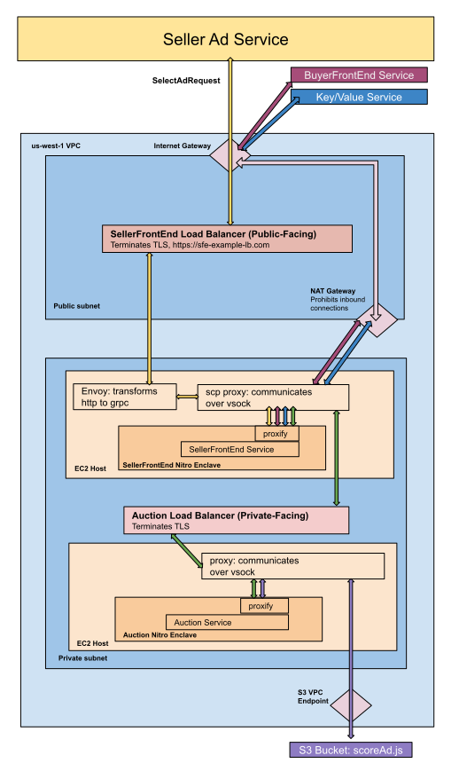
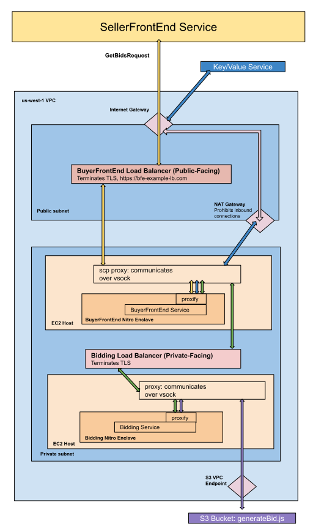
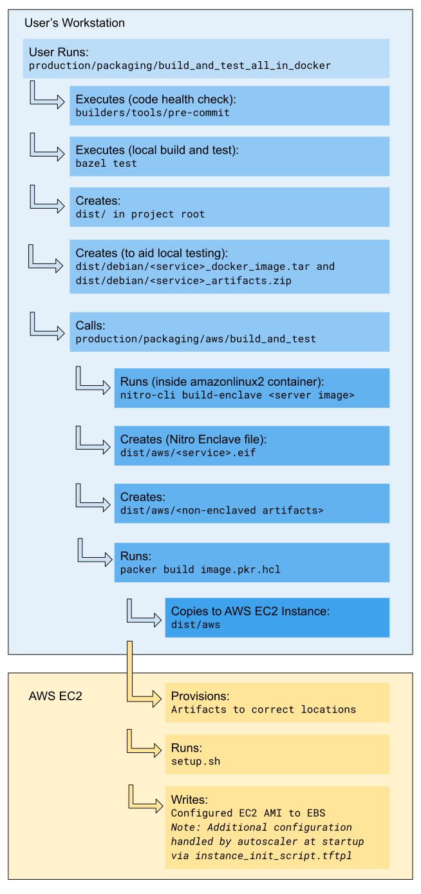

# Bidding and Auction Services AWS Cloud Support Explainer
_This document proposes a cloud architecture for FLEDGE Bidding and Auction services on Amazon Web Services (AWS) and also documents the packaging and deployment process for the Bidding and Auction services on AWS._

## Cloud Architecture for FLEDGE Bidding and Auction services
_This document proposes a cloud architecture for FLEDGE Bidding and Auction services on Amazon Web Services (AWS) with Nitro Enclave Trusted Execution Environments (TEE).  The goal of this document is to enable server operators to gain familiarity with the methods of and requirements for running the Bidding and Auction services in AWS.  This document will be updated as more features are added and the system evolves._

To learn more about FLEDGE services and the Bidding and Auction services, read the following documents:
* [FLEDGE Services Overview][1]
* [Bidding and Auction Services High Level Design and API][2]

### Availability timeline
The FLEDGE Bidding and Auction services will be open-sourced in Q2 2023. In addition to the code for each service, we will open source Terraform configurations and scripts that will allow ad techs to easily deploy the services proposed in this document. 


#### Comparison to Google Cloud Platform (GCP)
While this document focuses on AWS, a similar document will be published for GCP in Q2 2023. We intend to provide full GCP and AWS support for these services. Most implementation details will be, at a high level, similar. Two notable exceptions (ultimately with no impact on functionality) are:

1. [GCP includes Envoy][3] in its load balancer, so there will not be an explicit [Envoy component][4] in GCP.
2. GCP is based on a single [virtual machine instance][5], so a parent-child instance relationship will not be required to host the running trusted code in GCP.

### Sell-side platform

The seller will operate a SellerFrontEnd service and an Auction service. These services will be responsible for orchestrating the auction and will communicate with a seller-operated Key/Value service and multiple seller-configured BuyerFrontEnd services. See [here][6] for a more detailed overview.

The [trusted execution environment][7]-based SellerFrontEnd service will receive its requests from a [Seller Ad service][8]. These requests can be either HTTP or [gRPC][9]. See the [Envoy component][10] to learn how HTTP requests are translated to gRPC. The cloud system will also send network requests to all configured buyer front ends and key/value services. The following diagram provides an overall view of the system.



### Demand-side Platform

A buy-side ad tech will be responsible for operating a BuyerFrontEnd service, a Bidding service, and a Key/Value service. A request begins with a gRPC message from a SellerFrontEnd service. The major subsequent steps then include fetching data from the buyer-operated Key/Value service and generating bids for the ads present in the request. [See a more detailed overview][11]. The following diagram provides an overall view of the system.



### Component overview

#### Cloud region
The Bidding and Auction services are regional services, where a ‘cloud region’ refers to a particular geographic area as [defined by AWS][12]. We’ll open source Terraform configurations to support deployment in multiple regions in different geographies.  Ad techs can deploy services in any region supported by AWS. The Terraform configurations include parameters that the ad tech can update before deploying to a different cloud region. 

This document uses the AWS us-west-1 region as an example.

#### IAM Policies
IAM stands for [Identity and Access Management][13]. It’s used to securely control who has access to your AWS resources. You can use IAM to create and manage users, groups, and permissions. You can also use IAM to audit access to your resources. 

The default Terraform configuration places each [EC2 Host][14] into an IAM role. This IAM role can be used to determine permissions for the EC2 Host via an IAM policy document. It’s also used to set up admin access, such as SSH. This way, an ad tech can ssh into an EC2 host and inspect the environment.

#### VPC
A [virtual private cloud][15] (VPC) is an isolated resource within a public cloud. Sellers and buyers should start with 1 VPC per region. A VPC is critical for security purposes, and the proposed IAM authentication and authorization model will heavily rely on the VPC configuration.

#### Subnet
Each buyer and seller should have a public and private subnet. By hosting most components in the private subnet, the service has extra protection from internet traffic. However, the buyer and seller’s load balancers must face the public internet through an [internet gateway][16]. 

You can create outbound connections from the private subnet using the [NAT gateway][17], configured to route through the public subnet’s internet gateway.

#### Network policies
[Security groups][18] are used to control which types of traffic flow to which ports in the VPC. Key security group rules allow for egress/ingress traffic to flow from the Load Balancers to the EC2 Instances, and EC2 instances to send network requests to external services.

#### Load balancer
Each service has a load balancer in front. Each load balancer only applies to a particular subnet, so it is regional. The front-end service load balancers are in the public subnet while the Bidding and Auction load balancers are in the private subnets. To have a truly global system, it is the ad tech's responsibility to provide a global-scale load balancer that can route requests to its corresponding regional front end load balancers.

The SellerFrontEnd load balancer accepts both HTTP and gRPC traffic over TLS, while all other load balancers take gRPC traffic only. Both of the front end services’ load balancers accept internet traffic, while the load balancers for the Bidding and Auction services are internal-only. Each load balancer has health checks configured for its [target group][19]. A *target group* consists of an autoscaled number of EC2 hosts running a service inside a Nitro Enclave.

#### EC2 Host
The [EC2][20] Host is also known as an ‘instance.’ The instance runs a [Nitro Enclave][21] that contains a running service. The load balancer forwards traffic to a port on the instance and the traffic is then subsequently forwarded by a proxy, over VSOCK, to the listening port inside the Nitro Enclave.

##### Envoy
Inside the seller’s front-end service EC2 Host, we provide an instance of the open source [Envoy proxy][22]. This is solely used to convert HTTP traffic to gRPC that the SellerFrontEnd service can consume. Envoy will then forward the transformed request directly to the VSOCK proxy port. If the seller ad service wishes to send gRPC traffic itself, the load balancer is configured to bypass the Envoy listening port and send traffic directly to the VSOCK proxy port. The envoy configuration is not included in the TEE and can thus be modified directly by the ad tech.

##### VSOCK Proxy
Each EC2 host uses the open source [VSOCK proxy][23] to communicate with the services running inside the Nitro Enclave, automatically forwarding network traffic through [*proxify*][24] to ports bound by enclave-encapsulated services. The network security policy applied to the EC2 host must thus allow traffic on ports that are listened to by the enclave’s services. An important limitation of the proxy is that it currently only supports TCP traffic. VSOCK proxy communication is bidirectional and supports TLS.

##### DNS
The [Route 5][25] Resolver handles domain name resolution at the [private subnet address][26]. 

##### Instance Type Recommendations
By default, ad techs are free to use any [instance type][27] that supports Nitro Enclaves and meets the ad tech’s performance requirements. This includes the c5a, c6i, c6a instance types (all sizes). A recommended starter instance for functionality is c6i.24xlarge. Please take note that for AWS Nitro Enclaves, there are rules governing how much vCPU and memory is dedicated to each instance – please see the limitations described for [*/etc/nitro_enclaves/allocator.yaml*][28].

#### Parameter Store
[AWS Parameter Store][29] is a fully managed service that makes it easy for you to store and retrieve configuration data in a central location. The default Terraforms store the servers’ runtime flags in Parameter Store and fetch the flags on server startup. An ad tech can simply modify the parameter store and restart the server for the new flag to take effect.

#### Amazon S3 Usage
[Amazon S3][30] (a cloud object storage service) buckets are used to store the ad tech’s proprietary code modules that are required for the Bidding and Auction services. The Bidding and Auction services will communicate with S3 via an S3 VPC endpoint to fetch the code modules. Each S3 bucket must be configured to allow READ access to the EC2 host IAM role. Due to relaxed code module fetch latency requirements, the ad tech can host its code in an S3 bucket in a single region. 

#### Terraform-based Service Configuration
We will provide [Terraform][31] configurations for the Bidding and Auction services. Terraform is used to describe the cloud resource composition (via [Infrastructure as Code][32]) that is required for a fully-functional bidding and auction system and the provided Terraform configurations can be modified by the ad tech with no limitations. In fact, the Bidding and Auction services will be [configured via Terraform][33] so it is expected that the Ad Tech will interact with Terraform throughout [the deployment process][48].

## Guide: Package, Deploy, and Run a Service
_This section documents the packaging and deployment process for the Bidding and Auction services. The goal is for technical users to gain an understanding of how to deploy a functioning cloud environment with the service(s) of their choice. After the code is open sourced, much more detail will be added to this section so that it can serve as a complete ‘How-To’ guide._

### Overview
In order to create a functioning service in AWS, there are two major steps:
1. Packaging: this step involves the creation of the [Amazon Machine Image][34] (AMI) containing the service’s code in a Nitro Enclave.
2. Deployment: this step involves running Terraform to bring up the individual cloud components, including the AMI from step 1.

### Step 0: Prerequisites
Use a Linux-based operating system to follow these instructions. Other systems have not been tested.
1. Install [`git`][35].
2. Download the source code from the Github repository (not yet available; this document will be updated with relevant instructions once the code is open-sourced). 
3. Run:
   ```
   git submodule update --init
   ```
   This command and all suggested commands in this document should be run from the project root directory.
4. Install [Bazel][36] and [Docker][37], which are used to build the code and machine images.
    To verify that docker is installed and runs, try building the code using one of the tools installed by Docker: <br> `builders/tools/bazel-debian info workspace`<br> should return an output of the Bazel workspace location. Make sure that `bazel info workspace` and `bazel-debian info workspace` have different outputs or else your local builds will conflict with the packaging toolchain.
5. You may need to provide python3 (a packaging dependency) at `/opt/bin/python3`
6. Install the [aws-cli][38] and set up [AWS CLI environment variables][39] with your credentials. If you don’t already have credentials, you must [create an AWS account][40] and then create an IAM User for yourself via the AWS GUI by completing the steps at `IAM > Users > Add users`.
<br><br>
Note that the aws-cli is not used directly, and is instead used by our toolchain via a docker image. Thus, you do not necessarily have to install aws-cli locally, but because the packaging and deployment steps will be using the aws-cli, we need to create an Access Key pair.  To create credentials, in the AWS GUI complete the steps at:<br>
`IAM > Users > (your user) > Security credentials > Access keys > Create access key`
<br>
Then locally create the file ~/.aws/credentials with contents:
    ```
    [default]
    aws_access_key_id = <paste it here>
    aws_secret_access_key = <ditto>
    ```
    Additionally, the AWS access key and secret environment variables are required in your shell environment for the server deployment process to work with our tooling.
    ```
    export AWS_ACCESS_KEY_ID=<your_access_key_id>
    export AWS_SECRET_ACCESS_KEY=<your_access_key>
    export AWS_DEFAULT_REGION=us-west-1
    ```

#### Local testing
After installing the prerequisites, you should be able to test the server. To bring the server up locally:
1. Run `bazel build` to build each server.
2. Start the server with the artifact returned by Bazel.
3. Test the server following the steps [here][41].
4. (Optional) Run the built binary with the `--helpfull` flag to inspect the required flags.

*NOTE: The following commands require the Bidding and Auction services code which will not be open sourced until Q2 2023.*
<br>
**Bidding Server**
```
bazel build services/bidding_service:server && ./bazel-bin/services/bidding_service/server <YOUR FLAGS HERE>
```

**Buyer Frontend Server**
```
bazel build services/buyer_frontend_service:server && ./bazel-bin/services/buyer_frontend_service/server <YOUR FLAGS HERE>
```

**Auction Server**
```
bazel build services/auction_service:server && ./bazel-bin/services/auction_service/server <YOUR FLAGS HERE>
```

**Seller Frontend Server**
```
bazel build services/seller_frontend_service:server && ./bazel-bin/services/seller_frontend_service/server <YOUR FLAGS HERE>
```

### Step 1: Packaging
#### Step 1.1: Configuring a Test Build
Each service has a corresponding *init_server_basic* script. In this script, you can change the log level via:
```
export GLOG_v=<Your VLOG Level>
```
To build a seller front end service, you may want to modify the *envoy.yaml* configuration file to expose whichever ports you need via the *socket_address* fields. The *gRPC_cluster* port must match the port passed via the *[SERVICE]_PORT* flag.

#### Step 1.2: Building the Amazon Machine Image (AMI)
*Buy-side ad techs will only need to deploy the Buyer Front-end Server and the Bidding Server in production, while sell-side ad techs will only need to deploy the Seller Front-end Server and the Auction Server. However, when testing, ad techs may want to deploy all of the servers to better understand the message flows and structures.*
To deploy to AWS for testing, we suggest building an AMI for each service. The script to do so can be found at: 
```
production/packaging/build_and_test_all_in_docker
```
The script takes flags to specify which service and which region to build, for example:

```
production/packaging/build_and_test_all_in_docker \
--service-path auction_service --with-ami us-west-1
```

If the *--with-ami* flag is specified, the script will try to build an AMI in AWS. This will fail if you do not have your AWS Credentials configured, so take care to set that up ahead of time.

The script outputs the AMI ID of each service you build. You will need these IDs when deploying the cloud setup, so record them (or check your AMI page in AWS). You will have to update the AMI ID in the service’s *service_vars.tf* file.<br><br>

The following diagram documents the major steps involved in building an AMI. ad techs are free to edit this script as it is not included in the Trusted Execution Environment.



##### AMI Structure
A key part of the AMI is the [Nitro Enclave][42]. This is a wrapper (built with *nitro-cli build-enclave*) for a Docker image and contains the trusted server binary and startup scripts. Ad techs can modify code and settings outside of the enclave. The enclave cannot be modified, because it requires attestation. Thus, the supplied Terraform cloud architecture may be changed to meet the ad tech’s needs.

The AMI represents the base image of an EC2 parent instance. The parent hosts a VSOCK proxy (and in the case of the Seller Front End, also an instance of Envoy to enable http to gRPC transformation). This VSOCK proxy is used to communicate with the enclave with any port the enclave binds. All enclave ingress and egress traffic flows through the VSOCK proxy. Note that the parent runs *deploy/aws/terraform/services/autoscaling/instance_init_script.tftpl* on startup (as part of its autoscaling config) which prepares the instance and starts up the Nitro Enclave.

### Step 2: Deployment
#### Step 2.1: Terraform Setup
Install Terraform, following the instructions [here][43]. 
##### Terraform Layout
The Terraform is across three main folders in production/deploy/aws/terraform:
```
├── environment
│   ├── setup_1
│   └── setup_2
├── modules
│   ├── buyer
│   └── seller
└── services
    ├── autoscaling
    ├── backend_services
    ├── iam_group_policies
    ├── iam_groups
    ├── iam_role_policies
    ├── iam_roles
    ├── load_balancing
    ├── networking
    ├── security_group_rules
    ├── security_groups
    └── ssh
```
##### Terraform Services Directory 
This directory contains all of the individual components of a full stack: networking, load balancing, etc..
##### Terraform Modules Directory
This directory contains the seller and buyer modules, which compose the objects found in services/ and apply defaults. Please read the variable descriptions and defaults.
##### Terraform Environment Directory
This directory contains example setups of sellers and buyers; subdirectories of *environment*  (such as *setup_1*) are where you should run *terraform apply*. As an ad tech, this is where you will write (or reuse)  *.tf* files. Review *setup_1/us-west-1.tf* as an example. This file contains all of the ad tech-specific details such as runtime flags, region, and domain addresses. The Terraform variable descriptions in the buyer and seller *service_vars.tf* tiles contain the complete details of each variable.

#### Step 2.2: Configure Terraform Variables
Terraform variables are split into two major categories:
1. Those for the seller (definitions, defaults found in *production/deploy/aws/terraform/modules/seller/service_vars.tf*).
2. Those for the buyer (definitions, defaults found in *production/deploy/aws/terraform/modules/buyer/service_vars.tf*).

The seller module will bring up a SellerFrontEnd and Auction service, while the buyer module will bring up a BuyerFrontEnd and Bidding service. You can have multiple buyers for every seller, if you follow the configuration example in *setup_2/us-west-1.tf*.

Suppose you want to bring up a test environment in which you support multiple regions. In this case, you should make your environment directory look like the following, with each *.tf* file containing region-specific parameters:
```
├── environment
    └── multi_region_setup
        ├── us-central-1.tf
        ├── us-east-1.tf
        └── us-west-1.tf
```

#### Step 2.3: Apply Terraform
After modifying the provided implementations to your desired parameters (including updating all defaults, such as AMI IDs, in *modules/*/service_vars.tf*), you should run the following in your desired *environment/setup_n* directory to bring the entire system up. 

```
terraform init && terraform apply
```

You can then tunnel through the Terraform-created SSH instances to enter EC2 hosts in the private subnet using this [guide][44]. The Terraform configurations automatically create a [bastion host][45] with the correct network security policies to support SSH into the individual EC2 host instances, bypassing the load balancer and allowing server operators to inspect the environment and output of the Nitro Enclaves.

#### Step 2.4: Upload Code Modules
Ad techs must use an S3 bucket to host proprietary code modules. The bucket name will be required by the Terraform configuration so that a bucket and S3 VPC Endpoint can be created. The Bidding and Auction services will automatically fetch updates from the bucket, but it is the ad tech’s responsibility to upload their code modules to the bucket. Note that to upload to the bucket, the ad tech must modify the bucket permissions to allow their own proprietary endpoints WRITE access. This is most easily done through IAM permissions. See the AWS S3 [permission guide for details][46]. The Terraform configuration will allow the VPC’s instances READ access to the bucket by default. 

Additionally, for alpha testing, ad techs will need to specify the S3 object name of the code module to fetch in the Terraform configuration (only a single code module will be supported). Beyond alpha testing, ad techs will be able to host multiple different code modules in a single bucket and specify the module to use at the individual request level.

#### Step 2.5: Test the Service
Use [gRPCurl][47] to send a gRPC request to the load balancer address you configured in the Terraform. Requests must be addressed to port 443 so that the load balancer can terminate the TLS connection. When testing locally running services, plaintext must be used because there is no TLS connection termination support.

*Local service: list grpc endpoints*
```
grpcurl -plaintext localhost:<PORT> list
```

*Local service: send query*
```
grpcurl -plaintext -d '@' localhost:<PORT> privacy_sandbox.bidding_auction_servers.<SERVICE>/<ENDPOINT> < sample_request.json
```

*AWS service: list grpc endpoints*
```
grpcurl dns:///<DOMAIN.COM>:443 list
```

*AWS service: send query*
```
grpcurl -d '@' dns:///<DOMAIN.COM>:443 privacy_sandbox.bidding_auction_servers.<SERVICE>/<ENDPOINT> < sample_request.json
```


[1]: https://github.com/privacysandbox/fledge-docs/blob/main/trusted_services_overview.md
[2]: https://github.com/privacysandbox/fledge-docs/blob/main/bidding_auction_services_api.md
[3]: https://www.envoyproxy.io/docs.html
[4]: #envoy
[5]: https://cloud.google.com/compute/docs/instances
[6]: https://github.com/privacysandbox/fledge-docs/blob/main/bidding_auction_services_api.md#sell-side-platform-ssp-system
[7]: https://github.com/privacysandbox/fledge-docs/blob/main/trusted_services_overview.md#trusted-execution-environment
[8]: https://github.com/privacysandbox/fledge-docs/blob/main/bidding_auction_services_api.md#seller-ad-service
[9]: https://grpc.io/
[10]: #envoy
[11]: https://github.com/privacysandbox/fledge-docs/blob/main/bidding_auction_services_api.md#demand-side-platform-dsp-system
[12]: https://docs.aws.amazon.com/AWSEC2/latest/UserGuide/using-regions-availability-zones.html
[13]: https://aws.amazon.com/iam/
[14]: #ec2-host
[15]: https://aws.amazon.com/vpc/
[16]: https://docs.aws.amazon.com/vpc/latest/userguide/VPC_Internet_Gateway.html
[17]: https://docs.aws.amazon.com/vpc/latest/userguide/vpc-nat-gateway.html
[18]: https://docs.aws.amazon.com/vpc/latest/userguide/vpc-security-groups.html
[19]: https://docs.aws.amazon.com/elasticloadbalancing/latest/application/load-balancer-target-groups.html
[20]: https://docs.aws.amazon.com/AWSEC2/latest/UserGuide/concepts.html
[21]: https://docs.aws.amazon.com/enclaves/latest/user/nitro-enclave.html
[22]: https://www.envoyproxy.io/docs.html
[23]: https://github.com/privacysandbox/control-plane-shared-libraries/tree/main/cc/aws/proxy
[24]: https://github.com/privacysandbox/control-plane-shared-libraries/tree/main/cc/aws/proxy
[25]: https://aws.amazon.com/route53/
[26]: https://docs.aws.amazon.com/vpc/latest/userguide/vpc-dns.html#AmazonDNS
[27]: https://docs.aws.amazon.com/AWSEC2/latest/UserGuide/instance-types.html
[28]: https://docs.aws.amazon.com/enclaves/latest/user/nitro-enclave-cli-install.html#install-cli
[29]: https://docs.aws.amazon.com/systems-manager/latest/userguide/systems-manager-parameter-store.html
[30]: https://aws.amazon.com/s3/
[31]: https://developer.hashicorp.com/terraform/intro
[32]: https://www.terraform.io/use-cases/infrastructure-as-code
[33]: https://github.com/privacysandbox/fledge-docs/blob/main/bidding_auction_services_api.md#service-configuration
[34]: https://docs.aws.amazon.com/AWSEC2/latest/UserGuide/AMIs.html
[35]: https://git-scm.com/book/en/v2/Getting-Started-Installing-Git
[36]: https://bazel.build/
[37]: https://docs.docker.com/get-docker/
[38]: https://docs.aws.amazon.com/cli/latest/userguide/cli-chap-welcome.html
[39]: https://docs.aws.amazon.com/cli/latest/userguide/cli-configure-envvars.html
[40]: https://portal.aws.amazon.com/billing/signup/iam
[41]: #step-25-test-the-service
[42]: https://aws.amazon.com/ec2/nitro/nitro-enclaves/
[43]: https://github.com/privacysandbox/fledge-key-value-service/blob/main/docs/deploying_on_aws.md#set-up-terraform
[44]: https://github.com/privacysandbox/fledge-key-value-service/blob/main/docs/deploying_on_aws.md#ssh-into-ec2
[45]: https://aws.amazon.com/solutions/implementations/linux-bastion/
[46]: https://docs.aws.amazon.com/AmazonS3/latest/API/API_PutObject.html
[47]: https://github.com/fullstorydev/grpcurl
[48]: #guide-package-deploy-and-run-a-service


