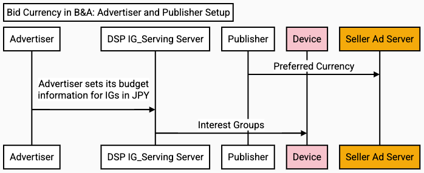
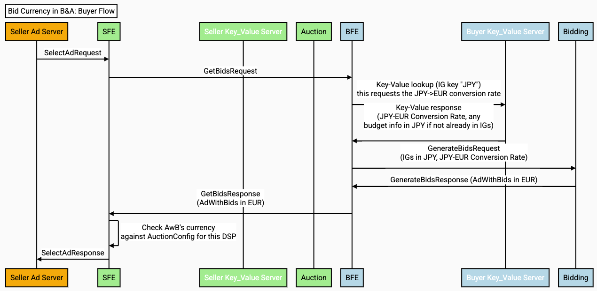
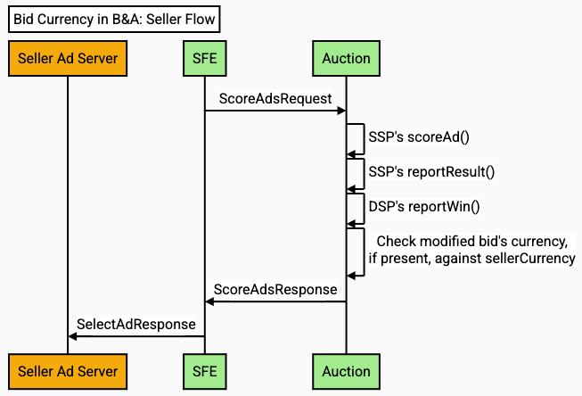

# Bidding and Auction Services Bid Currency Guide

This document provides guidance to adtechs for multi currency support of their bids in [Bidding and Auction services (B&A)](https://github.com/privacysandbox/fledge-docs/blob/main/bidding_auction_services_api.md).

You may refer to B&A services timeline and roadmap [here](https://github.com/privacysandbox/fledge-docs/blob/main/bidding_auction_services_api.md#timeline-and-roadmap).

You may refer to the high level architecture and design [here](https://github.com/privacysandbox/fledge-docs/blob/main/bidding_auction_services_api.md#high-level-design).

You may also refer to [privacy considerations](https://github.com/privacysandbox/fledge-docs/blob/main/trusted_services_overview.md#privacy-considerations), [security goals](https://github.com/privacysandbox/fledge-docs/blob/main/trusted_services_overview.md#security-goals) and the [trust model](https://github.com/privacysandbox/fledge-docs/blob/main/trusted_services_overview.md#trust-model).

If you have any questions, please submit your feedback using the Privacy Sandbox feedback [form](https://docs.google.com/forms/d/e/1FAIpQLSePSeywmcwuxLFsttajiv7NOhND1WoYtKgNJYxw_AGR8LR1Dg/viewform) or file a github issue [here](https://github.com/WICG/protected-auction-services-discussion).

## Overview

Multi-currency support means allowing buyers to bid in their own preferred currency, and yet submit their bids to participate in auctions conducted by sellers in the seller’s preferred currency, which may be different from the buyer’s. Broadly, this is accomplished by specifying the potential currencies upfront, annotating the currency of bids throughout the system, and enabling sellers and buyers to provide real-time exchange rates. 

The following sequence diagrams illustrate the effects of currency on the system. The example scenario used supposes an InterestGroup with information in JPY, a DSP which bids in EUR, and an SSP which evaluates bids in USD. 

<strong>Bid Currency support is common to both Protected Audience and Protected App Signals (PAS) <code>AdWithBid</code>s.</strong>

### Advertiser and Publisher Setup

Advertiser and DSP Setup:

*   Advertisers operate their business in some currency, say “JPY”.
*   Advertisers set information used for bidding (maybe a bid and a budget, for example) on each Interest Group/Custom Audience (IG/CA) in its own currency, say “JPY”. Advertisers must communicate with its buyer to do this.
*   Buyer operates in some other currency, let’s say “EUR”.
    *   Buyer ensures that the IG/CA has a currency tag in its key-value server lookup keys, so that it can lookup real-time conversion rates from the currency of the IG/CA’s bidding information (JPY here) to its own bidding currency (EUR here).
*   Buyer pushes the IGs/CAs to a device.

Separately, Publisher and Seller Setup:

*   Publisher operates its business in some currency, say “USD”
*   Publishers communicate this to the Seller’s Ad Server (SAS) through some channel. SAS chooses then to run the auction in “USD”.

### Buyer Flow

*   Seller's code in client (browser, Android) makes ad  requests to Seller Ad Server.
*   Seller Ad server adds to the AuctionConfig its own currency, each buyer’s expected currency, and real-time conversion rates, in this case from EUR to USD.
*   The Seller’s Seller Front-End server (SFE) sends a request for bids to each buyer’s Buyer Front-End server (BFE). 
*   BFE performs the Key-Value lookup for each IG/CA. IG/CAs which have a currency tag in their keys can use this to fetch a conversion rate. 
    *   The Key-Value server response, in addition to a conversion rate (JPY to EUR here), can include any information relevant to bidding for the IG/CA, in JPY, since the buyer’s script will have access to a conversion rate. 
*   The IG/CAs and the bidding signals both are passed into the Buyer’s `generateBid()` UDF (user defined function). This UDF needs to be able to handle the information in JPY and a conversion rate. It must return a bid in the buyer’s specified currency (EUR here).
*   This process takes place for each buyer. The results are sent back to the SFE, which then executes currency checking. 
    *   Bids which have a currency which does not match the buyer\_currency are rejected.

### Seller Flow

*   Seller Front-End (SFE) looks up each AdWithBid’s scoring signals from Seller Key-Value server, this is totally unchanged.
*   SFE makes the ScoreAdsRequest to the Auction server, containing AdWithBids (in EUR), and the seller\_signals, which contain a real-time conversion rate (set by the SAS) (from EUR to USD in this case). 
*   The Seller’s `scoreAd()` needs to accept AdWithBids in the buyer’s specified bidding currency (EUR here) and the conversion rate from buyer currency to seller currency (EUR to USD here) in seller\_signals.
    *   `scoreAd()` should also set an `incomingBidInSellerCurrency` on each bid, if applicable, to aid reporting; in this case this would be multiplying each `AdWithBid`’s `buyer_bid` by the EUR->USD conversion rate.
    *   In case of a component auction, `scoreAd()` must return bids in the seller\_currency (USD here).
*   The Seller’s `reportResult()` script now gets the original bid and original currency alongside all of the information it currently gets
    *   The Buyer’s `reportWin()` gets this same new information
*   In case of component auction, the Auction server checks each `AdScore`’s bid currency against the seller\_currency. 
*   The result is returned to the Seller Ad Server.

## Interest Groups / Custom Audiences

DSPs may wish to bid in one currency (say, EUR) but store values to be used for bidding in another currency, say JPY. DSPs may put `'JPY'` in the `trustedBiddingSignalsKeys` and retrieve a conversion rate from the buyer KV server.

## AuctionConfig

Sellers may set the following new fields in the `AuctionConfig`: 

*   Their own currency in `AuctionConfig.seller_currency`
*   Each participating DSP’s currency in `AuctionConfig.per_buyer_config.buyer_currency`

Sellers may set a conversion rate from each buyer’s currency to their own (seller) currency in `sellerSignals` (which already exists in the `AuctionConfig`). These fields are optional and have no defaults. These fields must contain three uppercase letters; SFE will reject requests with invalid currency fields. [Currency checking behavior is specified below](#currency-checking).

## generateBid()

`generateBid()` has always included the `bidCurrency` field in the response.

This is to be used to specify the currency of the bid.

## Metrics

B&A will use the existing bid rejection metric, kAuctionBidRejectedCount, when an `AdWithBid` or `AdScore` is rejected for currency mismatch.

[kAuctionBidRejectedCount is partitioned by kSellerRejectReasons](https://github.com/WICG/turtledove/blob/main/FLEDGE_extended_PA_reporting.md#reporting-api-informal-specification). B&A will add two new rejection reasons to the list:

<table>
  <tr>
   <td><strong>Enum value</strong>
   </td>
   <td><strong>Rejection Reason</strong>
   </td>
   <td><strong>Use</strong>
   </td>
  </tr>
  <tr>
   <td><code>8</code>
   </td>
   <td><code>BidFromGenBidFailedCurrencyCheck</code>
   </td>
   <td>Tracks <code>AdWithBid</code>s rejected in the SFE for mismatch with the <code>buyer_currency.</code>
   </td>
  </tr>
  <tr>
   <td><code>9</code>
   </td>
   <td><code>BidFromScoreAdFailedCurrencyCheck</code>
   </td>
   <td>Tracks <code>AdScore</code>s with modified bids rejected in the auction service for mismatch with the <code>seller_currency</code>.
   </td>
  </tr>
</table>

These rejection reasons will also be included as a part of Private Aggregate Reporting with B&A. They correspond to enum values 9 and 10 in [the Reporting API informal specification of the FLEDGE API Explainer](https://github.com/WICG/turtledove/blob/main/FLEDGE_extended_PA_reporting.md#reporting-api-informal-specification), which are unlikely to change since this would represent a change in the API.

_B&A reserves the right to change the integer values of this enum in B&A in the future to fully align with this API spec._

## Currency Checking

Currency checking in B&A matches that of the Chrome implementation. [To quote that explainer](https://github.com/WICG/turtledove/blob/main/FLEDGE.md#36-currency-checking):

*   If participants in the auction need to deal with multiple currencies, they can optionally take advantage of automated currency checking. All of it operates on currency tags, which are required to contain 3 upper-case ASCII letters.
*   If the `generateBid()` method returns a `bidCurrency`, and the `perBuyerConfig` for that buyer specifies a `buyerCurrency`, their consistency will be checked, and if there is a mismatch, the bid will be dropped.  Both the `buyerCurrency` for that buyer and returned `bidCurrency` must be present for checking to take place; if one or both are missing the currency check does not take place and the bid is passed on as-is.  The returned `bidCurrency` will be passed to `scoreAd()`'s `browserSignals.bidCurrency`, with unspecified currency rendered as `'???'`.
*   Currency checking after `scoreAd()` happens only [inside component auctions; please refer to this section](#component-auctions). 
*   `sellerCurrency` is used in currency checking for component auctions and also has an extensive effect on how reporting behaves. [Please see the reporting section for more details](#reporting).
*   `sellerCurrency`'s one other effect is with respect to checking the value of `incomingBidInSellerCurrency`, which is not checked unless the `AdWithBid.bidCurrency` matches the `sellerCurrency` and its value is set. In this case, the `incomingBidInSellerCurrency` must match the original `AdWithBid.bid`, else the bid will be rejected.
*   For each AdWithBid dropped, B&A will increment the `kAuctionBidRejectedCount` metric and record the rejection reason with it as `BidFromGenBidFailedCurrencyCheck`. If all `AdWithBid`s are dropped, the request will finish with grpc status code `INVALID_ARGUMENT` and the message `"All bids rejected for failure to match buyer currency."`

## In the Auction Server

### scoreAd()

<strong><code>bidMetadata</code></strong> (the fifth argument to <code>scoreAd()</code>, formerly called <code>deviceSignals</code> in B&A & <code>browserSignals</code> on Chrome) now passes the bid’s currency in the field <code>"bidCurrency"</code>.

For all auctions, `scoreAd()` now includes a new field in the response, `incomingBidInSellerCurrency`. For component auctions, the field `bidCurrency` is also to be used.

*   `incomingBidInSellerCurrency`: (optional) Provides a conversion of a bid in a multi-currency auction to the seller's own currency. See below.
*   `bid` (already extant; the modified bid for component auctions)
*   `bidCurrency`: Currency of the modified bid above (therefore for component auctions only too).

#### `incomingBidInSellerCurrency`

*   If `sellerCurrency` is set, `scoreAd()` for an auction is responsible for converting bids not already in `sellerCurrency` to `sellerCurrency`, via the `incomingBidInSellerCurrency` field of its return value. A bid already explicitly in the seller's currency cannot be changed by `incomingBidInSellerCurrency` (passing an identical value is a no-op; **passing a different one rejects the bid**). 
*   If neither the original bid is explicitly in `sellerCurrency` nor an `incomingBidInSellerCurrency` is specified, a value of 0 is used as the converted value.

### Component Auctions

*   If no modified bid is specified on the `AdScore` from `scoreAd()`, the original `AdWithBid`’s `bid` and `bid_currency` are set on the `AdScore`. 
*   If the `seller_currency` is specified, then the currency of the `AdScore` (if specified, and whether from `scoreAd()` or not) is checked against it. AdScores will be rejected for mismatch.

#### Metrics

For each `AdScore` rejected for failing to match the `seller_currency`, [kAuctionBidRejectedCount](https://source.corp.google.com/h/team/android-privacy-sandbox-remarketing/fledge/servers/bidding-auction-server/+/main:services/common/metric/server_definition.h;l=197;drc=fd1abfdac744124967378137d336ad65f034251a) is incremented and the rejection reason set to `BidFromScoreAdFailedCurrencyCheck`.

## Reporting

##### Win Reporting

The following fields have have been added to the `buyer/sellerReportingMetadata` parameter of `reportResult()` and `reportWin()`:

*   `bidCurrency`, denoting the currency of the `bid` field already present. 
*   `highestScoringOtherBidCurrency`, denoting the currency of the `highestScoringOtherBid` already present. 

These will be populated according to the this [table](https://github.com/WICG/turtledove/blob/main/FLEDGE.md#53-currencies-in-reporting) in the FLEDGE explainer: 

To summarize this table:

*   For both `reportResult/Win()`, and regardless of whether `sellerCurrency` is set, the `bid` reported is the original value from `buyer_bid`, and the `bidCurrency` is the currency from `AdWithBidMetadata.bid_currency`. 
*   For both `reportResult/Win()`:
    *   When the `sellerCurrency` is not set, `highestScoringOtherBid` is the original value from `buyer_bid` and `highestScoringOtherBidCurrency` will be set to`'???'`
    *   When `sellerCurrency` is set, `highestScoringOtherBid` is the converted value from `incomingBidInSellerCurrency` and `highestScoringOtherBidCurrency` is `sellerCurrency`

##### Debug Reporting

`forDebuggingOnly` functionality is expanded to include the following three fields:

*   `"${winningBidCurrency}"` is the currency tag of the winning bid.
*   `"${highestScoringOtherBidCurrency}"` is the currency tag of `highestScoringOtherBid`.
*   `"${topLevelWinningBidCurrency}"` is the currency tag of `highestScoringOtherBid`.

These, as well as `winningBid`, `highestScoringOtherBid`, and `topLevelWinningBid` will be filled out according to this table (https://github.com/WICG/turtledove/blob/main/FLEDGE.md#53-currencies-in-reporting). To summarize:

*   When `sellerCurrency` is unset:
    *   The bids are all original values from `buyer_bid`.
    *   The currencies are all `'???'`.
*   When `sellerCurrency` is set:
    *   The bids are all converted values from `incomingBidInSellerCurrency`.
    *   The currencies are all `sellerCurrency`.
        *   For component auctions, `topLevelWinningBidCurrency` is the `sellerCurrency` of the top-level auction.

## AuctionResult

AuctionResult is unchanged for single-seller auctions. For multi-seller auctions, the bid for the `scoreAd()` result will always be passed back, in the `bid` field. When specified, its currency will go in the new field `bid_currency`.

## Server-Orchestrated Multi-Seller Auctions

### API Updates

B&A has added a new field to the `AuctionConfig` called `per_component_seller_config`, which is analogous to `perBuyerConfig`. It maps each component seller to a configuration object. The config has one field, `expected_component_seller_currency`, a string containing a currency code, representing the currency in which the top-level-seller expects the component seller to deliver `AuctionResult`s. 

The name of the seller in the map must match what the component seller sends back in its `AuctionResult.auction_params.component_seller`. 

The top-level-seller is expected to agree upon expected currencies from each of its component sellers beforehand, and this communication is out-of-band from B&A’s perspective. This matches the way that sellers already communicate expected currencies with buyers.

#### Validation

The expected component seller currency field is optional and is validated by the same rule which governs `seller_currency` and `buyer_currency`. 

### Currency Checking

As `AuctionResult`s carry bid currencies, each `AuctionResult`’s bid currency is checked against the top-level seller’s specified `expected_currency` for its component seller. [This check operates based on the same rules as the AdWithBid currency checking described above](#currency-checking).

However, when an AuctionResult is rejected for currency mismatch, no metric is logged; a client-visible error is instead recorded.

### Checking `incomingBidInSellerCurrency`

If the incoming `AuctionResult` (from the component seller) has a bid currency, and this bid currency matches the top-level seller’s seller currency, then if the top level seller’s scoreAd() outputs an `incomingBidInSellerCurrency`, it must equal the `AuctionResult.bid`. Otherwise the bid will be rejected.

[This check operates based on the same rules as the AdScore incomingBidInSellerCurrency checking described above](#incomingbidinsellercurrency). 

### Github issues

Adtechs can file issues and feature requests on [Github](https://github.com/WICG/protected-auction-services-discussion). 

## Related publications

Refer to related publications on [Github](https://github.com/privacysandbox/protected-auction-services-docs).
