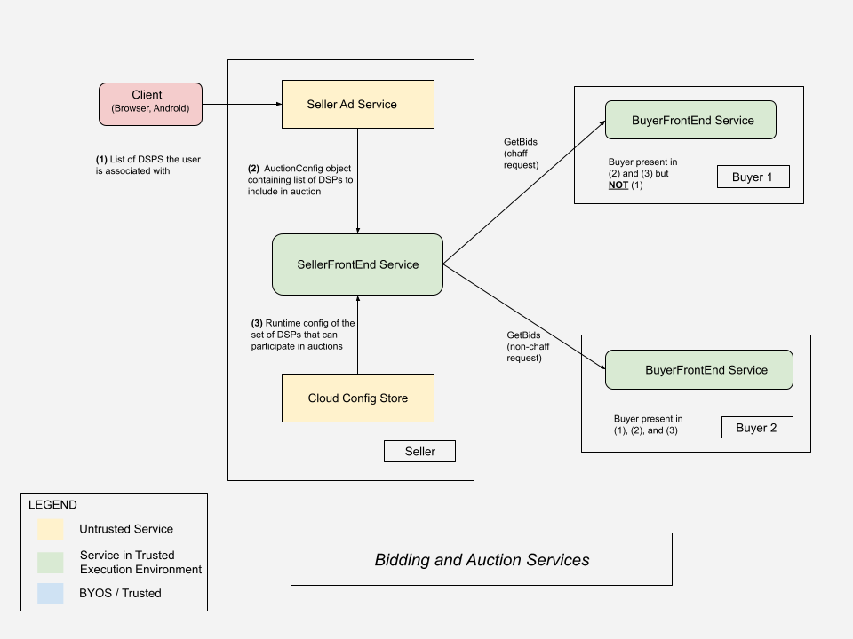

# Bidding and Auction Services: Chaffing Design
**Author:**  
[Neil Vohra](https://github.com/neilv-g), Google Privacy Sandbox

## Overview 

This document explains [Bidding and Auction Services](https://github.com/privacysandbox/protected-auction-services-docs/blob/main/bidding_auction_services_api.md)’ (B&A) design for chaffing, a security solution to prevent malicious actors from inferring which buyers a user is associated with by observing network traffic.

This is achieved by sending out chaff requests, which are ‘fake’ requests sent to buyers that aren’t participating in an auction for a user. 

This document covers:

1. Background on B&A flow
2. The motivations for chaffing
3. Design for chaffing
4. [Estimated effects on cost](?tab=t.0#bookmark=id.hl33mwpzg98z) for adtechs

Chaffing builds upon the [privacy considerations](https://github.com/privacysandbox/protected-auction-services-docs/blob/main/trusted_services_overview.md#privacy-considerations) and [security goals](https://github.com/privacysandbox/protected-auction-services-docs/blob/main/trusted_services_overview.md#security-goals) that have been previously described in other explainers. Note that all intra-server communication is encrypted, and messages in transit can only be decrypted by B&A servers running in Trusted Execution Environments (TEEs).

_Note: Chaffing will be enabled by default on production builds and cannot be disabled. For non-production builds, the servers will expose a runtime flag that adtechs can toggle while testing to disable chaffing._

## Background 

The following describes the flow of Protected Auctions with B&A: 

1. The client (browser, Android app) sends an encrypted B&A payload ([ProtectedAuctionInput](https://github.com/privacysandbox/bidding-auction-servers/blob/e40a4fccdce168379189ab7b6b87b55b1e3f736d/api/bidding_auction_servers.proto#L65)), to the seller's ad service. \
 \
This includes <code>[buyer_input](https://github.com/privacysandbox/bidding-auction-servers/blob/e40a4fccdce168379189ab7b6b87b55b1e3f736d/api/bidding_auction_servers.proto#L72)</code> for buyers that have interest groups stored on the client. Note that the seller can also specify a set of buyers to be included in encrypted B&A payload (refer [payload optimization)](https://github.com/privacysandbox/protected-auction-services-docs/blob/main/bidding-auction-services-payload-optimization.md#payload-optimization-guide-for-sellers--ssps).  
2. The Seller Ad Service sends <code>[SelectAdRequest](https://github.com/privacysandbox/bidding-auction-servers/blob/e40a4fccdce168379189ab7b6b87b55b1e3f736d/api/bidding_auction_servers.proto#L544)</code> to B&A (Seller Frontend service), The <code>SelectAdRequest</code> includes encrypted B&A payload and AuctionConfig. \
 \
In the <code>[AuctionConfig](https://github.com/privacysandbox/bidding-auction-servers/blob/e40a4fccdce168379189ab7b6b87b55b1e3f736d/api/bidding_auction_servers.proto#L722)</code> field, the seller's ad service can provide a [list of buyers](https://github.com/privacysandbox/bidding-auction-servers/blob/e40a4fccdce168379189ab7b6b87b55b1e3f736d/api/bidding_auction_servers.proto#L569) that may participate in the auction.
3. The Seller Frontend Service (SFE) processes the request and determines the subset of buyers (each of whom are running Buyer Frontend Services (BFE)) to invoke based on the intersection of the following:
    1. The <code>[buyer_input](https://github.com/privacysandbox/bidding-auction-servers/blob/e40a4fccdce168379189ab7b6b87b55b1e3f736d/api/bidding_auction_servers.proto#L72)</code> in the <code>ProtectedAuctionInput</code> generated by the client
    2. The <code>[buyer_list](https://github.com/privacysandbox/bidding-auction-servers/blob/e40a4fccdce168379189ab7b6b87b55b1e3f736d/api/bidding_auction_servers.proto#L569)</code> suggested by the Seller Ad Service
    3. Partner buyer domains configured in the SFE’s runtime config.

For an overview of the B&A architecture, see the B&A high level design diagram [here](https://github.com/privacysandbox/protected-auction-services-docs/blob/main/bidding_auction_services_api.md#high-level-design).

Without chaffing, a malicious actor (be it an SSP acting in bad faith or a network snooper) could monitor an SFE’s network traffic and easily correlate which buyers are invoked for a given SelectAd request. The data in the `buyer_input` is considered highly sensitive information because it represents the user’s interests, thus it must be protected.

To mitigate this threat, the SFE will send out additional chaff requests. If a network snooper were to observe the outgoing network traffic of the SFE, they would now see an additional `n` outgoing network requests that are indiscernible from the ‘real’ requests. However, buyers will be able to differentiate chaff and ‘real’ requests using a field in the plaintext request. Using this, buyers will know to not spend server resources processing a chaff request, and malicious actors are unable to learn the buyers specified in the client’s ciphertext.

## Design

There are a few different problems to solve for a proper chaffing implementation on B&A:

1. [Seller side] Determine a set of buyers to send chaff requests to
2. [Seller side] Generate chaff requests
3. [Buyer side] Process chaff requests in a manner similar to real requests
4. [Buyer side] Generate chaff responses

Chaffing will be implemented in two phases:

*   Phase 1 will focus on basic security measures by getting an initial chaffing implementation in place on B&A, and that is launched in 2024.
*   Phase 2 will revisit some of the solutions from Phase 1 and implement solutions with proper anti-abuse mitigations necessary to make chaffing a more secure solution. Phase 2 is planned to launch in early 2025. 

## Phase 1

### Ensuring determinism

Imagine a chaffing solution where the SFE randomly chooses a set of buyers to send chaff requests to. If a client’s ciphertext is run through the SFE 1000 times, a malicious actor can see which buyers are invoked each of the 1000 times, effectively sidestepping chaffing. To prevent this, determinism is introduced in the system by seeding server side random number generators (RNGs).

The system will seed RNGs with the <code>[generation_id](https://github.com/privacysandbox/bidding-auction-servers/blob/e40a4fccdce168379189ab7b6b87b55b1e3f736d/api/bidding_auction_servers.proto#L49)</code>, a UUID that is generated and stored by clients within the protected auction ciphertext. Unlike the auction config, the protected auction ciphertext is encrypted by the client and <em>cannot</em> be read by the Seller Ad Service. The ciphertext is an OHTTP encapsulated payload that is encrypted using a public key vended by the coordinators, and only attested Protected Auction Servers running within a TEE are given the private keys. Therefore, it is guaranteed that the Seller Ad Service can never view or decipher any of the contents of the ciphertext. The plaintext value for this field will also not be returned to adtechs client side when running an ad auction.

The <code>[generation_id](https://github.com/privacysandbox/bidding-auction-servers/blob/e40a4fccdce168379189ab7b6b87b55b1e3f736d/api/bidding_auction_servers.proto#L49)</code> is propagated from the SFE to the BFE today ([1](https://github.com/privacysandbox/bidding-auction-servers/blob/e40a4fccdce168379189ab7b6b87b55b1e3f736d/api/bidding_auction_servers.proto#L49), [2](https://github.com/privacysandbox/data-plane-shared-libraries/blob/main/src/logger/logger.proto#L52)), so it can be used throughout the system where deterministic behavior is needed.

### [SFE] Calculate how many chaff requests to send

Where

*   participating_buyers is the set of buyers who will receive non-chaff requests (i.e. the buyers in the intersection of a) the client ciphertext, b) `buyer_list` in the `auction_config`, and c) the SFE’s runtime config)
*   `buyers_in_sfe_runtime_config` is the [set of partner buyers that the seller's SFE is configured to communicate with](https://github.com/privacysandbox/bidding-auction-servers/blob/e40a4fccdce168379189ab7b6b87b55b1e3f736d/production/deploy/gcp/terraform/environment/demo/seller/seller.tf#L66)
*   `buyers_in_auction_config` is the [list of buyers passed into the SelectAd request](https://github.com/privacysandbox/bidding-auction-servers/blob/e40a4fccdce168379189ab7b6b87b55b1e3f736d/api/bidding_auction_servers.proto#L569)

the SFE will use the following bounds for the number of chaff requests to send:

*   If `participating_buyers` == 0, the bounds will be: 
    *   [2, `|(buyers_in_sfe_runtime_config ∩ buyers_in_auction_config) - participating_buyers|`].
*   If `participating_buyers` >= 1, the bounds will be: 
    *   [1, `|(buyers_in_sfe_runtime_config ∩ buyers_in_auction_config) - participating_buyers|`].

The SFE will choose a random number between these bounds and will always send at least 1 chaff request. The minimum number of requests (real and chaff) the SFE will send is always 2; it must be a non-static lower bound for the number of chaff requests to send. If the lower bound was static, the system would leak information for the case where the SFE sends 0 real requests and the ‘static lower bound’ number of requests. The malicious actor would then know the buyers in the ciphertext have no overlap with `|buyers_in_sfe_runtime_config| ∩ |buyers_in_auction_config|`.

Please read below for the cost implications of this solution.

### [SFE] Identify chaff request candidates

As mentioned above, chaff request candidates are buyers in the intersection of:

1. Buyers the SFE is configured to send GetBids requests to.
2. Buyers in the `buyer_list` in the `auction_config`.
3. Buyers not in the protected auction ciphertext sent by the client (because the SFE will send real requests to these buyers if possible).

**Chaffing in B&A**

Given those chaff request candidates, the SFE selects candidates by:

1. Taking the hash of the [generation ID](https://github.com/privacysandbox/bidding-auction-servers/blob/e40a4fccdce168379189ab7b6b87b55b1e3f736d/api/bidding_auction_servers.proto#L49) and use it to seed a random number generator (RNG)
2. Getting the list of buyers chaff requests can be sent to.
3. Shuffling the list, and send chaff requests to the first `n` buyers in the list where `n` is the number of chaff requests it will send.

### [SFE] Generate chaff requests

The SFE will set the <code>[is_chaff](https://github.com/privacysandbox/bidding-auction-servers/blob/e40a4fccdce168379189ab7b6b87b55b1e3f736d/api/bidding_auction_servers.proto#L262)</code> field in the GetBids request so the BFE can differentiate the request from real traffic. All other fields will be empty, so the chaff request will be padded to make them seem similarly sized to a ‘real’ request.

#### Request format

The format of the <code>[request_ciphertext](https://github.com/privacysandbox/bidding-auction-servers/blob/e40a4fccdce168379189ab7b6b87b55b1e3f736d/api/bidding_auction_servers.proto#L1040-L1041)</code> field in the GenerateBidsRequest proto will change to accommodate for chaffing. Today, the payloads only consist of the <code>[GenerateBidsRawRequest](https://github.com/privacysandbox/bidding-auction-servers/blob/e40a4fccdce168379189ab7b6b87b55b1e3f736d/api/bidding_auction_servers.proto#L945)</code> proto bytestrings. Going forward, the format will be as follows:

*   1 byte for request metadata:
    *   4 bits for the version number (e.g. 16 possible values) \
Version number represents the request format, in case the request format needs to be changed in the future.
    *   4 bits for the compression algorithm, if any, used (e.g. 16 different values)
*   4 bytes for the payload size
*   X bytes for the `GetBidsRawRequest` payload
*   Y bytes of padding

<table>
  <tr>
   <td colspan="5">
<strong>BFE Request Format</strong>
   </td>
  </tr>
  <tr>
   <td colspan="2">1 byte
   </td>
   <td>4 bytes
   </td>
   <td>X bytes
   </td>
   <td>Y bytes
   </td>
  </tr>
  <tr>
   <td>Version

number
   </td>
   <td>Compression

algorithm
   </td>
   <td>Payload

size
   </td>
   <td>GetBidsRequest

Payload
   </td>
   <td>Padding
   </td>
  </tr>
  <tr>
   <td>4 bits
   </td>
   <td>4 bits
   </td>
   <td colspan="3" style="background-color: #cccccc">
   </td>
  </tr>
</table>

For Phase 1, the version number and compression algorithm bits will all be zero. The version number will be zero until the request format is changed. Compression before encryption is enabled with B&A.

#### Request size

For Phase 1, lower and upper bounds for chaff request size are hardcoded and will be tightened in Phase 2. The SFE will choose a random number between these bounds.

### [BFE] Process chaff requests

To mimic processing a real request, the BFE will ‘hold’ onto chaff requests before sending back a response so that the response time is noised. Similar to the request, the response size will also be padded to mirror a real response.

#### Response format

The BFE response format will mirror the request format defined above:

<table>
  <tr>
   <td colspan="5"><strong>BFE Response Format</strong>
   </td>
  </tr>
  <tr>
   <td colspan="2">1 byte
   </td>
   <td>4 bytes
   </td>
   <td>X bytes
   </td>
   <td>Y bytes
   </td>
  </tr>
  <tr>
   <td>Version

number
   </td>
   <td>Compression

algorithm
   </td>
   <td>Payload

size
   </td>
   <td>GetBidsRequest

Payload
   </td>
   <td>Padding
   </td>
  </tr>
  <tr>
   <td>4 bits
   </td>
   <td>4 bits
   </td>
   <td colspan="3" style="background-color: #cccccc">
   </td>
  </tr>
</table>

## Phase 2

Phase 2 will implement dynamic solutions for some of the problems from Phase 1. These new solutions will more closely simulate real-time traffic, making it harder for malicious actors to learn anything about clients.

**We are seeking ecosystem feedback on following proposals:**

### [SFE] Generate chaff requests

For Phase 2, tighter bounds will be established for chaff `GenerateBids` request sizes from per-buyer historical request data. The SFE will maintain a per-buyer set of the last `n` real outgoing `GenerateBids` request sizes. This will be a moving window of the requests maintained in memory. When the SFE wants to send a particular buyer a chaff request, it can use some statistic (average, random number between the minimum and maximum) over the window to determine the request size.

The SFE already knows the set of buyers it can invoke on startup (via its runtime config), so there is a bounded set of buyers the SFE would maintain these windows for. On server startup, the SFE will alternate between hardcoded default request sizes to add some randomness while the windows are being populated for each buyer.

### [BFE] Process chaff requests

Having the BFE hold onto a chaff request and generating a chaff response are problems that can be solved using the same solution. Each BFE host can keep its own moving window of the respective metrics (request duration and response size) for the last `n` requests (real and chaff) it has served. When serving a chaff request, it can use some statistic over the window and use those values to serve a chaff request. Given that these windows will be empty on startup, the BFE will default to alternating pairs of hardcoded min/max values for these metrics until the windows have been fully populated.

This solution is on a host-by-host basis since the windows are localized to the BFE hosts. And because the BFE hosts are behind a global load balancer, a malicious seller has no way to guarantee hitting the same BFE host twice. The solution also very closely follows real-time traffic, also making chaff requests indiscernible from real requests. There is also the option to maintain these windows on a per-seller basis, similar to the previous solution.

# Cost estimation

Although the SFE will determine chaff request candidates by considering all buyers 1) in the `AuctionConfig` and 2) SFE’s runtime config and 3) not in the ciphertext, it is expected that sellers will not overpopulate the buyer list in the `AuctionConfig`. I.e. it is expected that the set of buyers in the `AuctionConfig` will be much less than the set of buyers in the SFE server for the average request.

This solution is designed to keep B&A operating costs low without compromising on protecting user data. With chaffing, B&A operating costs can be estimated to increase by low single-digit percentages for both sellers and buyers (more so sellers). We are actively seeking ecosystem feedback on the proposals above.

---

# Preventing replay attacks

Separately from the Phase 1 and Phase 2 solutions above, B&A servers also need to implement a solution to prevent replay attacks using a client’s ciphertext such that a malicious actor can’t repeatedly run a request through the system to learn more about its contents. However, Chrome and Android clients both have valid use cases where they may need to reuse a previously generated ciphertext blob. This is because ciphertexts are expensive to generate client side, and there are also valid use cases (ex. intermittent network issue resulting in a retry) where an SFE may see a given ciphertext blob more than once.

## Only process recently created ciphertexts

In the `ProtectedAuctionInput`, a new `request_timestamp_ms` field has been added that represents when the ciphertext was created or requested to be created. On Chrome, the client API will be updated to take a timestamp argument (i.e. the time will be set by adtechs), and Chrome will include this timestamp as a part of the encrypted ciphertext sent to the SFE. On Android, this timestamp will come from the device.

The SFE will examine the timestamp and reject any requests not within ± `n` seconds of the server side time. `n` will be large enough such that it accounts for the client ciphertext reuse use case.

Note: this solution is not meant to mitigate all potential side channel attacks; it is possible for a malicious actor to replay a request through the system within the `n` second window or even reset the clock time on a server to match the ciphertext creation time. This mitigation is meant to be a security hardening measure. That being said, this attack vector of repeatedly resetting the system time for every request is not scalable, especially when running on public cloud platforms.

## Fixed Size Responses

One of the potential mitigations against the attack of replayed requests is to use fixed size responses for all server to server communication.  Even if the request payload is replayed, the response payload will be padded such that it is always the same size to ensure no leak of bits. Fixed size responses is a mitigation still being explored which we are seeking ecosystem feedback on.

Note: For padding, fixed bucket sizes would be used instead of exponential bucket sizes to reduce impact on payload sizes and network costs for SSPs and DSPs, so the system would use another bucketing scheme. For server to server communication in a private network within the same availability zone, there is no network cost incurred.
