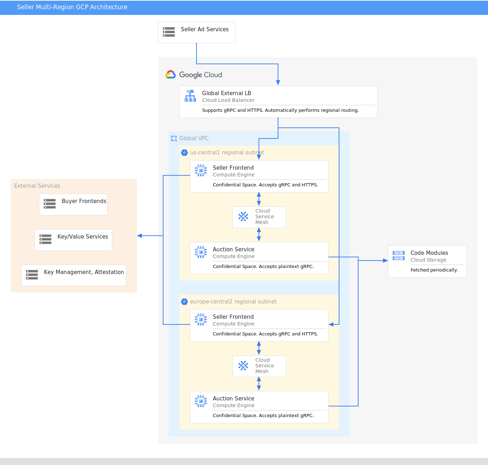
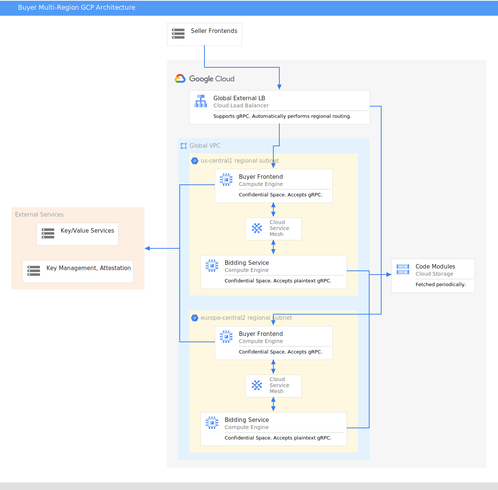

> FLEDGE has been renamed to Protected Audience API. To learn more about the name change, see the [blog post](https://privacysandbox.com/intl/en_us/news/protected-audience-api-our-new-name-for-fledge)

**Authors:** <br>
[Daniel Kocoj][58], Google Privacy Sandbox

# Bidding and Auction services GCP cloud support and deployment guide

## Cloud Architecture for Protected Audience Bidding and Auction services

This document proposes a cloud architecture for Protected Audience Bidding and Auction services on Google Cloud Platform (GCP). The goal of this document is to enable server operators to gain familiarity with the methods of and requirements for running Bidding and Auction services in GCP. This document will be updated as more features are added and the system evolves.

To learn more about Protected Audience services and Bidding and Auction services, read the following:

 - [Protected Audiences Services Overview][1]
 - [Bidding and Auction Services High Level Design and API][2]
 - [Bidding and Auction Services System Design][3]

To compare the GCP implementation to the AWS implementation, refer to the [Bidding and Auction services AWS cloud support and deployment guide][4].

The Protected Audience Bidding and Auction services implementations on GCP and AWS are functionally similar. One key difference is that while AWS uses an internal load balancer to route traffic to the Bidding and Auction services, GCP uses a service mesh. Another key difference is that the GCP packaging pipeline creates a Docker image, while the AWS packaging pipeline creates an Amazon Machine Image.

### Availability timeline

The Protected Audience Bidding and Auction services will be open-sourced in June 2023. In addition to the code for each service, we will open source Terraform configurations and scripts that allow ad techs to easily deploy the services proposed in this document.

### Sell-side platform

The seller operates a SellerFrontEnd service and an Auction service. These services are responsible for orchestrating the auction and communicate with a seller-operated Key/Value service and partner-operated BuyerFrontEnd services. [Learn more about how these services work][5].

A [trusted execution environment (TEE)][6] provides a level of assurance for data integrity, data confidentiality, and code integrity using hardware-backed techniques for increased security guarantees for code execution and data protection. The TEE-based SellerFrontEnd service receives its requests from a [Seller Ad service][7]. These requests can be either HTTP or [gRPC][8]. See the [Envoy component][9] to learn how HTTP requests are translated to gRPC. Then network requests are sent to all configured buyer front ends and Key/Value services. The following diagram provides an overall view of the system.

<figure id = "seller-gcp-diagram">
  
  <figcaption><b>Figure 1.</b> Seller GCP Architecture</figcaption>
</figure>


### Demand-side platform

A buy-side ad tech is responsible for operating a BuyerFrontEnd service, a Bidding service, and a Key/Value service. A request begins with a gRPC message from a SellerFrontEnd service. The major subsequent steps include fetching data from the buyer-operated Key/Value service and generating bids for the ads that are present in the request. [Learn more about the demand-side platform system][10]. The following diagram provides an overall view of the system.

<figure id = "buyer-gcp-diagram">
  
  <figcaption><b>Figure 2.</b> Buyer GCP Architecture</figcaption>
</figure>


### Component overview

#### Cloud region 

The Bidding and Auction services are regional services, where a ‘cloud region' refers to a particular geographical location as [defined by GCP][11]. We'll open source Terraform configurations to support deployment in **multiple regions in different geographies**. Ad techs can deploy services in any region supported by GCP. The Terraform configurations include parameters that an ad tech can update before deploying to a different cloud region. Note that even though the services are regional, the Terraform configurations show how to make use of global load balancers and service meshes to achieve multi-region coverage.

#### IAM Policies 

[Identity and Access Management][12] (IAM) is used to securely control who has access to your GCP resources. You can use IAM to create and manage users, groups, and permissions. You can also use IAM to audit access to your resources.

The default Terraform configuration requires a [service account][13] for each GCE instance. The service account is bound to an IAM role, which the GCE instance inherits.

#### VPC 

A [virtual private cloud][14] (VPC) is an isolated resource within a public cloud. Sellers and buyers should start with 1 global VPC. A VPC is critical for security purposes and provides configurable firewall rules (which can be found in the Terraform modules).

#### Subnet 

Each buyer and seller should have 1 private subnet per region. By hosting most components in the private subnet, the service has extra protection from internet traffic. However, the buyer and seller's load balancers must face the public internet. Like VPCs, subnets rely on firewall rules for network security.

#### Network policies 

[Firewall rules][15] are used to control which types of traffic flow to which ports in the VPC. Key security group rules allow for egress and ingress traffic to flow from the load balancers to GCE Instances, and GCE instances to send network requests to external services.

#### Managed instance group 

Each region uses a [managed instance group][16] to host its GCE instances. The managed instance group uses an instance template to create or destroy instances based on health checks and autoscaling requirements. Autoscaling is based on CPU utilization and is configurable in the terraform variables, including specifying a minimum and maximum number of instances per instance group. Health checks are configured such that managed instance groups will detect mal-performing VM instances and [auto-heal][17].

#### GCP Backend Service 

A [GCP Backend Service][18] is a global resource consisting of all regional managed instance groups for a particular service. Backend services work in tandem with load balancers and are responsible for routing a request to the correct instance.

#### Load balancer 

The buyer and seller frontend services both use a [Global External Load Balancer][19].

The SellerFrontEnd load balancer accepts both HTTP and gRPC traffic over TLS, while the BuyerFrontEnd load balancer accepts gRPC traffic only. Both services' load balancers accept internet traffic. Load balancers terminate TLS, then start a new TLS session with the GCE instance provided by the load balancer's GCP Backend Service. Note that root certificates for the Load Balancer and Backend Service are not verified.

#### Service mesh 

The SellerFrontEnd and BuyerFrontEnd both communicate with the Auction and Bidding services, respectively, via the [Traffic Director gRPC proxyless service mesh][20]. This bypasses any need for an internal load balancer and saves on dedicated load balancer costs. Specifically, the SellerFrontEnd and BuyerFrontEnd use gRPC's built-in [xDS capabilities][21] to query the Traffic Director control plane service and find routes to available [backend services][22]. Each front end relies on the Traffic Director to distribute its requests to the appropriate backend service, based on utilization and regional availability. While the service mesh itself is a global resource, it automatically routes requests based on region. Because the requests are internal to the VPC and subnet, they are sent as plaintext gRPC.

#### GCE Host 

The [GCE][23] Host is also known as an ‘instance.' The instance runs in a [Confidential Computing Space][24], which is created via a Docker image containing the service binary and startup scripts. The instance's open ports are identical to those exposed by the Docker image and are the only ports on which incoming connections are supported; connections initiated from inside the Confidential Space workload support both ingress and egress. Individual GCE instances belong to a [Managed Instance Group][25].

##### Confidential Space image version
In order to support incoming connections, the minimum Confidential Space image version is [`230600`][60] under the  `confidential-space-images` project and in the `confidential-space` and `confidential-space-debug` families.

##### Envoy 

Inside the seller's front-end service GCE Host Confidential Space, we provide an instance of the open source [Envoy proxy][26]. This is solely used to convert HTTP traffic to gRPC that the SellerFrontEnd service can consume. Envoy terminates TLS and then forwards the plaintext request to the seller's port. The envoy configuration is included in the TEE and can only be modified in a limited way by the operator (such as by providing TLS keys and certificates).

##### DNS 

[Cloud Domains][27] and [Cloud DNS][28] are supported for use with global external load balancers. The load balancers can automatically use [Google-managed TLS certificates][29] and don't require operators to provide regional domains. The Terraform configurations require a GCP Domain, [DNS Zone][30], and certificate resource ID.

##### Instance type recommendations 

By default, ad techs are free to use any [instance type][31] that supports Confidential Compute ([N2D or C2D][32] and that meets the ad tech's performance requirements. A recommended starter instance for functionality is _n2d-highcpu-128_. Take note of the [regional availability limitations][33] for Confidential Computing.

#### Cloud Logging
The GCE host uses the `tee-container-log-redirect` [metadata variable][59] to redirect all stdout and stderr output to [Cloud Logging][61] in both production and debugging environments. This allows service operators to use [Logs Explorer][62] to view logs across all of their services. The production Bidding and Auction service binaries will be built with `VLOG=0`, so only limited information will be logged compared to debugging binaries (which can be built with any `VLOG` level).

#### Secret Manager 

[GCP Secret Manager][34] is a fully managed service that makes it easy for you to store and retrieve configuration data (including secrets, such as TLS information, and runtime flags, such as ports) in a central location. The default Terraform configurations store the servers' runtime flags in Secret Manager and fetch the flags on server startup. An ad tech can modify the secret and restart the server for the new flag value to take effect.

#### Cloud Storage 

[Google Cloud Storage][35] (GCS, a cloud object storage service) [buckets][36] are used to store the ad tech's proprietary code modules that are required for Bidding and Auction services. The Bidding and Auction services communicate with GCS via a [Private Service Connect][37] endpoint to fetch the code modules. Each bucket must be configured to allow READ access to the GCE host IAM role. Due to relaxed code module fetch latency requirements, the ad tech can host its code in a GCS bucket in a single region if desired.

### Terraform-based Service Configuration

We will provide [Terraform][38] configurations for the Bidding and Auction services. Terraform is used to describe the cloud resource composition (via [Infrastructure as Code][39] that is required for a fully-functional bidding and auction system and the provided Terraform configurations can be modified by the ad tech with no limitations. In fact, the Bidding and Auction services are [configured via Terraform][40], so it is expected that the ad tech interacts with Terraform throughout the [deployment process][41].

## Guide: Package, deploy, and run a service

_This section documents the packaging and deployment process for the Bidding and Auction services. The goal is for technical users to gain an understanding of how to deploy a functioning cloud environment with the service(s) of their choice. After the Bidding and Auction services code is open sourced, much more detail will be added to this section so that it can serve as a complete how-to guide_.

### Overview

In order to create a functioning service in GCP, there are two major steps:

1. Packaging: The creation of the Docker image containing the service's code.
1. Deployment: Running Terraform to bring up the individual cloud components, including the image from step 1.

### Step 0: Prerequisites

#### Local Setup 

Use a Linux-based operating system to follow these instructions. Other systems have not been tested.

1. [Install][42] [`git`][42].
2. Download the source code from the [Github repository][63].
3. Run

`git submodule update --init`.

This command and all suggested commands in this document should be run from the project root directory.

4. Install [Docker][44], which is required to:
   1. Build the code. _NOTE: the code relies on the [Bazel][43] build system which is included in the default Docker images used by the build scripts._
   2. Build the production images with attestable hashes.
   3. Run tests and binaries locally.

To verify that Docker is installed and runs, try building the code using one of the tools installed by Docker. Running builders/tools/bazel-debian info workspace should return an output of the Bazel workspace location. Make sure that bazel info workspace and bazel-debian info workspace have different outputs, or your local builds will conflict with the packaging toolchain.

5. Create a symbolic link that points to your python3 installation from /opt/bin/python3.
6. Install [gcloud][45] and [initialize your environment][46].

#### Local testing 

After installing the prerequisites, you should be able to test the server. To run the server locally:

1. Run `builders/tools/bazel-debian build` to build each server.
2. Start the server with the artifact returned by Bazel.
3. Test the server following [these steps][47].
4. Optional: Run the built binary with the `--helpfull` flag to inspect the required flags.

**Startup Scripts**

The scripts in `tools/debug` contain example startup commands and can be run directly.

<table>
  <tr>
    <td><p><strong>Bidding Server</strong></p></td> 
    <td><p>builders/tools/bazel-debian build services/bidding_service:server && \</p><p>./bazel-bin/services/bidding_service/server <YOUR FLAGS HERE></p></td>
  </tr>
  <tr>
    <td><p><strong>Buyer Frontend Server</strong></p></td> 
    <td><p>builders/tools/bazel-debian build services/buyer_frontend_service:server && \</p><p>./bazel-bin/services/buyer_frontend_service/server <YOUR FLAGS HERE></p></td>
  </tr>
  <tr>
    <td><p><strong>Auction Server</strong></p></td> 
    <td><p>builders/tools/bazel-debian build services/auction_service:server && \</p><p>./bazel-bin/services/auction_service/server <YOUR FLAGS HERE></p></td>
  </tr>
  <tr>
    <td><p><strong>Seller Frontend Server</strong></p></td> 
    <td><p>builders/tools/bazel-debian build services/seller_frontend_service:server && \</p><p>./bazel-bin/services/seller_frontend_service/server <YOUR FLAGS HERE></p></td>
  </tr>
</table>

#### GCP project setup 

1. Create a [project][48]. This may belong to an organization but can also be standalone. All work will proceed within a single project.
2. Create a [service account][49]. This should have the minimum role permissions required, but for testing purposes it is convenient to set it to roles/Editor. GCE instances rely on this service account to perform their operations. GCE instances rely on the IAM role of the service account for permissions.
3. Register a domain name via [Cloud Domains][27]. Both seller and buyer services require a dedicated domain. Additionally, create a [Cloud DNS zone][50] for each of your domains.
4. Create SSL certificates for frontend services. You need these because the Global External Load Balancer only communicates with our frontends via TLS.
5. Create an [Artifact Registry][51] repository, then [authenticate your account][52]. You will build and upload the docker images used for testing, and production docker images are fetched from GitHub after open-sourcing the Bidding and Auction services. Set the GCP project id to your local shell environment variables under the variable name BA_GCP_PROJECT_ID. This is used by the packaging script to choose where to upload your images.
6. [Enable][53] the following APIs:

```
artifactregistry.googleapis.com
bigquery.googleapis.com
bigquerymigration.googleapis.com
bigquerystorage.googleapis.com
certificatemanager.googleapis.com
cloudapis.googleapis.com
cloudasset.googleapis.com
clouddebugger.googleapis.com
cloudresourcemanager.googleapis.com
cloudtrace.googleapis.com
compute.googleapis.com
confidentialcomputing.googleapis.com
datastore.googleapis.com
dns.googleapis.com
domains.googleapis.com
edgecache.googleapis.com
logging.googleapis.com
monitoring.googleapis.com
networkmanagement.googleapis.com
networkservices.googleapis.com
oslogin.googleapis.com
privateca.googleapis.com
secretmanager.googleapis.com
servicemanagement.googleapis.com
serviceusage.googleapis.com
sql-component.googleapis.com
storage-api.googleapis.com
storage-component.googleapis.com
storage.googleapis.com
trafficdirector.googleapis.com
```

### Step 1: Packaging

#### Step 1.1: Configure a test build (Optional)

The file `config.bzl` presents a flag for non_prod (non-attestable) builds, `non_prod_build`. You may modify the value of the `GLOG_v` key to increase your log level for more verbose logs.

To build a seller front end service, you may want to modify the `envoy.yaml` configuration file to expose whichever ports you need via the `socket_address` fields. The `gRPC_cluster` port must match the port passed via the _`<Service>_PORT`_ flag.

#### Step 1.2: Building the GCP Confidential Space Docker Image 

_Buy-side ad techs only need to deploy the Buyer Front-End service and the Bidding service in production, while sell-side ad techs only need to deploy the Seller Front-end Server and the Auction Server. However, when testing, ad techs may want to deploy all of the servers to better understand the message flows and structures_.

To deploy to GCP for testing, we suggest building a docker image for each service. A script to do so can be found at:

`production/packaging/build_and_test_all_in_docker`

This script takes flags to specify which service and which region to build. For example:

```
production/packaging/build_and_test_all_in_docker --service-path <SERVICE_NAME>_service  --instance local --platform gcp --gcp-image-tag <DEPLOYMENT ENVIRONMENT> --gcp-image-repo <REGION>-docker.pkg.dev/<PROJECT_ID>/<REPO_NAME> --build-flavor <prod (for attestation) or non_prod (for debug logging)> --no-tests --no-precommit
```
> **Note**:
>  -   Switch `prod` to `non_prod` for a debugging build that turns on all vlog.
>  -   `<DEPLOYMENT ENVIRONMENT>` must match `environment` in the terraform deployment (see Step 2).


The script uploads the service (configured via the `service-path` flag) docker image (tagged with the `gcp-image-tag` flag) to the Artifact Registry repository provided by the `gcp-image-repo` flag. The GCE managed instance group template Terraform resources then take as input an image path, which you can provide via a string of the following format: `<gcp-image-repo>/<service-path>:<gcp-image-tag>`.

### Step 2: Deployment

#### Step 2.1: Terraform setup 

Install Terraform, following [these instructions][54].

##### Terraform layout 

The Terraform lies across three main folders within the `production/deploy/gcp/terraform` directory:

```
.
├── environment
│   └── demo
├── modules
│   ├── buyer
│   └── seller
└── services
    ├── autoscaling
    ├── load_balancing
    ├── networking
    └── security
```

##### Terraform Services directory  

This directory contains all of the individual components of a full stack: networking, load balancing, etc..

##### Terraform Modules directory 

This directory contains the seller and buyer modules, which compose the objects found in `services/` and apply defaults. Take note of the variable descriptions and defaults.

##### Terraform Environment directory 

This directory contains example setups of sellers and buyers. Subdirectories of the `environment` directory (such as `setup_1`) are where you should run `terraform apply`. As an ad tech, this is where you write (or reuse) _`.tf`_ files. Review `setup_1/multi-region.tf` as an example. This file contains all of the ad tech-specific details such as runtime flags, region, and domain addresses. The Terraform variable descriptions in the buyer and seller `service_vars.tf` files contain the complete details of each variable.

#### Step 2.2: Configure Terraform variables 

For recommended configurations, please see [here][65].

Terraform variables are split into two major categories:

1. Those for the seller (definitions, defaults found in `production/deploy/gcp/terraform/modules/seller/service_vars.tf`).
1. Those for the buyer (definitions, defaults found in `production/deploy/gcp/terraform/modules/buyer/service_vars.tf`).

The seller module brings up a SellerFrontEnd and Auction service, while the buyer module brings up a BuyerFrontEnd and Bidding service. You can have multiple buyers for every seller. 

#### Step 2.3: Apply Terraform 

After modifying the provided implementations to your desired parameters (including updating all defaults in `modules/*/service_vars.tf`), you should run the following in your desired environment or setup directory to bring the entire system up.

```
terraform apply
```

You can see the output of each GCE instance via the [serial logging][55] console.

#### Step 2.4: Upload Code Modules 

Ad techs must use a GCS bucket to host proprietary code modules. The bucket name is required by the Terraform configuration so that a bucket and Private Service Connect Endpoint can be created. Bidding and Auction services automatically fetch updates from the bucket, but it is the ad tech's responsibility to upload their code modules to the bucket. Note that to upload to the bucket, the ad tech must modify the bucket permissions to allow their own proprietary endpoints WRITE access. This is most easily done through IAM permissions. See the GCP GCS [permission guide for details][56]. The Terraform configuration allows the VPC's instances READ access to the bucket by default.

Instead of using a bucket, during alpha and early beta testing server operators may specify an arbitrary code module endpoint to fetch (via an HTTPS call) in the Terraform configuration. Only a single code module is supported. Later in beta testing, ad techs will be able to host multiple different code modules in a single bucket and specify the module to use at the individual request level.

#### Step 2.5: Test the Service 

##### Option 1: secure_invoke
Please see the secure_invoke [README][64]. This tool is bundled with the Bidding and Auction services.

##### Option 2: grpcurl
Use [grpcurl][57] to send a gRPC request to the load balancer address you configured in the Terraform. Requests must be addressed to port 443 so that the load balancer can terminate the TLS connection. When testing locally-running services, disable the `TLS_INGRESS` flags to bypass TLS requirements. 

**Note:** if providing a `sample_request.json`, keep in mind that the `SelectAdRequest` will still require a protected_audience_ciphertext (see `secure_invoke` in Option 1 for instructions on how to generate a ciphertext payload). Additionally, grpcurl will not be able to decrypt the `AuctionResult` ciphertext.


<table>
  <tr>
    <td><p><strong>Task</strong></p></td> 
    <td><p><strong>Command</strong></p></td>
  </tr>
  <tr>
    <td><p>Local service: List grpc endpoints</p></td> 
    <td><p>grpcurl -plaintext localhost:<PORT> list</p></td>
  </tr>
  <tr>
    <td><p>Local service: Send query</p></td> 
    <td><p>grpcurl -plaintext -d '@' localhost:<PORT> privacy_sandbox.bidding_auction_servers.<SERVICE>/<ENDPOINT> < sample_request.json</p></td>
  </tr>
  <tr>
    <td><p>GCP service: List grpc endpoints</p></td> 
    <td><p>grpcurl dns:///<DOMAIN.COM>:443 list</p></td>
  </tr>
  <tr>
    <td><p>GCP service: Send query</p></td> 
    <td><p>grpcurl -d '@' dns:///<DOMAIN.COM>:443 privacy_sandbox.bidding_auction_servers.<SERVICE>/<ENDPOINT> < sample_request.json</p></td>
  </tr>
</table>

[1]: https://github.com/privacysandbox/fledge-docs/blob/main/trusted_services_overview.md
[2]: https://github.com/privacysandbox/fledge-docs/blob/main/bidding_auction_services_api.md
[3]: https://github.com/privacysandbox/fledge-docs/blob/main/bidding_auction_services_system_design.md
[4]: https://github.com/privacysandbox/fledge-docs/blob/main/bidding_auction_services_aws_guide.md
[5]: https://github.com/privacysandbox/fledge-docs/blob/main/bidding_auction_services_api.md#sell-side-platform-ssp-system
[6]: https://github.com/privacysandbox/fledge-docs/blob/main/trusted_services_overview.md#trusted-execution-environment
[7]: https://github.com/privacysandbox/fledge-docs/blob/main/bidding_auction_services_api.md#seller-ad-service
[8]: https://grpc.io/
[9]: #envoy
[10]: https://github.com/privacysandbox/fledge-docs/blob/main/bidding_auction_services_api.md#demand-side-platform-dsp-system
[11]: https://cloud.google.com/compute/docs/regions-zones
[12]: https://cloud.google.com/iam/docs/
[13]: https://cloud.google.com/compute/docs/access/service-accounts
[14]: https://cloud.google.com/vpc/docs
[15]: https://cloud.google.com/firewall/docs/firewalls
[16]: https://cloud.google.com/compute/docs/instance-groups
[17]: https://cloud.google.com/compute/docs/tutorials/high-availability-autohealing
[18]: https://cloud.google.com/load-balancing/docs/backend-service
[19]: https://cloud.google.com/load-balancing/docs/https
[20]: https://cloud.google.com/traffic-director/docs/proxyless-configure-advanced-traffic-management
[21]: https://grpc.github.io/grpc/core/md_doc_grpc_xds_features.html
[22]: #gcp-backend-service
[23]: https://cloud.google.com/compute/docs
[24]: https://cloud.google.com/compute/confidential-vm/docs/about-cvm
[25]: #managed-instance-group
[26]: https://www.envoyproxy.io/docs.html
[27]: https://cloud.google.com/domains/docs/overview
[28]: https://cloud.google.com/dns
[29]: https://cloud.google.com/load-balancing/docs/ssl-certificates/google-managed-certs
[30]: https://cloud.google.com/dns/docs/zones
[31]: https://docs.aws.amazon.com/AWSEC2/latest/UserGuide/instance-types.html
[32]: https://cloud.google.com/compute/docs/general-purpose-machines#n2d_machines
[33]: https://cloud.google.com/compute/confidential-vm/docs/locations
[34]: https://cloud.google.com/secret-manager
[35]: https://cloud.google.com/storage
[36]: https://cloud.google.com/storage/docs/creating-buckets
[37]: https://cloud.google.com/vpc/docs/about-accessing-google-apis-endpoints
[38]: https://developer.hashicorp.com/terraform/intro
[39]: https://www.terraform.io/use-cases/infrastructure-as-code
[40]: https://github.com/privacysandbox/fledge-docs/blob/main/bidding_auction_services_api.md#service-configuration
[41]: #guide-package-deploy-and-run-a-service
[42]: https://git-scm.com/book/en/v2/Getting-Started-Installing-Git
[43]: https://bazel.build/
[44]: https://docs.docker.com/get-docker/
[45]: https://cloud.google.com/sdk/gcloud
[46]: https://cloud.google.com/sdk/docs/install-sdk#initializing_the
[47]: #step-25-test-the-service
[48]: https://cloud.google.com/resource-manager/docs/creating-managing-projects
[49]: https://cloud.google.com/iam/docs/service-account-overview
[50]: https://cloud.google.com/dns/docs/overview/
[51]: https://cloud.google.com/artifact-registry/docs
[52]: https://cloud.google.com/artifact-registry/docs/docker/pushing-and-pulling#cred-helper
[53]: https://cloud.google.com/endpoints/docs/openapi/enable-api
[54]: https://github.com/privacysandbox/fledge-key-value-service/blob/main/docs/deploying_on_aws.md#set-up-terraform
[55]: https://cloud.google.com/compute/docs/troubleshooting/troubleshooting-using-serial-console
[56]: https://cloud.google.com/storage/docs/access-control/iam-permissions
[57]: https://github.com/fullstorydev/grpcurl
[58]: https://github.com/dankocoj-google
[59]: https://cloud.google.com/compute/confidential-vm/docs/reference/cs-options#cs-metadata
[60]: https://cloud.google.com/compute/confidential-vm/docs/work-with-confidential-space-images#open_inbound_ports
[61]: https://cloud.google.com/logging
[62]: https://cloud.google.com/logging/docs/view/logs-explorer-interface
[63]: https://github.com/privacysandbox/bidding-auction-servers
[64]: https://github.com/privacysandbox/bidding-auction-servers/tree/main/tools/secure_invoke
[65]: https://github.com/privacysandbox/bidding-auction-servers/tree/main/production/deploy/gcp/terraform/environment/demo