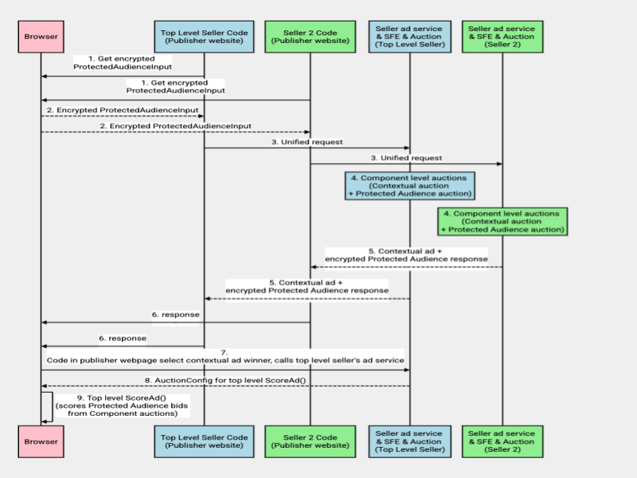
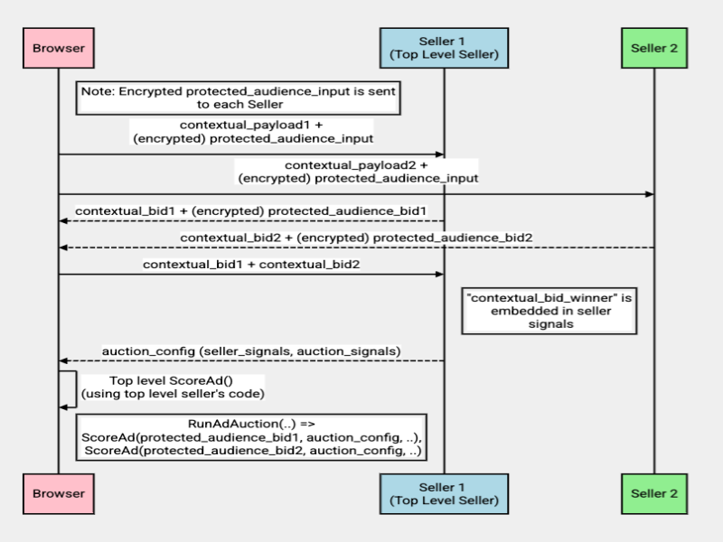
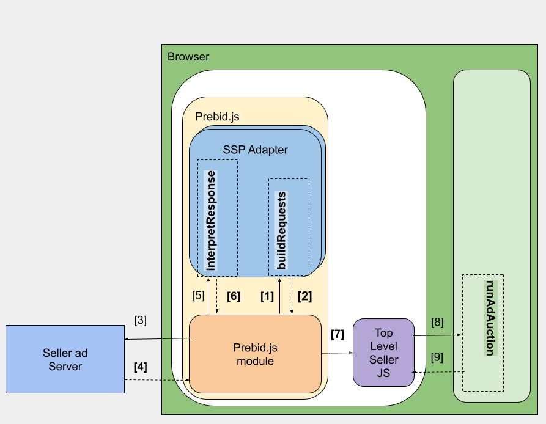
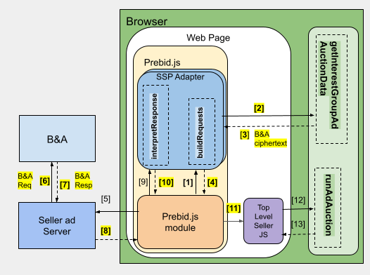
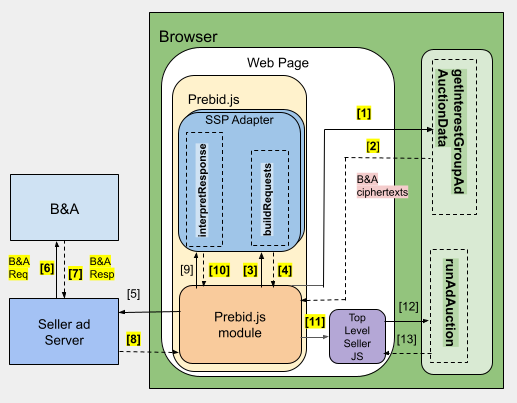
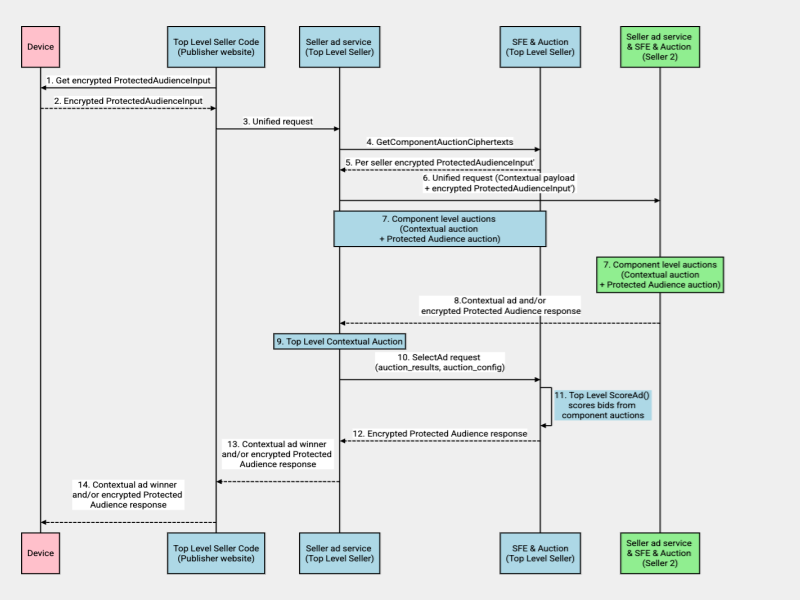
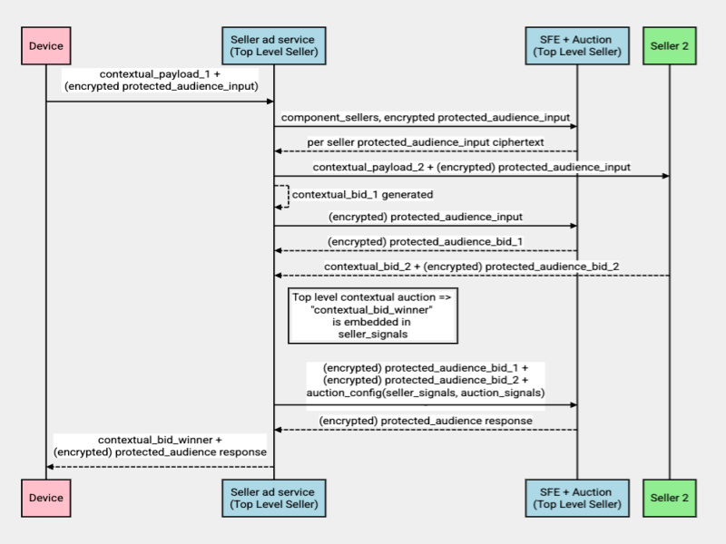

> FLEDGE has been renamed to Protected Audience API. To learn more about the name change, see the [blog post](https://privacysandbox.com/intl/en_us/news/protected-audience-api-our-new-name-for-fledge)

**Authors:** <br>
[Jaspreet Arora][2], Google Privacy Sandbox<br> 
[Priyanka Chatterjee][1], Google Privacy Sandbox

# Bidding and Auction Services Multi Seller Auctions
This document explains the proposed multi-seller auction flows using [Bidding and Auction services][3].
We propose following types of multi-seller auctions:
* Device-orchestrated component auction
* Server-orchestrated component auction

This explainer provides building blocks for ad techs to participate in multi-seller auctions with their
ad management solution. While this explainer does not provide step-by-step instructions for each specific
ad tech’s integration, we aim to provide options to meet your auction use cases. 

_Note: SSP and DSP can operate Bidding and Auction services on different cloud platforms that are supported. 
For multi seller auctions, SSPs can operate on different cloud platforms._

Refer to this [section][5] for related explainers. You can share feedback on the design by filing a [GitHub issue][4].

Additional questions remain open for comment. As we build this technology, we’ll provide more detailed
setup instructions.

_Note: We will publish reporting designs for multi seller auctions in a different explainer. If you
developed reporting scripts using [Chrome on-device Protected Audience specification][27], that would work
with [Bidding and Auction services][3]._

## Key terms and concepts
### Seller
A party running an ad auction, likely to be an ad tech supply-side platform (SSP).

### Buyer
A party bidding for ad space in an ad auction, likely to be a demand-side platform (DSP), or the advertiser
itself. Ad space buyers own and manage Protected Audience interest groups.

### Seller’s ad service
A server owned by a seller to orchestrate real-time bidding (RTB) requests and Protected Audience auction
requests to Bidding and Auction services.

### Unified request
A seller’s single request for the contextual and server-side Protected Audience auction, from their code
on a publisher site. This was described in the Bidding and Auction services high-level design and API
explainer.
* The seller’s ad service makes two sequential requests.
  * [Existing flow] The seller sends real-time bidding (RTB) requests to buyers for contextual bids,
    then conducts the contextual auction.
  * [Server side Protected Audience flow] The seller sends a SelectAd request to SellerFrontEnd service
    to start the Protected Audience auction. The request payload includes encrypted Protected Audience data,
    contextual signals, buyer_list, seller_origin, per_buyer_timeout and other necessary information.
* The SellerFrontEnd conducts the Protected Audience auction. It returns an encrypted response that
  includes either the winning bid, or an encrypted padded response if the contextual bid filters all
  Protected Audience bids. For privacy reasons, the seller's ad service will be unable to determine if
  the payload has a winning Protected Audience ad or not, so it should also pass the contextual winner
  to the client.

### Contextual auction
In this explainer, we use "Contextual auction" to mean everything that does not involve cross-site data.
This includes the contents of the web page or URL where the ad will appear, which is the traditional
sense of "contextual."  But for our purposes, first-party data that the publisher provides about their
user, or Seller-Defined Audience data, are also bundled into what we are calling "contextual".

### Component auction
An auction conducted by a single seller among a collection of buyers, as part of a multi-seller auction.
The auction winners then participate in a top-level auction. In a unified flow, the top-level auction
includes the winners for the contextual auction and/or the winner for the Protected Audience auction.
Each Component auction follows the single seller unified flow specified in Bidding and Auction Services
Design.

### Top-level auction
The auction which decides the final winner, conducted after individual seller auctions (component
auctions). 

Note: The top-level auction runner cannot use Protected Audience data to bring its own demand.
Therefore buyers can not participate in the top-level auction. The top-level auction scores winning bids
from component auctions. 

### Multi-seller auction
Auctions with participation from multiple sellers and their partner buyers, where the final winning ad
candidate is decided by a top level auction.

### Top-level seller
The sell-side ad tech or the publisher conducting the top-level auction. This ad tech specifies the
scoreAd() script and auction config for scoring the winning candidates from Component auctions.

### Component-level seller
The sell-side ad techs that integrate with a top-level seller and conduct their own Component auction.
The winners from those auctions are scored in the top-level auction.

## Timeline
We expect to make Multi seller auction support with Bidding and Auction services available for testing
by September 2023.

## Services overview


_This type of multi seller auction will be supported for web advertising with Bidding and Auction services._ 

The Bidding and Auction services allow Protected Audience computation to take place on cloud servers
with a [trusted execution environment][6] (TEE), rather than locally on a user's device. Each Bidding
and Auction service is hosted in a virtual machine (VM) within a secure, hardware-based TEE. Ad tech
platforms operate and deploy Protected Audience services on a public cloud. 

### Sell-side services
The sell-side services include the SellerFrontEnd service and the Auction service. The SellerFrontEnd
service orchestrates requests in parallel to buyers by communicating with multiple BuyerFrontEnd
Services. This service also fetches real-time scoring signals from the seller's Key/Value service
required for the auction and calls the [Auction service][7] for Protected Audience auction. The Auction
service will execute the seller-owned code to score the bids from their seller partners. Review a
detailed [overview of the sell-side services][8].

### Buy-side services
The buy-side services include the BuyerFrontEnd service and the Bidding service. The BuyerFrontEnd
service communicates with the Buyer-operated Key/Value services to fetch bidding signals and call
the Bidding service to generate bids. The Bidding service will execute the buyer-owned code to
generate the bids for the interest groups. Review a detailed [overview of the buy-side services][9].

The seller’s ad service starts the Protected Audience auction on the Auction service by sending a
request to the SellerFrontEnd Service with the encrypted Protected Audience data (from the browser),
and contextual signals in plaintext. Read about the Protected Audience auction [flow using the
Bidding and Auction Services][10].

## Design
The [Bidding and Auction services API][11] will be extended to support multi-seller auction flows,
with an updated API.  There are two different ways in which a multi-seller auction could make use
of these services, based on where the top-level auction takes place.

[Device-orchestrated Component auction][13]: Each component auction is orchestrated by the respective
seller in the publisher web page, in the browser. Each component auction can be conducted with
the Bidding and Auction services or on-device. The top-level Protected Audience auction is executed
on the browser.

_Note: If all component sellers run auctions on-device, the component auction flow should be the same
as described in [Chrome Protected Audience on-device explainer][15]._

[Server-orchestrated Component auction][14]: The top-level seller makes one request for an auction,
from the publisher web page, to its ad service, The top-level seller’s ad service orchestrates unified
requests to other sellers for Component auctions that can run on Bidding and Auction services. Then,
the top-level Protected Audience auction is executed in the top-level seller's TEE-based Auction service.

### Device-orchestrated Component auctions


#### High-level overview
Each component seller sends a unified request for its specific Component auction. Each sellers' code
calls the browser API to obtain the encrypted Protected Audience request payload. Then, they forward
this payload to their own ad servers as a [unified request][16]. Requests can be sent from the client
in parallel. 

Each component seller decides where its auction takes place. This means sellers can run a Protected
Audience component auction on-device or with the Bidding and Auction services.

 * If a seller decides to run a Protected Audience component auction on-device, their partner buyers
   that participate in the auction must generate bids on-device. If a seller decides to run a Protected
   Audience component auction in the Protected Audience Auction service, their participating partner
   buyers must generate bids server side in the Protected Audience Bidding service.
   
 * If a seller decides to run a Protected Audience component auction on-device, the seller code in the
   publisher web page on browser sends contextual request to seller's ad service, the contextual response
   include contextual signals required to build Protected Audience auction config, then the Protected
   Audience component auction executes on-device.
   
The contextual auction winner and encrypted Protected Audience response from each Component auction are
made available to the browser. The top-level seller conducts the final contextual auction with the
contextual auction winners from the contextual half of the component auctions, and populates the auction
config (scoring signals and auction signals). This can happen on-device or on the top-level seller’s ad
service. Then the top-level seller's ScoreAd() function scores the Protected Audience bids received from
the Protected Audience half of the component auctions. This takes place on the device.

#### Flow
The flow describes Protected Audience component auction in Bidding and Auction services or on the browser,
followed by top level auction on the browser.

* Following is the flow if Protected Audience component auction happens server side:

  * Each component-level seller’s code on a publisher’s web page on browser calls respective seller's ad
    service for a Component auction with one [unified request][16], as per the [Contextual and Protected Audience
    auction flow][17]. If the seller decides to run server side Protected Audience auction in Bidding and Auction services,
    then a [unified request][16] is sent; if the seller decides to run Protected Audience  auction on the browser,
    the contextual request is sent to seller ad service. The requests fan out in parallel from the publisher web page
    for each Seller. 
    * The unified request includes contextual payload and encrypted Protected Audience data. 
    * The seller's ad service uses the contextual payload to run a contextual auction.
    * The seller's ad service forwards the encrypted Protected Audience data and contextual signals to the TEE-based
      SellerFrontEnd service to conduct the Protected Audience auction. 
      * This flow is similar to the Protected Audience auction described in [Bidding and Auction services][10]
        with one special handling for which bids are skipped for scoring if corresponding _allow_component_auction_
        field is set to false in the [AdWithBid][19] response from Buyer.
      * For the bids that are scored, the _allowComponentAuction_ flag and _modified bid_ field would be returned
        by the scoreAd() script. For the winning Protected Audience bid, these will be returned to the client
        in the encrypted Protected Audience response.
        
   * Each component seller's ad service sends its contextual ad winner ad and/or encrypted Protected Audience
     response from component auctions back to the browser.
     
   * If the seller's component Protected Audience auction does not produce any winner, an encrypted, padded
     (fake) Protected Audience response is returned from the TEE-based SellerFrontEnd service to the seller's
     ad service.
     
   * The seller code in the publisher web page passes the encrypted Protected Audience response to the browser.
     _Note_: Only the browser API can decrypt the response. The client-side design details are documented in the
     [Browser API design for Bidding and Auction services integration][20].

* Following is the flow if Protected Audience component auction happens on-device:
  
  * Each component-level seller’s code on a publisher’s web page on browser calls respective seller's ad service
    for a contextual auction. This response includes contextual ad winner and contextual signals (that are part
    of the auction config) required for component-level Protected Audience auction.
    
  * Component-level Protected Audience auction happens on-device if the buyers and sellers determine if there is
    incremental value for Protected Audience. The highest scored bid and other data from this auction are made
    available for the top-level ScoreAd() on-device. See Chrome on-device explainer for details.
    See the explainer for [Protected Audience API on browser][21] for more details.
    
* The code in a publisher’s page can pick the contextual winner on the browser or sends contextual ad winners
  to the top-level seller's ad service to pick the contextual ad winner.
  
  * Contextual signals (seller signals and auction signals) are part of the top-level Protected Audience auction
    config and are required for the top-level Protected Audience auction.
    
* Top-level Protected Audience auction scores Protected Audience bids that are made available from component
  auctions. The top-level Protected Audience auction happens in the browser. The client-side design details are
  documented in the [Browser API design for Bidding and Auction services integration][20].
  
  * The browser may fetch scoring signals for top level auction as done today in [top-level Protected Audience
    auctions in the browser][21]. However, the top-level seller can decide whether their script requires scoring
    signals for the top-level auction.

#### Sequence diagram



#### Data flow



#### API changes
_Note: The Bidding and Auction services will conduct a component auction or a top-level auction, based on the
input to the [SelectAd RPC][22]_.

##### AuctionConfig
The following new fields will be added to the plaintext AuctionConfig object sent to the SellerFrontEnd service by the Seller Ad server:

* _string top_level_seller(optional)_: It’s similar to the seller field passed in the single seller auctions and will signal the 
  Bidding and Auction services that this is a Component auction. This is passed in the deviceSignals field to the generateBid() and reportResult() code by ad-techs. The component auction output includes other information required by the client for the top-level auction (for example, allowComponentAuction).

```
syntax = "proto3"; 

// Plaintext. Passed by the untrusted Seller service for configuring options for // the auction.
message AuctionConfig {
  // Existing fields .... 

  // Optional, but must be specifed if this is meant to be consumed for  
  // Component auctions. If this value is not present, the auction will be
  // treated as single seller.
  string top_level_seller = 9;
}
```
 
##### AuctionResult
The following new fields will be added to the encrypted AuctionResult object, sent in the SelectAdResponse
from the SellerFrontEnd service:
  
* _float bid (optional)_: This will be used to provide a modified bid value for the top-level seller
  scoring script. The original bid value will be returned in the “bid” field in AuctionResult. This will be
  populated from the “bid” field of the component seller’s scoreAd() code as described in the Chrome Protected
  Audience explainer. If this is not present, the original bid value will be passed to the top-level scoring
  script. 
  
* _string ad_metadata (optional)_: This will be used to pass the ad's metadata to the top-level seller's scoring function.
  This will be populated from the “ad” field of the component seller’s scoreAd() script as described in the Chrome
  Protected Audience explainer. If this is not present, an empty string will be passed to the top-level seller
  scoring script.

* _string top_level_seller_: This will contain the value passed by the seller’s ad server in the auction config object. This will be used by the device to validate that this is only used in a top-level auction run by the specified top-level seller.

  
The updated definition for AuctionResult will be as follows:
```
 syntax = "proto3"; 

 message AuctionResult {
   // Existing fields ....
   // Bid price corresponding to an ad.
   float bid = 6;

   // Optional name/domain for top-level seller in case this
   // is a component auction.
   string top_level_seller = 15;

   // Optional. Metadata of the ad, this will be passed to top-level 
   // seller's scoring function. Represents a serialized string that is
   // deserialized to a JSON object before passing to script. If this is
   // not present, an empty string will be passed to the top-level
   // seller scoring script.
   string ad_metadata = 16;

   // Reporting metadata required for top level auction will be updated
   // later.         
 }
```

_Note: Additional metadata will be sent back to the client for reporting (URL generation and report URL ping) after
the top-level auction on the browser. The API changes will be published at a later date in a different explainer._


#### Ad Tech Specifications
##### Component Seller Ad Server
The seller's ad server orchestrates the flow to conduct the component auction as follows - 
1. Sends a SelectAdRequest to SellerFrontEnd service with a B&A payload ciphertext and an auctionConfig as described in the [API changes][28].

_Note: For a component auction, the auctionConfig must contain a `topLevelSeller` field with the domain of the top level seller which will call runAdAuction on the browser._

2. Includes the encrypted AuctionResult responses (returned from the SelectAd request in step 1) sent back in the HTTP response body back to the JavaScript Fetch initiated by the browser with "adAuctionHeaders: true".
3. Attaches base64url encoded SHA-256 hash of each encrypted response included in an HTTP response header (Ad-Auction-Result header) back to the [browser][29]. 

_Note: This is required by the browser to ensure that the encrypted AuctionResult response is in fact coming from the correct seller origin. Refer [here][29] for more details._

Following is an example of Ad-Auction-Result header:
```
Ad-Auction-Result: ungWv48Bz-pBQUDeXa4iI7ADYaOWF3qctBD_YfIAFa0=,
9UTB-u-WshX66Xqz5DNCpEK9z-x5oCS5SXvgyeoRB1k=
```

#### Integration with Publisher bidding frameworks

Following are design examples for Publisher bidding frameworks such as [Prebid.js][31] integration with browser APIs for [device-orchestrated component auctions](#device-orchestrated-component-auctions).

> **Note:** We have received feedback from the ecosystem on how a multi-seller Protected Audience auction with Bidding and Auction Services (B&A) can be integrated with publisher bidding frameworks. To enable implementation, and foster discussion of a new feature, we are presenting one possible way that B&A can work with bidding frameworks. 
> 
> In this section, we provide an approach for [Prebid.js][31], which is a popular publisher bidding library used by the ecosystem, but a similar approach can be applied to other bidding libraries. Note that we describe a possible way Prebid.js can be updated to work with a multi-seller auction using Bidding and Auction services, but the exact implementation is up to the Prebid.js team.
> 
> We are seeking feedback on this integration, and your comments and suggestions on the approach are welcome. To provide feedback, please visit the Protected Auction Services Discussion repository on GitHub.

##### Background

[Prebid.js][31] provides integration with on-device component auctions through modules like the [PAAPI module](https://docs.prebid.org/dev-docs/modules/paapi.html), and [topLevelPAAPI](https://docs.prebid.org/dev-docs/modules/topLevelPaapi.html) module. An example flow to demonstrate its working is presented below. 


##### [On-device component auctions](https://github.com/WICG/turtledove/blob/main/FLEDGE.md#24-scoring-bids-in-component-auctions) with Prebid.js

> *<span style="text-decoration:underline;">Note</span>: Prebid integration with browser to support on-device component auctions is completed and available.*



1. Prebid.js calls seller adapter [buildRequests()](https://docs.prebid.org/dev-docs/bidder-adaptor.html#building-the-request) for contextual payload
2. [buildRequests()](https://docs.prebid.org/dev-docs/bidder-adaptor.html#building-the-request) returns ServerRequestObjects
3. Prebid module sends requests to seller ad servers
4. Seller ad server returns contextual bids
5. Prebid.js invokes [interpretResponse()][30] in the seller adapter with serverResponse.
6. [interpretResponse()](https://docs.prebid.org/dev-docs/bidder-adaptor.html#building-the-request:~:text=Browsing%2DTopics%27%2C%20%27%3F1%27%29%3B-,Interpreting%20the%20Response,-The%20interpretResponse%20function) returns [contextual bids and component auctionConfig(s)](https://docs.prebid.org/dev-docs/modules/paapi.html#:~:text=return%20%7Bbids%2C%20fledgeAuctionConfigs%7D%3B) to Prebid
7. Prebid.js module provides component auctionConfig(s) to top-level seller JS
8. Top-level seller JS invokes  [runAdAuction()](https://github.com/WICG/turtledove/blob/main/FLEDGE.md#24-scoring-bids-in-component-auctions:~:text=optionally%2C%20a%20boolean%20*/...%2C%0A%7D%3B-,const%20result%20%3D%20await%20navigator.runAdAuction(myAuctionConfig)%3B,-//%20If%20%60result%60%20is) to kick off top-level scoreAd()
9. Top-level seller JS receives winner from top-level auction

##### Device-orchestrated component auctions with Prebid.js

The current Prebid modules for Protected Audience auction support can be extended to support the B&A device-orchestrated component auctions API.

The following section presents a hypothetical integration flow for Prebid.js with the B&A device orchestrated component auctions. 

This concept envisions a possible set of changes to [Prebid.js][31] and seller modules to illustrate how Prebid.js seller modules can use B&A services for Protected Audience component auctions. These changes are an informal example and are not meant to be prescriptive.

> *<span style="text-decoration:underline;">Note</span>: The Browser APIs are available for Prebid to integrate with browser to support [device-orchestrated component auctions](#device-orchestrated-component-auctions) for B&A .*

###### Flow


1. Prebid.js calls seller adapter [buildRequests()](https://docs.prebid.org/dev-docs/bidder-adaptor.html#building-the-request) for contextual payload
2. [NEW] Seller Prebid adapter [buildRequests()](https://docs.prebid.org/dev-docs/bidder-adaptor.html#building-the-request) invokes [navigator.getInterestGroupAdAuctionData()](https://github.com/WICG/turtledove/blob/main/FLEDGE_browser_bidding_and_auction_API.md#step-1-get-auction-blob-from-browser) to fetch B&A ciphertext (encrypted request payload for B&A auctions)
3. [NEW] Browser returns a **B&A ciphertext** to [buildRequests()](https://docs.prebid.org/dev-docs/bidder-adaptor.html#building-the-request)
4. [NEW] [buildRequests()](https://docs.prebid.org/dev-docs/bidder-adaptor.html#building-the-request) includes the **B&A ciphertext** in the data field of [ServerRequestObjects](https://docs.prebid.org/dev-docs/bidder-adaptor.html#the-output-of-buildrequests-serverrequest-objects)
5. Prebid.js module sends requests to Seller Ad Servers with the **B&A ciphertext**
6. [NEW] Seller ad server calls their B&A for component PA auction
7. [NEW] Seller's B&A returns an encrypted **AuctionResult**
8. [NEW] Seller ad server returns B&A **AuctionResult** and contextual bids to browser
9. Prebid.js calls [interpretResponse](https://docs.prebid.org/dev-docs/bidder-adaptor.html#interpreting-the-response)() in the seller adapter with [serverResponse](https://docs.prebid.org/dev-docs/bidder-adaptor.html#interpreting-the-response:~:text=//%20const%20serverBody%20%3D-,serverResponse,-.body%3B%0A%20%20%20%20//%20const).
10. [NEW] interpretResponse() returns [contextual bids and component auctionConfig(s)](https://docs.prebid.org/dev-docs/modules/paapi.html#:~:text=function-,interpretResponse,-%28resp%2C) with the B&A **AuctionResult**  to Prebid.js

*[1-10 for each seller adapter]*

11. Prebid.js module provides component auctionConfig(s) to top-level seller JS
12. Top-level seller JScalls runAdAuction() to kick off top level scoreAd() with all component auctionConfig(s)
13. Top-level seller JS receives winner from top level auction

###### Changes in Prebid.js 
[Prebid.js][31] would need to incorporate the following changes in the [paapiForGpt](https://docs.prebid.org/dev-docs/modules/paapi.html#bid-adapter-integration) module - While calling the seller ad server, include the [adAuctionHeader in the request](https://github.com/WICG/turtledove/blob/main/FLEDGE_browser_bidding_and_auction_API.md#step-3-get-response-blobs-to-browser) to prepare the browser to look for Ad-Auction-Result HTTP response headers. 

###### Changes in Seller Prebid Module 
1. If the fledgeForGpt module is enabled (PAAPI eligibility passed in [ortb2Imp.ext.ae](https://prebid-docs.atre.net/dev-docs/modules/fledgeForGpt.html#adunit-configuration)), invoke [navigator.getInterestGroupAdAuctionData()](https://github.com/WICG/turtledove/blob/main/FLEDGE_browser_bidding_and_auction_API.md#step-1-get-auction-blob-from-browser) to fetch the B&A payload ciphertext with the top level seller.
2. Parse the response from [navigator.getInterestGroupAdAuctionData()](https://github.com/WICG/turtledove/blob/main/FLEDGE_browser_bidding_and_auction_API.md#step-1-get-auction-blob-from-browser). It contains requestID and request (the B&A payload ciphertext). 
3. Save the requestId field for later use in [interpretResponse](https://docs.prebid.org/dev-docs/bidder-adaptor.html#interpreting-the-response)().
4. Include the B&A payload ciphertext in the data field of [ServerRequestObjects](https://docs.prebid.org/dev-docs/bidder-adaptor.html#the-output-of-buildrequests-serverrequest-objects) from [buildRequests()](https://docs.prebid.org/dev-docs/bidder-adaptor.html#building-the-request).
5. Construct and return component auctionConfig objects (per ad slot) in [interpretResponse](https://docs.prebid.org/dev-docs/bidder-adaptor.html#interpreting-the-response)() using the AuctionResult ciphertexts from the server response and requestId field saved in 3.

###### Changes in Seller Ad Server 
> *<span style="text-decoration:underline;">Note</span>: These changes are not Prebid specific, but required for any seller's ad servers to support device-orchestrated component auctions with B&A services.*

If a B&A ciphertext is received in the call from Prebid, seller's ad server sends a [SelectAdRequest](https://github.com/privacysandbox/bidding-auction-servers/blob/6830804052778404bdf6758fbd165dd644e91539/api/bidding_auction_servers.proto#L521) to SellerFrontEnd service [as described](#component-seller-ad-server) in the previous section. 

##### Device-orchestrated component auctions with Prebid.js with Browser API optimizations

> *<span style="text-decoration:underline;">Note</span>: The following section presents a hypothetical integration flow for Prebid.js with the B&A device orchestrated component auctions with an additional proposed latency optimization - an update in the Browser API  \
getInterestGroupAdAuctionData to accept more than one seller origin and return a map of seller origin to B&A payload ciphertext.*

###### Flow


1. [**NEW**] [Prebid.js](Prebid.js) calls [navigator.getInterestGroupAdAuctionData](https://github.com/WICG/turtledove/blob/main/FLEDGE_browser_bidding_and_auction_API.md#step-1-get-auction-blob-from-browser)() with **all partner seller origins**
2. [**NEW**] **Browser** returns **B&A payload ciphertexts (one per seller origin)** to Prebid.js
3. [**NEW**] Prebid.js calls seller adapter [buildRequests()](https://docs.prebid.org/dev-docs/bidder-adaptor.html#building-the-request) with **B&A ciphertext** for this seller
4. [NEW] [buildRequests()](https://docs.prebid.org/dev-docs/bidder-adaptor.html#building-the-request) includes **B&A ciphertext** in the data field of [ServerRequestObjects](https://docs.prebid.org/dev-docs/bidder-adaptor.html#the-output-of-buildrequests-serverrequest-objects)
5. Prebid.js module sends requests to Seller Ad Servers with the **B&A ciphertext**
6. [NEW] Seller ad server calls their B&A for component PA auction
7. [NEW] Seller's B&A returns encrypted **AuctionResult**
8. [NEW] Seller ad server returns B&A **AuctionResult** and contextual bids to browser
9. Prebid.js calls [interpretResponse](https://docs.prebid.org/dev-docs/bidder-adaptor.html#interpreting-the-response)() in the seller adapter with [serverResponse](https://docs.prebid.org/dev-docs/bidder-adaptor.html#interpreting-the-response:~:text=//%20const%20serverBody%20%3D-,serverResponse,-.body%3B%0A%20%20%20%20//%20const).
10. [NEW] interpretResponse() returns [contextual bids and component auctionConfig(s)](https://docs.prebid.org/dev-docs/modules/paapi.html#:~:text=function-,interpretResponse,-%28resp%2C) with the B&A **AuctionResult**  to Prebid.js

*[3-10 for each seller adapter]*

11. Prebid.js module provides component auctionConfig(s) to top level seller Js 
12. Top level seller Js calls runAdAuction() to kick off top level scoreAd() with all component auctionConfig(s)
13. Top level seller Js receives winner from top level auction

###### Changes in Chrome 
Currently, the [navigator.getInterestGroupAdAuctionData()](https://github.com/WICG/turtledove/blob/main/FLEDGE_browser_bidding_and_auction_API.md#step-1-get-auction-blob-from-browser) method accepts a single seller origin and returns a B&A ciphertext for this seller. Chrome will expose API changes which will enable fetching the B&A payload ciphertexts for multiple sellers at once. These API updates will be available in 2025.

###### Changes in Prebid.js 
[Prebid.js][31] would need to accommodate the following changes in the [paapiForGpt](https://docs.prebid.org/dev-docs/modules/paapi.html#bid-adapter-integration) module - 

1. If the fledgeForGpt module is enabled, invoke [navigator.getInterestGroupAdAuctionData()](https://github.com/WICG/turtledove/blob/main/FLEDGE_browser_bidding_and_auction_API.md#step-1-get-auction-blob-from-browser) to fetch the B&A payload ciphertexts with **all partner seller origins** and the top level seller. 
2. Pass the corresponding seller’s B&A payload ciphertext when invoking the [buildRequests()](https://docs.prebid.org/dev-docs/bidder-adaptor.html#building-the-request) function in the seller module.
3. While calling the seller ad server, include the [adAuctionHeader in the request](https://github.com/WICG/turtledove/blob/main/FLEDGE_browser_bidding_and_auction_API.md#step-3-get-response-blobs-to-browser) to prepare the browser to look for Ad-Auction-Result HTTP response headers. 

###### Changes in Seller Prebid Module 
1. Parse the response from [navigator.getInterestGroupAdAuctionData()](https://github.com/WICG/turtledove/blob/main/FLEDGE_browser_bidding_and_auction_API.md#step-1-get-auction-blob-from-browser). It contains requestID and request (the B&A payload ciphertext). 
1. Save the requestId field for later use in [interpretResponse](https://docs.prebid.org/dev-docs/bidder-adaptor.html#interpreting-the-response)().
2. Include the B&A payload ciphertext in the data field of [ServerRequestObjects](https://docs.prebid.org/dev-docs/bidder-adaptor.html#the-output-of-buildrequests-serverrequest-objects) from [buildRequests()](https://docs.prebid.org/dev-docs/bidder-adaptor.html#building-the-request).
3. Construct and return component auctionConfig objects (per ad slot) in [interpretResponse](https://docs.prebid.org/dev-docs/bidder-adaptor.html#interpreting-the-response)() using the AuctionResult ciphertexts from the server response and requestId field saved in 3.


###### Changes in Seller Ad Server 
> *<span style="text-decoration:underline;">Note</span>: These changes are not Prebid specific, but required for any seller's ad servers to support device-orchestrated component auctions with B&A services.*

If a B&A ciphertext is received in the call from Prebid, seller's ad server sends a [SelectAdRequest](https://github.com/privacysandbox/bidding-auction-servers/blob/6830804052778404bdf6758fbd165dd644e91539/api/bidding_auction_servers.proto#L521) to SellerFrontEnd service [as described](https://github.com/privacysandbox/protected-auction-services-docs/blob/main/bidding_auction_services_multi_seller_auctions.md#component-seller-ad-server) in the previous section. 

#### Open Questions
The following is an open question for the top level Seller:

In Device-orchestrated Component Auction, the top level auction would score Protected Audience (winning) bids from
Component Auctions. In this case, are real-time scoring signals required to be fetched from the Seller's Key/Value
service?

### Server-orchestrated component auction


_This type of multi seller auction will be supported for app and web advertising with Bidding and Auction services, including [Protected App Signals](https://github.com/privacysandbox/protected-auction-services-docs/blob/main/bidding_auction_services_protected_app_signals.md#multi-seller-auction-support) data._

#### High-level overview
The top-level seller code in the publisher web page in the browser would send a [unified request][16] to the seller's
ad service that includes separate contextual request payload for each seller participating in the auction and one
encrypted Protected Audience request payload. The top-level seller’s code in the publisher web page/app asks the browser/android API
for the encrypted Protected Audience/Protected App Signals data to include in the unified request.

The top-level seller's ad service orchestrates the multi-seller auction, by sending contextual and server side Protected
Audience/Protected App Signals auction requests in parallel to other component sellers' ad services. This orchestration is new work to be done
by the top-level seller; it will not be handled by the open-sourced Bidding and Auction services code that runs inside a
TEE. All sellers, including the top-level seller, execute respective [unified flows][10] for a contextual auction followed
by Protected Audience/Protected App Signals auction if there is demand as determined by buyers and the seller.

The top-level seller's ad service receives the contextual auction winners and encrypted Protected Audience/Protected App Signals winners from
each Component auction. The top-level seller conducts the final contextual auction on their server, and prepares the
contextual signals for the top-level Protected Audience/Protected App Signals auction. The top-level seller conducts the top-level Protected
Audience/Protected App Signals auction in its TEE-based Auction service. 

After the top-level auction, the SellerFrontEnd service will send an encrypted response payload to
the top-level seller's ad service in [SelectAd][22] response. The top-level seller's ad service will be unable to determine
if the encrypted Protected Audience/Protected App Signals response payload has a winning Protected Audience/Protected App Signals ad or not. The seller's ad service
would pass both the top-level contextual ad winner and the encrypted Protected Audience/Protected App Signals response back to the client.

#### Server-orchestrated flow
* The top-level seller code on a publisher web page/android app sends one request to the top-level seller's ad service for contextual
  and Protected Audience/Protected App Signals auction. The request payload includes:
  
  * Separate contextual request payloads for each participating seller.
  
  * One Protected Audience/Protected App Signals request payload for all component-level sellers. This payload is encrypted and padded by the
    browser, so that it’s the same size across all users and auctions. 
    
* The top-level seller server orchestrates unified requests in parallel for each component-level seller partner. The
  unified request payload includes the contextual request payload and the encrypted Protected Audience/Protected App Signals payload **meant
  only for the partner seller**.
  
  * The top-level seller's ad service calls SellerFrontEnd service to obtain encrypted payload for other sellers;
    this request payload also includes a list of partner sellers for the multi-seller auction. 
    
  * The SellerFrontEnd service running in TEE decrypts the encrypted Protected Audience/Protected App Signals data and creates different
    payloads for each seller by adding different random noise to the input and re-encrypting the Protected Audience/Protected App Signals
    data. This ensures different encrypted data, in other words ciphertext is sent to each partner seller.
    
  * The SellerFrontEnd service returns different encrypted Protected Audience/Protected App Signals data mapped to the list of sellers back
    to the seller's ad service.
    
* All sellers (including the top-level seller) execute respective [unified flow][10] in parallel. Each seller conducts a
  contextual auction with their respective ad service. If buyers and sellers determine if there is incremental demand
  for Protected Audience/Protected App Signals, the seller conducts a Protected Audience/Protected App Signals auction in TEE-based Auction service. Within the
  [Protected Audience/Protected App Signals auction flow][10]:
  
  * Bids are skipped for scoring based on the allow_component_auction field in the [AdWithBid][19] response from Buyer.
  
  * For scored bids, the allowComponentAuction flag and modified bid would be returned by the ScoreAd() script. For the
    winning Protected Audience/Protected App Signals bid, these will be returned to the client in the encrypted Protected Audience response.

* Each component-level seller partner returns a contextual bid and / or an encrypted Protected Audience/Protected App Signals response to the
  top-level seller's ad service.
  
  * _Note: The top-level seller's ad service can not decrypt encrypted Protected Audience/Protected App Signals responses received from
    Component auctions; it can only be decrypted within an attested TEE-based service._
    
* The top-level seller conducts a top-level contextual auction in its seller's ad service. The top-level seller also
  generates contextual signals (part of the AuctionConfig) that are required for the top-level Protected Audience/Protected App Signals auction.
  
* The top-level seller conducts the top-level Protected Audience/Protected App Signals auction incorporating Protected Audience/Protected App Signals bids in the
  TEE-based Auction server.
  
  * The top-level seller sends all encrypted Protected Audience/Protected App Signals responses received from Component auctions to TEE-based
    SellerFrontEnd service. The TEE-based SellerFrontEnd service decrypts them. If there’s a Protected Audience/Protected App Signals ad winner
    from component auctions, the SellerFrontEnd service sends a request to the Auction service for top-level Protected
    Audience/Protected App Signals auction. If there's no Protected Audience/Protected App Signals ad winner from component auctions, the SellerFrontEnd service
    would return an encrypted padded (fake) response to the top level seller's ad service.
    
  * The SellerFrontEnd service returns a fixed-size encrypted padded Protected Audience/Protected App Signals response back to the seller's ad
    service. This is true whether or not the Protected Audience/Protected App Signals auction produced a winning ad. 
    
  * The seller’s ad service won’t be able to determine if the encrypted payload has a winning Protected Audience/Protected App Signals bid or
    not, so it should also pass the contextual winner to the client.

* The top-level seller returns the final contextual bid and / or Protected Audience/Protected App Signals winner back to the browser.

* Seller code in the publisher web page passes an encrypted Protected Audience/Protected App Signals response to the browser.

  * The seller code in the publisher web page can not decrypt the encrypted Protected Audience/Protected App Signals response, only the
    browser API will be able to decrypt that.

#### Sequence diagram 



#### Data flow



#### API changes

##### AuctionResult
In a device-orchestrated component auction flow, the auction result contains a top level seller field which the device matches to make sure the component auction is only used by the appropriate top-level seller. In this case, the AuctionResult will also include an AuctionParams object which contains the following fields:

* _string component_seller_: This field will be used make sure the top level seller is not able to use the result ciphertext of a component seller for another component seller.
* _string ciphertext_generation_id_: This field will be used to make sure the component auction result is only used for the intended Protected Audience Auction initiated on the device and cannot be replayed.

```
syntax = "proto3"; 

message AuctionResult {
  // Existing fields including auction_config.... 

  message AuctionParams {
    // The generation id in the request ciphertext. This is to ensure that
    // the result from a component auction can only be used in the same
    // top level auction as other component auctions conducted from the original
    // ciphertext. This is checked in the top level seller SFE and the request
    // is rejected in case of mismatch of result generation IDs.
    string ciphertext_generation_id = 1;

    // Component Seller domain.
    // This field is used to tie the auction result to the specific seller who
    // conducted the auction and is used in the top level auction as input
    // to the scoreAd function.
    string component_seller = 2;
  }

  // This is only populated for component auctions.
  AuctionParams auction_params = 18;
}

```

##### SelectAdResponse
The SelectAdResponse for Server component Auctions will contain the following additional fields:

* _string key_id_: Version of the public key used for encryption by component seller SFE. The top-level seller SFE needs to use private keys corresponding to same key_id to decrypt 'component_auctions_results'.

```
syntax = "proto3"; 

message SelectAdResponse {
  // Existing fields 
 
  // Encrypted AuctionResult from Protected Audience/Protected App Signals auction. 
  // May  contain a real candidate or chaff, depending on ScoreAd() outcomes.
  bytes auction_result_ciphertext = 1;

  //  ------------- New fields -------------- 
 
  // Version of the public key used for encryption by component seller SFE. The       
  // top-level seller SFE needs to use private keys corresponding to same key_id  
  // to decrypt 'component_auctions_results'.
  string key_id = 3;

 }
```

##### AuctionConfig
The auction config for component auctions will include the cloud platform information for the top level seller to make sure the results are encrypted with the correct public key which can be decrypted on the top level seller’s SFE.

```
syntax = "proto3"; 

message AuctionConfig {
  // Existing fields including auction_config.... 
  
  // Optional. specifies the cloud provider for the top-level seller. If this
  // field is populated along with top-level seller field, this will be
  // treated as a server orchestrated component auction, and the AuctionResult
  // object in SelectAdResponse will be encrypted with a public key instead
  // of the shared encryption context.
  EncryptionCloudPlatform top_level_cloud_platform = 11;
}
```

##### SelectAdRequest

The following new fields will be added to the [SelectAdRequest][22] object to conduct a top-level auction in
the Bidding and Auction service with "Server-Orchestrated Component auction":

 * _repeated ComponentAuctionResult component_auction_results_: For conducting a top-level auction in top-level Seller's Auction service, the
 top-level seller can pass in the encrypted responses from component-level Protected Audience/Protected App Signals auctions. Along with
 this, the seller would also have to populate the AuctionConfig for passing the contextual signals for the top-level
 auction. The seller can leave the existing [protected_audience_ciphertext][22] field empty; it will be ignored otherwise.
 
 The updated definition for SelectAdRequest will be as follows:
 
 ```
 syntax = "proto3"; 

 message SelectAdRequest {
   // Existing fields .... 

   message ComponentAuctionResult {
	// Encrypted AuctionResult from a server component auction.
	bytes auction_result_ciphertext = 1;
	
	// Version of the public key used for encryption. The service
	// needs to use private keys corresponding to same key_id to decrypt
	// 'auction_result'.
	string key_id = 2;
   }
   // List of encrypted SelectAdResponse from component auctions.
   // This may contain Protected Audience/Protected App Signals auction bids 
   // from the component level auctions,
   // that will be scored by the top level seller's ScoreAd().
   // If this field is populated, this is considered a top-level auction and the other
   // protected_audience_ciphertext field (if populated) will be ignored. 
   repeated ComponentAuctionResult component_auction_results = 5;
 }
 ```
 
##### GetComponentAuctionCiphers

A new API endpoint will be added to the SellerFrontEnd service: _GetComponentAuctionCiphertexts_. 

For server-orchestrated Component auctions, this endpoint can be used to get encrypted Protected Audience/Protected App Signals payloads
for partner component sellers. The API uses the encrypted Protected Audience/Protected App Signals data sent from the device to create
unique / distinct ciphertexts for the partner sellers.

```
syntax = "proto3";

// SellerFrontEnd service operated by Seller.
service SellerFrontEnd {
 // Returns encrypted Protected Audience/Protected App Signals request payload for 
 // component level sellers for component auctions.
rpc GetComponentAuctionCiphertexts(GetComponentAuctionCiphertextsRequest) returns (GetComponentAuctionCiphertextsResponse) {
   option (google.api.http) = {
     post: "/v1/getComponentAuctionCiphertexts"
     body: "*"
  };

// Request to fetch encrypted Protected Audience/Protected App Signals data for each seller. 
message GetComponentAuctionCiphertextsRequest {
  // Encrypted ProtectedAudienceInput from the device.
  bytes protected_audience_ciphertext = 1;

  // List of partner sellers that will participate in the server orchestrated
  // component auctions.
  repeated string component_sellers = 2;
 }

// Returns encrypted Protected Audience/Protected App Signals data for each seller. 
// The ciphertext for each seller is generated such that they are unique. 
message GetComponentAuctionCiphertextsResponse {
  // Map of sellers passed in request to their encrypted ProtectedAuctionInput.
  // Key ID is baked into the payload as done on device.
  map<string, bytes> seller_component_ciphertexts = 1;
}
```

_Note: For event level win reporting, urls will be generated on the server side and sent back to the client for pinging
from the device. The API changes around reporting URL generation will be published at a later date in a different explainer._

#### Ad tech Specification

Following are the specifications for ad tech owned code to support multi seller component auctions. Ad tech's code for
[scoreAd()][24] and [GenerateBid()][25] would work with the following changes.

_Note: If scoring happens in TEE-based Auction service, bid_metadata is built by Auction service._ 

#### Component-level seller 

##### ScoreAd()

The seller [scoreAd()][24] code needs to return the allowComponentAuction flag and a bid. The [bid_metadata][26] parameter for scoreAd will also contain a topLeveSeller field for the current auction, and can be used by the component seller.

```
scoreAd(adMetadata, bid, auctionConfig, trustedScoringSignals, bidMetadata) {
  ...
  return {...
		//Modified bid value to provide to the top-level seller script.
		'bid': modifiedBidValue,
		// If this is not true, the bid is rejected in top-level auction.
    'allowComponentAuction': true
  };
}
```

#### Top-level seller 

##### ScoreAd()

The [bid_metadata][26] / browerSignal passed to [ScoreAd()][24] for top-level Protected Audience/Protected App Signals auction would also include
componentSeller which is the seller for the Component auction.

#### Buyer

[GenerateBid()][25] should set the allowComponentAuction flag to true. If this is not present or set to ‘false’, the bid will be
skipped in the Protected Audience/Protected App Signals component auction.

##### Protected Audience (PA)
```
generateBid(interestGroup, auctionSignals, perBuyerSignals, trustedBiddingSignals, browserSignals) {
  ...
  return {...
          'allowComponentAuction': true,
         };
}
```

#### Protected App Signals (PAS)
A new field will be added to the [GenerateBid() UDF]() - `auctionMetadata`. This will contain the top level seller for the current auction. This top level seller field was provided by the component seller as part of the auctionConfig when the component auction was started.

The proposed change in the generateBid signature is as follows:
```
/*
 * Inputs
 * -----
 * 1. `ads` Contains the data returned by the ad retrieval service or KV
 *    lookup. This data includes ad metadata and optionally
 *    trustedBiddingSignals as well.
 * 2. `sellerAuctionSignals` has the auction related information (See here).
 * 3. `buyerSignals` flow from the RTB path (and can potentially carry
 *    contextual embeddings needed for making a prediction during bid
 *    generation). More details are here.
 * 4. `preprocessedDataForRetrieval`: This is the data returned by 
 *    `prepareDataForAdsRetrieval` UDF. Note: This will only be populated for
 *    the retrieval flow.
 * 5. `encodedOnDeviceSignals` is a Uint8Array and would contain
 *    the encoded app signals emanating from device.
 * 6. `encodedOnDeviceSignalsVersion` is an integer that helps the buyer
 *    ad techs to decide which version of decoding logic to use.
 * 7. `auctionMetadata` is an object constructed by the B&A services that provides additional
 *     data to the buyer (such as top level seller) which the buyer's script might want to  *     use or verify in the bidding logic. This top level seller field is provided by
 *     the component seller as part of the auctionConfig when the auction is started. 
 *     {
 *        "topLevelSeller": "com.anotherSSP.data" // present for component auctions
 *     }
 *
 * Output
 * ------
 * Returns a JSON.
 * `allowComponentAuction`: If this buyer is taking part of a component auction, this  
 * value must be present and true, or the bid is ignored. This value is ignored for     
 * single seller auctions.
 * Note: Only one bid is returned among all the input Protected App Signals
 * ads.
 */
function generateBid(ads, sellerAuctionSignals, buyerSignals, 
                     preparedDataForAdRetrieval, encodedOnDeviceSignals,
                     encodedOnDeviceSignalsVersion, auctionMetadata) {
return { "ad": <ad Value>,
         "bid": <float here>,
         "render": <render url string here>,
         "adCost": <float here>,
	       "allowComponentAuction": <bool here>};
}
```

## Related material
* [Bidding and Auction services][3]
* [Bidding and Auction services payload optimization](https://github.com/privacysandbox/fledge-docs/blob/main/bidding-auction-services-payload-optimization.md)
* [Bidding and Auction services system design explainer][18]
* [Bidding and Auction services AWS cloud support and deployment guide](https://github.com/privacysandbox/fledge-docs/blob/main/bidding_auction_services_aws_guide.md)
* [Bidding and Auction services GCP cloud support and deployment guide](https://github.com/privacysandbox/fledge-docs/blob/main/bidding_auction_services_gcp_guide.md)
* [Protected Audience services](https://github.com/privacysandbox/fledge-docs/blob/main/trusted_services_overview.md)
* [Chrome client design for Bidding and Auction services integration](https://github.com/WICG/turtledove/blob/main/FLEDGE_browser_bidding_and_auction_API.md)
* [Android - Bidding and Auction services integration high level document](https://developer.android.com/design-for-safety/privacy-sandbox/protected-audience-bidding-and-auction-services)
 
[1]: https://github.com/chatterjee-priyanka
[2]: https://github.com/jasarora-google
[3]: https://github.com/privacysandbox/fledge-docs/blob/main/bidding_auction_services_api.md
[4]: https://github.com/privacysandbox/fledge-docs/issues
[5]: #related-material
[6]: https://github.com/privacysandbox/fledge-docs/blob/main/trusted_services_overview.md#trusted-execution-environment
[7]: https://github.com/privacysandbox/fledge-docs/blob/main/bidding_auction_services_system_design.md#auction-service
[8]: https://github.com/privacysandbox/fledge-docs/blob/main/bidding_auction_services_system_design.md#sell-side-platform-ssp-system
[9]: https://github.com/privacysandbox/fledge-docs/blob/main/bidding_auction_services_system_design.md#demand-side-platform-dsp-system
[10]: https://github.com/privacysandbox/fledge-docs/blob/main/bidding_auction_services_api.md#flow
[11]: https://github.com/privacysandbox/fledge-docs/blob/main/bidding_auction_services_api.md#service-apis
[12]: #api-changes
[13]: #device-orchestrated-component-auctions
[14]: #server-orchestrated-component-auctions
[15]: https://github.com/WICG/turtledove/blob/main/FLEDGE.md#24-scoring-bids-in-component-auctions
[16]: #unified-request
[17]: https://github.com/privacysandbox/fledge-docs/blob/main/bidding_auction_services_api.md#unified-contextual-and-fledge-auction-flow-with-bidding-and-auction-services
[18]: https://github.com/privacysandbox/fledge-docs/blob/main/bidding_auction_services_system_design.md
[19]: https://github.com/privacysandbox/fledge-docs/blob/main/bidding_auction_services_api.md#adwithbid
[20]: https://github.com/WICG/turtledove/blob/main/FLEDGE_browser_bidding_and_auction_API.md
[21]: https://github.com/WICG/turtledove/blob/main/FLEDGE.md#24-scoring-bids-in-component-auctions
[22]: https://github.com/privacysandbox/fledge-docs/blob/main/bidding_auction_services_api.md#sellerfrontend-service-and-api-endpoints
[23]: https://github.com/privacysandbox/fledge-docs/blob/main/bidding_auction_services_api.md#protectedaudienceinput
[24]: https://github.com/privacysandbox/fledge-docs/blob/main/bidding_auction_services_api.md#scoread
[25]: https://github.com/privacysandbox/fledge-docs/blob/main/bidding_auction_services_api.md#generatebid
[26]: https://github.com/privacysandbox/fledge-docs/blob/main/bidding_auction_services_api.md#arguments
[27]: https://github.com/WICG/turtledove/blob/main/FLEDGE.md#5-event-level-reporting-for-now
[28]: https://github.com/privacysandbox/protected-auction-services-docs/blob/main/bidding_auction_services_multi_seller_auctions.md#api-changes
[29]: https://github.com/WICG/turtledove/blob/main/FLEDGE_browser_bidding_and_auction_API.md#step-3-get-response-blobs-to-browser
[30]: https://docs.prebid.org/dev-docs/bidder-adaptor.html#building-the-request:~:text=Browsing%2DTopics%27%2C%20%27%3F1%27%29%3B-,Interpreting%20the%20Response,-The%20interpretResponse%20function
[31]: https://prebid.org/
[32]: https://github.com/privacysandbox/protected-auction-services-docs/blob/main/bidding_auction_services_protected_app_signals.md#generatebid-udf