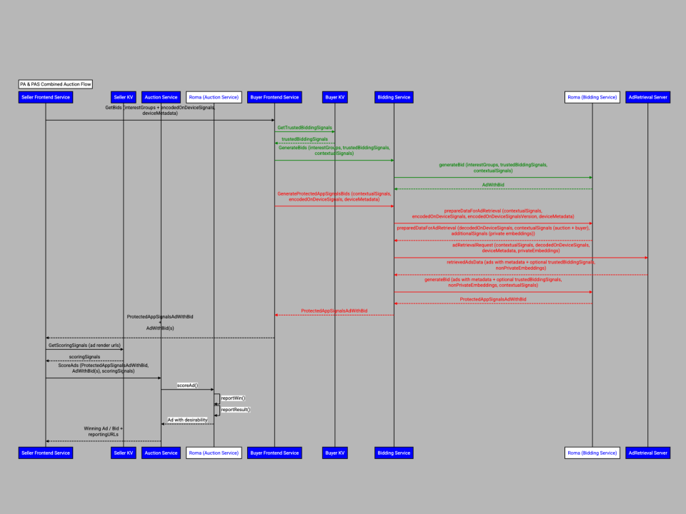

# Bidding and Auction Services: Protected App Signals

**Authors:** <br>
[Salman Malik][1], Google Privacy Sandbox <br>
[Priyanka Chatterjee][2], Google Privacy Sandbox <br>
Trenton Starkey,  Google Privacy Sandbox <br>

## Overview

This document explains [Bidding and Auction Services](https://github.com/privacysandbox/protected-auction-services-docs/blob/main/bidding_auction_services_system_design.md#overview) (B&A) design for ad targeting with [Protected App Signals](https://developer.android.com/design-for-safety/privacy-sandbox/protected-app-signals).

The [Bidding and Auction Services](https://github.com/privacysandbox/fledge-docs/blob/main/bidding_auction_services_api.md) (B&A) allows **Protected Auctions** to take place in [trusted execution environment](https://github.com/privacysandbox/fledge-docs/blob/main/trusted_services_overview.md#trusted-execution-environment) (TEE) based servers on a [supported cloud platform](https://github.com/privacysandbox/fledge-docs/blob/main/bidding_auction_services_api.md#supported-public-cloud-platforms). Protected Auction refers to ad selection and scoring of bids in TEE based services for ad targeting. Protected Auction includes support for Protected Audience and Protected App Signals data flows.

Protected App Signals data is curated on Android devices, refer [here](https://developer.android.com/design-for-safety/privacy-sandbox/protected-app-signals#curate-protected) for more information. To conduct a Protected Auction utilizing Protected App Signals, seller SDKs collect encrypted Protected Auction data using the [getAdSelectionData](https://developer.android.com/design-for-safety/privacy-sandbox/protected-audience-bidding-and-auction-services#run-auction) API. Encrypted `ProtectedAuctionInput` [[1](https://github.com/privacysandbox/bidding-auction-servers/blob/06bf6ed1bd98916d1a9b6887518936655b4d537b/api/bidding_auction_servers.proto#L448-L449), [2](https://github.com/privacysandbox/bidding-auction-servers/blob/06bf6ed1bd98916d1a9b6887518936655b4d537b/api/bidding_auction_servers.proto#L53-L58)] comprises Protected App Signals. The whole payload, including the Protected App Signals data, is encrypted on the device and can only be decrypted within the TEE. It is important to note that the encrypted `ProtectedAuctionInput` (ciphertext) may also encompass `ProtectedAudience` data.

Seller's SDK will send the payload and other first party ad request data to their own ad server, which then sends a [SelectAdRequest](https://github.com/privacysandbox/bidding-auction-servers/blob/b222e359f09de60f0994090f7a57aa796e927345/api/bidding_auction_servers.proto#L300-L304) to B&A and includes the encrypted payload and the auction configuration. Upon receiving the [SelectAdRequest](https://github.com/privacysandbox/bidding-auction-servers/blob/b222e359f09de60f0994090f7a57aa796e927345/api/bidding_auction_servers.proto#L300-L304), B&A framework will facilitate ad selection for the participating buyers. During ad selection, buyer custom logic (UDFs / user defined functions) will do [ad retrieval][3] and compute bids using Protected App Signals and other published provided data. The ad and bid from the buyer will then be sent to the seller for final scoring and for the seller to select a winner.  Note that Protected App Signals and Protected Audience data flows will run in parallel but independent to select ads and compute bids. Then the seller would get bids for ads using Protected App Signals and Protected Audience flows that will be scored together to decide on a winning ad. The winning ad will be encrypted and then decrypted on the device with the results being returned to the caller for rending.


### B&A Self-Serve Guide

Refer to B&A's [self-serve guide](https://github.com/privacysandbox/protected-auction-services-docs/blob/main/bidding_auction_services_onboarding_self_serve_guide.md) for more information about onboarding to B&A services, specifications for adtechs, server infrastructure, scaling and performance tuning recommendations.


## Design

B&A supports two mutually exclusive modes for Protected App Signals Ad
Selection:

1. Ad selection from ads that are retrieved from a TEE based Ad Retrieval
  Service.
1. Ad selection from ads passed via the contextual path (RTB response) to SFE.

### Auction With TEE Retrieved Ads

Following is an overview of Protected App Signals architecture with B&A with
Top-K Ads retrieved via a TEE based Ad Retrieval Service.

<figure id = "image-1">
  
  <figcaption><b>Figure 1.</b>Protected App Signals Architecture (with retrieval service) </figcaption>
</figure><br><br>


Following is the flow:

1.  <em>[Android client]</em>
    *   Using Android's privacy preserving ad-relevance APIs (PPAPI), Android client collects  Protected App Signals relevant to the user. Refer [here](https://developer.android.com/design-for-safety/privacy-sandbox/protected-app-signals#curate-protected) for more information.
    *   Seller's Android SDK calls PPAPI to get `ProtectedAuctionInput` ciphertext data including the [encoded](https://developer.android.com/design-for-safety/privacy-sandbox/protected-app-signals#on-device-encoding) representation of the Protected App Signals.
        * _Note: The payload is compressed, encrypted and padded, refer [here](https://github.com/privacysandbox/protected-auction-services-docs/blob/main/bidding_auction_services_api.md#client--seller-ad-service-communication) for more information about client &lt;> server communication._
    *   Seller's Android SDK sends an ad request to the seller's ad service that includes ProtectedAudienceInput ciphertext.
        * _Note: Seller's SDK may also send device metadata along with the request, like device's geo information, language and user-agent._

2. <em>[Seller's ad service]</em>
    * Seller's ad service may run an auction similar to today's contextual auction. At this point, the contextual signals are also made available.
    * Seller's ad service sends [SelectAdRequest](https://github.com/privacysandbox/bidding-auction-servers/blob/b222e359f09de60f0994090f7a57aa796e927345/api/bidding_auction_servers.proto#L304) to [SellerFrontend (SFE) service](https://github.com/privacysandbox/protected-auction-services-docs/blob/main/bidding_auction_services_api.md#sellerfrontend-service) that includes `ProtectedAuctionInput` ciphertext, <code>[AuctionConfig](https://github.com/privacysandbox/bidding-auction-servers/blob/b222e359f09de60f0994090f7a57aa796e927345/api/bidding_auction_servers.proto#L305)</code> and [type of client](https://github.com/privacysandbox/bidding-auction-servers/blob/b222e359f09de60f0994090f7a57aa796e927345/api/bidding_auction_servers.proto#L191). Seller's ad service can forward the device metadata to SFE if available, refer [here](https://github.com/privacysandbox/protected-auction-services-docs/blob/main/bidding_auction_services_api.md#metadata-forwarding) for more information about metadata forwarding.

3. <em>[SellerFrontEnd (SFE) service]</em>
    * Upon receiving a [SelectAdRequest](https://github.com/privacysandbox/bidding-auction-servers/blob/b222e359f09de60f0994090f7a57aa796e927345/api/bidding_auction_servers.proto#L304) from the [seller's ad service](https://github.com/privacysandbox/protected-auction-services-docs/blob/main/bidding_auction_services_api.md#sellers-ad-service), [SFE](https://github.com/privacysandbox/protected-auction-services-docs/blob/main/bidding_auction_services_api.md#sellerfrontend-service) decrypts and decompresses ProtectedAuctionInput ciphertext that includes Protected App Signals data. SelectAdRequest payload also includes seller's [AuctionConfig](https://github.com/privacysandbox/bidding-auction-servers/blob/b222e359f09de60f0994090f7a57aa796e927345/api/bidding_auction_servers.proto#L305).
   * SFE parses the buyer list from <code>buyer_list</code>[[3](https://github.com/privacysandbox/bidding-auction-servers/blob/06bf6ed1bd98916d1a9b6887518936655b4d537b/api/bidding_auction_servers.proto#L326-L329)] provided by the seller in <code>[AuctionConfig](https://github.com/privacysandbox/bidding-auction-servers/blob/b222e359f09de60f0994090f7a57aa796e927345/api/bidding_auction_servers.proto#L305)</code> and checks for intersection with the buyer domains configured on the server as part of the <code>BUYER_SERVER_HOSTS</code> config [[4](https://github.com/privacysandbox/bidding-auction-servers/blob/06bf6ed1bd98916d1a9b6887518936655b4d537b/production/deploy/gcp/terraform/environment/demo/seller/seller.tf#L62)].
   * SFE sends <code>GetBidsRequest</code>[[5](https://github.com/privacysandbox/bidding-auction-servers/blob/06bf6ed1bd98916d1a9b6887518936655b4d537b/api/bidding_auction_servers.proto#L493-L495C9)] to the Buyer Frontend (BFE) service of each buyer to collect ads / bids from the shortlisted buyers.
   * GetBidsRequest includes buyer inputs for Protected App Signals and Protected Audience, buyer signals (contextual signals) and other required data.
     * If [device metadata](https://github.com/privacysandbox/protected-auction-services-docs/blob/main/bidding_auction_services_api.md#metadata-forwarding) is available, SFE would also [add the metadata in GetBids gRPC request](https://github.com/privacysandbox/protected-auction-services-docs/blob/main/bidding_auction_services_api.md#metadata-forwarded-by-sellerfrontend-service) to BFE.

4. <em>[BuyerFrontEnd (BFE) service]</em>
   * Each buyer’s BFE checks for the presence of <code>ProtectedAppSignalsBuyerInput</code>[[6](https://github.com/privacysandbox/bidding-auction-servers/blob/06bf6ed1bd98916d1a9b6887518936655b4d537b/api/bidding_auction_servers.proto#L541-L542)] in GetBidsRequest. If present, BFE will send a <code>GenerateProtectedAppSignalsBidsRequest</code>[[7](https://github.com/privacysandbox/bidding-auction-servers/blob/06bf6ed1bd98916d1a9b6887518936655b4d537b/api/bidding_auction_servers.proto#L771-L772)] to the bidding service. <code>GenerateProtectedAppSignalsBidsRequest </code>includes buyer inputs, buyer (contextual) signals and other required data.
   * _Note: If buyer input for ProtectedAudience is present in <code>GetBidsRequest</code>, then bid generation [flow](https://github.com/privacysandbox/protected-auction-services-docs/blob/main/bidding_auction_services_api.md#flow) for Protected Audience is executed in parallel._

5. <em>[Bidding service] </em>
Bidding Service performs the following in sequence to retrieve a Protected App Signals ad and corresponding bid:

    * Prepares the data required for retrieving ads from buyer’s Ad Retrieval service. This is achieved by calling into buyer provided <code>prepareDataForAdRetrieval</code> [UDF](#preparedataforadretrieval-udf).
    * Calls buyer's [Ad Retrieval service][3] to fetch top k-ads and associated metadata (optionally including trusted bidding signals).
The ad retrieval request payload includes data from the previous step as well as buyer signals required for bidding and [device metadata](https://github.com/privacysandbox/protected-auction-services-docs/blob/main/bidding_auction_services_api.md#metadata-forwarding) if available.
        * _Note: Device metadata is passed in as part of the request payload to ad retrieval service._
    * Feeds the ads and metadata to the buyer provided <code>generateBid</code> [UDF](#generatebid-udf) to get a single Protected App Signals ad with bid.
    * Returns this ad and corresponding bid to BFE.

7. <em>[BFE]</em>
    * BFE handles <code>GenerateProtectedAppSignalsBidsResponse </code>and  returns the ad and bid to the seller’s SFE service.
      If Protected Audience ads are also participating in the auction then BFE waits for bids for both Protected Audience and Protected App Signals
      ads before returning all the ads and bids to SFE.

8. <em>[SFE]</em>
    * SFE waits for all the buyer bids, collects scoring signals from seller’s KV service for all the render URLs in the bids received from BFEs
      and sends these ads and bids along with the scoring signals to the auction service.

10. <em>[Auction service]</em>
    * Auction [service](#auction-service) scores all the ads / bids and chooses a winner.
      * _Note:_
        * _Both Protected Audience and Protected App Signals bids are scored in this single auction._
        * _Each bid is scored in isolation._
    * Seller and buyer's reporting urls and registered beacons are also generated in the auction service once a winning ad / bid is selected. Refer [here](https://github.com/privacysandbox/protected-auction-services-docs/blob/main/bidding_auction_event_level_reporting.md) for more information.
    * Auction service returns information about  winning ad / bid and reporting urls back  to SFE.

9. <em>[SFE]</em>
    * SFE sends back the encrypted <code>[AuctionResult](https://github.com/privacysandbox/bidding-auction-servers/blob/b222e359f09de60f0994090f7a57aa796e927345/api/bidding_auction_servers.proto#L208)</code> in <code>SelectAdResponse</code> to the seller's ad service.
This response can contain a winner or can contain a chaff (e.g. if no buyers ended up participating in the auction or if no buyers generated a bid for candidate ads).

10. <em>[Seller's ad service]</em>
    * Seller's ad service includes the <code>[AuctionResult](https://github.com/privacysandbox/bidding-auction-servers/blob/b222e359f09de60f0994090f7a57aa796e927345/api/bidding_auction_servers.proto#L208)</code> ciphertext in ad response to the client.
This payload is decrypted by the seller on the device.

12. <em>[Android client]</em>
    * The encrypted response is decrypted. If there is no chaff ad is rendered on the app.
    * Adtech's reporting endpoints are pinged from the client.

### Auction With Contextual Ads

Following is an overview of Protected App Signals architecture with B&A with
contextual ads participating in the auction.

<figure id = "image-2">
  
  <figcaption><b>Figure 2.</b>Protected App Signals Architecture Diagram (with KV service) </figcaption>
</figure><br><br>

Following is the flow:


1. <em>[Android client]</em>
    * Using Android's privacy preserving ad-relevance APIs (PPAPI), Android client collects  Protected App Signals payload Refer  [to the signal curation explainer](https://developer.android.com/design-for-safety/privacy-sandbox/protected-app-signals#curate-protected) for more information.
    * Seller's Android SDK calls PPAPI to get `ProtectedAuctionInput` ciphertext data including the [encoded](https://developer.android.com/design-for-safety/privacy-sandbox/protected-app-signals#on-device-encoding) representation of the Protected App Signals.
        *   Note: The payload is compressed, encrypted and padded, refer [to the B&A explainer](https://github.com/privacysandbox/protected-auction-services-docs/blob/main/bidding_auction_services_api.md#client--seller-ad-service-communication) for more information about client &lt;> server communication.
    * Seller's Android SDK sends an ad request to the seller's ad service that includes `ProtectedAudienceInput` ciphertext.
        *   _Note: Seller's SDK may also send 1p data, device metadata and contextual signals._
2. <em>[Seller's ad service]</em>
    * Seller's ad service may run an auction similar to today's contextual auction. At this point, the contextual signals are also made available. Seller Ad Service also returns [contextual ad render ids](https://github.com/privacysandbox/bidding-auction-servers/blob/64cf212087572e4f0c1eac56083e49489d85e06a/api/bidding_auction_servers.proto#L472), as part of [PerBuyerConfig](https://github.com/privacysandbox/bidding-auction-servers/blob/64cf212087572e4f0c1eac56083e49489d85e06a/api/bidding_auction_servers.proto#L418), that should participate in the Protected App Signals auction.
    * Seller's ad service sends [SelectAdRequest](https://github.com/privacysandbox/bidding-auction-servers/blob/b222e359f09de60f0994090f7a57aa796e927345/api/bidding_auction_servers.proto#L304) to [SellerFrontend (SFE) service ](https://github.com/privacysandbox/protected-auction-services-docs/blob/main/bidding_auction_services_api.md#sellerfrontend-service)that includes `ProtectedAuctionInput` ciphertext, <code>[AuctionConfig](https://github.com/privacysandbox/bidding-auction-servers/blob/b222e359f09de60f0994090f7a57aa796e927345/api/bidding_auction_servers.proto#L305)</code> and[ type of client](https://github.com/privacysandbox/bidding-auction-servers/blob/b222e359f09de60f0994090f7a57aa796e927345/api/bidding_auction_servers.proto#L191). Seller's ad service can forward the device metadata to SFE if available, refer [here](https://github.com/privacysandbox/protected-auction-services-docs/blob/main/bidding_auction_services_api.md#metadata-forwarding) for more information about metadata forwarding.
3. <em>[SellerFrontEnd (SFE) service]</em>
    * Upon receiving a [SelectAdRequest](https://github.com/privacysandbox/bidding-auction-servers/blob/b222e359f09de60f0994090f7a57aa796e927345/api/bidding_auction_servers.proto#L304) from the[ seller's ad service](https://github.com/privacysandbox/protected-auction-services-docs/blob/main/bidding_auction_services_api.md#sellers-ad-service), [SFE](https://github.com/privacysandbox/protected-auction-services-docs/blob/main/bidding_auction_services_api.md#sellerfrontend-service) decrypts and decompresses <code>ProtectedAuctionInput</code> ciphertext that includes Protected App Signals data. <code>SelectAdRequest</code> payload also includes seller's [AuctionConfig](https://github.com/privacysandbox/bidding-auction-servers/blob/b222e359f09de60f0994090f7a57aa796e927345/api/bidding_auction_servers.proto#L305).
    * Then SFE parses the buyer list from <code>buyer_list</code>[[3](https://github.com/privacysandbox/bidding-auction-servers/blob/06bf6ed1bd98916d1a9b6887518936655b4d537b/api/bidding_auction_servers.proto#L326-L329)] provided by the seller in <code>[AuctionConfig](https://github.com/privacysandbox/bidding-auction-servers/blob/b222e359f09de60f0994090f7a57aa796e927345/api/bidding_auction_servers.proto#L305)</code> and checks for intersection with the buyer domains configured on the server as part of the <code>BUYER_SERVER_HOSTS</code> config [[4](https://github.com/privacysandbox/bidding-auction-servers/blob/06bf6ed1bd98916d1a9b6887518936655b4d537b/production/deploy/gcp/terraform/environment/demo/seller/seller.tf#L62)].
    * SFE sends <code>GetBidsRequest</code>[[5](https://github.com/privacysandbox/bidding-auction-servers/blob/06bf6ed1bd98916d1a9b6887518936655b4d537b/api/bidding_auction_servers.proto#L493-L495C9)] to the Buyer Frontend (BFE) service of each buyer to collect ads / bids from the shortlisted buyers.
    * <code>GetBidsRequest</code> includes buyer inputs for Protected App Signals and Protected Audience, buyer signals (contextual signals) and other required data. If [device metadata](https://github.com/privacysandbox/protected-auction-services-docs/blob/main/bidding_auction_services_api.md#metadata-forwarding) is available, SFE would also[ add the metadata in GetBids gRPC request](https://github.com/privacysandbox/protected-auction-services-docs/blob/main/bidding_auction_services_api.md#metadata-forwarded-by-sellerfrontend-service) to BFE.
4. <em>[BuyerFrontEnd (BFE) service]</em>
    * Each buyer’s BFE checks for the presence of <code>ProtectedAppSignalsBuyerInput</code>[[6](https://github.com/privacysandbox/bidding-auction-servers/blob/06bf6ed1bd98916d1a9b6887518936655b4d537b/api/bidding_auction_servers.proto#L541-L542)] in <code>GetBidsRequest</code>. If present, BFE will send a <code>GenerateProtectedAppSignalsBidsRequest</code>[[7](https://github.com/privacysandbox/bidding-auction-servers/blob/06bf6ed1bd98916d1a9b6887518936655b4d537b/api/bidding_auction_servers.proto#L771-L772)] to the bidding service. <code>GenerateProtectedAppSignalsBidsRequest</code> includes buyer inputs (which [includes](https://github.com/privacysandbox/bidding-auction-servers/blob/64cf212087572e4f0c1eac56083e49489d85e06a/api/bidding_auction_servers.proto#L612) contextual ad render ids), buyer (contextual) signals and other required data.
        * <em>Note: If buyer input for <code>ProtectedAudience</code> is present in <code>GetBidsRequest</code>, then bid generation [flow](https://github.com/privacysandbox/protected-auction-services-docs/blob/main/bidding_auction_services_api.md#flow) for Protected Audience is executed in parallel.</em>
5. <em>[Bidding service]</em>
    * Bidding service calls into a TEE based Key-Value service to fetch real time signals.
    * These real time signals are then fed to the buyer provided <code>generateBid</code> [UDF](#generatebid-udf) to get a single Protected App Signals ad with bid which is then returned to BFE.
6. <em>[Buyer Frontend (BFE) Service]</em>
    * BFE handles <code>GenerateProtectedAppSignalsBidsResponse</code> and  returns the ad and bid to the seller’s SFE service. If Protected Audience ads are also participating in the auction then BFE waits for bids for both Protected Audience and Protected App Signals ads before returning all the ads and bids to SFE.
7. <em>[Seller Frontend (SFE) Service]</em> SFE waits for all the buyer bids, collects scoring signals from seller’s KV service for all the render URLs in the bids received from BFEs and sends these ads and bids along with the scoring signals to the auction service.
8. <em>[Auction service]</em>
    * Auction service [scores](#auction-service) all the ads / bids and chooses a winner.
        *   <em>Note: Both Protected Audience and Protected App Signals bids are scored in this single auction.</em>
    * Each bid is scored in isolation.
    * Seller and buyer's reporting urls and registered beacons  are also generated in the auction service once a winning ad / bid is selected. Refer [here](https://github.com/privacysandbox/protected-auction-services-docs/blob/main/bidding_auction_event_level_reporting.md) for more information.
    * Auction service returns information about  winning ad / bid and reporting urls back  to SFE.
9. <em>[Seller Frontend (SFE) Service]</em>
    * SFE sends back the encrypted [AuctionResult](https://github.com/privacysandbox/bidding-auction-servers/blob/b222e359f09de60f0994090f7a57aa796e927345/api/bidding_auction_servers.proto#L208) in <code>SelectAdResponse</code> to the Seller's Ad Service. This response can contain a winner or can contain a chaff (e.g. if no buyers ended up participating in the auction or if no buyers generated a bid for candidate ads).
10. Seller's ad service includes the [AuctionResult](https://github.com/privacysandbox/bidding-auction-servers/blob/b222e359f09de60f0994090f7a57aa796e927345/api/bidding_auction_servers.proto#L208) ciphertext in ad response to the client. This payload is decrypted by the seller on the device.
11. The ad is rendered and then adtech's reporting endpoints are pinged from the client.


### API Updates

The following sections provide the detailed design of the Protected App Signals flow with Bidding and Auction services.


#### [Android API](https://developer.android.com/design-for-safety/privacy-sandbox/protected-app-signals#curate-protected)

To support Protected App Signals, the seller's SDK on Android will send ad requests to the seller's ad service, where the request payload would include additional data in encrypted <code>[ProtectedAuctionInput](https://github.com/privacysandbox/bidding-auction-servers/blob/b222e359f09de60f0994090f7a57aa796e927345/api/bidding_auction_servers.proto#L53-L58) </code>(which is a [new](#new-protectedauctioninput-message) message type). The Protected App Signals are treated as an opaque byte string by B&A. Refer [here](https://developer.android.com/design-for-safety/privacy-sandbox/protected-app-signals#curate-protected) for more details about Protected App Signals curation.


#### Bidding and Auction services API

Following sections go over the updates to the B&A API required to support Protected App Signals ad targeting.


##### SelectAd API  Updates

###### [New]` ProtectedAuctionInput` Message

B&A supports  `ProtectedAudienceInput` proto message to get the encrypted protected audience data in `SelectAdRequest`. This` ProtectedAudienceInput `message has now been deprecated.

```protobuf
message ProtectedAudienceInput {
  option deprecated = true;

  // ...
}
```

With Protected App Signals ad targeting use-case, we generalize the `ProtectedAudienceInput` message by introducing `ProtectedAuctionInput`.

ProtectedAuctionInput message will be a superset that includes Protected App Signals as well as the Protected Audience data sent from the  device.  Android will migrate to support `ProtectedAuctionInput `from` ProtectedAudienceInput`. Seller's ad service must depend on the `ProtectedAuctionInput `message going forward.

```protobuf
// ProtectedAuctionInput is generated and encrypted by the client,
// passed through the untrusted Seller service, and decrypted by the
// SellerFrontEnd service.
// It is the wrapper for all of BuyerInput and other information required
// for the Protected Audience auction.
message ProtectedAuctionInput {
  // Input per buyer.
  // The key in the map corresponds to IGOwner (Interest Group Owner) that
  // is the Buyer / DSP. This  string that can identify a
  // buyer participating in the auction. The value corresponds to plaintext
  // BuyerInput ingested by the buyer for bidding.
  map<string, bytes> buyer_input = 1;

  // Publisher website or app.
  // This is required to construct browser signals for web.
  // It will also be passed via GetBids to buyers for their Buyer KV lookup
  // to fetch trusted bidding signals.
  string publisher_name = 2;

  // A boolean value which indicates if event level debug reporting should be
  // enabled or disabled for this request.
  bool enable_debug_reporting = 3;

  // Globally unique identifier for the client request.
  string generation_id = 4;

  // Consented debugging field.
  ConsentedDebugConfiguration consented_debug_config = 5;
}
```

###### [New] `ProtectedAppSignals` Message

A new proto message `ProtectedAppSignals` is added to `BuyerInput.BuyerInput `for each buyer is sent in encrypted [ProtectedAuctionInput](https://github.com/privacysandbox/bidding-auction-servers/blob/06bf6ed1bd98916d1a9b6887518936655b4d537b/api/bidding_auction_servers.proto#L64) from Android.` `There is an entry in `buyer_input` map for each buyer ad-tech with Protected App Signal data (and / or Protected Audience data) who wants to participate in a Protected Auction.

```protobuf
// Grouping of data pertaining to app install ad selection flow.
message ProtectedAppSignals {
  // Signals from device that can help generate a relevant app
  // install ad for user.
  bytes app_install_signals = 1;

  // Version of the encoding used for the Protected App Signals.
  int32 encoding_version = 2;
}

// A BuyerInput includes data that a buyer (DSP) requires to generate bids.
message BuyerInput {
  // InterestGroup (a.k.a CustomAudience) information passed from the client.
  message InterestGroup {
  // ...
  // ...
  }
  // The Interest Groups (a.k.a Custom Audiences) owned by the buyer.
  repeated InterestGroup interest_groups = 1;

  // Signals from device that can help generate a relevant app install ad for
  // users.
  ProtectedAppSignals protected_app_signals = 2;
}
```

###### [New] `ContextualProtectedAppSignalsData` Message

A new proto message is introduced in [AuctionConfig](https://github.com/privacysandbox/bidding-auction-servers/blob/64cf212087572e4f0c1eac56083e49489d85e06a/api/bidding_auction_servers.proto#L387) > [PerBuyerConfig](https://github.com/privacysandbox/bidding-auction-servers/blob/64cf212087572e4f0c1eac56083e49489d85e06a/api/bidding_auction_servers.proto#L418) to enable buyer RTB servers to specify the contextual ad render ids that should participate in the Protected App Signals auction. The new message definition is as follows:

```protobuf
// Protected App Signals ad related data that Buyer adtechs can send via
// contextual path to control which PAS ads participate in the auction.
message ContextualProtectedAppSignalsData {
  // Optional.
  // Raw Ad ids that can be used to lookup signals from the KV server.
  repeated string ad_render_ids = 1;

  // Optional.
  // Bool indicating whether ads should also be fetched from ads retrieval
  // service.
  //
  // If true, the Bidding server will send an Ad fetch request to the
  // Ad retrieval service and the request will contain the list of ad_render_ids
  // as an additional parameter.
  //
  // If false, the ad_render_ids will be sent to the TEE K/V server to fetch
  // the ads related metadata.
  bool fetch_ads_from_retrieval_service = 2;
}
```

##### Code Version Information

UDF (user defined functions) for bidding, scoring and reporting developed by adtechs can be fetched from adtech hosted endpoints or cloud storage endpoints. Refer [here](https://github.com/privacysandbox/protected-auction-services-docs/blob/main/bidding_auction_services_system_design.md#code-blob-fetch-and-code-version) for more information.

B&A plans to support multiple versions of UDF for bidding, scoring and reporting. With UDF multi versioning support, multiple versions of UDF will be prefetched off the critical path in Bidding and Auction service at service startup and periodically thereafter; refer [here](https://github.com/privacysandbox/protected-auction-services-docs/blob/main/bidding_auction_services_system_design.md#code-version-flow) for more information.

To facilitate A/B experimentation of `UDF `logic, B&A API provides support for adtechs to specify the version of `UDF` they would like to use per ad selection request.

_NOTE: Currently, only B&A API supports multiple code versions for bidding and scoring. However, the full support for multi code versioning in B&A (including that for reporting) to facilitate adtech's A/B experimentation will be available later._


###### `generateBid` Code Version

B&A's Protected App Signals support requires buyer ad-techs to provide a [new generateBid UDF](#generatebid-udf).


*   <em>Note: This UDF is different from that of [Protected Audience](https://github.com/privacysandbox/protected-auction-services-docs/blob/main/bidding_auction_services_api.md#generatebid).</em>

Since ad techs may need to A/B test their `generateBid` logic, we provide API support for adtechs to specify what version of `generateBid` they would like to use per auction request in [SelectAdRequest.AuctionConfig.PerBuyerConfig](https://github.com/privacysandbox/bidding-auction-servers/blob/b222e359f09de60f0994090f7a57aa796e927345/api/bidding_auction_servers.proto#L336)


```protobuf
    // Per buyer configuration.
    message PerBuyerConfig {
    // ... Existing Fields here ...

      // Optional.
      // Version of buyer's GenerateBid() code for Protected App Signals.
      // The string must be an object name belonging to the
      // Cloud Storage bucket specified at Bidding service startup.
      // A buyer can pass this information to the Seller in RTB response.
      // If a version is not specified, the default version
      // (specified in the service startup config) will be used.
      string protected_signals_generate_bid_code_version = 5;

      // Optional.
      // Version of buyer's GenerateAdRetrievalUserMetadata() code for
      // Protected App Signals.
      // The string must be an object name belonging to the
      // Cloud Storage bucket specified at Bidding service startup.
      // A buyer can pass this information to the Seller in RTB response.
      // If a version is not specified, the default version
      // (specified in the service startup config) will be used.
      string protected_signals_generate_embeddings_version = 6;
    }
```

###### `scoreAd` Code Version

B&A also provides a [field](https://github.com/privacysandbox/bidding-auction-servers/blob/b222e359f09de60f0994090f7a57aa796e927345/api/bidding_auction_servers.proto#L408) in the [AuctionConfig](https://github.com/privacysandbox/bidding-auction-servers/blob/b222e359f09de60f0994090f7a57aa796e927345/api/bidding_auction_servers.proto#L305) for seller’s to control the code version for score ads as well:

```protobuf
    message SellerCodeExperimentSpecification {
      // The Id is specified by the seller to support coordinated experiments
      // with the seller's Key/Value services.
      int32 seller_kv_experiment_group_id = 1;

      // The code version of the score ad module provided by the seller.
      // The string must be an object name belonging to the
      // Cloud Storage bucket specified at Auction service startup.
      // If a version is not specified, the default version
      // (specified in the service startup config) will be used.
      string score_ad_version = 2;
    }
```

#### Buyer Frontend API Updates


##### `GetBidsRawRequest` API updates

To solicit bids from buyer ad techs, SFE sends a `GetBidsRequest` to each buyer’s BFE.

Similar to `SelectAdRequest`,` GetBidsRequest` also includes `BuyerInput` where `ProtectedAppSignals` _can_ be embedded. Protected App Signals are passed in the `protected_app_signals_buyer_input` field in `GetBidsRequest`.

This field will be populated only for Android clients to solicit Protected App Signals ad / bids but not for any other type of targeting. The change is shown below:

```protobuf
// Protected App Signals input per buyer.
message ProtectedAppSignalsBuyerInput {
  ProtectedAppSignals protected_app_signals = 1;

  // Contextual data related to PAS ads.
  ContextualProtectedAppSignalsData contextual_protected_app_signals_data = 2;

}


// Unencrypted request.
message GetBidsRawRequest {
  // ... Existing fields ...

  // Protected App Signals buyer input.
  ProtectedAppSignalsBuyerInput protected_app_signals_buyer_input = 10;
}
```


##### `GetBidsResponse` API updates

BFE will wait for both Protected Audience ads with bids as well as Protected App Signals ad bid and return a result with both types of bids back to SFE. To support this, the response message is augmented with Protected App Signals bid as shown below:


```protobuf
// Response to GetBidsRequest.
message GetBidsResponse {
  // Unencrypted response.
  message GetBidsRawResponse {
    // Includes ad_render_url and corresponding bid value pairs for each IG.
    // Represents a JSON object.
    repeated AdWithBid bids = 1;

    // Includes ad_render_url and corresponding bid value pairs for app install
    // ads. Represents a JSON object.
    repeated ProtectedAppSignalsAdWithBid app_install_bids = 2;
  }

  // Encrypted GetBidsRawResponse.
  bytes response_ciphertext = 1;
}
```

#### Bidding Service API updates


##### A new RPC Endpoint

A new API for bidding service is exposed to generate bids for Protected App Signals ads.

```protobuf
// Bidding service operated by buyer.
service Bidding {
  // Generate bids for ads in Custom Audiences (a.k.a InterestGroups) and
  // filters ads.
  rpc GenerateBids(GenerateBidsRequest) returns (GenerateBidsResponse) {...}

  // Generate bids for app install ads.
  rpc GenerateProtectedAppSignalsBids(GenerateProtectedAppSignalsBidsRequest) returns (GenerateProtectedAppSignalsBidsResponse) {
    option (google.api.http) = {
      post: "/v1/generateappinstallbids"
      body: "*"
    };
  }
}
```

##### `GenerateProtectedAppSignalsBidsRequest` Message

Following new message will be added to be used as an input to the newly added RPC call above:

```protobuf
// Generate bids for all app install ads.
message GenerateProtectedAppSignalsBidsRequest {
  // Unencrypted request.
  message GenerateProtectedAppSignalsBidsRawRequest {
    /********************* Common inputs for bidding ***********************/
    // Information about auction (ad format, size) derived contextually.
    // Represents a JSON object. Copied from Auction Config in SellerFrontEnd
    // service.
    // Represents a serialized string that is deserialized to a JSON object
    // before passing to Adtech script.
    string auction_signals = 1;

    // Buyer may provide additional contextual information that
    // could help in generating bids. Not fetched real-time.
    // Represents a serialized string that is deserialized to a JSON object
    // before passing to Adtech script.
    //
    // Note: This is passed in encrypted BuyerInput, i.e.
    // buyer_input_ciphertext field in GetBidsRequest. The BuyerInput is
    // encrypted in the client and decrypted in `BuyerFrontEnd` Service.
    // Note: This is passed in BuyerInput.
    string buyer_signals = 2;


    // Signals used to generate features needed to generate ads for app
    // install.
    ProtectedAppSignals protected_app_signals = 3;

    // Seller origin.
    // Sent to generateBid script in device signals.
    string seller = 4;

    // Publisher app that is part of Buyer KV lookup url.
    // Sent to generateBid script in device signals.
    string publisher_name = 5;

    // Helpful context for logging and tracing the request.
    LogContext log_context = 6;

    // Consented debugging field.
    server_common.ConsentedDebugConfiguration consented_debug_config = 7;

    // A boolean value which indicates if event level debug reporting should be
    // enabled or disabled for this request.
    bool enable_debug_reporting = 8;

    // Contextual data regarding PAS ads.
    ContextualProtectedAppSignalsData contextual_protected_app_signals_data = 9;
  }

  // Encrypted GenerateProtectedAppSignalsBidsRawRequest.
  bytes request_ciphertext = 1;

  // Version of the public key used for request encryption. The service
  // needs use private keys corresponding to same key_id to decrypt
  // 'request_ciphertext'.
  string key_id = 2;
}
```

##### New `ProtectedAppSignalsAdWithBid` Message

This new message would include a bid for Protected App Signal ad. This is built in the Bidding server and returned to BFE in `GenerateProtectedAppSignalsBidsResponse` (see [here](#generateprotectedappsignalsbidsresponse-message)).

```protobuf
// Bid for an app install ad candidate.
message ProtectedAppSignalsAdWithBid {
  // Metadata of the ad, this will be passed to Seller's scoring function.
  // Represents a serialized string that is deserialized to a JSON object
  // before passing to Adtech script.
  google.protobuf.Value ad = 1;

  // Bid price corresponding to an ad.
  float bid = 2;

  // Ad render url that identifies an ad creative.
  string render = 3;

  // A numerical value used to pass reporting advertiser click or conversion
  // cost from generateBid to reportWin. The precision of this number is
  // limited to an 8-bit mantissa and 8-bit exponent, with any rounding
  // performed stochastically.
  double ad_cost = 4;

  // A 12 bit integer signal used as input to win reporting url generation for
  // the Buyer.
  int32 modeling_signals = 5;

  // Indicates the currency used for the bid price.
  string bid_currency = 6;

  reserved 7;

  // Optional field for debug report URLs.
  DebugReportUrls debug_report_urls = 8;

  // Holds schema version as well as features related information that needs
  // to be send back to the buyer who has the winning bid.
  string egress_payload = 9;

  // Temporary unlimited size egress features. Meant for experimentation only.
  string temporary_unlimited_egress_payload = 10;
}
```

Since B&A release 3.4.1, PAS support in B&A provides buyers _temporary_ egress data for training the models used during ad selection. More details about egress data can be found [here](https://developers.google.com/privacy-sandbox/relevance/protected-audience/android/protected-app-signals#reporting) and [here](https://github.com/privacysandbox/protected-auction-services-docs/blob/main/bidding_auction_services_protected_app_signals_egress.md).


##### `GenerateProtectedAppSignalsBidsResponse` Message

This will be the output of the new RPC:

```protobuf
// Encrypted response to GenerateProtectedAppSignalsBidsRequest with bid prices
// corresponding to all eligible app install Ad creatives.
message GenerateProtectedAppSignalsBidsResponse {
  // Unencrypted response.
  message GenerateProtectedAppSignalsBidsRawResponse {
    // Bids corresponding to ads.
    repeated ProtectedAppSignalsAdWithBid bids = 1;
  }

  // Encrypted GenerateProtectedAppSignalsBidsRawResponse.
  bytes response_ciphertext = 1;
}
```

For the definition of `ProtectedAppSignalsAdWithBid message` please refer back to [this](#new-protectedappsignalsadwithbid-message) section.


### Protected Audience & Protected App Signals Combined Auction Flow

The following sequence diagram shows the Protected Audience and Protected App Signals ad selection as part of a single auction. Note that the BFE branches out the bid generation flow for Protected Audience and Protected App Signals). BFE waits for both types of bids before returning an aggregated response with all the ads + bids to SFE. SFE then forwards these bids from buyer for scoring to the Auction service (after SFE has fetched the scoring signals from KV) to conduct an auction and choose a single winning ad with bid.


<figure id = "image-2">
  
  <figcaption><b>Figure 2.</b>Protected App Signals Sequence Diagram</figcaption>
</figure><br><br>

**Legend:**

Red: Protected App Signals Flow

Green: Protected Audience Flow


## Buyer B&A Services


### Buyer Frontend (BFE) Service

BFE is the frontend service for bidding in the buyer stack. It inspects the buyer input provided by the SFE and decides whether or not to solicit a bid for Protected App Signals from the bidding service. If Protected Audience is also present in the incoming buyer input then BFE will also solicit Protected Audience related bids from the Bidding service and return ads and corresponding bids for both types of ad back to SFE.


#### Configuration

Buyer ad techs need to ensure the following while bringing up a buyer stack:


*   Protected App Signals support is enabled (via a [flag](https://github.com/privacysandbox/bidding-auction-servers/blob/b222e359f09de60f0994090f7a57aa796e927345/production/deploy/gcp/terraform/environment/demo/buyer/buyer.tf#L64)) in the stack.
*   An Ad Retrieval Service endpoint is deployed and reachable by the bidding service.
*   A `prepareDataForAdRetrieval` UDF is hosted on an endpoint by the buyer adtech and should be  reachable by the bidding service.
    *   Note: `prepareDataForAdRetrieval `UDF can be fetched from the` prepareDataForAdRetrievalCodeUrl `key in Terraform config.
*   A buyer bidding UDF (`generateBid`) for Protected App Signals is hosted on an endpoint and is reachable by the bidding service.
*   `reportWin` UDF is hosted on an endpoint and is reachable by auction service (in the seller stack).

Next section provides details about how the bidding service uses the app signals and generates an ad with bid for participation in an auction conducted by the seller ad tech.


### Bidding Service

Bidding service is at the heart of the bidding process for Protected App Signals. Bidding service: 1) decodes signals into a useful form (to buyer adtechs) via buyer provided UDF, 2) retrieves relevant ads, and 3) generates a bid for the most relevant ad.

These three distinct stages in the bidding process are summarized below (for an overview refer to this [doc](https://developer.android.com/design-for-safety/privacy-sandbox/protected-app-signals#buy-side-ad)):


#### `prepareDataForAdRetrieval` UDF

This is a buyer ad tech provided UDF and is aimed at preparing all the data needed to get relevant ads from the ads retrieval service. (**Note**: This UDF is only used in the TEE Ad Retrieval flow and bypassed in the contextual flow).  This UDF is expected to:

1. Decode the incoming encoded signals.
2. Retrieve any embeddings that may be required in the (next) retrieval stage. This step optionally may involve a call to an [inference service](https://github.com/privacysandbox/protected-auction-services-docs/blob/main/inference_overview.md) to fetch embeddings from a ML model.

Signature of this UDF is as follows:

```javascript
/**
 * Inputs
 * ------
 * 1. `encodedOnDeviceSignals` is a Uint8Array and would contain
 *    the encoded app signals emanating from device.
 * 2. `encodedOnDeviceSignalsVersion` is an integer that helps the buyer
 *    ad techs to decide which version of decoding logic to use.
 * 3. `sellerAuctionSignals` has the auction related information (See here).
 * 4. `contextualSignals` flow from the RTB path (and can potentially carry
 *     contextual embeddings needed for making a prediction during bid
 *     generation). More details are here.
 *
 * Output
 * ------
 * Returns a JSON object. The exact contents are controlled by the adtech
 * (e.g. it can contain the decoded signals and embeddings required for
 * retrieval).
 */
function prepareDataForAdRetrieval(encodedOnDeviceSignals,
                                   encodedOnDeviceSignalsVersion,
                                   sellerAuctionSignals,
                                   perBuyerSignals) {
   return {};  // A JSON struct useful for ad retrieval and bidding.
}
```

Note: that the data returned by this UDF is fed to both the ad retrieval service as well as the `generateBid` UDF in the pipeline.


#### Fetching Ads from Ad Retrieval Service

The [Ads Retrieval service][3] is invoked by the bidding service to retrieve the top-k ads which have the highest chance of conversion. This service needs to provide an endpoint that supports a `PUT` HTTP verb.


##### Input Format

The input data required for fetching the ads is passed in the `partitions > arguments` block. Bidding service sends the following information in a sequence in the body of the `PUT` request to the ad retrieval service in order to get relevant ads:


*   Data retrieved from the `prepareDataForAdRetrieval` UDF (which can include the decoded app signals and embeddings required for retrieval).
*   Device metadata (including information about the client IP, user agent and language etc.). This data can help the ad retrieval service filter the relevant ads e.g. different ads may be suitable based on the user's geolocation.
*   Contextual signals flowing retrieved via the buyer’s own RTB server (these can among other things include embeddings based on the contextual data that can be helpful for making a final prediction during bidding)

```json
{
   "partitions" : [
      {
         "arguments" : [
            {
               "data" : "{\"key1\": \"1\", \"key2\": \"2\"}"
            },
            {
               "data" : {
                  "X-Accept-Language" : "en-US,en;q=0.9",
                  "X-BnA-Client-IP" : "1.2.3.4",
                  "X-User-Agent" : "Mozilla/5.0 (Linux; Android 15; SM-G960U) Mobile MyAmazingApp/1.2.3 (com.example.myapp; in-app-ad; SDK/1.0)"
               }
            },
            {
               "data" : "{\"key3\": \"3\"}"
            }
         ]
      }
   ]
}
```


##### Output Format

Output from the ad retrieval service should contain a JSON object in the following format:

```json
{"singlePartition":{"stringOutput": "arbitrary text string"}}
```

Adtechs can choose to embed any information regarding in the retrieved Protected App Signals ads as value of the `singlePartition` > `stringOutput` key as long as that information is meaningful to the adtech’s `generateBid` script since this data will be ingested by the ad tech provided `generateBid` UDF. The returned data here can contain e.g. ads and ads metadata (including ads embeddings that can be used in `generateBid` to make a final prediction).


#### `generateBid` UDF

Once all ads (and associated data) are retrieved from the ads retrieval service, bidding service relays this data to the ad tech provided `generateBid` UDF. The signature of this method is as follows:

```javascript
/*
 * Inputs
 * -----
 * 1. `ads` Contains the data returned by the ad retrieval service or KV
 *    lookup. This data includes ad metadata and optionally
 *    trustedBiddingSignals as well.
 * 2. `sellerAuctionSignals` has the auction related information (See here).
 * 3. `buyerSignals` flow from the RTB path (and can potentially carry
 *    contextual embeddings needed for making a prediction during bid
 *    generation). More details are here.
 * 4. `preprocessedDataForRetrieval`: This is the data returned by 
 *    `prepareDataForAdsRetrieval` UDF. Note: This will only be populated for
 *    the retrieval flow.
 * 5. `encodedOnDeviceSignals` is a Uint8Array and would contain
 *    the encoded app signals emanating from device.
 * 6. `encodedOnDeviceSignalsVersion` is an integer that helps the buyer
 *    ad techs to decide which version of decoding logic to use.
 *
 * Output
 * ------
 * Returns a JSON equivalent to this proto message.
 * Note: Only one bid is returned among all the input Protected App Signals
 * ads.
 */
function generateBid(ads, sellerAuctionSignals, perBuyerSignals, 
                     preparedDataForAdRetrieval, encodedOnDeviceSignals,
                     encodedOnDeviceSignalsVersion) {
return { "ad": <ad Value>,
         "bid": <float here>,
         "render": <render url string here>,
         "adCost": <float here>};
}
```

#### `reportWin` UDF

When the buyer adtech wins an auction, the seller uses this buyer-provided UDF to create reporting URLs and to register ad beacons. Note that both buyer and seller reporting URLs are generated in the auction service once scoring has been completed. More details about event level reporting can be found in this [explainer](https://github.com/privacysandbox/protected-auction-services-docs/blob/main/bidding_auction_event_level_reporting.md).

This UDF will have the following signature:

```javascript
function reportWin(auctionSignals, perBuyerSignals, signalsForWinner, 
                   buyerReportingSignals, egressPayload, 
                   temporaryUnlimitedEgressPayload) {
  // ...
}
```

Details about all the arguments (except `egressPayload*`) can be found [here](https://github.com/privacysandbox/protected-auction-services-docs/blob/main/bidding_auction_services_api.md#reportwin). Egress arguments are meant to help buyers egress data (_temporarily_ unlimited) for training their models that are used during ad selection. Refer [here](https://github.com/privacysandbox/protected-auction-services-docs/blob/main/bidding_auction_services_protected_app_signals_egress.md) for more details about the expected egress data format.

## Seller B&A Services


### Seller Frontend (SFE) Service

As mentioned in the [overview section](#overview), SFE determines which buyers can participate in the auction and fetches bids from these buyers. Once the bids are fetched from all the buyers, SFE calls Auction service to decide on the winning ad and generate reporting urls.  The winning ad and reporting urls are returned back to the client in encrypted [AuctionResult](https://github.com/privacysandbox/bidding-auction-servers/blob/b222e359f09de60f0994090f7a57aa796e927345/api/bidding_auction_servers.proto#L208) in [SelectAdResponse](https://github.com/privacysandbox/bidding-auction-servers/blob/b222e359f09de60f0994090f7a57aa796e927345/api/bidding_auction_servers.proto#L457).


#### Configuration

Buyer ad techs need to ensure the following while bringing up a buyer stack Protected App Signals support is enabled (via [this](https://github.com/privacysandbox/bidding-auction-servers/blob/b222e359f09de60f0994090f7a57aa796e927345/production/deploy/gcp/terraform/environment/demo/seller/seller.tf#L66) flag) in the stack.


*   `reportWin` UDF endpoint provided by the buyers is utilized in the terraform module to help generate the reports for buyers winning the auction.


### Auction Service

Auction service is responsible for choosing a winning bid amongst all buyers participating in Protected Auction and the ad types. This service scores bid for each ad using the seller adtech provided logic as detailed below:


#### `scoreAd` UDF

The seller adtech provided scoreAd [UDF](https://github.com/privacysandbox/protected-auction-services-docs/blob/main/bidding_auction_services_api.md#scoread) is used by the auction service to generate a desirability score for each ad. Once every ad is scored by this UDF, the auction service chooses the winner Ad with the highest positive desirability score. The scoring logic is agnostic of the type of ad being scored, therefore the winning ad can either be a Protected App Signals Ad or a Protected Audience ad.


#### `reportResult` UDF

When a bid is chosen as a winner, seller adtech provided reportResult [UDF](https://github.com/privacysandbox/protected-auction-services-docs/blob/main/bidding_auction_services_api.md#reportresult) is invoked to generate signals for winner ad tech. This data is then fed to the buyer provided Protected App Signals specific reportWin [UDF](#reportwin-udf) to generate the reporting URLs. The reporting urls are pinged from the device after the ad is rendered (and or upon user interaction).


[1]: https://github.com/salmanmlk
[2]: https://github.com/chatterjee-priyanka
[3]: https://github.com/privacysandbox/protected-auction-key-value-service/blob/main/docs/protected_app_signals/ad_retrieval_overview.md
