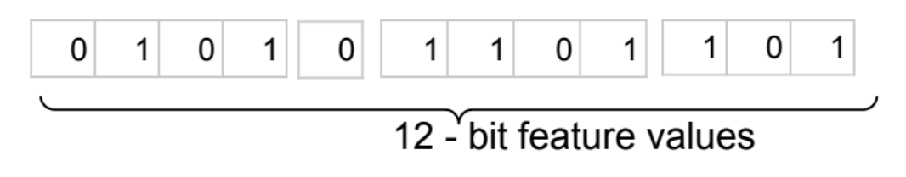
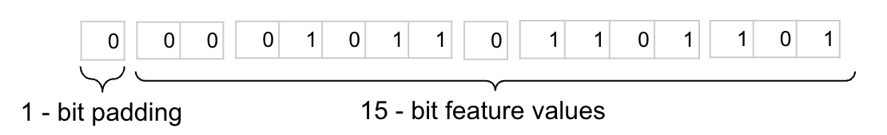
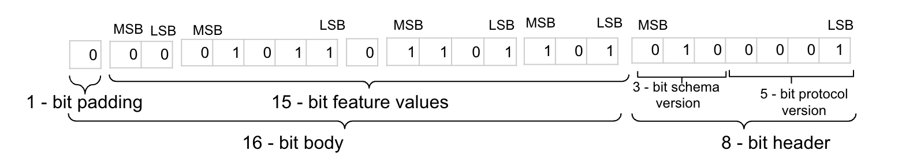
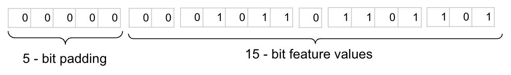

**Author:**  
[Rashmi Rao](https://github.com/rashmijrao), [John Cox](https://github.com/johncox-google), [Salman Malik](https://github.com/salmanmlk), Google Privacy Sandbox

# Protected App Signals egress in Bidding and Auction Services

Protected App Signals provides ad-techs a way to egress data from inside the privacy boundary to their own servers for model training. See the [Protected App Signals Explainer](https://developers.google.com/privacy-sandbox/relevance/protected-audience/android/protected-app-signals), particularly the [Reporting](https://developers.google.com/privacy-sandbox/relevance/protected-audience/android/protected-app-signals#reporting) section, for background. Refer design for Protected App Signals with B&A [here](https://github.com/privacysandbox/protected-auction-services-docs/blob/main/bidding_auction_services_protected_app_signals.md).

This document describes the following:

1. The set of feature types available to egress information to adtech servers for model training for Protected App Signals.

2. The wire format of each feature.

3. The wire format of the `egressPayload` itself.

The wire representation of the `egressPayload` will be noised per feature type. More details will be provided in a future explainer update.

Based on the information in this document, adtechs can write parsers to prepare the `egressPayload` and transform the values it contains into features for use in their model training systems. 

# Feature types

We support two kinds of feature types: primitives, which can contain a single feature value; and collections, which can contain multiple primitives.

## Primitive types

These types represent single values: booleans, unsigned integers, and signed integers

### `boolean-feature-type`

This represents a single boolean value

Expected value: `true` or `false`

**Wire format**

0 (`false`) or 1 (`true`)

### `unsigned-integer-feature-type`

This represents a single non-negative integer value.

Parameters:

*   `size`: unsigned integer indicating the number of bits based on the range of values.

Expected value:  non-negative integer value in the range [0,2^size-1]

For example, if `size `= `3` `unsigned-integer-feature-type` can have a value : ` [0, 7] `and will occupy 3 bits on the wire.

**Wire format**

Binary representation of the unsigned integer. The integer will be converted to wire format following little endian byte order.

Example: If `value` = `5` and `size `= `3`, wire format will be `101`

### `signed-integer-feature-type`

This type can be used to represent a single positive or negative integer value. 

Parameters:

*   `size`: unsigned integer indicating the number of bits based on the range of values.

Expected value:  integer value in the range [-2^(size-1),2^(size-1)-1]

For example, if `size` = `4`, `signed-integer-feature-type` can have a value `[-8, 7]`, and will occupy 4 bits on the wire.

**Wire format**

2’s complement representation of the signed integer. The integer will be converted to wire format following little endian byte order.

Example: If `value` = `-3` and `size`=`4`, wire format will be `1101`

## Collection types

These feature types represent a collection of homogeneous or heterogeneous values.

The wire representation of the values will be in the right-to-left order.

### `bucket-feature-type`

This type can be used to represent an ordered list of `boolean-feature-type` values.

Expected values: list of boolean (`true` or `false`) values

**Parameters**

*   <code>allow-multiple<strong>: </strong></code>indicates whether the bucket can contain multiple <code>true</code> values.
*   <code>size<strong>: </strong></code>number of values in the bucket.

<strong>Wire format</strong>

Sequential bit representation of `boolean-feature-type` values.

For example, if `size` = `4`, `bucket-feature-type` can have values which are of the type `boolean-feature-type`. If the `boolean-feature-type` values are [`true`, `false`, `true`, `false`] this will occupy `4` bits on the wire. Wire format will be `0101`

### `histogram-feature-type`

This type can be used to represent an ordered, heterogeneous list of `unsigned-integer-feature-type` and `signed-integer-feature-type` values. 

**Parameters**

*   `size`: unsigned integer indicating the number of fixed size values in the histogram.

Expected values: list of `unsigned-integer-feature-type` and `signed-integer-feature-type` values

**Wire format**

Wire format of each contained value, right-to-left. For example, if the histogram contains `2` elements, the first of which is an unsigned 3-bit integer with the value `5`, and the second is a signed `4`-bit integer with the value `-3`, then the wire format would be `1101101. `The wire representation of the values will be in the right-to-left order.

# Payload wire format

The definition of the wire format of a payload is called its _protocol_. Below we describe the first wire format, or protocol version `1`.  The protocol version included in the payload will be set by the platform.

A payload is made up of two parts: a **header** containing metadata information used for serialization and deserialization; and a **body** containing serialized feature values.

## Header

The header itself has two parts: 

1. **Protocol version**: unsigned `5`-bit int indicating the version of the wire format specification used to encode the payload.

2. **Schema version**: unsigned `3`-bit int. Version identifier for the schema that defines the payload.

The wire format of the header is the protocol version, then the schema version, right-to-left. For example, if the protocol version is `1` (`00001` on the wire)  and the schema version is `2` (`010` on the wire), the header will be `01000001`.

## Body

The body contains serialized feature values, with values as defined in each feature type above. The order of the features is the same as their order in the provided schema for the payload, right-to-left.

The body is `0`-padded. Details of the padding are slightly different for `egressPayload` and `temporaryUnlimitedEgressPayload`:

1. `egressPayload` is first `0`-padded to its maximum size in bits, then `0`-padded to the nearest byte.
2. `temporaryUnlimitedEgressPayload` is `0`-padded to the nearest byte.

## Example 

*   Protocol version : `1` 
*   Example schema version : `2` 
*   Example max wire size for `egressPayload`: `20` bits

Consider this example schema, feature values and corresponding wire format for each feature type specified the schema:

<table>
  <tr>
   <td colspan="2"><strong>Feature type</strong>

<strong>(Defined in the schema)</strong>
   </td>
   <td><strong>Feature type in collection</strong>

<strong>(Defined in the schema)</strong>
   </td>
   <td><strong>Parameters </strong>

<strong>(Defined in the schema)</strong>
   </td>
   <td><strong>Corresponding value in Json</strong>
   </td>
   <td><strong>Wire representation</strong>
   </td>
  </tr>
  <tr>
   <td rowspan="2" colspan="2"><code>histogram-feature-type</code> with <code>size</code> = <code>2</code>
   </td>
   <td><code>unsigned-int-feature-type</code>
   </td>
   <td><code>size</code> = <code>3</code>
   </td>
   <td><code>5</code>
   </td>
   <td><code>101</code>
   </td>
  </tr>
  <tr>
   <td><code>signed-int-feature-type</code>
   </td>
   <td><code>size</code> = <code>4</code>
   </td>
   <td><code>-3</code>
   </td>
   <td><code>1101</code>
   </td>
  </tr>
  <tr>
   <td colspan="2"><code>boolean-feature-type</code>
   </td>
   <td>
   </td>
   <td>
   </td>
   <td><code>false</code>
   </td>
   <td><code>0</code>
   </td>
  </tr>
  <tr>
   <td colspan="2"><code>bucket-feature-type</code> 
   </td>
   <td><code>boolean-feature-type</code>
   </td>
   <td><code>size</code> = <code>4</code>, <code>allow-multiple</code> = <code>true</code>
   </td>
   <td><code>[true, false, true, false]</code>
   </td>
   <td><code>0101</code>
   </td>
  </tr>
</table>

Wire format of the feature values would be: 

#### Wire format for <code>temporaryUnlimitedEgressPayload</code>:</strong>

Wire format of the feature values + padding would be: 

Wire format of the feature values + padding + header would be:

#### Wire format for <code>egressPayload</code>:</strong>

Wire format of the feature values + padding would be: 

Wire format of the feature values + padding + header would be:

