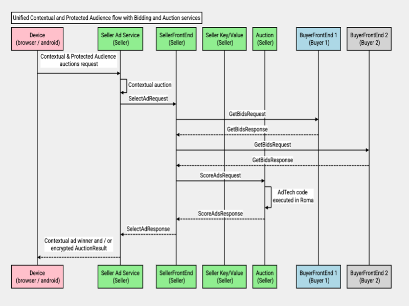
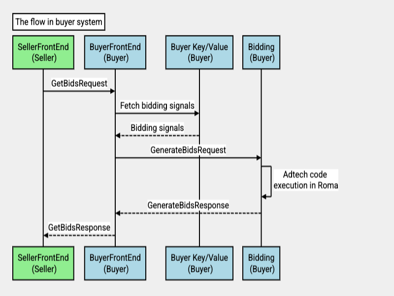
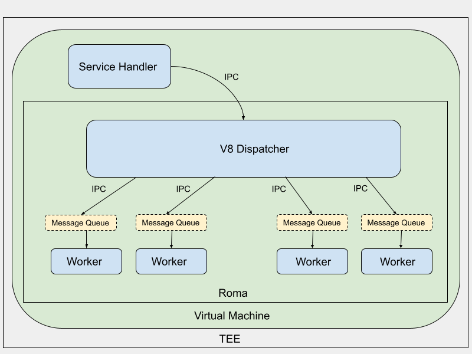
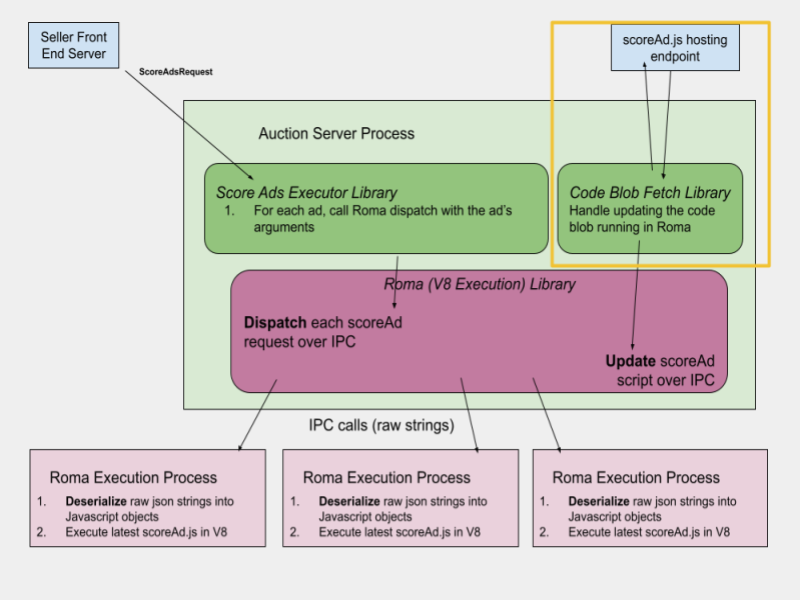
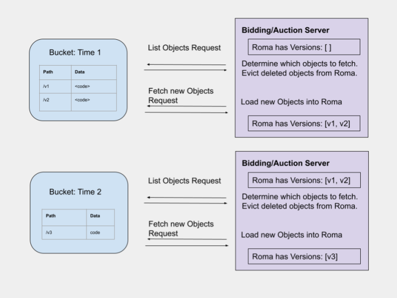

> FLEDGE has been renamed to Protected Audience API. To learn more about the name change, see the [blog post](https://privacysandbox.com/intl/en_us/news/protected-audience-api-our-new-name-for-fledge)

**Authors:**  
[Priyanka Chatterjee][1], Google Privacy Sandbox  
[Daniel Kocoj][2], Google Privacy Sandbox 
[Alek Kundla][3], Google Privacy Sandbox

# Bidding and Auction Services System Design
The [Bidding and Auction Services][4] (B&A) outlines a way to allow Protected
Audience auctions to take place in [trusted execution environment][5] (TEE) based
servers on a [supported cloud platform][6]. 

This explainer describes the system design of Bidding and Auction services.
For [high level design][7], [Adtech specs][8], [API][9], refer to this [explainer][4]. 

_Note:_ 
  * Refer [here][10] for Chrome client side design explainer for Bidding and Auction
    services integration.
  * Refer [here][50] for Android's client side design explainer for Bidding and Auction services
    integration. 

## Overview 

Seller's code in the publisher web page (in browser) or publisher app
(in android) sends a unified contextual and Protected Audience auction HTTPS
request to the seller's ad service. The request includes contextual payload and 
encrypted [_Protected Audience data_][11]. Seller's ad service sends Real Time Bidding
(RTB) requests to buyers for contextual bids, and conducts a contextual auction.
Then the seller ad service sends a request to TEE based [SellerFrontEnd service][12]
that includes encrypted _Protected Audience data_, contextual signals and other
data. Protected Audience bidding and auction kicks off in [Bidding and Auction
services][4]. The SellerFrontEnd service decrypts encrypted _Protected Audience data_
using decryption keys prefetched from [Key Management System][13]. Then SellerFrontEnd
service orchestrates bidding requests in parallel to buyers participating in the
auction. Within each buyer system, TEE based [BuyerFrontEnd service][14] looks up
real-time bidding signals from [buyer's key/value service][16] and calls TEE based
[Bidding service][15] for bidding. Buyers would need to return bids within a timeout
set by the seller. After bids are received from buyers, SellerFrontEnd service
looks up real-time scoring signals from [seller's key/value service][17] and calls
TEE based [Auction service][18] for scoring the bids. SellerFrontEnd returns an
encrypted auction result to the seller ad service. Seller ad service sends the
encrypted auction result back to the client.

Bidding and Auction services are based on the gRPC framework. The server code is
developed in C++ and configurations are based on [Terraform][19]. The server code and
configurations will be open sourced by Google Privacy Sandbox.

Bidding and Auction services also allows execution of Adtech owned code for
generating bids, scoring ads, generating reporting urls. The hosting environment
would protect the confidentiality of the Adtech code and contextual signals (if
the execution happens only in the cloud).

The communication between services in the [Bidding and Auction system][4] is
protected by TLS / SSL and additionally, request-response payloads are encrypted
by [Hybrid Public Key Encryption][20] (HPKE). Also, request/response payload sent over
the wire will be compressed by gzip.

## Design

### Sell-side platform (SSP) system
Following services will be operated by an SSP, also referred to as a seller.

#### Seller's ad service
The seller's ad service is the existing stack of the seller that facilitates
real-time bidding auctions. 

The seller's ad service will receive a unified contextual and Protected Audience
auctions HTTPS request from the client for selecting an ad. The request would
include contextual request payload and encrypted [_Protected Audience data_][11]
from the client. The encrypted _Protected Audience data_ includes Interest
Group (Custom Audience) and other information on the user's device required for
bidding. 

* Seller's code in the publisher web page or publisher app calls the client
  (browser or android) to get the encrypted _Protected Audience data_.
  
* Seller's code sends a HTTPS request to the seller's ad service that includes
  contextual and encrypted _Protected Audience data_ (unified request).

  * The encrypted data is uploaded in the body of the HTTPS request and [device
    metadata][21] is added to the HTTP request header. 

  * The seller's ad service will not be able to decrypt encrypted _Protected
    Audience data_.
  
  * _Note: There will be 7 size buckets for Protected Audience data, with
    the minimum size being very small. This would ensure that the request
    payload size does not leak enough bits with iterative requests. This would
    mitigate re-identification of the user._

* Seller's ad service conducts contextual auction.

  * Seller sends real time bidding (RTB) requests to partner buyers. Buyers
    respond with bids for contextual auction and may express demand to participate
    in Protected Audience auction by returning _buyer_signals_ in RTB response.
    
  * Based on different factors, seller can determine if there is incremental
    value in Protected Audience auctions. If there is value, seller's ad service
    calls Bidding and Auction services.
   
* Seller's ad service calls Bidding and Auction services for Protected Audience
  auction after conducting contextual auction, only if there is for demand for
  Protected Audience auction.
  
  * The encrypted _Protected Audience data_ is passed in the request along with
    other required data.

  * Seller's ad service can send HTTP(S) requests or gRPC requests; HTTPS
    requests would be translated to gRPC using [proxy service][22] configured in front
    of SellerFrontEnd service. 

* The response from seller ad service would include a contextual ad winner
  and / or encrypted [Protected Audience response][23].
  
  * If Bidding and Auction services is called by seller ad service, an encrypted
    Protected Audience response will always be returned.

* The seller code in the publisher web page or app returns the encrypted
  Protected Audience response to the client (browser or android). 

  * Only the client (browser or android) will be able to decrypt the Protected
    Audience response.

_Note: The size of Protected Audience data must be small to optimize latency
 and reduce network cost for Adtechs. We will publish a separate explainer for
 the payload optimization guide for DSPs._
 
 #### SellerFrontEnd service
 
 The front-end service of the system that runs in the [TEE][5] on a supported cloud
 platform. The service is based on the gRPC framework and provides a gRPC endpoint
 ["SelectAd"][24] that receives requests from the seller's ad service to initiate
 Protected Audience auction flow. 
 
 * SellerFrontEnd server instance loads configured data in memory at server startup.
   This includes the following, for more details refer [here][25]:
   * Domain address of other services that SellerFrontEnd depends on. 
     * This includes address of BuyerFrontEnd services of partner buyers, address of
       seller key/value service, address of Auction service and address of key hosting
       services in key management systems.
       
   * Seller's origin (domain address).
   
   * Global timeout of buyer.
   
   * Map of buyer origin to BuyerFrontEnd domain address for all buyers that the seller
     has partnered with. 
     
 * At server startup, the gRPC or HTTP connections to other services (BuyerFrontEnd
   services of partner buyers, Auction service, seller's key/value service, cryptographic
   key hosting services) are prewarmed.
  
 * Seller's ad service would send a _SelectAd_ request to TEE based SellerFrontEnd service. 
   * The request payload includes encrypted [_Protected Audience data_][11]; and other data passed
     by the seller as follows:
     * [AuctionConfig][24]
       * _seller_signals_ : This can include the contextual bid used to filter Protected
         Audience bids during scoring.
       * _auction_signals_
       * _per_buyer_config_ map : Map of buyer domain to per buyer information like
         _per_buyer_signals_, _per_buyer_timeout_ and other optional information.
       * _buyer_list_ : List of buyers participating in the auction. This includes the
         domain address of the buyers, also known as buyer origin or InterestGroupOwner.
         * Note: This may be a subset of the buyer domains in _per_buyer_config_ map.
       * _seller_ origin

   * The communication between seller's ad service and SellerFrontEnd over the untrusted
     network is protected by TLS / SSL. The TLS / SSL session will terminate at the load
     balancer in front of SellerFrontEnd service.
     
 * SellerFrontEnd service decrypts encrypted Protected Audience data. This data includes
   BuyerInput for the buyers whose protected audience data is available on the user's
   device. 
   
 * SellerFrontEnd validates that the seller's origin in service configuration is the same
   as that passed by the seller's ad service in the SelectAd request. Otherwise,
   SellerFrontEnd returns an error response to the seller's ad service.
   
 * SellerFrontEnd orchestrates GetBids requests in parallel to buyers participating in the
   auction for bidding.
   * SellerFrontEnd will not send the requests to all buyers the seller partnered with,
     i.e. the information configured in service configuration.
     
   * The requests will be sent to only those buyers in buyer_list whose corresponding
     BuyerInput is available in Protected Audience data.
     
   * After bids are generated, buyers return GetBids response to SellerFrontEnd. The
     GetBids response includes AdWithBid objects corresponding to each bid. AdWithBid
     object includes ad_render_url or ad_component_render_url corresponding to the bid.
     
 * SellerFrontEnd looks up real-time scoring signals required for the auction from the
   seller's key/value service.
   * All ad render urls and ad component render urls are batched for scoring signals
     lookup.
     
   * The urls are encoded in SellerFrontEnd before scoring signals lookup.
   
 * SellerFrontEnd sends a [ScoreAds][26] request to the Auction service to score ads and
   select a winner. The request payload includes ads with bids, scoring signals,
   contextual signals and other information required for the auction.
   * Auction service returns a Protected Audience winner to SellerFrontEnd. 
   
   * When ads are scored, the contextual bid may filter all Protected Audience bids.
     In this case, the Auction service doesn't return a Protected Audience winner to
     SellerFrontEnd.
     
 * SellerFrontEnd returns an encrypted AuctionResult in SelectAd response to seller's
   ad service.
   * If there is no Protected Audience winner, that would be indicated with is_chaff
     field set to true in AuctionResult. Even in this case, an encrypted AuctionResult
     that is padded with fake data will be returned to the seller's ad service.
     
   * The size of fake / padded [AuctionResult][23] would be in the order of real
     AuctionResult size. This would ensure that the size of the response doesn't leak
     any information to the seller.
     
 ##### Throttling in SellerFrontEnd
 The [_ProtectedAudienceInput_][11] in [SelectAd][24] request would include a generation_id
 that the client (browser / android) will generate based on [UUID][27] (Universal Unique Identifier).
 SellerFrontEnd will cache the generation_id distributedly. Seller's ad service will
 receive an error from SellerFrontEnd if repeated / replayed SelectAd requests are sent
 that include the same generation_id in ProtectedAudienceInput.     
 
 ##### Fake requests / Chaffs to DSP
 To prevent the seller from determining the buyers on the user's device by observing
 network traffic outside the TEE with the help of cloud / network logs, SellerFrontEnd
 service sends fake requests (chaff) to "m" buyers not participating in the auction.
 The set of "m" buyers are randomly selected from the list of partner buyers of the
 seller configured in SellerFrontEnd server configuration, except the buyers receiving
 real requests. The number "m" itself will be variable so that buyers on the user's
 device (or buyers receiving real requests) are not leaked with iterative requests.
 Additionally, "m" will be small (less than 5) so that buyer servers are not overwhelmed
 with fake traffic. 
 
 To prevent the seller from filtering buyers receiving chaff by observing response time
 outside the TEE with the help of cloud / network logs, the response time from
 BuyerFrontEnd to SellerFrontEnd would add random jitter. To prevent the seller from
 filtering buyers receiving chaff by observing response packet size outside the TEE
 with the help of cloud / network logs, the response payload will be padded. 
 
 #### Auction service
 The Auction service runs in the TEE on a supported cloud platform. The service is
 based on the gRPC framework and provides a gRPC endpoint [ScoreAds][26], that receives
 requests from SellerFrontEnd service to initiate the auction. This service responds
 to requests from the SellerFrontEnd service and has limited outbound access over the
 public network.
 
 Auction service allows seller owned code to execute in a custom code execution engine
 within the TEE. The custom code execution engine is based on V8 sandbox and has
 tighter security restrictions; the sandbox can not log information and doesn't have
 disk or network access.
 
 * Auction server instances load configured data in memory at server startup. This
   includes the endpoint from where adtech code modules are prefetched and address
   of key hosting services in key management systems; for more details [refer here][28].
   
 * Server instances prefetch [code blobs][29] owned by sellers from a cloud storage instance
   at server startup and periodically. The code modules are cached in memory by the
   custom code execution sandbox. Refer to the [Adtech code execution][30] section for more
   details. 
   * During [B&A Alpha testing][31], code blobs will be prefetched at startup and periodically
     from an arbitrary endpoint that is configured in the Auction service configuration. 
    
 * SellerFrontEnd service sends ScoreAds request Auction service for scoring ads and
   generating reporting urls. The request payload includes bids from buyers, contextual
   signals, scoring signals and other required data.
   
 * For privacy, Auction service deserializes and splits scoring signals (for all
   ads / bids) such that ScoreAd() can only ingest scoring signals required to score the
   ad.
   
 * Auction service dispatches the request to a custom code execution engine with all
   inputs required for adtech code execution. 
   * Within the sandbox, adtech's ScoreAd() code is executed within a separate worker
     thread for scoring an ad. However, execution within worker threads can happen in
     parallel. Refer to the [Adtech code execution][30] section for more details.
     
  #### Seller's key/value service
  A seller's service receives requests from the [SellerFrontEnd service][12] with lookup keys
  available in buyers' bids (such as ad_render_urls or ad_component_render_urls), and
  returns real-time scoring signals required for auction.
  
  _Note: The seller's key/value system may be BYOS key/value Service or TEE based key/value
  service depending on the timeline._
  
  
  
  ### Demand-side platform (DSP) system
  Following services will be operated by an DSP, also referred to as a buyer.

  #### BuyerFrontEnd service
  The front-end service of the system that runs in the [TEE][5] on a supported cloud platform.
  The service is based on the gRPC framework and provides a gRPC endpoint [GetBids][32] that
  receives requests from SellerFrontEnd service (or partner seller) to initiate bidding flow. 
  
  * BuyerFrontEnd server instance loads configured data in memory at server startup. This
    includes the following, for more details [refer here][33]:
    * Domain address of other services that BuyerFrontEnd depends on. This includes address
      of buyer's key/value service, address of Bidding service and address of key hosting
      services in [Key Management System][13].
      
  * At server startup, the gRPC or HTTP connections to other services (Bidding service,
    buyer's key/value service, cryptographic key hosting services) are prewarmed.
    
  * The BuyerFrontEnd service receives GetBids request from SellerFrontEnd service of
    partner seller.
    
  * The BuyerFrontEnd service decrypts GetBids request using decryption keys prefetched
    from Key Management System.
    
  * The BuyerFrontEnd service fetches real-time bidding signals from the buyer's key/value
    service; this is required for generating bids. The bidding_signal_keys in different
    interest groups are batched for the lookup. 
    * The bidding signal response from key/value service is split by bidding_signal_keys
      in interest groups.
      
  * The BuyerFrontEnd service sends a GenerateBids request to the Bidding service. The
    Bidding service returns ad candidates with bid(s) for each interest group.
    
  * The BuyerFrontEnd returns all bids ([AdWithBid][35]) to SellerFrontEnd service.

  #### Bidding service
  The Bidding service runs in the TEE on a supported cloud platform. The service is based on
  the gRPC framework and provides an endpoint [GenerateBids][34], that receives requests from
  BuyerFrontEnd service to initiate the bidding flow. This service responds to requests
  from the BuyerFrontEnd service and has limited outbound access over the public network. 
  
  Bidding service allows buyer owned code to execute in a custom code execution engine
  within the TEE. The custom code execution engine is based on V8 sandbox and has tighter
  security restrictions; the sandbox can not log information and doesn't have disk or
  network access. Refer to the [Adtech code execution Engine][30] section for more details. 

  * Bidding server instances load configured data in memory at server startup. This includes
    the endpoint from where adtech code modules are prefetched and address of key hosting
    services in key management systems; for more details [refer here][36].
    
  * Server instances prefetch [code blobs][29] owned by buyers from a cloud storage instance at
    server startup and periodically. The code modules are cached in memory by the custom
    code execution sandbox. Refer to the [Adtech code execution][30] section for more
    details.
    * During [B&A Alpha testing][31], code blobs will be prefetched at startup and periodically
      from an arbitrary endpoint that is configured in the Bidding service configuration. 
      
  * BuyerFrontEnd service sends GenerateBids request to Bidding service for generating bids.
    The request payload includes interest groups, per buyer signals, real time bidding
    signals and other required data.
    
  * For privacy, Bidding service deserializes and splits bidding signals such that
    GenerateBid() can only ingest bidding signals required to generate bid(s) per Interest
    Group.
    
  * Within the Bidding service, a request is dispatched to a custom code execution engine / sandbox
    with all inputs required for adtech code execution. 
    * Within the sandbox, adtech's GenerateBid() code is executed within a separate worker
      thread for generating bids for an Interest Group. The execution within worker threads
      can happen in parallel. Refer to the [Adtech code execution][30] section for more details.

  #### Buyer’s key/value Service
  A buyer's Key/Value service receives requests from the [BuyerFrontEnd service][14] and returns
  real-time buyer data required for bidding, corresponding to lookup keys.
  
  _Note: The buyer’s key/value system may be BYOS key/value Service or TEE based key/value
  service depending on timeline._

  
 
  ## Cryptographic protocol & key fetching
  The cryptographic protocol is bidirectional [Hybrid Public Key Encryption][13](HPKE). In this
  mechanism, public key and private key pairs are versioned. The private keys have sufficiently
  longer validity than public keys for the same version. Public keys are fetched from public
  key hosting service and private keys are fetched from private key hosting services in [Key
  Management Systems][20]. Each private key is split and fetched from two private key hosting
  endpoints in the Key Management Systems, where each system is operated by a [Coordinator][37].
  Refer [here][38] for more details.
  
  ### Key fetching in client 
  Client (browser, android) periodically fetches a set of public keys from the public key
  hosting service in Key Management Systems every 7 days and are cached client-side with a
  fixed TTL in order of days. New versions of public keys are prefetched before the expiration
  time of the previous set of keys. 
  
  ### Key fetching in server
  Server instances running in TEE prefetch all valid private keys from the Key Management
  Systems at service startup and periodically in the non critical path. The private keys are
  cached in-memory and have a caching TTL in order of hours; therefore these keys are refreshed
  periodically every few hours. This ensures if any private key is compromised for some reason,
  that is not in-use for long. Private keys are granted to the TEE based servers only after
  attestation. The binary hash of the service and guest operating system running on the virtual
  machine is validated against a hash of the open source image through attestation; note that
  the attestation mechanism is cloud platform specific. The server instances also prefetch a
  set of public keys every 7 days and cache in-memory for days. Public keys are required for
  encryption of outgoing requests to other TEE based servers. 
  
  ### Client to server communication
  Client to server communication is protected by TLS over the untrusted public network and
  the [_ProtectedAudienceInput_][11] is encrypted by [Oblivious HTTP][39] which is a wrapper over 
  bidirectional Hybrid Public Key Encryption(HPKE). The _ProtectedAudienceInput_ payload is separately
  encrypted because the TLS session terminates at the load balancer of front end services in B&A. The
  client encrypts the _ProtectedAudienceInput_ payload with a public key and the key version is prefixed
  in the ciphertext with Oblivious HTTP.
  
  ### Server to server communication
  Server to server communication over a public unsecured network is protected by TLS and
  request-response payload encryption is based on bidirectional [Hybrid Public Key Encryption][13] (HPKE).
  Depending on the network topology of services that would communicate over a private network,
  request-response payload encryption may be sufficient protection. For TEE to TEE encryption,
  the client server would encrypt the request payload with a public key and send the key version
  separately along with the request ciphertext.
   
  ### Request-response encryption and decryption
  * Request payload will be encrypted using a public key.
    * The key version will be prefixed in the request ciphertext with [Oblivious HTTP][39]. 
    * The key version will be sent separately along with the ciphertext with bidirectional [HPKE][13].
  * In a TEE based server, client requests will be decrypted using split private keys.
    * The private keys must be of the same version as the public key used for encryption.
  * Response will be encrypted using bidirectional HPKE, using key material from HPKE context
    of the request. 
    * The HPKE context is used to export a secret key material.

  ## Adtech Code Execution Engine 
  ### Roma
  
  
  The adtech code execution engine is called [Roma][40] that provides a sandbox environment for
  untrusted, closed source, self contained code. Roma is based on [V8][41], Google's open source
  high-performance JavaScript & WebAssembly engine written in C++. Bidding service and
  Auction service that executes adtech code, have a dependency on Roma. The frontend
  services of B&A do not have a dependency on Roma.

  Roma is based on a multiprocessing model. When the service (Bidding / Auction) starts
  up, a Roma dispatcher process is initialized that forks child processes; each child
  process forks processes to spawn the workers. The workers are prewarmed at server
  startup and remain alive to process workloads. There is IPC (inter process communication)
  between the gRPC server handler and dispatcher to dispatch requests for code execution
  in workers. There is also an IPC channel between dispatcher and workers. 

  For privacy, it is important to ensure that there is isolation of workers. This means
  that workers will not share any memory with each other.
  
  For reliability of the system, it is important to ensure the following:
  * In case a request causes a crash, that would be failed gracefully without disrupting
    Bidding / Auction service.
  * In case a worker crashes, resources will be freed up and the service will not be
    disrupted.
    * In a very rare event, if the dispatcher process crashes, the service will be
      restarted.

  #### Roma workers
  Following is the flow for spawning Roma workers:
  * When the dispatcher process starts, that allocates all shared memory segments.
  * The dispatcher forks an intermediate child process that deallocates all shared
    memory segments, except the memory segment for the target Roma worker. 
  * The intermediate child process forks a target Roma worker. 
  * The target Roma worker re-parent to dispatcher and the intermediate child process exits.
  * If a worker crashes or the process exits, the dispatcher is notified to clean up
    resources. New worker is re-forked.
    
  There is a shared memory block between the dispatcher and each worker. This would help
  avoid data copies and input / output delays and that is important for a low latency
  system. Inside the shared memory block, each worker has a message queue for reading
  requests and writing responses. Each queue element contains both request and response.
  For incoming requests, the dispatcher picks a worker queue that has the least number
  of pending requests to put the new item (request) to the back of the queue. However,
  the dispatcher follows a round robin placement policy when worker queues have the
  same number of pending requests. The processed requests are retrieved from the front
  of the queue. Each worker picks pending items from front to the back of the queue,
  processes them and marks complete.
  
  The number of workers is configurable, but by default is set to the number of
  vCPU (virtual Central Processing Unit) of the virtual machine where the
  Bidding / Auction gRPC application is hosted. The per worker memory limit is also
  configurable. Each worker's resource usage is controlled using Linux kernel control
  groups.
  
  ### Security guarantees
  * Adtech code executing in Roma or the sandbox code, will not have outbound network
    access from the sandbox.
  * Bidding / Auction services that depend on Roma, will have limited outbound access.
    * These services can fetch cryptographic keys from Key Management Systems that are
      part of the trust circle.
    * These services can respond to TEE based frontend services in B&A.
    * These services can fetch code blobs from cloud storage buckets.
      * During B&A Alpha testing, these services can fetch code from an adtech provided
        endpoint configured in Bidding / Auction service configuration.
  * Input / output (logging, disk or file access) will be disabled within the Roma
    sandbox.
  * Memory core dump will be disabled in Roma to prevent sensitive data leak.
  * Roma will protect the confidentiality of the adtech code and signals during the
    server side execution in a trusted environment. 
  * Any potential vulnerability (like v8 vulnerability) may cause the Adtech code to
    escape the isolated worker. To mitigate this, the worker is further restricted with
    Linux kernel partition, resource isolation and security mechanisms (i.e. Linux
    namespaces, control groups and secure computing mode).
    
  ### Code properties
  Following are the properties of code executed in Roma.
  
  * Code is adtech owned, not open-source.
  * Code is not encrypted.
  * The code is self contained and will be executed within an isolated worker thread.
    * The output of the code can only be part of the encrypted response sent to frontend
      services in B&A.
  * The code blob size can vary per adtech. 
  * The code can be in Javascript or WASM instantiated with Javascript. 
    * Most languages like Java, C++, C# can be compiled to WASM bytecode.
    * Currently there is no support for running binaries (in other languages) natively
      in a container within the TEE.
      
  ### Code Execution
  The code modules are fetched by the Bidding / Auction service in the non-request path,
  then dispatched to Roma along with the code version (in case of multiple code versions).
  The code is cached in Roma. In the request path, the code is executed in a Roma worker
  in isolation. The code is executed in parallel in different Roma workers. There is no
  state saved between two executions in the same worker. There is no shared memory resource
  between executions in different workers.
  
  **Every worker has its own copy of code. However, the number of copies of code at any point
  is bound by the number of Roma workers in Bidding / Auction service**.
  
  Following modes of code execution are supported:
  
  #### Javascript Execution
  Javascript can be executed in a Roma worker. The Javscript code will be prefetched by Bidding / Auction
  service at server startup and periodically in the non critical path.
  
  Javascript code is preloaded, cached, interpreted and a snapshot is created. A new context is
  created from the snapshot before execution in a Roma worker.
  
  #### Javascript + WASM Execution
  WASM bytecode can be executed in a Roma worker along with Javascript. The Javscript and WASM binary will
  be prefetched by Bidding / Auction service at server startup and periodically in the non critical path.
  The WASM binary must be delivered with an application/wasm MIME type (Multipurpose Internet Mail Extensions).

  When Javascript and WASM are provided for an execution, it is recommended that the adtechs inline
  WASM in the Javascript code. However, if the WASM code is not inlined, Bidding service would
  take care of that with a Javascript wrapper that inlines the WASM.
  
  Javascript code is preloaded, cached, interpreted and a snapshot is created. The WASM is not included in
  the Javascript snapshot.
  
  The [WASM module][42] will be instantiated synchronously using [WebAssembly.Instance][43].
  A WebAssembly.Instance object is a stateful, executable instance of a WASM module that
  contains all the [Exported WebAssembly functions][44] that allow invoking WebAssembly code
  from JavaScript. 
  
  #### WASM Execution
  In this case, no Javascript is required.
  
  WASM bytecode can be executed in a Roma worker. The WASM binary will be prefetched by Bidding / Auction
  service at server startup and periodically in the non critical path. The WASM binary must be delivered with
  an application/wasm MIME type.

  The WASM module is preloaded and cached in Roma in the non request path. WASM is parsed for every execution
  within a Roma worker. 
    
  ### Execution in Bidding / Auction services
  
  #### Execution within Bidding service
  [GenerateBid()][45] will be executed per interest group in parallel and in isolation. For
  every [GenerateBids][34] request, a dispatch request is sent to Roma that batches all the
  inputs. Roma will execute pre-initialized GenerateBid() per interest group in separate
  worker processes in parallel.

  ReportWin() will be executed in a Roma worker to generate reporting url for the buyer.
  
  #### Execution within Auction service
  [ScoreAd()][46] will be executed per ad (bid) in parallel and in isolation. For every
  [ScoreAds][26] request, a dispatch request is sent to Roma that batches all the inputs.
  Roma will execute pre-initialized ScoreAd() per ad (bid) in separate worker processes
  in parallel.

  ReportResult() will be executed in a Roma worker in the Auction service to generate a
  reporting url for the seller.
  
  ### Code blob fetch and code version
  #### Overview
  Adtech will need to provide code modules for bidding, scoring and reporting url
  generation. The Bidding / Auction services will prefetch code modules in the
  non-request path periodically from AWS S3 and GCP GCS buckets, configured by
  adtechs. The code modules will be loaded in Roma and cached. 

  The following is the layout for the Auction service for scoring ads, an identical
  layout will exist for the Bidding service.
  
  
  
  #### Lifecycle of the code storage bucket 
  The following is an overview of the lifecycle of a bucket update. The Bidding or Auction
  service queries the bucket for its objects (code modules) and then updates Roma with code
  module additions and code module deletions.
  
  
  
  #### Code module fetch
  *For [Bidding and Auction services alpha testing][31], the code modules can be prefetched from
  arbitrary endpoints provided by the adtechs. The url endpoints must be configured in Bidding / 
  Auction server configuration. If an adtech requires both Javascript and WASM, they must provide 
  two different url endpoints that will be set in Bidding / Auction service configuration. The
  Bidding / Auction services would prefetch adtech code modules at server startup and periodically
  every few hours.*

  Beyond alpha testing, a publisher-subscriber based messaging system will be supported
  so that any time the adtech updates the bucket, the service will receive a notification
  and load the new code modules.

  The following portrays the cloud architecture of a pub/sub system in [AWS][47] (a similar
  system will be supported for [GCP][48]). 
  
  In AWS, an EC2 instance has its own notification queue (SQS) and changes to the S3 bucket
  are what trigger the notification system (SNS). The adtech will add or remove a code module
  in the storage bucket, and Bidding / Auction services will eventually receive a notification
  to check the bucket; they will subsequently load any updates so that the running Roma
  instances match the state of the modules in the bucket.
  
  
  
  #### Code version flow
  * Adtechs can store multiple versions of code modules in Cloud Storage.
  * Adtechs can pass the code version used by code modules in the [SelectAd][24] request.
    * Buyers can return the code version used by code module for the request
  * Bidding / Auction service fetches code objects from the Cloud Storage instance (bucket)
    at service startup and periodically fetches the code objects every n hours.
  * Roma dispatcher API would expose a Load() to accept a code object along with
    _code_version_id_.
  * In non critical path:
    * Every n hrs, the service compares the list of current object names (code versions)
      in the bucket to what it has loaded into Roma.
    * Based on the difference, the service adds new code objects to Roma and evicts
      non-existent objects from Roma.
    * In their request, the adtech may specify the code version (object name such as v1, v2
      and so on). Roma will be able to service parallel requests specifying different code
      versions.
  * In the request path, grpc service would dispatch the workload with inputs required for
    execution of cached code. 
  * For Bidding / Auction services crashes / loses state, the latest code can be fetched
    when the service restarts.
    
  ## Reporting 
  Event level win reporting urls will be generated on the server side and sent to the
  client (browser / android), so that the client can ping the reporting endpoints of the
  Adtech. 
  
  More details about reporting will be published in a different explainer.
  
  ## K-Anonymity Integration
  An explainer will be published to cover details on K-Anonymity Integration. 

  ## Concurrency
  The concurrency model is based on asynchronous thread pool and callbacks. The thread pool
  library is based on [EventEngine][49]. The Input / Output (IO) processing model is asynchronous IO.
  
  ## Cloud Deployment 
  
  ### Network Topology
  * Seller and Buyer may operate services in different cloud platforms.
  * Services within the Seller system (i.e. SellerFrontEnd, Auction) will be co-located and
    share a VPC network. The communication between SellerFrontEnd service and Auction service
    is over a private network. 
  * Services within the Seller system (i.e. BuyerFrontEnd, Bidding) will be co-located and
    share a VPC network. The communication between BuyerFrontEnd service and Bidding service is
    over a private network.
    
  ### Availability
  Bidding and Auction services will support multi regional replication. An adtech deploying the
  server instances to a supported cloud platform, would decide the availability of these services. 
  
  ## Related material
  * [Bidding and Auction services high-level design and API explainer][4]
  * [Bidding and Auction Services Multi Seller Auctions](https://github.com/privacysandbox/fledge-docs/blob/main/bidding_auction_services_multi_seller_auctions.md)
  * [Bidding and Auction services AWS cloud support and deployment guide](https://github.com/privacysandbox/fledge-docs/blob/main/bidding_auction_services_aws_guide.md)
  * [Protected Audience services](https://github.com/privacysandbox/fledge-docs/blob/main/trusted_services_overview.md)
  * [Chrome client design for Bidding and Auction services integration](https://github.com/WICG/turtledove/blob/main/FLEDGE_browser_bidding_and_auction_API.md)

[1]: https://github.com/chatterjee-priyanka
[2]: https://github.com/dankocoj-google
[3]: https://github.com/akundla-google
[4]: https://github.com/privacysandbox/fledge-docs/blob/main/bidding_auction_services_api.md
[5]: https://github.com/privacysandbox/fledge-docs/blob/main/trusted_services_overview.md#trusted-execution-environment
[6]: https://github.com/privacysandbox/fledge-docs/blob/main/bidding_auction_services_api.md#supported-public-cloud-platforms
[7]: https://github.com/privacysandbox/fledge-docs/blob/main/bidding_auction_services_api.md#unified-contextual-and-fledge-auction-flow-with-bidding-and-auction-services
[8]: https://github.com/privacysandbox/fledge-docs/blob/main/bidding_auction_services_api.md#specifications-for-adtechs
[9]: https://github.com/privacysandbox/fledge-docs/blob/main/bidding_auction_services_api.md#service-apis
[10]: https://github.com/WICG/turtledove/blob/main/FLEDGE_browser_bidding_and_auction_API.md
[11]: https://github.com/privacysandbox/fledge-docs/blob/main/bidding_auction_services_api.md#protectedaudienceinput
[12]: https://github.com/privacysandbox/fledge-docs/blob/main/bidding_auction_services_api.md#sellerfrontend-service
[13]: https://github.com/privacysandbox/fledge-docs/blob/main/trusted_services_overview.md#key-management-systems
[14]: https://github.com/privacysandbox/fledge-docs/blob/main/bidding_auction_services_api.md#buyerfrontend-service
[15]: https://github.com/privacysandbox/fledge-docs/blob/main/bidding_auction_services_api.md#bidding-service
[16]: https://github.com/privacysandbox/fledge-docs/blob/main/bidding_auction_services_api.md#buyers-keyvalue-service
[17]: https://github.com/privacysandbox/fledge-docs/blob/main/bidding_auction_services_api.md#auction-service
[18]: https://github.com/privacysandbox/fledge-docs/blob/main/bidding_auction_services_api.md#sellers-keyvalue-service
[19]: https://www.terraform.io/
[20]: https://datatracker.ietf.org/doc/rfc9180/
[21]: https://github.com/privacysandbox/fledge-docs/blob/main/bidding_auction_services_api.md#metadata-for-filtering-in-buyer-keyvalue-service
[22]: https://www.envoyproxy.io/
[23]: https://github.com/privacysandbox/fledge-docs/blob/main/bidding_auction_services_api.md#auctionresult
[24]: https://github.com/privacysandbox/fledge-docs/blob/main/bidding_auction_services_api.md#sellerfrontend-service-and-api-endpoints
[25]: https://github.com/privacysandbox/fledge-docs/blob/main/bidding_auction_services_api.md#sellerfrontend-service-1
[26]: https://github.com/privacysandbox/fledge-docs/blob/main/bidding_auction_services_api.md#auction-service-and-api-endpoints
[27]: https://en.wikipedia.org/wiki/Universally_unique_identifier
[28]: https://github.com/privacysandbox/fledge-docs/blob/main/bidding_auction_services_api.md#auction-service-1
[29]: https://github.com/privacysandbox/fledge-docs/blob/main/bidding_auction_services_api.md#adtech-code
[30]: #adtech-code-execution-engine
[31]: https://github.com/privacysandbox/fledge-docs/blob/main/bidding_auction_services_api.md#alpha-testing
[32]: https://github.com/privacysandbox/fledge-docs/blob/main/bidding_auction_services_api.md#buyerfrontend-service-and-api-endpoints
[33]: https://github.com/privacysandbox/fledge-docs/blob/main/bidding_auction_services_api.md#buyerfrontend-service-1
[34]: https://github.com/privacysandbox/fledge-docs/blob/main/bidding_auction_services_api.md#bidding-service-and-api-endpoints
[35]: https://github.com/privacysandbox/fledge-docs/blob/main/bidding_auction_services_api.md#adwithbid
[36]: https://github.com/privacysandbox/fledge-docs/blob/main/bidding_auction_services_api.md#bidding-service-1
[37]: https://github.com/privacysandbox/fledge-docs/blob/main/trusted_services_overview.md#deployment-by-coordinators
[38]: https://github.com/privacysandbox/fledge-docs/blob/main/trusted_services_overview.md#system-overview
[39]: https://datatracker.ietf.org/wg/ohttp/about/
[40]: https://github.com/privacysandbox/control-plane-shared-libraries/tree/main/cc/roma
[41]: https://v8.dev/
[42]: https://developer.mozilla.org/en-US/docs/WebAssembly/JavaScript_interface/Module
[43]: https://developer.mozilla.org/en-US/docs/WebAssembly/JavaScript_interface/Instance
[44]: https://developer.mozilla.org/en-US/docs/WebAssembly/Exported_functions
[45]: https://github.com/privacysandbox/fledge-docs/blob/main/bidding_auction_services_api.md#generatebid
[46]: https://github.com/privacysandbox/fledge-docs/blob/main/bidding_auction_services_api.md#scoread
[47]: https://aws.amazon.com/what-is/pub-sub-messaging/
[48]: https://cloud.google.com/pubsub
[49]: https://grpc.github.io/grpc/core/classgrpc__event__engine_1_1experimental_1_1_event_engine.html
[50]: https://developers.google.com/privacy-sandbox/relevance/protected-audience/android/bidding-and-auction-services

  

   

