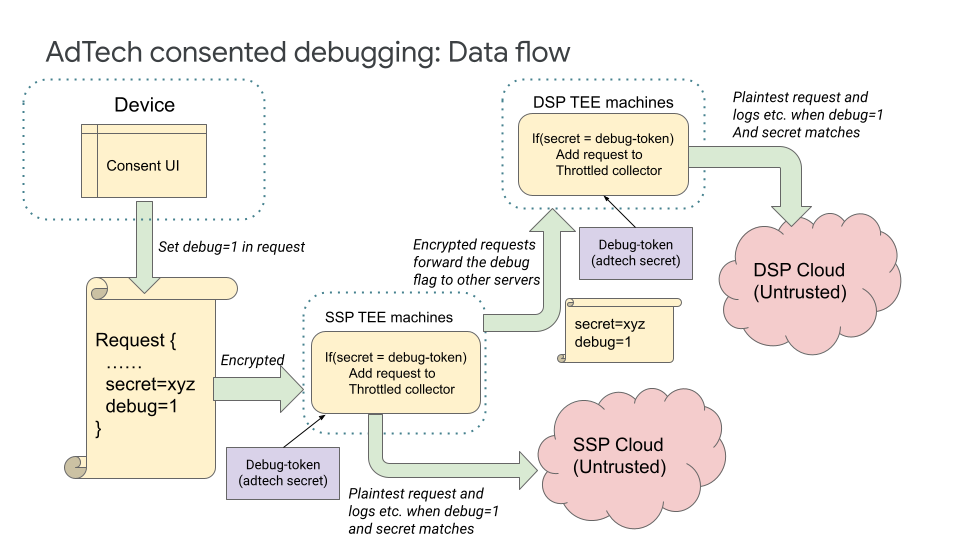
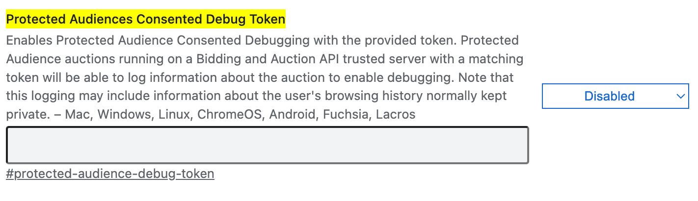

## Debugging Protected Audience API Services

**Authors:** <br>
[Akshay Pundle][11], Google Privacy Sandbox <br>
[Michael Mihn-Jong Lee][12], Google Privacy Sandbox <br>
[Xing Gao][13], Google Privacy Sandbox

The Protected Audience API ([Android][1], [Chrome][2]) proposes multiple
real-time services (e.g. [Bidding and Auction][3] and [Key/Value][4] services)
running in a [trusted execution environment][5] (TEE). These are isolated
environments for securely processing sensitive data with limited data egress.
Debugging is essential for running a production system. Reproducing issues and
finding root causes is essential to the iterative process of making a high
quality robust software. An isolated system running in a TEE poses unique
debugging challenges due to limited data inspection.

In this document, we propose various methods of debugging TEE servers while
retaining the privacy characteristics. We introduce three ways for AdTechs to
debug the system:

- **AdTech consented debugging:** Provides a way for AdTechs to gain access to
    debugging data and requests that can be replayed on local systems
- **Local, Debug mode(`non_prod`):** Provides a way for AdTechs to use standard debugging
    tools. This can be used along with AdTech consented debugging to replay and
    debug requests.
- **Aggregate error reporting:** Provides aggregate error counts for tracking
    errors in production systems.

## AdTech consented debugging

AdTech consented debugging enables AdTechs to get plaintext request and response
pairs, and other debugging data (e.g., verbose logging messages) from their
servers. The Protected Audience API normally protects this data and it is not
available to the AdTechs, or anyone else other than the user who owns the data.
This feature is aimed at AdTech developers looking to debug the system, and not
regular users of the system or API.

The main use case here is when an AdTech wants to debug issues, they (the AdTech
developer) act as the user, and grant consent on their client by initiating a
special mode in Chrome or Android, thereby making their request and associated
data available for debugging. A user (in this case, the AdTech developer) is
fully in control of their Protected Audience API data, and chooses to make it
available for debugging; debug reporting will not be provided for requests from
any users besides those who have enabled this special mode. This consent allows
the system to collect the request and response pair in plaintext and the debug
data, and provide it to the AdTech.

The production system collects logs, metrics, plaintext requests and other
details for such consented requests and makes them available to the AdTech.
Privacy impacting metrics (see [Monitoring Protected Audience API Services][6])
that are normally noised to protect privacy, will be collected without noise for
these consented requests.

With logs and metrics, AdTechs have more information to find the source of the
problem. They will also have the plaintext request that their server was called
with. This means they can replay this request on a local (or debug) instance of
the server, examine logs and use other standard debugging tools for finding
misbehaving code and performance problems. This also means there is no need to
replicate the entire set of servers involved in serving the Client request,
since AdTech already has the request their servers were called with.

### Data flow

When an AdTech wants to reproduce a problem, they will start Chrome or Android
and give consent via the UI. This will enable the system to collect debug data.
While giving consent, the AdTech developer will also need to provide a secret
debug-token known only to the AdTech. This will ensure that the set of consented
requests is only available for debugging on that particular AdTech's servers.



Subsequent Protected Audience API requests from this client will include the
consent and the secret debug-token in request to Protected Audience API servers.
Consent and the secret debug-token will be encrypted as part of the request
(request internals are not visible outside the TEE servers). If the server calls
other servers, the consent information will propagate to all Protected Audience
API TEE servers involved.

The AdTech will provide each Protected Audience API server the secret
debug-token at startup. Upon receiving the request, the server will match the
secret debug-token from the request with the secret debug-token it was started
with. If the tokens match, the server will treat the request as a consented
request. Otherwise the request will be treated as a normal request. The consent
will be propagated to other Protected Audience API TEE servers in either case
(whether the request is treated as consented or otherwise)

When a server determines a request to be consented, it will collect logs,
granular metrics and the plaintext request and response. These will be published
to the AdTech's cloud store, where they can access this information. Publishing
this will happen through [OpenTelemetry][7] and will use the same channels as
mentioned in the [Monitoring Protected Audience API Services][6] document.
Privacy impacting metrics that are usually exported with noise will be published
without noise for consented requests.

### Reasons for using a secret debug-token

- A secret debug-token helps filter out requests originating from other
    AdTechs who may be debugging at the same time. This prevents intentional or
    unintentional spam that would have made it difficult to isolate requests
    that were sent by that particular AdTech.
- Without effective filtering, the associated cloud storage for an AdTech may
    get filled with requests from other AdTechs, even though they didn't do any
    debugging.

### Provide Consent

AdTech developers can give consent in Chrome and Android to make data from their
client available for debugging. Care will be taken to prevent abuse of the
setting. Note that this feature is targeted at the AdTech developers, not the
general Chrome or Android user.

- Chrome: AdTech can provide the consent at
    `chrome://flags#protected-audience-debug-token` with a debug token.



- Android: The details are being designed and this explainer will be updated
    in the future.

### Configure TEE Servers

To enable the AdTech consented debugging, every Protected Audience API TEE
server should run with the following runtime flags:

```
ENABLE_OTEL_BASED_LOGGING = "true"
CONSENTED_DEBUG_TOKEN = "secret debug token"
# Enables verbose logging messages. Set to "0" to disable.
PS_VERBOSITY = "10"
```

The value of `CONSENTED_DEBUG_TOKEN` should match the debug token set in the
device. If set, the value must be a string of length 6 or more characters.

The behavior of `CONSENTED_DEBUG_TOKEN` is as following:

1. Setting to an empty string: This will turn consented debugging off for that server.
2. Setting to a string of length 6 or more characters: This causes consented debugging to be turned on, with the given value as the debug token for that server.
3. Setting to a non-empty string less than 6 characters will prevent the server from starting.


### Access Debug Data

Verbose logs, Event Message, and Adtech UDF Log are available. See more in [Debugging data](#debugging-data).

Metrics for consented request is exported without noise.

## Local debugging and Debug mode(`non_prod`)

The Protected Audience API services will be runnable on the local machine. This
means it will be possible to set up a local instance (e.g. [B&A][8], [K/V][9]
services) of a Protected Audience API server, send plaintext requests collected
using the debugging mechanism described above, and use standard debugging tools
(since this will not be running inside a TEE). This includes examining system
logs, stack traces etc. Such a locally running server will not be able to
decrypt or respond to production traffic.

The above described system of AdTech consented debugging gives the AdTech access
to the requests in plaintext that their servers were called with. They can then
set up local instances of servers and use these requests for further debugging
and reproducing the problem.

### Debug mode(`non_prod`)

TEE servers provide a special execution mode for debugging called Debug mode(`non_prod`). In
this mode, the server runs inside the TEE, but cannot attest with the production
[key management systems][10], so they cannot decrypt any production traffic.
This mode provides some debug capability like console logs. Debug mode(`non_prod`) is useful
for testing a more realistically deployed system compared to local testing. The
above method of replay requests can also be used with servers launched in the
Debug mode(`non_prod`).

### Access Debug Data

Verbose logs, Event Message,  Adtech UDF Log and  Debug info are available. See more in [Debugging data](#debugging-data).

## Aggregate error reporting

We will provide cumulative error counts per server. These will include request
level and system errors. We will not support errors directly originating from
AdTech provided javascript execution due to security reasons. Aggregate errors
will also be published using [OpenTelemetry][7] as mentioned in
[Monitoring Protected Audience API Services][6]. Error counts may also be noised
depending on the source of the error. For consented debug requests, the true
error counts will be reported without noise.

The following errors will be available for tracking:

- **Number of Requests responded:** The number of requests that were not
    processed successfully and resulted in error.
- **Number of Requests responded with error, partitioned by type of error:**
    Similar to the above metric, but the data will be at the gRPC status
    granularity.
- **Number of requests initiated by this server that resulted in an error,
    partitioned by type of error:** This will count the number of errors that
    happened in requests initiated by the server (available at gRPC status
    granularity). E.g. for SFE, this would include errors that occurred when
    calling BFE servers.
- **Number of requests initiated by this server that resulted in an error,
    partitioned by destination:** Similar to the above, but partitioned by the
    request destination.

## Debugging data
Bidding and Auction servers can be built in 2 [build_flavor](https://github.com/privacysandbox/bidding-auction-servers/blob/e40a4fccdce168379189ab7b6b87b55b1e3f736d/BUILD#L163), `prod` and `non_prod`, only `prod` image can pass attestation and decrypt
production request, but `non_prod` have more debugging methods with requests with fake encryption.

1. Verbose logs

    This is the verbose logs from the B&A code.
    - Export channel
      - In `prod`, they are only exported through Open Telemetry log, which can be viewed in cloud log explorer.
      - In `non_prod`, they are also printed in stderr.

    - Log types
      - System logs:
        These logs are not related to user device request, they are always exported in both `prod` and `non_prod`.
      - Request logs:
        These logs are the result of server processing encrypted request. With `prod`, they are only exported for [AdTech consented debugging](#adtech-consented-debugging). With `non_prod`, they are always exported.

    Each server has `PS_VERBOSITY` flag, which sets the verbosity level. High `PS_VERBOSITY` can slow down the `non_prod` server, because there can be large volume of request logs at high QPS, `PS_VERBOSITY` should be `<=3` in this case.

2. Event message

    This is a [structured proto message](https://github.com/privacysandbox/bidding-auction-servers/blob/e40a4fccdce168379189ab7b6b87b55b1e3f736d/api/bidding_auction_servers.proto#L1582) to include the API proto object.
    It is written to cloud storage through Open Telemetry log collector([example config](https://github.com/privacysandbox/bidding-auction-servers/blob/main/production/deploy/gcp/terraform/services/autoscaling/collector_startup.tftpl)) for [AdTech consented debugging](#adtech-consented-debugging).

3. Adtech UDF Log

    This is the log from javascript `console.log`. They are only exported for [AdTech consented debugging](#adtech-consented-debugging), through both Request logs and Event message.

4. Debug info in server response

    This includes request logs and event message mentioned above.
    It is available in `non_prod` only, when [debug_info bit](https://github.com/privacysandbox/data-plane-shared-libraries/blob/e852bce2b8a11a52154103dd25949556e8a4f09e/src/logger/logger.proto#L33) is turned on in server request, Debug Info will be included in [server response](https://github.com/privacysandbox/bidding-auction-servers/blob/e40a4fccdce168379189ab7b6b87b55b1e3f736d/api/bidding_auction_servers.proto#L748).

    To use this feature, [secure_invoke](https://github.com/privacysandbox/bidding-auction-servers/tree/main/tools/secure_invoke)
    can be used to send request with debug_info bit.


[1]: https://developer.android.com/design-for-safety/ads/fledge
[2]: https://developer.chrome.com/docs/privacy-sandbox/fledge/
[3]: https://github.com/privacysandbox/fledge-docs/blob/main/bidding_auction_services_api.md
[4]: https://github.com/WICG/turtledove/blob/main/FLEDGE_Key_Value_Server_API.md
[5]: https://en.wikipedia.org/wiki/Trusted_execution_environment
[6]: https://github.com/privacysandbox/fledge-docs/blob/main/monitoring_protected_audience_api_services.md
[7]: https://opentelemetry.io/
[8]: https://github.com/privacysandbox/fledge-docs/blob/main/bidding_auction_services_aws_guide.md#local-testing
[9]: https://github.com/privacysandbox/fledge-key-value-service/blob/main/docs/deploying_locally.md
[10]: https://github.com/privacysandbox/fledge-docs/blob/main/trusted_services_overview.md#key-management-systems
[11]: https://github.com/akshaypundle
[12]: https://github.com/mihnjong-l
[13]: https://github.com/xinggao01
