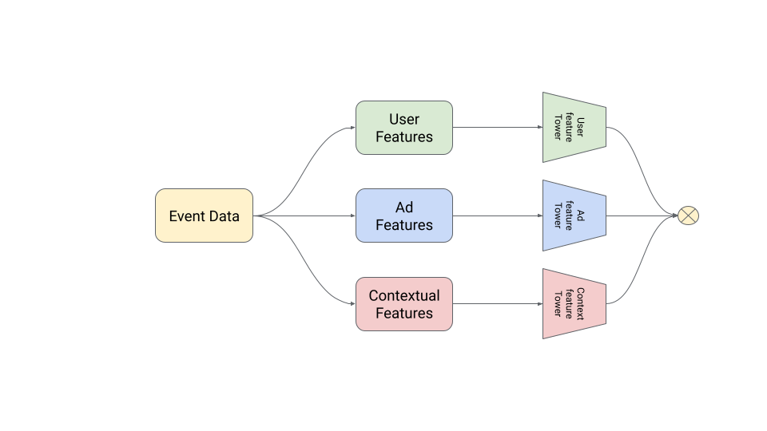
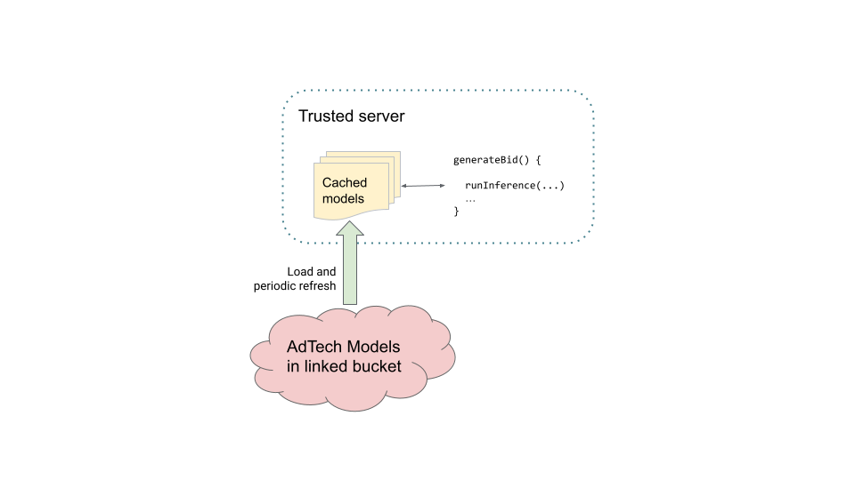
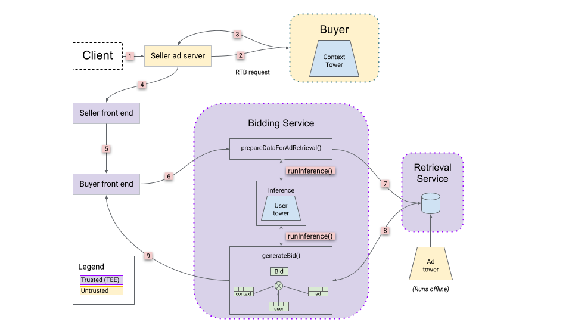
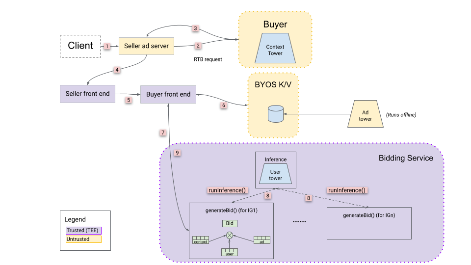
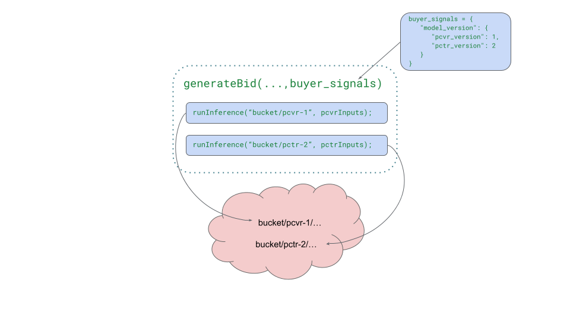

# B&A Inference Overview

**Authors:** <br>
[Akshay Pundle][4], Google Privacy Sandbox <br>
Trenton Starkey,  Google Privacy Sandbox <br>

## Background

This document describes the proposed inference capabilities on [Bidding and
Auction Services][5] (B&A). We examine the building blocks that B&A will provide
for running inference.

B&A enables real-time bidding and auctions for the [Protected App Signals][6]
(PAS) and [Protected Audience][7] (PA) APIs. Real-time bidding allows
advertisers to bid on each impression individually. Calculating the bid is a
core function in B&A. The B&A servers run in the cloud in a [Trusted Execution
Environment][8] (TEE) and apply technical data protection measures through
different phases of the auction including when bids are computed.

During bid calculation, it is often beneficial to make inference predictions.
This is the process of using a pre-trained ML model supplied by the Ad Tech to
make predictions using the given input. For example, predicting click-through
(pCTR) and conversion rates (pCVR) can help to produce the right bid. To this
end, we aim to enable the running of such inferences against a variety of
models.

## Inference on Bidding and Auction services

Bidding and Auction (B&A) will be expanded to include inference capabilities.
This means B&A will have the ability to run pre-trained ML models supplied by
the Ad tech to make predictions.  Inference service will be supported on
[Protected Audience][7] (PA) API and [Protected App Signals][6] (PAS) flows.

### Protected App Signals
Inference will be supported from the PAS user-defined functions (UDFs)
[generateBid()][9] and [prepareDataForAdRetrieval()][10]. For more details on
these functions see [Protected App Signals][11] (PAS).

### Protected Audience API
Inference service will be supported from the PA [generateBid()][20] UDF.

### Note on UDF nomenclature
Throughout this document we will use `generateBid()` as our example. `generateBid()`
is a UDF defined by the ad tech for each of the PAS and PA flows, that includes
ad tech business logic and encapsulates the logic for calculating bids. The same
inference capabilities will be available in `prepareDataForAdRetrieval()` for PAS
deployments, and may be extended to other ad tech UDFs in the future for PAS and
PA deployments.

We will support two main ways of running inference:

1. **Inference with embedded models**: Models are encapsulated in ad tech
  provided JavaScript code
1. **Inference with externally provided models**: Models are external to the ad
  tech provided JavaScript code and APIs are provided to access them

### Inference with embedded models

Models can be embedded in the ad tech's implementation of `generateBid()`. The
ad tech can embed simpler models in their code, either implemented in JavaScript
or with [WebAssembly][12] (Wasm).

With this method, the model's binary data and all code required to use it for
inference are bundled in the ad tech's provided code. This method does not
require fetching the model binary data (such as weights) externally. Instead, it
relies on all data being bundled along with the code.

This method can support fully custom models. Since the model and code are fully
controlled by the ad tech, any compatible model format and code for inference
can be used: code written in JavaScript and code that can be compiled into Wasm.

This method works better for smaller and simpler models.

- Complex models often require large frameworks or libraries, and other
  initialization, which may incur a higher cost to run inside the JavaScript
  sandbox.
- Not all model code can be translated into Wasm or JavaScript in a
  straightforward way. It may be more difficult to translate complex models and
  supporting code. There is a tradeoff between model size and memory cost.

### Inference with externally provided models

In this method, we will support loading binary model data from external sources.
The models will be fetched periodically from a linked source (e.g. [Google Cloud
Storage buckets][13], [Amazon S3 buckets][14]) and loaded into memory. An API
will be provided to `generateBid()` to run inference against the loaded models.
The whole operation of invoking `runInference()`, running predictions using the
loaded models and returning the values to the caller will take place inside a
single TEE. Data will not leave the TEE, and will not be observable externally
either. Outside observers will not be directly able to observe how many times
inference was invoked, if at all.

We will initially support [Tensorflow][15] and [PyTorch][16] based models.

We will provide the following APIs, which will be usable from ad tech code:

- **Run inference using the external models**: This is the main way to use
  inference. A batch of inputs can be constructed in ad tech code and passed to
  the API. Inference will run for each input on the given pre-loaded model and
  the responses will be returned. The call, for illustrative purposes, may look
  like the following:
  ```
  runInference(modelPath, [input1, input2...])
  ```
- **Get the list of paths of models available for use**: This would get the list
  of models currently loaded and available for use in the server. The paths of
  models would typically encapsulate version information (see [Versions in
  B&A][17]). Along with the versioning strategy, this API gives the ad tech
  precise control in choosing versions of models to run inference against. The
  call, for illustrative purposes, may look like the following:
  ```
  getModelPaths(...)
  ```

Note that these APIs are for clarity only and may not reflect the actual
specification. We will define the actual API in more detail in future iterations
of this explainer. These APIs will also be callable from Wasm.

## Factorized and Unified models

Model inputs can use private features (e.g. user data) and non-private features
(e.g. ad data). Private features are available only inside the TEE and so, such
inference must run inside the TEE. This is because the private data should not
leave the privacy preserving boundary. Non-private features can be available on
the contextual path ([see B&A system design][18]), and models relying only on
such data can run outside the TEE, on ad tech hardware, and may also pre-compute
inferences.

Common bid prediction models use contextual, ad and user features for
prediction. Out of these, only the user features are private. The machine
learning models using such private features are the only ones that need to run
inside the TEE. Contextual and ad features are not private, so pre-computation
on these can be done outside the TEE.

For example, a model that relies only on contextual features can be run in the
contextual path during the RTB request. A model based on only ad features can
pre-compute results per ad and upload them to the K/V server. Such results can
be queried during request processing and made available to `generateBid()`.

On the other hand, a model that uses user features, or one that uses user and ad
features will need to run inside the TEE, and cannot run outside the TEE
boundary.

### Unified models

A **unified** approach to such a prediction could run a model that takes
contextual, ad and user features as input, and makes a prediction, running the
entire model inside the TEE. B&A will support unified models directly through
the [two ways][19] of running inference (embedded and external models) described
above. In the unified approach, the entire model will need to run inside the
TEE, since it uses private features. These models will tend to be larger. Both
these factors can increase the cost and latency of running such models.

### Factorized models

**Model factorization** is a technique that makes it possible to break a single
model into multiple pieces, and then combine those pieces into a prediction. In
B&A-supported use cases, models often make use of three kinds of data: user
data, contextual data, and ad data.

As described above, in the unified case, a single model is trained on all three
kinds of data. In the factorized case, you could break the model up into
multiple pieces. The model that includes the sensitive user data needs to be
executed within the trust boundary, on the buyer's bidding services.

This makes the following design possible:

1. Break the model up into a private piece (the sensitive user data) and one or
  more non-private pieces (the contextual and ad data).
1. Optionally, inferences from some or all of the non-private pieces can be
  passed in as arguments to a [User Defined Function][1] (UDF), e.g.
  `generateBid()`. For example, contextual embeddings can be computed along the
  contextual path, returned to the seller's frontend in the contextual response,
  and then can be passed into the B&A auction as part of the `buyer_signals`
  constructed by the seller when they initiate the Auction.
1. Optionally, ad techs can create models for non-private pieces (such as ads
  features) ahead of time, then materialize embeddings from those models into
  the ad retrieval server (for PAS) or [Key/Value server][21] (for PA) and fetch
  these embeddings at runtime.
1. To make a prediction within a UDF, combine private embeddings (from 
  inference within the TEE) with non-private embeddings (from UDF
  arguments or those fetched from the ad retrieval / [key/value servers][21])
  with an operation like a dot product. This is the final prediction.

The following figure shows a factorized pCTR model broken into three parts,
contextual, user and ads towers. Only the User tower needs to run inside the
TEE. The contextual and ad towers can run outside the TEE since they do not rely
on private features.

<figure id = "image-1">
  
  <figcaption><b>Figure 1.</b> Factorized pCTR Model </figcaption>
</figure><br><br>

Factorized models are useful because loading and executing large models inside
the TEE may be expensive. Oftentimes, only a small part of the model relies on
private data (like user data), and the rest needs non-private (e.g. contextual
or ad) data. With factorization, parts that depend on non-private features can
be outside the TEE where they can be executed on ad tech hardware, while keeping
the models requiring private features inside the TEE.

Factorization can be utilized only when the model can be broken down into its
constituents (as described above) fairly easily. If models rely on a lot of
cross features (e.g. ad x contextual information), factorization may not be an
effective strategy.

We will support data flows that allow querying and passing such embeddings to
`generateBid()`, where they can be combined with user (private) embeddings to make the final prediction. The next section describes this data flow.

## Overall flow

### Loading external models

B&A will support loading models inside the TEE. B&A servers will fetch and load
ad tech models periodically from a connected cloud bucket and make them
available for inference in the ad tech provided code (e.g. `generateBid()`). The
loading will be performed in the background, separate from the execution of
`generateBid()`. After loading, the models will also be pre-warmed in the
background, so that when the models are used in the request flow, they are
already warmed.

<figure id = "image-2">
  
  <figcaption><b>Figure 2.</b> Loading external models</figcaption>
</figure><br><br>

The loaded models will be executed in the supported frameworks (e.g. Tensorflow,
PyTorch). When `runInference()` is invoked from within `generateBid()`, the inference request will be forwarded to the corresponding executor for processing, and the results will be returned back to the calling function. These calls occur within the confines of a single TEE host, and data never leaves the TEE.

Note that `runInference()` will not call out to the cloud buckets, or trigger
loading of the model. It will only execute requests against models that have
already been loaded.

### Flows to support factorized models

To support factorized models, B&A will support data flows that enable
transferring embeddings produced from the model parts to `generateBid()`, so
that they can be combined together with the prediction made through the
`runInference()` call. These flows are based on the existing [request
processing][2] flows in B&A.

B&A will support these flows as following:

- Support passing embeddings generated as a part of the Contextual RTB auction
  to `generateBid()` through `buyer_signals`. These embeddings can be produced
  in real time, or can be looked up from ad tech servers during the contextual
  RTB request processing.
- For PAS workflows
    - Support model loading and inference from `prepareDataForAdRetrieval()`
      through the `runInference()` call. `prepareDataForAdRetrieval()` can be
      used to generate private embeddings that are passed to the [Ad Retrieval
      service][11] to filter and fetch Ads.
    - Support querying embeddings from the Ad Retrieval service (runs inside
      TEE) and passing them to `generateBid()`. These embeddings will be
      produced offline and uploaded to the Ad retrieval service. The keys will
      define what the embeddings are for, and appropriate keys can be looked up
      during [retrieval request][10] to fetch the pre-computed embeddings
- For PA workflows,
    - Support querying embeddings from the Key/Value service and passing them to
      generateBid as a part of the regular key/value lookup. These embeddings
      will be produced offline and uploaded to the ad techs key/value service.
      The keys should be defined by the ad tech and will be fetched as a part of
      the regular key/value fetch and passed on to `generateBid()
- Support model loading and inference in `generateBid()` through the
  `runInference()` call, as described above. Here, inference runs inside TEE and
  can use private features based on the inputs of `generateBid()`. This produces
  an embedding that can be combined with the embeddings from the contextual
  path and ad retrieval service, as described above. The data flows make
  these embeddings available in `generateBid()` so they can be combined with
  the private embedding to make a final prediction.

The entire flow is encapsulated in the diagrams below along with an explanation
of each step.

### PAS flow

This flow is based on the [Protected App Signals flow][11] which
fits into the [B&A request processing flow][2].

<figure id = "image-3">
  
  <figcaption><b>Figure 3.1</b> Sample flow for PAS factorized models</figcaption>
</figure><br>

1. Client sends a request to the seller's untrusted server.
1. As part of real-time bidding (RTB) ad request, the seller sends contextual
  data (publisher provided data) to various buyers. At this stage, buyers run an
  ML model that requires only contextual features. This request occurs on the
  contextual path not running on the TEEs. It runs on ad tech-owned hardware of
  their choosing.
1. Once the contextual requests are processed, the contextual ad with bid is
  sent back to the seller. Along with this, the buyer can send `buyer_signals`,
  which the seller will forward to the appropriate buyer front end (BFE). The
  `buyer_signals` is an arbitrary string, so the buyer can send the contextual
  embedding and the version of the models being used (that `generateBid()`
  should use) as a part of this.
1. The seller server forwards the request to the seller front end (SFE), which
  runs inside the TEE.
1. The SFE sends requests to the buyer's BFE. It will include the
  `buyer_signals` as a part of the request.
1. The BFE sends a request to the Bidding service. The Bidding service runs
  `prepareDataForAdRetrieval()` that can optionally invoke inference. This UDF
  prepares the request to send to the Ad retrieval server.
1. The request prepared above is sent to the Ad retrieval server, that will run
  logic to fetch Ads.
1. The retrieved ads are sent back to the bidding service, where they are given
  as input to `generateBid()`. Ad embeddings can be included as a part of this
  response. The Bidding service then invokes `generateBid()`. This call includes
  the `buyer_signals` and data from the Ad retrieval server. Thus, contextual
  embedding and version (part of `buyer_signals`) and the ad embeddings (part of
  data looked up from the Ad retrieval server) are sent to the `generateBid()`
  invocation.
1. The calculated bid is returned. To compute the bid, `generateBid()` can run
  models through `runInference()calls` and combine the output embedding with
  other embeddings that were fetched above to make a final prediction.

In the above flow, `prepareDataForAdRetrieval()` and `generateBid()` can use
external models through the `runInference()` API call. This runs inside the TEE
and can perform inference with models using private features (e.g. the user
tower). Alternatively (not shown in figure), each of the UDFs can use embedded
models to perform inference.

### PA flow
The following diagram is a sample flow based on the [Protected Audience API][7] which
fits into the  [B&A request processing flow][2].

<figure id = "image-3-2">
  
  <figcaption><b>Figure 3.2</b> Sample flow for PA factorized models</figcaption>
</figure><br>

A flow for a Protected audience deployment will be similar to the above.

1. Client sends a request to the seller's untrusted server.
1. As part of real-time bidding (RTB) ad request, the seller sends contextual
   data (publisher provided data) to various buyers. At this stage, buyers run
   an ML model that requires only contextual features. This request occurs on
   the contextual path not running on the TEEs. It runs on ad tech-owned
   hardware of their choosing.
1. Once the contextual requests are processed, the contextual ad with bid is
   sent back to the seller. Along with this, the buyer can send `buyer_signals`,
   which the seller will forward to the appropriate buyer front end (BFE). The
   `buyer_signals` is an arbitrary string, so the buyer can send the contextual
   embedding and the version of the models being used  (that `generateBid()`
   should use) as a part of this.
1. The seller server forwards the request to the seller front end (SFE), which
   runs inside the TEE.
1. The SFE sends requests to the buyer’s BFE. It will include the
   `buyer_signals` as a part of the request.
1. The BFE performs K/V lookup from the BYOS K/V server (or TEE-KV server,
   depending on ad tech deployment).
1. The retrieved keys are sent to the bidding service, where they are given as
   input to `generateBid()`. This can include ad embeddings that were queried from
   the K/V server. The Bidding service then invokes ``generateBid()``. This call
   includes the buyer_signals and data from the K/V server. Thus, contextual
   embedding and version (part of `buyer_signals`) and the ad embeddings (part of
   data looked up from the K/V server) are sent to the generateBid() invocation.
1. `generateBid()` logic is executed for each of the [Interest Groups][23] (IGs). This
   executes the logic and each invocation can make calls to `runInference()` to
   perform inference against any of the loaded models. The `generateBid()` logic
   can also combine the output embedding with other embeddings (like ad and
   contextual embeddings) that were fetched above to make a final prediction.
1. The final prediction is returned from `generateBid()`.

In the above flow, `generateBid()` can use external models through the
`runInference()` API call. This runs inside the TEE and can perform inference
with models using private features (e.g. the user tower). Alternatively (not
shown in figure), each of the UDFs can use embedded models to perform inference.

## Versioning

Inference on B&A will support factorized models. There are multiple models and
embeddings that contribute towards the final prediction, some of which may be
pre-computed. It is important to make sure that model and embedding versions
used are consistent.

For facilitating this, we will provide the buyer a way to choose the version of
models to run per request. As a part of contextual request processing, a version
for inference can be decided by the buyer. The model version information can be
passed through the `buyer_signals`. This field is a string and can be used to
pass arbitrary information from the contextual RTB request to `generateBid().
buyer_signals` will also be passed to the K/V server where this model version
information can be used to look up embeddings. The ad tech is free to choose the
structure of the `buyer_signals` including how the model information is passed
and what it contains. For example, something like the following could be used:
```
buyer_signals = {
   ...
   "model_version": { "pCVR_version": 1,  "pCTR_version": 2 }
   ...
}
```
### Using versions in B&A

The `runInference()` API runs inferences against a named model. `generateBid()`
is responsible for interpreting the version included in `buyer_signals` and
translating it to an actual path that corresponds to an entity in the cloud
bucket. A simple translation scheme could be something like
`${model_name}-${model_version`}. This name will be translated into a cloud
bucket folder from which the model was loaded as shown in the figure below. This
figure is for illustrative purposes only. It shows the mapping from model path
to an actual path in the cloud bucket. The cloud bucket will only be synced
periodically, so each `runInference()` call will not call out to the cloud
bucket. Thus, there will be some delay between a new model being available in
the cloud bucket, and it being made available to `runInference()`. We will cover
such details in future updates to this explainer.

<figure id = "image-4">
  
  <figcaption><b>Figure 4.</b> Model name translation </figcaption>
</figure><br><br>

The `getModelPaths()` function described [earlier][3] can be used along with
the version information to implement a versioning strategy by calling
`runInference()` with the chosen version. Here are some examples how this
could be done:

```
// run inference against a hardcoded version of a model
modelPath = translateToPath("pcvr", 1.0) // custom ad tech logic
runInference(modelPath, [inputs...])

// run inference against version specified in buyer signals
modelPath = translateToPath("pcvr", buyer_signals.model_version.pCVR_version);
runInference(modelPath, [inputs...])

// run inference against the latest version of a model
models = getModelPaths()
latestPcvrVersion = findLatestPcvr(models)  // custom ad tech logic
modelPath = translateToPath("pcvr", latestPcvrVersion);
runInference(modelPath, [inputs...])
```

## Supported platforms

### Embedded models

Ad tech will have full control over what platforms and model types are used
here. The models can be encapsulated in the ad tech provided JavaScript or Wasm
code, thus JavaScript and any language that compiles to Wasm will be supported.
Ad tech can bundle any libraries of their choice along with their code, so any
frameworks or custom written code can be supported as long as it is capable of
executing in the JavaScript sandbox.

### ML execution for External models

We will initially support 2 popular ML platforms: Tensorflow and PyTorch. More
detail to come in future updates on what model formats we will support based on
ecosystem feedback.

### HW Acceleration

Accelerator hardware availability is dependent on the cloud platforms. As of
this writing, confidential processing within TEEs takes place on CPUs. If or
when additional hardware like GPUs becomes available in cloud provider TEE
environments, we look forward to supporting them.

Note that this pertains only to models executed inside the TEE (i.e. on B&A
servers). For factorized models with components outside the TEE , the ad tech is
free to choose whatever hardware they prefer.

## Model size limits

Larger models can help ad techs get higher utility while trading off cost.
Larger models have more memory and computation cost, and thus can be more
expensive to run. They can also cause greater latency in predictions. Thus, the
size of models that are reasonable to run depends on ad tech setup and the
tradeoffs made.

We will not have any particular model size limits, and it will be up to the ad
tech to determine the cost vs utility curve to see what sizes of models are
sufficient, and how many inferences are made per request.

For external models, based on our experiments, models up to 100Mb should have a
reasonable cost and latency. Ad techs should verify performance against their
own models to make sure the cost, utility and latency is in line with their
expectations.

Embedded models are much more custom, and ad techs should experiment with their
setup to determine reasonable limits based on their cost and latency thresholds.

## Sources of cost

For inference, the cost predominantly comes from the resource usage to perform
inference (CPU costs, in our case). There can be some overhead from various
factors (e.g. translating inputs during request dispatch, fetching and storing
models etc.) Since this translates to cost, we will try to minimize such
overhead.

We have seen that CPU utilization for inference scales with model size and
number of inference requests. Larger models consume more resources, as do more
requests. This can be a factor in considering how you factorize your models.

For example, if the model running inside the TEE uses only **user** features,
then the results from this model can be shared across all ads being processed in
that invocation of `generateBid()`. Thus, inference needs to be called only once
per model class (i.e. once for pCVR, once for pCTR, etc.). This cost will scale
with the number of model classes.

On the other hand, if the model running inside the TEE uses **user x ad**
features, then the predictions will be different per ad. Thus, inference will
need to be called for each ad that is being processed in `generateBid()`. So,
for each ad, pCVR and pCTR models will need to be called. Here the cost will
scale with the (number of model classes) x (number of ads).

We will provide more guidance around cost aspects in future updates, or in a
separate explainer.

## Seeking feedback

We are actively engaging with the ecosystem to gather feedback as we develop our
inference solution. PyTorch or TensorFlow were the two most commonly mentioned
frameworks during our outreach. We are starting with these, and welcome
additional feedback.

In addition, ad tech should also consider embedded models that can support
JavaScript and any language that can be compiled down to WebAssembly (see [list
here][22]). You can use this option for custom code, custom model formats, etc.

[1]: https://cloud.google.com/bigquery/docs/user-defined-functions
[2]: https://github.com/privacysandbox/fledge-docs/blob/main/bidding_auction_services_system_design.md#overview
[3]: #inference-with-externally-provided-models
[4]: https://github.com/akshaypundle
[5]: https://github.com/privacysandbox/fledge-docs/blob/main/bidding_auction_services_api.md
[6]: https://developer.android.com/design-for-safety/privacy-sandbox/protected-app-signals
[7]: https://developer.chrome.com/docs/privacy-sandbox/protected-audience/
[8]: https://github.com/privacysandbox/fledge-docs/blob/main/trusted_services_overview.md#trusted-execution-environment
[9]: https://developer.android.com/design-for-safety/privacy-sandbox/protected-app-signals#generatebid
[10]: https://developer.android.com/design-for-safety/privacy-sandbox/protected-app-signals#preparedataforadretrieval
[11]: https://developer.android.com/design-for-safety/privacy-sandbox/protected-app-signals#buy-side-ad
[12]: https://webassembly.org/
[13]: https://cloud.google.com/storage/docs/buckets
[14]: https://aws.amazon.com/s3/
[15]: https://www.tensorflow.org/
[16]: https://pytorch.org/
[17]: #using-versions-in-ba
[18]: https://github.com/privacysandbox/fledge-docs/blob/main/bidding_auction_services_system_design.md#sellers-ad-service
[19]: #inference-on-bidding-and-auction-services
[20]: https://github.com/privacysandbox/protected-auction-services-docs/blob/main/bidding_auction_services_api.md#generatebid
[21]: https://github.com/privacysandbox/protected-auction-services-docs/blob/main/bidding_auction_services_api.md#buyer-byos-keyvalue-service
[22]: https://webassembly.org/getting-started/developers-guide/
[23]: https://developers.google.com/privacy-sandbox/private-advertising/protected-audience#interest-group-detail
