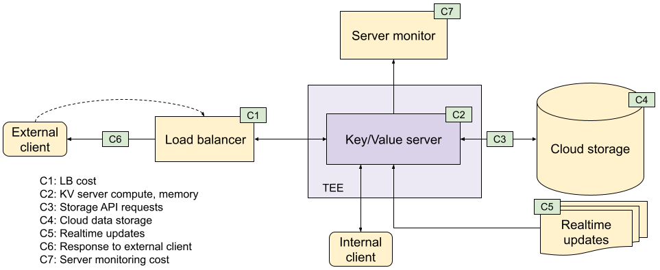
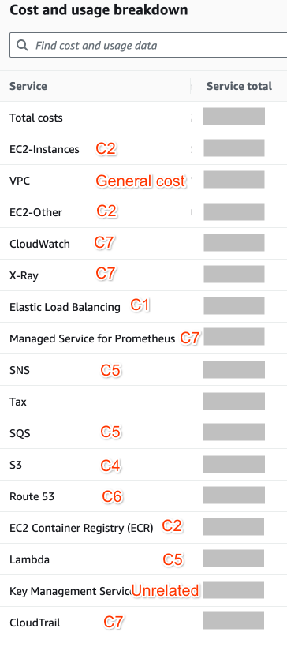
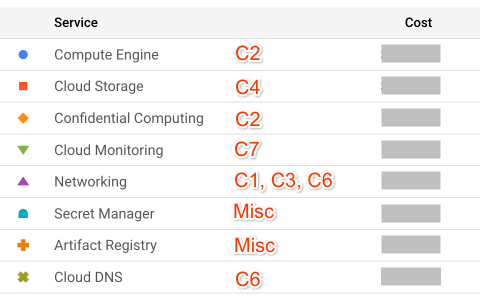

# Key/Value Service Cost

**Authors:**
<br> [Leiming Zhang][1], Google Privacy Sandbox
<br> [Lusa Zhan][2], Google Privacy Sandbox

# Introduction

[The Key Value service](https://github.com/privacysandbox/protected-auction-key-value-service/tree/main) is developed with the same underlying technologies as the Bidding and Auction services. Both systems have similar deployment and trust models and the general cost structures of the two are therefore similar. This explainer begins by quoting the [background section](https://github.com/privacysandbox/protected-auction-services-docs/blob/main/bidding_auction_cost.md#background) of the Bidding and Auction services. Various components and cost factors may also overlap with the Bidding and Auction services and similar quotations may be used to reflect the consistency. Quoted texts use italic style. Differences between the Key Value Server and Bidding and Auction Services are highlighted in red in quoted texts.

# Background

“ ${\color{red}The}$ ${\color{red}Key}$ ${\color{red}Value}$ ${\color{red}service}$ _runs in supported [Trusted Execution Environments (TEE)](https://github.com/privacysandbox/fledge-docs/blob/main/trusted_services_overview.md#trusted-execution-environment) provided by AWS and GCP. In this document, the Privacy Sandbox team explores the various factors that affect the cost of such a deployment and how these can be mitigated._

_There are different tradeoffs when provisioning this system like [QPS](https://en.wikipedia.org/wiki/Queries_per_second), acceptable latency, regional failover etc. Providing estimates for all combinations is impossible, and a lot depends upon the choice the ad tech makes, the tradeoffs that are considered etc._

_A framework has been developed to understand the costs of operating a privacy-preserving advertising system. This framework will help ad tech companies understand the source of costs and make informed decisions about how to operate their businesses._

_The cost components described depend on the underlying cost structures provided by cloud providers. The Privacy Sandbox team takes into account our current understanding of these, but the underlying cost structures can change over time, which would also change the cost components described in this document._

_The cost components described below scale with the throughput of the system. Provisioned costs (e.g. number of VMs) depend on how many resources are provisioned. Costs like network and load balancer cost scale with actual usage and are proportional to the volume of traffic processed by the ad tech._

_The cost depends on system performance which will need to be empirically measured. Ad techs can follow instructions in the [Cost Estimation](#cost-estimation) section or_
${\color{red}deploy}$
${\color{red}our}$
${\color{red}system}$
${\color{red}for}$
${\color{red}Protected}$
${\color{red}Audience}$
${\color{red}/}$
${\color{red}Protected}$
${\color{red}App}$
${\color{red}Signals}$
${\color{red}testing}$
_to collect such data and create detailed cost estimates._

_While it is impossible for the Privacy Sandbox team to collect representative data since it does not operate a production system with live traffic, it can measure resource consumption for a parameterized system with synthetic requests and setup. Ad tech can use these to arrive at ballpark cost estimates._

_Typical cloud costs fall into the following categories:_”

## Network

_“Network costs can be a significant component of operating costs. Services are usually operated inside a Virtual Private Cloud (VPC). Typically, network egress from a VPC is charged. This means that you would pay for outbound traffic from the services that go outside the VPC boundary, like going to the internet or to another region but not for traffic inside the VPC. Traffic inside VPC is usually free. Internal network components (like load balancers) that charge for data processing will still incur cost on internal traffic. For this reason, the system uses_
${\color{red}direct}$
${\color{red}calls}$
${\color{red}with}$
${\color{red}internal}$
${\color{red}IP}$
${\color{red}addresses}$
${\color{red}for}$
${\color{red}internal}$
${\color{red}sharding}$
${\color{red}traffic}$
.
_This does not incur cost for traffic inside the VPC. Some network components like NAT (AWS, GCP) have hourly charges, and ingress and egress data charges based on usage.”_

## Infrastructure

_"Infrastructure costs include Virtual Machine (VM) costs and other services used. VM cost depends on CPU, memory usage etc. These costs typically balance QPS, application latency and availability needs."_

## Data loading

There are two ways to load data into the server: cloud storage and realtime update. Cloud storage cost depends on data size and metadata operations while realtime update cost depends mostly on data throughput.

## Load balancer

_“Load balancers typically charge for data processed. This includes inbound and outbound data. If a load balancer is used on internal traffic, this processing is still usually chargeable._

_NAT gateways are also chargeable. These are used to make outbound connections out of the VPC and typically also charge for processed data.”_

## TEE overhead

_“Cloud operators may charge an overhead for TEE enclave usage. The way these charges are levied is different and operators should use their setup to determine how TEE costs affect the overall cost._

_GCP: [Confidential Compute charges](https://cloud.google.com/compute/confidential-vm/pricing)_

_AWS: [Enclave pricing](https://docs.aws.amazon.com/enclaves/latest/user/nitro-enclave.html#nitro-enclave-pricing)_”

# High level cost breakdown

<figure id = "kv-image-1" align = "center">
  
  <center><figcaption><b>Figure. 1</b> Key/Value server cost</figcaption></center>
</figure><br><br>

Key/Value server costs breakdown in the following way, as shown in the figure above.

**C1: _Load balancer:_** “_A load balancer (LB) forwards incoming requests to the_
${\color{red}key/value}$
${\color{red}server}$
_instances. This cost depends on the total processed bytes by the LB and may also include components based on usage time.”_

**C2: Key/Value server:** Key/Value service processing consumes CPU and memory.

**C3: Storage API requests and data transfer:** API requests like listing and fetching objects incur cost. Depending on the regions of your cloud storage and server instances, data transfer may incur cost.

**C4: Cloud data storage:** Data storage for snapshots and delta files will incur cost. Metadata operations (e.g., listing objects) and inter-region data transfer may also incur cost.

**C5: Realtime updates:** This is a low latency data loading pathway. The cost here mostly depends on data throughput.

**C6: Response to external client:** This is the network egress cost of sending the responses back to the external client. NAT costs may also be accrued since a connection across the VPC boundary will be needed.

**C7: Server monitor:** Server monitoring services will incur cost. This includes OpenTelematry (Otel) collector and monitoring services from cloud providers.

# Details

## Load balancer and Network address translation (NAT)

### Load balancer

_“The_
${\color{red}key/value}$
${\color{red}server}$
_will have a load balancer for incoming requests. These will incur processing costs (_
${\color{red}C1}$
${\color{red}in}$
_Fig. 1) depending on the total bytes routed. This will depend on QPS and request payload size.”_

However, if the key/value server only needs to handle traffic within the same VPC (e.g., traffic from Bidding and Auction services deployed under the same VPC. In Fig. 1, it’s shown as the internal client), you can disable the load balancer and no related cost will incur. Note that this feature (optional load balancer) is only available on GCP at the moment and support for other clouds (e.g., AWS) will be available later.

### NAT

_“A NAT is used to make outbound connections to the internet from within the VPC. NAT traffic is typically charged for bytes processed. The cost can be estimated by estimating the traffic, and can be controlled by limiting it.”_

### Traffic director (GCP)

On GCP, Traffic director is used to handle internal traffic (e.g., traffic from an internal client). This cost depends on the total number of endpoints (instances).

## VM costs

The key/value server requires CPU and memory. From [Fig. 1](?tab=t.0#bookmark=id.oa1u44lgx1im), the costs for these are C2. These costs depend on factors like the total shards/replicas required, the size of dataset in a single shard, total throughput required, throughput per vCPU of each of the instances, how the servers are provisioned, what latency is acceptable, complexity of UDF etc.

**Total shards/replicas required**: Sharding allows splitting data and having each server store only part of the data. Replicas for each shard provide more throughput bandwidth and extra reliability. [More about sharding and replica](https://github.com/privacysandbox/protected-auction-key-value-service/blob/release-0.15/docs/sharding/sharding.md).

**Size of dataset per VM**: Data needs to be loaded to a machine’s RAM. Larger dataset requires machines with more RAM.

**_Total throughput required_**: _“Desired throughput of request being processed. The required resources scale proportionally to this.”_

**_Throughput per vCPU:_**: “_Needs to be experimentally determined”_

**_How the servers are provisioned_**: _“Peak QPS may be much more than avg. QPS. Provisioning servers for peak QPS and extra redundancy would require more cost.”_

**_Latency_**: _“If degraded latency is acceptable, servers may be underprovisioned. If this tradeoff is made, at high QPS, the servers could start to lag and latency could be higher.”_

**Complexity of UDF**: Running User-Defined Functions (UDF) requires CPU and memory. The more time they run for, the more resources they consume. [More about UDF](https://github.com/privacysandbox/protected-auction-services-docs/blob/main/key_value_service_user_defined_functions.md).

## Network costs

**Response to external client**: The response to external client will incur network egress/NAT costs. These will depend on the payload sent back, which will contain the query result. This cost is C6 in Fig. 1.

**Response to internal client**: This will not incur any network cost as both the key/value server and the internal client are deployed in the same private network.

## Data loading costs

### Cloud storage

Storage cost mostly depends on how much data (i.e., snapshot/delta files) you need to store and how frequently you need to do API requests (e.g., Get, List) to cloud storage.

**Data storage**: The cloud storage for snapshot and delta files will incur cost, which depends on the total data storage size and their timespan in storage. Your choice of storage location also has an influence on the cost. This cost is C4 in Fig. 1.

**Storage API requests**: Storage API requests like Get, List will incur cost. As for data reading/access, although the cost is not directly related to data size, the system may need to make multiple API requests depending on the buffer size.

**Data transfer:** If the cloud storage bucket resides in a different region than server instances, additional data transfer cost will incur.

### Realtime updates

Realtime updates enable low-latency data loading via message queues. The system leverages AWS SQS/SNS and GCP Pub/Sub for realtime updates, respectively. Pub/Sub costs are based on data throughput. For SQS/SNS, the costs are based on the number of requests while each request is 64KB at max and any request with larger size is billed as multiple requests. Data transfer within the same region is typically free for both services. However, inter-region transfers may incur additional charges. This cost is C5 in Fig. 1.

AWS: [SNS pricing](https://aws.amazon.com/sns/pricing/), [SQS pricing](https://aws.amazon.com/sqs/pricing/)

GCP: [Pub/Sub pricing](https://cloud.google.com/pubsub/pricing)

## Monitoring costs

Monitoring related costs are C7 in Fig. 1. Note that the monitoring solution is provided as a reference implementation and can be customized.

### Otel Collector

Otel collector runs as a standalone service to collect key/value server metrics. On AWS, it’s running in the host machine, while, on GCP, it’s running in a dedicated VM. Regardless of platforms, VM related costs will incur for Otel collectors.

### Cloud Monitoring

Metrics collected by the Otel collector will be exported to Cloudwatch/Prometheus on AWS and Metrics Management / Logs explorer on GCP. All these cloud provided services will incur costs.

# Cost estimation

“_Both GCP and AWS itemize all costs needed for a key/value server deployment, and this can be used to build a quite accurate estimate of running costs. Estimating cost for a range of ad techs running these servers proves difficult due to the sheer number of factors that affect cost, including but not limited to:_

- _Deployment configuration for each ad tech_
- _Estimation of compute capacity_”
- Estimation of payload size, including for sharded servers and [UDF read APIs](https://github.com/privacysandbox/protected-auction-services-docs/blob/main/key_value_service_user_defined_functions.md#datastore-read-api)
- _“Estimation of response size”_
- _“Identifying where pricing applies and the correct line item that should be applied.”_
- CPU time taken up by UDFs

## Cost test environment

_“To overcome these obstacles, running the key/value server in a test environment over a short period of time may be used to extrapolate monthly or annual costs (or to verify calculated estimates). Guides are available for deploying an environment in [GCP](https://github.com/privacysandbox/protected-auction-key-value-service/blob/release-0.15/docs/deployment/deploying_on_gcp.md) and [AWS](https://github.com/privacysandbox/protected-auction-key-value-service/blob/release-0.15/docs/deployment/deploying_on_aws.md). The test environment should replicate, as closely as possible, the architecture that will be used in production. This includes:”_

- Deployment related factors:
  - _“Network configuration and load balancers”_
  - Correct sizing of the instances
  - Sharding configuration
- Runtime related factors:
  - _“Request payloads and header information that are similar in size and composition to production payloads”_
  - User-defined functions implementation with similar latency and response size. In addition, they should mimic the number, request payload size, and request composition of [UDF read API](https://github.com/privacysandbox/protected-auction-services-docs/blob/main/key_value_service_user_defined_functions.md#datastore-read-api) calls
  - Overall data set size and individual record sizes
  - Data update frequency and size while the server is running. This includes realtime updates.

_“Correct sizing and quantity of the host instances will be a significant factor in the total cost of the environment.”_ Load testing should be used to identify the optimal number of vCPUs required. This will heavily depend on the runtime related factors listed above.

_“To facilitate identifying the billing costs attributed by the test environment, each component can be [labeled (GCP)](https://cloud.google.com/resource-manager/docs/creating-managing-labels) or [tagged (AWS)](https://docs.aws.amazon.com/tag-editor/latest/userguide/tagging.html) with unique key value sets. These are needed to isolate the costs involved in the test environment from those of any other resources in use within the same project (GCP) or account (AWS). The [reference terraform configurations](https://github.com/privacysandbox/protected-auction-key-value-service/tree/release-0.15/production/terraform) in the code base demonstrate how this can be done.”_

However, while many components support labeling and tagging, many others do not. This includes GCP CloudNAT and some monitoring related services. To further isolate costs for these services, consider placing the test environment in a region by itself.

## Running a cost test

The key/value server supports both reading data via the external API and writing data via data uploads to blob storage. Both reads and writes will affect each other’s latency.

In order to estimate the cost for the key/value service accurately, test setups for both need to replicate a production payload as close as possible and be run at the same time.

_“Each test run should cover a minimum of 24 hours within the daily billing period of the cloud service that is being used._

- _AWS: midnight UTC - midnight UTC_
- _GCP: midnight PST - midnight PST”_

### Data loading setup (write path)

The test setup for the write path should include delta/snapshot updates at the same frequency, record size, and record numbers as the expected production data. This also includes real time updates. Since data generation is not part of the key/value service, each ad tech will need to set up their own pipelines to replicate data updates.

The cost components for data loading generally include data transfer costs and server cost for loading the data into memory. Data transfer costs depend on the frequency of updates and the data size. The server cost for data loading depends on the required instance size to hold the data in memory and CPU usage to process the data. While data transfer costs could be estimated, the server cost for data loading is harder to estimate without a full data setup.

### Request API serving setup (read path)

_“Tests on the read path may be performed with any load test utility that supports gRPC (e.g. [GHZ](https://ghz.sh/) and [wrk2](https://github.com/giltene/wrk2)). Tests should provide a constant stream of calls to the test environment at a steady rate for the period of the test.”_ The QPS used does not have to match production traffic, but it should match expected QPS for a single instance or a single set of sharded instances.

The request payload should match the [key/value service’s API](https://github.com/privacysandbox/protected-auction-key-value-service/blob/release-0.15/docs/APIs.md).

```sh
RATE=60
HOURS=48
TOTAL_CALLS=$(( HOURS*60*60*RATE ))
ghz \
    -r $RATE \
    --total=$TOTAL_CALLS \
    --call=kv_server.v2.KeyValueService/GetValuesHttp \
    --data-file ~/tmp/test-payload.txt \
    demo.kv-server.your-domain.example:8443
```

_Example command line call to start a two-day test run at 60 QPS_

## Collecting cost data

_“After the test is completed the results may be found in the billing explorer of the respective cloud provider ([GCP Billing](https://pantheon.corp.google.com/billing/), [AWS Cost Explorer](https://console.aws.amazon.com/cost-management/home#/cost-explorer)).”_ The components for data loading and request serving will need to be separated to extrapolate a monthly or annual cost.

### AWS

_“In AWS, billing data is collected from AWS Cost Explorer using a daily usage report. This breaks down cost by component and can be exported in csv-format. An example from one run is shown below.”_

<figure id = "kv-image-2" align = "center">
  
  <center><figcaption><b>Figure. 2</b> Cost example on AWS</figcaption></center>
</figure><br><br>

To find the data loading cost, the report should be filtered to include the key/value server’s required data loading services (S3, SNS, SQS) and any other services used for data generation.

To find the request serving costs, the report should be filtered to exclude the above services. Note that some usage types are billed by hour, which will not scale with the number of requests. These include VpcEndpoint-Hours, NatGateway-Hours, and LoadBalancerUsage. To extrapolate monthly costs, those should be excluded as well.

### GCP

_“A similar tool is provided by GCP in the Reports section of the Billing interface breaking out the costs into [individual SKUs](https://cloud.google.com/skus). To identify the test data, the correct date range and include filters for the desired GCP labels (for NAT costs, the region filter may be used when the test environment is the only NAT user in the region).”_

<figure id = "kv-image-3" align = "center">
  
 <center><figcaption><b>Figure. 3</b> Cost example on GCP</figcaption></center>
</figure><br><br>

To find the data loading cost, the report should be filtered to include the key/value server’s required data loading services (Cloud Storage, Cloud Pub/Sub) and any other services used for data generation.

To find the request serving costs, the report should be filtered to exclude the above services.

### Extrapolating monthly or annual cost

These captured billing costs can be extrapolated to find the expected monthly or annual operating costs.

Given a similar data loading architecture between the test and production, the data loading costs from the test should give a rough estimate of costs in production.

_“The request serving cost is (roughly) linearly representative of a single day of operation for the architecture in question computing the total number of inbound requests. Since production level traffic will be higher than the test run, the “scaled up” daily cost must be calculated for the expected QPS. In the simplest case, the cost fogr the test environment can be multiplied by a factor of production-to-test QPS.”_

$$Cost_{production} = Cost_{\textit{data loading test}} + Cost_{\textit{request serving test}} \times \frac{Rate_{\textit{API request production}}}{Rate_{\textit{request serving test}}}$$

_“This estimated daily production cost can then be multiplied to obtain the monthly or annual production costs._

_Note that this linearity exists since most of the cost is based on data transfer bytes or processing, both of which are roughly linear with the rate of requests. Some additional savings will be seen in actual production costs that are not seen here such as the NAT uptime in a GCP environment, however these costs tend to be relatively minor (NAT uptime is $0.0014 per hour)."_

Note:

1. Since the Key Value server is stateful, as it requires in-RAM data to process requests, scaling the QPS to a single machine may not be linear to the resource cost of the machine. In order to apply the above formula, it’s better to fully utilize the test machines’ resources so scaling to the production volume would only require horizontal scaling to more machines, which removes the uncertainty mentioned above, and makes the relation more linear.
2. _"This assumes a production architecture similar to that under test. More complex architectures to handle higher loads, such as a fan-out load balancing scheme, may yield different results.”_

[1]: https://github.com/formgit
[2]: https://github.com/lusayaa
