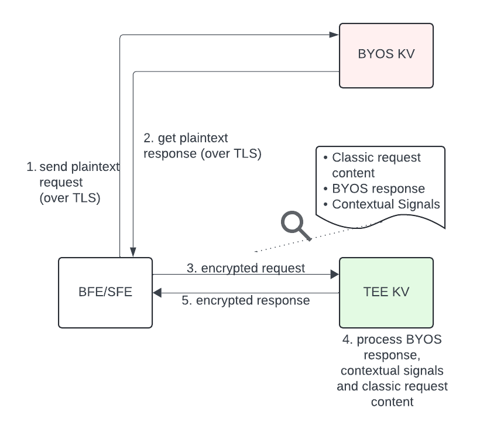

# Hybrid mode for TEE Key Value service


# Overview

For the Protected Audience (PA) auctions initiated from the browser, we are adding a temporary hybrid mode of deployment that enables TEE based [Key Value service (TKV)](https://github.com/privacysandbox/protected-auction-services-docs/blob/main/key_value_service_use_cases.md) to be deployed with the Bring-Your-Own-Server (BYOS) KV to co-process one request. This will be available for both the on-device auctions and [Bidding and Auction (B&A)](https://github.com/privacysandbox/protected-auction-services-docs/blob/main/bidding_auction_services_api.md) services-led auctions. This feature is not available for PA auctions on Android.


*   For Bidding and Auction (B&A) services, this will be available at the B&A release version 4.8.0 for BFE. Once the B&A version that supports it for SFE is known, this doc will be updated.
*   For Chrome, the detailed design is still work in progress and this doc will be updated with details soon in the future.


# Motivation

The hybrid mode provides a valuable transition period for AdTechs migrating to TKV. This allows for a gradual integration process, enabling AdTechs to evaluate TKV with real production traffic before fully transitioning from the temporary "Bring Your Own Server" solution .


# Background


## The PA use cases

As part of the auction, bidding signals from the KV server need to be looked up (by Buyer Front End (BFE) in case of the B&A flow, and Chrome, in case of on-device) to pass them into the `generateBid` ([B&A](https://github.com/privacysandbox/protected-auction-services-docs/blob/main/bidding_auction_services_api.md#generatebid-javascriptwasm-spec), [Chrome](https://github.com/WICG/turtledove/blob/main/FLEDGE.md#32-on-device-bidding)) function as a `trustedBiddingSignals` parameter.

Similarly, scoring signals need to be looked up (by Seller Front End (SFE) in case of B&A, and Chrome, in case of on-device) to pass them into `scoreAd` ([B&A](https://github.com/privacysandbox/protected-auction-services-docs/blob/main/bidding_auction_services_api.md#scoread), [Chrome](https://github.com/WICG/turtledove/blob/main/FLEDGE.md#23-scoring-bids)) function as a `trustedScoringSignals` parameter.

When a request to KV is made, it can hit either BYOS or TKV implementations.


## The BYOS to TKV migration

As mentioned in the PA [explainer](https://github.com/WICG/turtledove/blob/main/FLEDGE_Key_Value_Server_API.md), “As a temporary mechanism during the First Experiment timeframe, the buyer and seller can fetch these bidding signals from any server, including one they operate themselves (a "Bring Your Own Server" model)”.

The TKV implementation is the replacement to the BYOS approach that fulfills our privacy goals and will eventually be used as the allowed implementation once the temporary mechanism expires.

Migrating from the BYOS to TKV is an expectation on adtechs who are using BYOS. However, there are some significant differences between the BYOS and TKV, making the migration non-trival, particularly if the migration requires moving everything from the BYOS to TKV.

Below we list some major differences. To understand how the hybrid mode can help unlock an alternative migration strategy, it is essential to understand the necessary elements.


## The BYOS and TKV differences


### Interface between the browser/B&A services and KV

BYOS servers only support Version 1 of the communication protocol between KV servers and the callers. For the BYOS API (v1), please refer to the [Protected Audience Spec as the source of truth](https://wicg.github.io/turtledove/). Additionally see this [section](https://github.com/WICG/turtledove/blob/692ad8825e9b7e6b1b1347b9b0d38ee1fdaadf63/FLEDGE.md#31-fetching-real-time-data-from-a-trusted-server) here.

In addition to BYOS API (v1), the TKV server implementation supports [Version 2](https://privacysandbox.github.io/draft-ietf-protected-audience-key-value-service/draft-ietf-protected-audience-key-value-services.txt).


### Request processing interface between the TKV and the adtech operator

The TKV implementation supports user-defined functions ([UDFs](https://github.com/privacysandbox/protected-auction-services-docs/blob/main/key_value_service_user_defined_functions.md)). UDFs can run proprietary computation logic and they have access to a read API provided by the key/value service to query the server’s internal data store, populated by dataset from the service operator.


# What is the hybrid mode

In addition to the existing two modes of communication mentioned in the background, a new hybrid mode can be used.

At a high level, hybrid mode enables a flow of: caller (Chrome or B&A) -> BYOS -> TKV -> back to the caller, for each request.

Hybrid is helpful when you are not ready to fully migrate to TKV. It may also be beneficial if you:


1. want to take advantage of request signals or capabilities that are only available in TKV.
2. want to experiment with the TKV to provide feedback without heavy investment in rewriting all your logic to support TKV
3. want to gradually migrate to TKV to be ready for the enforcement and iterate with small steps to avoid breakages

You can split your logic in two pieces. The first piece, that does not depend on those signals, can continue to live in BYOS. That logic will do necessary computations and produce an output that will be passed to the TKV. \
In TKV you can add logic that you’re interested in running in TKV, such as that which requires [TKV only signals](https://github.com/privacysandbox/protected-auction-services-docs/blob/d2af102b4580bc85dd65a17958f74be63cea1e1b/key_value_service_contextual_signals_propagation.md), or that which has lower risk to try in TKV first. It can combine the previously generated output with them and produce the final result.


## What flows does the hybrid mode apply to?

Hybrid is not enabled for [Android](https://developers.google.com/privacy-sandbox/private-advertising/protected-audience/android), only [Chrome](https://developers.google.com/privacy-sandbox/private-advertising/protected-audience).

This is because Android for PA and [Protected App Signals ](https://developers.google.com/privacy-sandbox/private-advertising/protected-audience/android/protected-app-signals)(PAS) only allow TEE KV from the start. \
Hybrid mode will be turned off as part of future enforcement.


## Transitioning between deployment modes

Eventually, you can start moving pieces from BYOS to TKV, with the aim to fully migrate to TKV, at which point you can disable BYOS and no longer bear the costs associated with running that server.

In the case where certain issues are observed, the design aims to support an easy experience to transition back to BYOS mode, or revert to a previous hybrid mode version.

This gradual migration can help you go through this process at your own pace with low stakes for each decision, figuring out how to change your system to adapt to the TKV restrictions that our server enforces.


# B&A services-led auctions



As you can see in the diagram above, for the B&A-led auctions, an ability to make two sequential requests is added.

First, BFE/SFE makes a BYOS API (v1) request. Then, a B&A server makes a downstream request to the TKV using the fully encrypted protocol specified [here](https://privacysandbox.github.io/draft-ietf-protected-audience-key-value-service/draft-ietf-protected-audience-key-value-services.txt).

BYOS output will be available in the AdTechs [UDF](https://github.com/privacysandbox/protected-auction-services-docs/blob/main/key_value_service_user_defined_functions.md) in TKV as a field with the name “byos_output” in request [metadata](https://github.com/privacysandbox/protected-auction-key-value-service/blob/6f702e02833a06c1bfd6a31f7d9c8f0ded98536d/public/api_schema.proto#L30). Each UDF invocation has access to that metadata, see more details [here](https://github.com/privacysandbox/protected-auction-key-value-service/blob/release-1.0/docs/APIs.md#the-generic-udf-api).


## How do I use the hybrid mode?


### Technical steps

To use hybrid, you need to set the following flag ENABLE_HYBRID flag to true.

You also need to deploy a BYOS server and [a TKV server](https://github.com/privacysandbox/protected-auction-key-value-service/blob/release-1.0/getting_started/onboarding.md).

If you are a seller, you would then need to set the following parameters to point your SFE to those instances:


<table>
  <tr>
   <td>Terraform key
   </td>
   <td>Example value
   </td>
  </tr>
  <tr>
   <td>SELLER_KV_SERVER_ADDR
   </td>
   <td>https://kvserver.com/trusted-signals
   </td>
  </tr>
  <tr>
   <td>SELLER_TKV_V2_SERVER_ADDR
   </td>
   <td>dns:///kvserver:443
   </td>
  </tr>
</table>


Similarly, if you are a buyer you need to set the following parameters to point your  BFE to those instances:


<table>
  <tr>
   <td>Terraform key
   </td>
   <td>Example value
   </td>
  </tr>
  <tr>
   <td>BUYER_KV_SERVER_ADDR
   </td>
   <td>https://kvserver.com/trusted-signals
   </td>
  </tr>
  <tr>
   <td>BUYER_TKV_V2_SERVER_ADDR
   </td>
   <td>dns:///kvserver:443
   </td>
  </tr>
</table>


Make sure to use BYOS output that is available in your [UDF](https://github.com/privacysandbox/protected-auction-services-docs/blob/main/key_value_service_user_defined_functions.md) in TKV as a field with the name “byos_output” in request [metadata](https://github.com/privacysandbox/protected-auction-key-value-service/blob/6f702e02833a06c1bfd6a31f7d9c8f0ded98536d/public/api_schema.proto#L30).


## Cost considerations

Having BFE/SFE and TKV deployed in the same cloud (see the currently supported list of clouds [here](https://github.com/privacysandbox/protected-auction-key-value-service/blob/release-1.0/getting_started/onboarding.md#step-2-cloud-set-up)) can save money on network egress. That will happen once BFE and SFE will support app mesh, which is in our plans to eventually implement.

BYOS can be deployed anywhere, for example on prem, but the same considerations as above apply for cost.

Having to make two sequential network calls instead of one will naturally add extra latency.

Having to run two KV servers (BYOS and TKV) will naturally result in higher resource usage and extra maintenance.


## Short circuiting a hybrid request

In Hybrid mode, on a per request basis, AdTech can choose to short circuit to not make a downstream request to TEE KV. For the B&A flow that is achieved by adding a header “ad-auction-v1-only” set to true to the BYOS KV response marked 2 in the diagram above. If that header is present, B&A server will use only the data retrieved from BYOS KV for that specific request.


## Handling Android and Chrome traffic with the hybrid mode for B&A


If you are an AdTech that is using B&A with the hybrid mode and you participate in auctions for Chrome and Android traffic, it is important to understand how the request routing works in each case.

You can reuse the same TKV instance for Android and Chrome Traffic.

As mentioned [earlier](#what-flows-does-the-hybrid-mode-apply-to), Android traffic works only with TKV, and does not allow integration with BYOS KV. Any request originating on Android will be routed by BFE/SFE directly to TKV as you can see on the diagram above.

However, if you have the hybrid enabled, then the standard B&A hybrid sequence will be followed: first the BYOS Kv will be called out, and then the TKV.


# On device

We will add hybrid mode support for on device shortly after. We’re planning to update this document with additional details once they are finalized and are ready to be shared.


# Recommended practices for gradual migration

A typical gradual migration from [BYOS KV to TKV](#the-byos-to-tkv-migration) is described below:


1. AdTech has a working BYOS KV integration. This is assumed to be the starting point and we will not elaborate on how to get to this point
2. An AdTech follows the [onboarding](https://github.com/privacysandbox/protected-auction-key-value-service/blob/release-1.0/getting_started/onboarding.md) steps to deploy a TKV.
3. An AdTech determines that the [default](https://github.com/privacysandbox/protected-auction-key-value-service/blob/6f702e02833a06c1bfd6a31f7d9c8f0ded98536d/public/udf/constants.h) UDF is not enough for their use case. That can be the case, for example, if an AdTech needs to use [contextual signals](https://github.com/privacysandbox/protected-auction-services-docs/blob/d2af102b4580bc85dd65a17958f74be63cea1e1b/key_value_service_contextual_signals_propagation.md) or the [BYOS output](#technical-steps).
4. An AdTech writes a [custom code ](https://github.com/privacysandbox/protected-auction-key-value-service/blob/release-1.0/docs/generating_udf_files.md)in TKV. That guide also covers how to test that UDF locally without having to upload it to TKV right away.
5. An AdTech [turns on hybrid mode](#technical-steps) for 1% of their traffic. The 1% traffic sampling can be controlled by this [header](#short-circuiting-a-hybrid-request). For example, a random number between [1;100] can be picked and that flag can be set to true for any number in [2; 100] interval. A similar sampling approach can be used for other traffic percentages mentioned below.
6. Observe an issue by using this [monitoring](https://github.com/privacysandbox/protected-auction-key-value-service/blob/release-1.0/docs/playbook/monitoring_details.md) playbook for TKV.
7. Revert to pure BYOS. This can be done changing the sampling above to 0.
8. Based on the logs, fix the issue. The rest of the [playbook](https://github.com/privacysandbox/protected-auction-key-value-service/tree/release-1.0/docs/playbook) can help with that, or the broader [docs](https://github.com/privacysandbox/protected-auction-key-value-service/tree/release-1.0/docs) folder. You can always create an issue on this repo to get help.
9. Follow steps 5-8 until the issue is resolved.
10. Turn the traffic to 50%, 100%. Use steps 5-8 where necessary to address the issue if you see them as the percentage of traffic increases.
11. Migrate some more logic to TKV. That can be done by setting the sampling to 0 (this is optional) and then updating a UDF to the new version. Note that your UDF can have different branches which can be triggered based on some UDF key passed in the BYOS output. Since the BYOS server knows when a downstream request will be made it can add an additional key and value to the output that the TKV server UDF will expect and branch off.

    For example,


```
// BYOS response.
{ 'keys': {
      'key1': 'value1',
      ...},
  'perInterestGroupData': {
      'name1': {
          'priorityVector': {
              'signal1': number,
              ...}
      },
      ...
  },
  // UDF branching flag used later in the TKV's UDF
  'udfBranch' : "12"
}
```


```
// UDF global entry point
function HandleRequest(executionMetadata, ...udf_arguments) {
  if (executionMetadata.requestMetadata
      && executionMetadata.requestMetadata.byos_output)
  {
     const parsed_byos_output = JSON.parse(executionMetadata.requestMetadata.byos_output);
     if(parsed_byos_output.udfBranch == "12")
     {
       return executeNewExperimentalVersion(udf_arguments);
     }
     else
     {
       return executeStableVersion(udf_arguments);
     }
  }
  ...
}
```


12. This can accelerate your development cycles as you won’t have to upload more UDFs, and have the control in your BYOS.
13. If you have concerns and are not sure how a piece of logic can be migrated, feel free to file an issue for this repo.
14. Follow steps 5-11 until you fully migrate the logic and get to 100% of traffic.
15. At this point you are ready to disable the hybrid mode and use TKV only mode. Congratulations!


# Feedback

Feedback on this feature is welcome. Please provide it by opening an issue on github.
