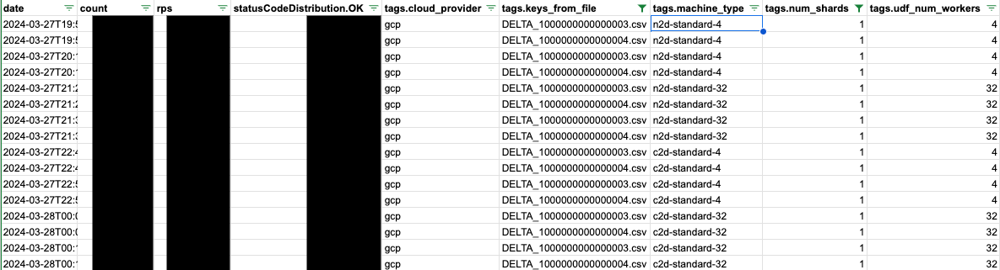

# K/V Server Instance Sizing Guide

**Author:**
<br> [Lusa Zhan][1], Google Privacy Sandbox

## Introduction

Instance sizing is a crucial aspect of configuring a key-value server for optimal performance. If the instance is too small, the server may not be able to handle the desired requests per second (RPS). On the other hand, the server may not reap the benefits of an instance that is too large, resulting in unnecessary cost to the ad tech. 

Multiple factors play a role in determining the most suitable instance size, including desired RPS, dataset size, request payload, [user-defined functions](https://github.com/privacysandbox/protected-auction-services-docs/blob/main/key_value_service_user_defined_functions.md) (UDF), and CPU usage. The most meaningful estimates will require narrowing down the possible combinations of different factors based on an ad tech’s use case.

To aid in this decision process, the K/V server provides a [benchmarking tool](https://github.com/privacysandbox/protected-auction-key-value-service/tree/main/tools/benchmarking) that automates some manual deployment and benchmarking steps. The tool accepts different deployment and request parameters, runs benchmarks, and provides a summary with the RPS of each combination of parameters. 


## Benchmarking Tool


### Overview

The <code>[deploy_and_benchmark](https://github.com/privacysandbox/protected-auction-key-value-service/blob/main/tools/benchmarking/deploy_and_benchmark)</code> tool will deploy one or multiple terraform configurations one by one and run benchmarks against the deployed server. 

The tool takes multiple input parameters, such as 


*   A file with sets of Terraform variables to override
*   Directory with snapshot files or delta files  with key value mutations of type `Update`
*   List of number of keys (`n`) to include from a snapshot file
*   (Optionally) a directory with UDFs to upload and benchmark against

Given these input parameters, the benchmarking tool completes the following steps for each combination of parameters


*   Deploy with the given set of terraform variable overrides
*   Generate requests with `n` keys from the given snapshot file
*   Run benchmarks
*   Collect results in a CSV

The output CSV file contains metadata on each benchmark iteration and the RPS that can then be analyzed by the user.

_Note: The tool does _not_ upload key-value delta/snapshot files. Please ensure those are already loaded into the blob storage bucket that the server will be reading from. Similarly, the tool will not be performing continuous data generation or upload key value delta files while the server is already running. This will need to be handled by a separate pipeline._


### Reference

For requirements and detailed usage of the tool, please refer to the [README](https://github.com/privacysandbox/protected-auction-key-value-service/blob/main/tools/benchmarking/README.md). The tool includes more flags than are outlined in this document.


### Choosing input parameters

In its simplest form, the tool can be used to iterate through a set of deployments that override the instance only. 

However, there are many other factors besides instance size that affect the server’s RPS, such as


*   Request payload size 
*   Key size and value size
*   Whether it is sharded
*   CPU usage of UDFs
*   Data loading

The tool is designed to allow iterating through some of these parameters, such as request payload and deployment variables . The benchmarking results can inform decisions around different deployment models, dataset configurations, payloads, and more. 


### A note on runtime and benchmark durations

The tool’s runtime depends on the number of combinations of input parameters it needs to iterate through and can increase significantly just by adding more combinations of input parameters. 

By default, the benchmarking tool uses a duration of 60 seconds for each iteration of a benchmark. Short benchmark iterations can be useful for initial testing with multiple variables, for instance to measure RPS across different datasets and request payloads. 

To accurately reflect production environments, it is recommended to increase the benchmark durations to several hours once the variables have been narrowed down. These benchmarks should run parallel to a data update pipeline that mimics a production environment in terms of payload, data update size, and frequency.


## Tutorial

This is a step-by-step example of how to use the tool with some parameters. The example goes through generating sample data that is loaded into the server at startup, setting input parameters for the script, and looking at the output. 

This example assumes that the dataset and the UDFs are fixed. The request payload may contain anywhere from 10 to 100 keys. Since the dataset is small, sharding will not be considered. 

It is mostly interested in which instance size to choose.


### Completing prerequisites

Follow the [requirements](https://github.com/privacysandbox/protected-auction-key-value-service/blob/main/tools/benchmarking/README.md#requirements) for running the tool. Start from the workspace root.


#### Generating data and uploading data to be loaded into KV server

Data that is loaded into the K/V server needs to be generated separately. More info in [data loading guides](https://github.com/privacysandbox/protected-auction-key-value-service/tree/main/docs/data_loading).

Some initial data should be loaded into the data storage bucket before the server is deployed to make sure the lookup calls are not retrieving nonexistent data.

Generate a delta file and upload it to the cloud storage bucket the server will be pulling data from. 


```
builders/tools/bazel-debian build tools/benchmarking/example/kv_data:generate_100_delta

KV_DELTA=bazel-bin/tools/benchmarking/example/kv_data/DELTA_1000000000000004

// If uploading to AWS. 
// AWS_S3_BUCKET should match the terraform's s3_delta_file_bucket_name 
// Ex: AWS_S3_BUCKET=s3://my-delta-file-bucket
aws s3 cp $KV_DELTA $AWS_S3_BUCKET

// If uploading to GCP
// GCLOUD_STORAGE_BUCKET should match the terraform's data_bucket_id 
// Ex: GCLOUD_STORAGE_BUCKET=gs://my-delta-file-bucket
gcloud storage cp $KV_DELTA $GCLOUD_STORAGE_BUCKET
```


When the server starts, it will load the data from the storage bucket. This initial data loading process will not affect the server’s RPS, since it should be completed before the server is ready to serve requests. 

This tutorial will not cover continuous data loading while the server is up. However, data loading does affect RPS. For a more comprehensive benchmarking test, it is recommended to update/load data as the server is running. The frequency and duration of data loading should be shorter than each benchmark iteration. For instance, if the benchmark duration is 1 hour, data loading intervals could be 20 minutes. 


#### Generating data for requests

As part of the benchmark, the tool sends requests to the server.  The requests are generated using keys from snapshot files or delta files with key value mutations of type `Update`. The tool will iterate through each delta/snapshot file in a given directory, generate one request for each, and perform benchmark iteration for each request.

The previously generated delta files from this tutorial include only `Update` key value mutations and can be used for request generation.


```
mkdir example_kv_delta
SNAPSHOT_DIR=example_kv_delta
cp $KV_DELTA $SNAPSHOT_DIR
```


#### Writing and generating UDFs

Custom UDFs should be generated and uploaded in advance. See the [guide for generating UDFs](https://github.com/privacysandbox/protected-auction-key-value-service/blob/main/docs/generating_udf_files.md). 

The provided [example UDF](https://github.com/privacysandbox/protected-auction-key-value-service/blob/main/tools/benchmarking/example/udf_code/benchmark_udf.js) is a passthrough JavaScript UDF that calls the lookup function on the input data. 


```
builders/tools/bazel-debian run //tools/benchmarking/example/udf_code:benchmark_udf_js_delta

UDF_DELTA=dist/deltas/DELTA_2000000000000001

// If uploading to AWS
aws s3 cp $UDF_DELTA $AWS_S3_BUCKET

// If uploading to GCP
gcloud storage cp $UDF_DELTA $GCLOUD_STORAGE_BUCKET
```


This is an optional step. If no custom UDF is uploaded, the server will use the [default UDF](https://github.com/privacysandbox/protected-auction-key-value-service/blob/main/public/udf/constants.h).


### Running the tool

Once the data is generated and uploaded, the input parameters for the tool can be defined.

Deployment related arguments are as follows:


```
# Set the cloud provider
CLOUD_PROVIDER="aws"
CLOUD_PROVIDER="gcp"

# Set the terraform files the tools will use to deploy the server
TF_VAR_FILE=/path/to/my.tfvars.json
TF_BACKEND_CONFIG=/path/to/my.backend.conf

# Set the URL of the server for the environment that will be deployed
# The URL will be shown as the output of the `terraform apply` command
SERVER_URL="https://demo.my-example.com"

# Mininum amount of seconds to wait after terraform apply before checking 
# server health. Sometimes terraform apply finishes, but an existing (old) 
# server may still be online for a bit.
MINIMUM_SERVER_WAIT_SECS=300
```


You will need to iterate  through different instance sizes, so create a file with terraform variables that should be overridden. Each line in the file is considered one set of terraform variable overrides and will be used for one deployment.

For instance, for AWS, we may want to iterate through these instance types:


```
instance_type=c5.4xlarge,enclave_cpu_count=12,enclave_memory_mib=24576,num_shards=1,udf_num_workers=12,instance_ami_id=ami-0c3ea8d5ff3ef70d2
instance_type=c5.12xlarge,enclave_cpu_count=36,enclave_memory_mib=73728,num_shards=1,udf_num_workers=36,instance_ami_id=ami-0c3ea8d5ff3ef70d2
instance_type=m5.4xlarge,enclave_cpu_count=12,enclave_memory_mib=49152,num_shards=1,udf_num_workers=12,instance_ami_id=ami-0c3ea8d5ff3ef70d2
instance_type=m5.12xlarge,enclave_cpu_count=36,enclave_memory_mib=147456,num_shards=1,udf_num_workers=36,instance_ami_id=ami-0c3ea8d5ff3ef70d2
```


On GCP, the file may look like this:


```
machine_type=n2d-standard-4,num_shards=1,udf_num_workers=4
machine_type=n2d-standard-8,num_shards=1,udf_num_workers=8
machine_type=n2d-standard-32,num_shards=1,udf_num_workers=32

machine_type=c2d-standard-4,num_shards=1,udf_num_workers=4
machine_type=n2d-standard-8,num_shards=1,udf_num_workers=8
machine_type=n2d-standard-32,num_shards=1,udf_num_workers=32
```


Save the file:


```
TF_OVERRIDES=${PWD}/path/to/tf_overrides.txt
```


Set the number of keys to choose to include in each benchmark iteration’s request. In this case, the tool will create two requests for the given snapshot file (in `$SNAPSHOT_DIR`)" one request with 10 keys, one request with 100.


```
NUMBER_OF_LOOKUP_KEYS_LIST="10 100"
```


Finally, choose where the summary CSV should be written:


```
OUTPUT=${PWD}/example_benchmarking_results.csv
```


Run the tool:


```
./tools/benchmarking/deploy_and_benchmark \
--cloud-provider ${CLOUD_PROVIDER} \
--server-url ${SERVER_URL} \
--tf-var-file ${TF_VAR_FILE} \
--tf-backend-config ${TF_BACKEND_CONFIG} \
--snapshot-dir ${SNAPSHOT_DIR} \
--tf-overrides  ${TF_OVERRIDES} \
--ghz-tags "${GHZ_TAGS}" \
--minimum-server-wait-secs "${MINIMUM_SERVER_WAIT_SECS}" \
--csv-output ${OUTPUT}

```


### Example output

The output is a CSV file with one row per benchmark iteration. It includes the terraform variables that were overridden for the iteration, the files that were used to generate keys for the benchmark iteration’s request, and other metadata. The **rps** column contains the number of requests per second and can be used to determine which instance size to choose.

<figure id = "benchmarking_output" align = "center">
  
  <center><figcaption><b>Figure. 1</b> Sample benchmarking tool output</figcaption></center>
</figure><br><br>


[1]: https://github.com/lusayaa
