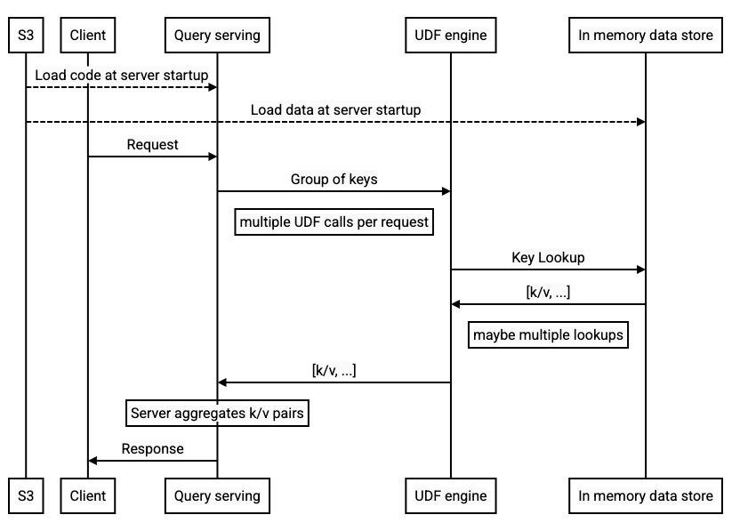

> FLEDGE has been renamed to Protected Audience API. To learn more about the name change, see the [blog post](https://privacysandbox.com/intl/en_us/news/protected-audience-api-our-new-name-for-fledge)

# Key/Value service user-defined functions (UDFs)

* Author: Lusa Zhan

* Contributor: Peiwen Hu


## Overview

The key/value service is adding support for executing user-defined functions
(UDFs). This explainer describes the planned critical user journey and API that
will need to be followed to use UDFs in the trusted key/value service. 
An initial version has been added to the
[key/value service repo](https://github.com/privacysandbox/fledge-key-value-service)
in release 0.9.0.

The UDF code snippet is loaded through a cloud file storage solution such as the
AWS S3 and will be executed when the server receives a
[query request](https://github.com/WICG/turtledove/blob/main/FLEDGE_Key_Value_Server_API.md#query-api-version-2).
Once per
[partition](https://github.com/WICG/turtledove/blob/main/FLEDGE_Key_Value_Server_API.md#request-version-20),
the request handler invokes the UDF, which can run proprietary computation logic
and in addition, has access to a read API provided by the key/value service to
query the server’s internal data store, populated by dataset from the service
operator.




<small>_The diagram above shows the basic UDF code loading and request flow:
At startup, the server loads untrusted code and data into memory.
When the client sends a request to the server, the server splits
the keys in the request into multiple groups of keys and
calls the UDF per group of keys.
The UDF can perform any number of lookup calls to the in-memory K/V data store.
The server collects the results of the UDF executions, aggregates them,
and returns them in the response to the client._</small>

By default, we will load a simple pass-through UDF that will do an internal datastore lookup
for the keys and return the values. 
To override the default UDF, see the
[UDF guide](https://github.com/privacysandbox/fledge-key-value-service/blob/main/docs/generating_udf_files.md).

For details on the broader trust model, see the [trust model explainer](https://github.com/privacysandbox/fledge-docs/blob/main/key_value_service_trust_model.md#design-principles).


## UDF fact sheet

(For the Initial phase only)

<table>
  <tr>
   <td>Characteristics
   </td>
   <td>Description
   </td>
   <td>Note
   </td>
  </tr>
  <tr>
   <td>Language supported
   </td>
   <td>Javascript, WASM
   </td>
   <td>WASM support is limited to “inline WASM” initially, where the WASM code must be invoked by a piece of javascript driver code, i.e., the UDF entrypoint must still be in javascript.
   </td>
  </tr>
  <tr>
   <td>Number of UDF implementations
   </td>
   <td>One fixed code snippet can be loaded at a time. To override a code snippet, upload a UDF configuration.  
   </td>
   <td>
   </td>
  </tr>
  <tr>
   <td>Engine
   </td>
   <td>Chrome V8
   </td>
   <td>
   </td>
  </tr>
  <tr>
   <td>Timeout
   </td>
   <td>1 second
   </td>
   <td>Currently not configurable, but will be in future iterations.
   </td>
  </tr>
  <tr>
   <td>Visibility
   </td>
   <td>Private
   </td>
   <td>Code is only known to the service operator. The code is not part of the attestation process in the trust model that requires open sourcing. Privacy constraints of the code execution are upheld by the runtime environment.
   </td>
  </tr>
</table>


## Engage and share feedback

1.  Examine the APIs proposed in the sections below. Do your use cases require
    more? Please leave feedback by posting github issues in the
    [key/value service repo](https://github.com/privacysandbox/fledge-key-value-service/issues).

2.  Provide feedback on the overall capabilities and requirements, such as:

    *   Are you interested in specific languages?
    *   What is your expected code snippet size?
    *   How often do you expect to update your UDF? What is the accepted latency
        for the code update?
    *   Do you need multiple versions of UDFs to co-exist? What is the use case?

3.  Write your UDF and test it out by following the [steps
  below](#running-the-kv-server-with-a-udf).

    The key/value service repo also includes a tool to check the compatibility of UDFs without having to spin up a K/V server (see [testing section of the UDF guide](https://github.com/privacysandbox/fledge-key-value-service/blob/main/docs/generating_udf_files.md#3-test-the-udf-delta-file)). 
    Note that the UDF feature does not yet include trust model enforcements. However, the principles are outlined in the [trust model explainer](https://github.com/privacysandbox/fledge-docs/blob/main/key_value_service_trust_model.md#design-principles) and should be followed to ensure compatibility with the final implementation.


## Running the K/V server with a UDF

1.  Write the UDF Code snippet

    The code snippet should have the following properties:

    *   Language
        *   Javascript (if desired, Javascript with inline WASM)
    *   UDF handler
        *   The code snippet should contain a UDF handler function that serves
            as the main entry point for execution.
        *   While function and parameter naming in the handler signature is up
            to Adtech, the input and output are expected to be in the specified
            format outlined in the [API](#user-defined-function-api-v1) (see
            [input](#input) and
            [output](#output)).
        *   Note that the server will pass the input as a *JSON object*, but
            expects the output to be a *serialized JSON string*.
    *   (optional) Call the [datastore read API](#datastore-read-api)
        *   The UDF can optionally make one or more `getValues` calls to get
            key-value pairs from the internal datastore.

2.  Load the code snippet

    At the moment, the UDF code snippet is loaded as a snapshot or delta file
    through AWS and should be in the same S3 bucket as other delta files.

    The snapshot or delta file itself must contain a
    [UserDefinedFunctionsConfig](https://github.com/privacysandbox/fledge-key-value-service/blob/main/public/data_loading/data_loading.fbs).

    See details on how to generate and upload UDF delta files in the
    [UDF guide](https://github.com/privacysandbox/fledge-key-value-service/blob/main/docs/generating_udf_files.md).

3.  Deploy the server

    Deploy the server either on
    [AWS](https://github.com/privacysandbox/fledge-key-value-service/blob/main/docs/deploying_on_aws.md)
    or
    [locally](https://github.com/privacysandbox/fledge-key-value-service/blob/main/docs/developing_the_server.md).

4.  Run a query

    Use
    the[ Query API](https://github.com/WICG/turtledove/blob/main/FLEDGE_Key_Value_Server_API.md#query-api-version-2)
    (v2 or above) to test the UDF.

## APIs


### User-defined function API (v1)


#### Input

The input to the UDF is a JSON object containing the
request’s context and a partition’s key group objects.
The format of the key groups are the same as in the v2
Query API.


##### Schema of the input

```json
{
  "title": "UDF Input Object",
  "description": "Input to user-defined function"
  "type": "object",
  "additionalProperties": false,
  "properties": {
    "context": {
      "description": "global context shared by all partitions",
      "type": "object",
      "additionalProperties": false,
      "properties": {
       "subkey": {
         "description": "Auxiliary key. For Chrome, it is the hostname.",
          "type": "string"
        }
      }
    },
    "keyGroups": {
      "description": "Contains information from one partition",
      "type": "array",
      "items": {
        "$ref": "#/$defs/single_key_group_object"
      }
    },
    "udfInputApiVersion": {
      "description": "UDF Input API version",
      "type": "integer"
    }
  },
  "required": ["context", "keyGroups", "udfInputApiVersion"],
  "$defs": {
    "single_key_group_object": {
     "descrption": "All keys from this group share some common attributes",
      "type": "object",
      "additionalProperties": false,
      "properties": {
        "tags": {
          "description": "List of tags describing this key group's attributes",
          "type": "array",
          "items": {
            "type": "string"
         }
        },
        "keyList": {
          "type": "array",
          "items": {
            "type": "string"
          }
        }
      }
    }
  }
}
```


Example input JSON:

```json
{
 "context": {
    "subkey": "example.com"
  },
 "keyGroups": [
      {
        "tags": [
          "structured",
          "groupNames"
        ],
        "keyList": [
          "IG1"
        ]
      },
      {
        "tags": [
          "custom",
          "keys"
        ],
        "keyList": [
          "keyA",
          "keyB"
        ]
      }
 ],
 "udfInputApiVersion": 1
}
```


#### Output

The output of the UDF is a
JSON object with a `keyGroupOutputs` property. The server uses the output to
build its response to the client.

##### Schema of the output

```json
{
 "title": "UDF Output Object",
 "description": "output of one UDF call",
 "type": "object",
  "additionalProperties": false,
  "properties": {
    "keyGroupOutputs": {
      "type": "array",
      "items": {
        "$ref": "#/$defs/single_key_group_output"
      }
    },
    "udfOutputApiVersion": {
      "description": "UDF Output API version",
      "type": "integer"
    }
  },
  "required": ["keyGroupOutputs", "udfOutputApiVersion"],
  "$defs": {
    "single_key_group_output": {
      "description": "Output for one key group",
      "type": "object",
      "additionalProperties": false,
      "properties": {
        "tags": {
          "description": "List of tags describing this key group's attributes",
          "type": "array",
          "items": {
            "type": "string"
          }
        },
        "keyValues": {
          "description": "If a keyValues object exists, it must at least contain one key-value pair. If no key-value pair can be returned, the key group should not be in the response.",
          "type": "object",
          "patternProperties": {
            ".*": {
              "$ref": "#/$defs/single_value_output"
            }
          }
        }
      }
    },
    "single_value_output": {
      "description": "One value to be returned in response for one key",
      "type": "object",
      "additionalProperties": false,
      "properties": {
        "value": {
          "type": [
            "string",
            "number",
            "integer",
            "object",
            "array",
            "boolean"
          ]
        },
        "global_ttl_sec": {
          "description": "Adtech-specified TTL for client-side caching, not dedicated to a specific subkey. In seconds. Unset means no caching.",
          "type": "integer"
        },
        "dedicated_ttl_sec": {
          "description": "Adtech-specified TTL for client-side caching, specific to the subkey in the request. In seconds. Unset means no caching.",
          "type": "integer"
        }
      },
      "required": [
        "value"
      ]
    }
  }
}
```

Example output:

```json
{
  "keyGroupOutputs": [
    {
      "tags": ["structured", "groupNames"],
      "keyValues":
          {
            "IG1": {
              "value": {
                "priorityVector": {"signal1": 1}
              }, 
              "global_ttl_sec": 1
            }
          }
    },
    {
      "tags": ["custom", "adComponentRenderUrls"],
      "keyValues": {
        "adcomponents.com/1": {
          "value": "value1", "global_ttl_sec": 120
        },
        "adcomponents.com/2": {
          "value": ["value2A", "value2B"], 
          "global_ttl_sec": 60
        }
      }
    }
  ],
  "udfOutputApiVersion": 1
}
```

### Datastore Read API

We expose a read-only API to the datastore that is accessible from within the UDF. A call to `getValues(keys)` returns the key value pairs from the datastore for the given input. It is registered as a regular Javascript function.


#### Input

The input is an array of strings that should be looked up from the datastore.


##### Schema of the input

```json
{
  "title": "getValues input",
  "type": "array",
  "items": {
    "type": "string"
  }
}
```

Example input:

```json
["lookup_key1", "lookup_key2"]
```

#### Output

The output is a ***serialized JSON string*** that needs to be parsed.

The JSON contains a map of requested keys and lookup results for each key.

*   If the key lookup is successful, the lookup result will be a string value.
*   If an error occurs during the key lookup (e.g. missing key), the lookup
    result will be a status with a non-zero status code.
    The UDF can decide which keys it wants to retry.

##### Schema of the output

```json
{
  "type": "object",
  "properties": {
    "kvPairs": {
      "type": "object",
      "patternProperties": {
         ".*": {
           "$ref": "#/$defs/single_kv_pair"
         }
      }
    }
  },
  "required": [
    "kvPairs", "outputVersion"
  ],
  "$defs": {
    "single_kv_pair": {
      "description": "A single KV pair",
      "type": "object",
      "additionalProperties": false,
      "properties": {
        "value": {
          "type": [
            "string"
          ]
        },
        "status": {
          "$ref": "#/$defs/status"
        }
      }
    },
    "status": {
      "description": "Status for a key. Set if error occurred.",
      "type": "object",
      "additionalProperties": false,
      "properties": {
        "code": {
          "type": "integer" // 0: OK, non-zero: Error 
        },
        "message": {
          "type": "string"
        }
      },
      "required": [
        "message",
        "code"
      ]
    }
  }
}
```

Example output:

```json
{
  "kvPairs": {
    "key1": {
      "value": "value1"
    },
    "key2": {
      "status": {
        "code": 2,
        "message": "Some error"
      }
    }
  }
}
```

### Example UDF snippet

```javascript
function handleRequest(input){
  ...
  for (const keyGroup of input.keyGroups) {
    const kvPairs =
      JSON.parse(getValues(keyGroup.keyList)).kvPairs;
   ...
  }
  ...
  return output;
}
```
