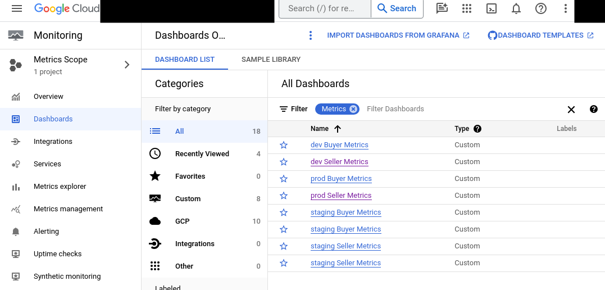
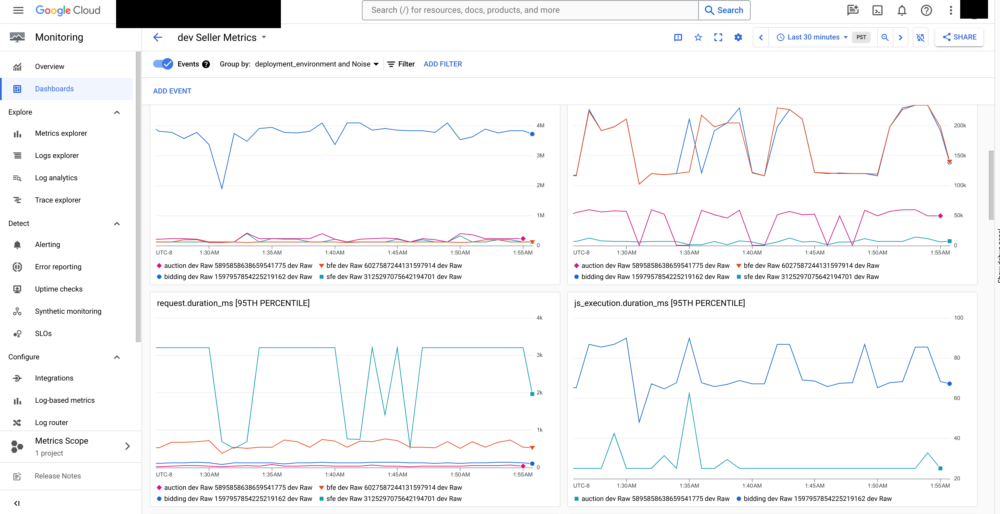
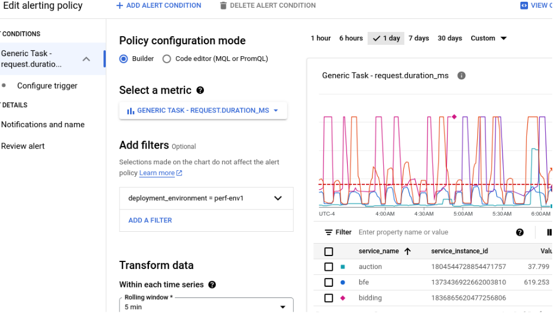
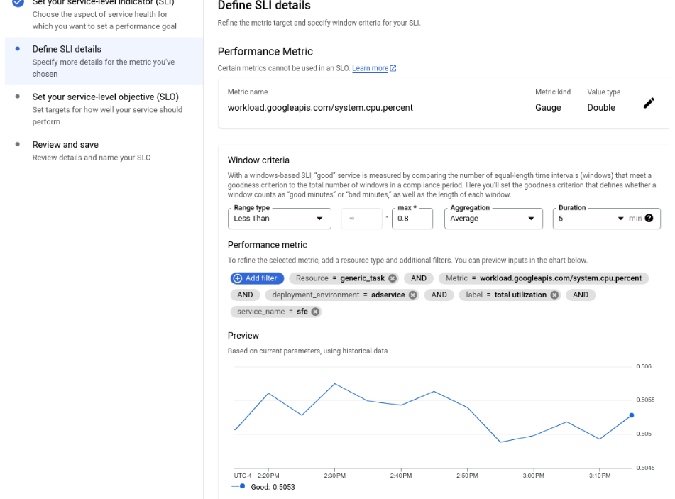
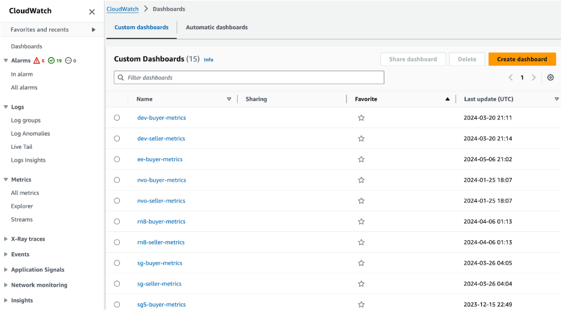
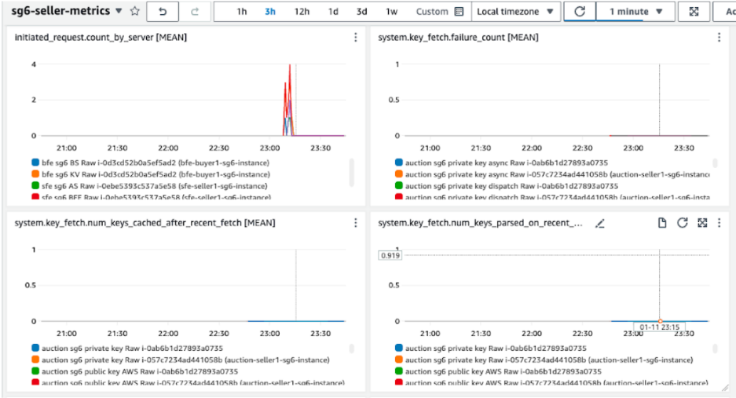
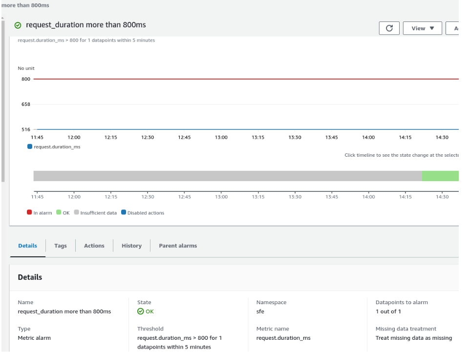
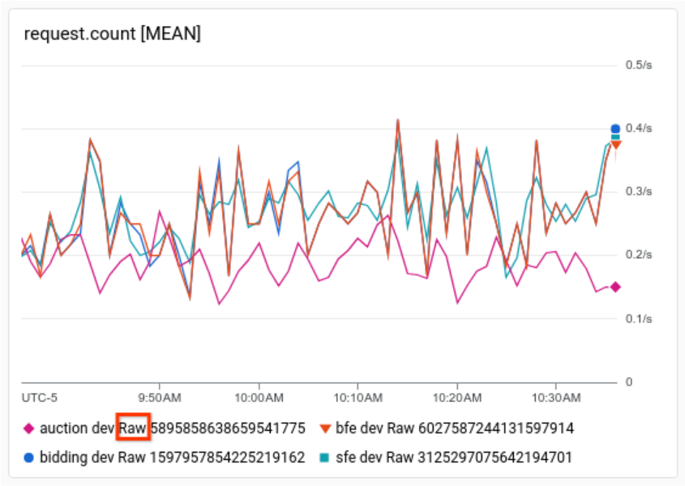
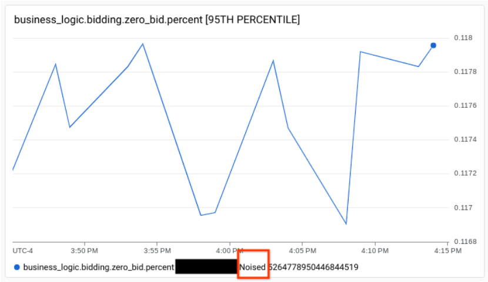
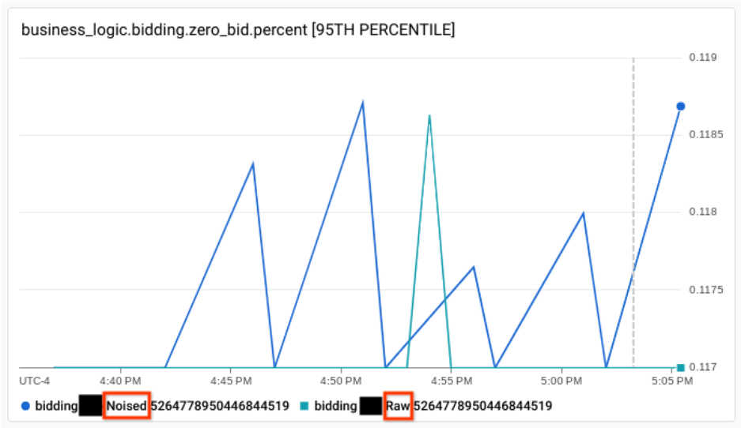

# Monitoring Protected Audience API Services

**Authors:**<br>
[Akshay Pundle](https://github.com/akshaypundle), Google Privacy Sandbox<br>
[Brian Schneider](https://github.com/bjschnei), Google Privacy Sandbox<br>
[Xing Gao](https://github.com/xinggao01), Google Privacy Sandbox<br>
[Roopal Nahar](https://github.com/roopalna), Google Privacy Sandbox<br>
[Chau Huynh](https://github.com/chau-huynh), Google Privacy Sandbox<br>

Protected Audience API ([Android](https://developer.android.com/design-for-safety/ads/fledge), [Chrome](https://developer.chrome.com/docs/privacy-sandbox/fledge/)) proposes multiple real time services ([Bidding and Auction](https://github.com/privacysandbox/fledge-docs/blob/main/bidding_auction_services_api.md) and [Key/Value](https://github.com/WICG/turtledove/blob/main/FLEDGE_Key_Value_Server_API.md) services) that run in a [trusted execution environment](https://github.com/privacysandbox/protected-auction-services-docs/blob/main/trusted_services_overview.md#trusted-execution-environment) (TEE). These are isolated environments for securely processing sensitive data, with very limited data egress. Due to the privacy guarantees of such a system, traditional ways of monitoring are not viable as they may leak sensitive information. Nevertheless, monitoring is a critical activity for operating such services.

This proposal implements mechanisms to provide telemetry data using privacy-preserving technologies. Services running inside a TEE are now able to export common system and business metrics using these mechanisms. We use methods including [differential privacy](https://en.wikipedia.org/wiki/Differential_privacy) and data aggregation to maintain the privacy-preserving nature of Protected Audience API services while providing critical metrics that will help ad techs monitor their systems effectively.

## High level Implementation

*   The servers have integrated with [OpenTelemetry](https://opentelemetry.io/) (OTel) so data can be exported to monitoring systems for creating dashboards, defining alerts and other uses.
*   System metrics are supported, such as CPU resource utilization, and server specific business metrics. These metrics are predefined in the system, instrumented into the code by the privacy sandbox developers.
*   Metrics are either non-noised or have noise added.
*   There is a subset of metrics that are sensitive and may reveal information about user activity or which might give the ad tech running a server an unfair advantage. These metrics are noised using differential privacy.
*   Other metrics do not have noise added, but are aggregated by OpenTelemetry for performance reasons, before being published.


## Code references

The metrics implementation is split into two parts:

*   Common metrics are implemented in [definition.h](https://github.com/privacysandbox/data-plane-shared-libraries/blob/main/src/metric/definition.h)
*   Metrics specific to a bidding and auction server are implemented in [server_definition.h](https://github.com/privacysandbox/bidding-auction-servers/blob/main/services/common/metric/server_definition.h).


## Properties of a metric

This section describes the properties defined in the [list of metrics](#list-of-metrics).


### Metric name

A name that uniquely identifies the metric among any Privacy Sandbox servers.


### Noising

Metrics can either have noise added or be non-noised. The list of metrics differentiates between
metrics that will be exported without noise, and metrics that will have
noise added.


### Instrument

In OpenTelemetry, metrics are recorded through [instruments](https://opentelemetry.io/docs/specs/otel/metrics/api/#instrument). We support three types of metric instruments for collection.


#### UpDownCounter

A UpDownCounter ([OTel reference](https://opentelemetry.io/docs/specs/otel/metrics/api/#updowncounter)) sums the values it receives. For example, a counter may count the total number of bytes received, or total number of milliseconds taken for computation. These are aggregatable quantities, and the counter aggregates them. Counters can be used for noised and non-noised metrics.


#### Histogram

A histogram ([OTel reference](https://opentelemetry.io/docs/specs/otel/metrics/api/#histogram)) is useful to record distributions of metrics. For example, it is useful to analyze various percentiles of the request duration or the size of the response payload. These can be recorded as a histogram. Histograms can be used for noised and non-noised metrics.


#### Gauge

A gauge ([OTel reference](https://opentelemetry.io/docs/specs/otel/metrics/api/#gauge)) is useful for collecting a non-aggregatable value such as CPU usage. Gauges can only be used for non-noised metrics.


### Attribute

Metrics can have associated attributes. Attributes common to all metrics are
listed in the [Common Attributes]( #common-attributes) section. In addition, metrics can have extra
attributes that are per-metric. These are recorded in the Attributes column in
the below table.


## List of metrics


### Common Metrics

These are common metrics tracked across all B&A servers.


| Metric Name                                         | Description                                                                     | Instrument    | Noising        | Attributes                                                                     |
|-----------------------------------------------------|---------------------------------------------------------------------------------|---------------|----------------|--------------------------------------------------------------------------------|
| request.count                                       | Total number of requests received by the server                                 | UpDownCounter | Not Noised     |                                                                                |
| request.duration_ms                                 | Total time taken by the server to execute the request                           | Histogram     | Not Noised     |                                                                                |
| request.failed_count_by_status                      | Total number of requests that resulted in failure partitioned by Error Code     | UpDownCounter | Not Noised     | Absl error code                                                                |
| request.size_bytes                                  | Request size in bytes                                                           | Histogram     | Not Noised     |                                                                                |
| response.size_bytes                                 | Response size in bytes                                                          | Histogram     | Not Noised     |                                                                                |
| system.cpu.percent                                  | CPU usage                                                                       | Gauge         | Not Noised     | total utilization, main process utilization, total load, total cpu cores       |
| system.memory.usage_kb                              | Memory usage                                                                    | Gauge         | Not Noised     | MemTotal, MemAvailable, main process                                           |
| system.thread.count                                 | Thread count                                                                    | Gauge         | Not Noised     |                                                                                |
| initiated_request.count_by_server                   | Total number of requests initiated by the server partitioned by outgoing server | UpDownCounter | Noised with DP | Server name                                                                    |
| system.key_fetch.failure_count                      | Failure counts for fetching keys with the coordinator                           | Gauge         | Not Noised     | public key dispatch, public key async, private key dispatch, private key async |
| system.key_fetch.num_keys_parsed_on_recent_fetch    | Number of keys parsed on the most recent key fetch                              | Gauge         | Not Noised     | public key GCP, public key AWS, private key                                    |
| system.key_fetch.num_keys_cached_after_recent_fetch | Number of keys currently cached in memory after the most recent key fetch       | Gauge         | Not Noised     | public key GCP, public key AWS, private key                                    |
| system.bucket_fetch.available_blobs                 | Blob availability status on server: 1 means available, 0 means removed.         | Gauge         | Not Noised     |                                                                                |
| system.bucket_fetch.blob_load_status                | Blob fetch & load status: 0 = success, > 0 maps to absl error status codes.     | Gauge         | Not Noised     |                                                                                |


### SFE Metrics

These are metrics tracked on the Seller front end B&A servers.

| Metric                                           | Description                                                                      | Instrument    | Noising        | Attributes      |
|--------------------------------------------------|----------------------------------------------------------------------------------|---------------|----------------|-----------------|
| initiated_request.auction.duration_ms            | Total duration request takes to get response back from Auction server            | Histogram     | Noised with DP |                 |
| initiated_request.auction.errors_count_by_status | Initiated requests to auction that resulted in failure partitioned by Error Code | UpDownCounter | Noised with DP | Absl error code |
| initiated_request.auction.size_bytes             | Size of the initiated Request to Auction server in Bytes                         | Histogram     | Noised with DP |                 |
| initiated_request.bfe.errors_count_by_status     | Initiated requests to BFE that resulted in failure, partitioned by Error Code    | UpDownCounter | Noised with DP | Absl error code |
| initiated_request.kv.duration_ms                 | Total duration request takes to get response back from KV server                 | Histogram     | Noised with DP |                 |
| initiated_request.kv.errors_count_by_status      | Initiated requests to KV that resulted in failure partitioned by Error Code      | UpDownCounter | Noised with DP | Absl error code |
| initiated_request.kv.size_bytes                  | Size of the Initiated Request to KV server in Bytes                              | Histogram     | Noised with DP |                 |
| initiated_response.auction.size_bytes            | Size of the initiated Response from Auction server in Bytes                      | Histogram     | Noised with DP |                 |
| initiated_response.kv.size_bytes                 | Size of the Initiated Response from KV server in Bytes                           | Histogram     | Noised with DP |                 |
| sfe.error_code                                   | Number of errors in the SFE server by error code                                 | UpDownCounter | Noised with DP | Error code      |
| sfe.initiated_request.count_by_buyer             | Total number of initiated requests per buyer                                     | UpDownCounter | Noised with DP | Buyer           |
| sfe.initiated_request.duration_by_buyer          | Initiated requests duration per buyer                                            | UpDownCounter | Noised with DP | Buyer           |
| sfe.initiated_request.errors_count_by_buyer      | Total number of initiated requests failed per buyer                              | UpDownCounter | Noised with DP | Buyer           |
| sfe.initiated_request.size_by_buyer              | Initiated requests size per buyer                                                | UpDownCounter | Noised with DP | Buyer           |
| sfe.initiated_response.size_by_buyer             | Initiated response size per buyer                                                | UpDownCounter | Noised with DP | Buyer           |


### Buyer Frontend Metrics

These are metrics tracked on the BFE B&A servers.

| Metric                                           | Description                                                                       | Instrument    | Noising        | Attributes      |
|--------------------------------------------------|-----------------------------------------------------------------------------------|---------------|----------------|-----------------|
| bfe.error_code                                   | Number of errors in the BFE server by error code                                  | UpDownCounter | Noised with DP | Error code      |
| initiated_request.bidding.duration_ms            | Total duration request takes to get response back from bidding server             | Histogram     | Noised with DP |                 |
| initiated_request.bidding.errors_count_by_status | Initiated requests to Bidding that resulted in failure, partitioned by Error Code | UpDownCounter | Noised with DP | Absl error code |
| initiated_request.bidding.size_bytes             | Size of the Initiated Request to Bidding server in Bytes                          | Histogram     | Noised with DP |                 |
| initiated_request.kv.duration_ms                 | Total duration request takes to get response back from KV server                  | Histogram     | Noised with DP |                 |
| initiated_request.kv.errors_count_by_status      | Initiated requests by KV that resulted in failure partitioned by Error Code       | UpDownCounter | Noised with DP | Absl error code |
| initiated_request.kv.size_bytes                  | Size of the Initiated Request to KV server in Bytes                               | Histogram     | Noised with DP |                 |
| initiated_response.bidding.size_bytes            | Size of the Initiated Response from Bidding server in Bytes                       | Histogram     | Noised with DP |                 |
| initiated_response.kv.size_bytes                 | Size of the Initiated Response from KV server in Bytes                            | Histogram     | Noised with DP |                 |

### Bidding Metrics

These are metrics tracked on the Bidding B&A servers.

| Metric                                  | Description                                              | Instrument    | Noising        | Attributes |
|-----------------------------------------|----------------------------------------------------------|---------------|----------------|------------|
| js_execution.duration_ms                | Time taken to execute the JS dispatcher                  | Histogram     | Noised with DP |            |
| js_execution.error.count                | No. of times js execution returned status != OK          | UpDownCounter | Noised with DP |            |
| business_logic.bidding.bids.count       | Total number of bids generated by bidding service        | UpDownCounter | Noised with DP |            |
| business_logic.bidding.zero_bid.count   | Total number of times bidding service returns a zero bid | UpDownCounter | Noised with DP |            |
| business_logic.bidding.zero_bid.percent | Percentage of times bidding service returns a zero bid   | UpDownCounter | Noised with DP |            |
| bidding.error_code                      | Number of errors in the bidding server by error code     | UpDownCounter | Noised with DP | Error code |

### Auction Metrics

These are metrics tracked on the Auction B&A servers.

| Metric                                      | Description                                                                                    | Instrument    | Noising        | Attributes              |
|---------------------------------------------|------------------------------------------------------------------------------------------------|---------------|----------------|-------------------------|
| js_execution.duration_ms                    | Time taken to execute the JS dispatcher                                                        | Histogram     | Noised with DP |                         |
| js_execution.error.count                    | No. of times js execution returned status != OK                                                | UpDownCounter | Noised with DP |                         |
| business_logic.auction.bids.count           | Total number of bids used to score in auction service                                          | UpDownCounter | Noised with DP |                         |
| business_logic.auction.bid_rejected.count   | Total number of times auction service rejects a bid partitioned by the seller rejection reason | UpDownCounter | Noised with DP | Seller_rejection_reason |
| business_logic.auction.bid_rejected.percent | Percentage of times auction service rejects a bid                                              | Histogram     | Noised with DP |                         |
| auction.error_code                          | Number of errors in the auction server by error code                                           | UpDownCounter | Noised with DP | Error code              |


## Common attributes

These attributes are consistent across all metrics tracked on the B&A servers
and will not be subjected to noise addition. This is because they are either
constant throughout the server's lifetime (such as service version) or externally
available (such as timestamp). Once differential privacy is implemented, these
attributes will be appended to the data post-noising, just prior to their
release from the TEE.

|     Attribute name     |                             Description                             |
|:----------------------:|:-------------------------------------------------------------------:|
|          Time          |                    Time the metric was released.                    |
|      Service name      |         Name of the service that the metric was measured on         |
|       Server-id        |          The id of the machine the metric was measured on.          |
|        Task-id         | Unique id of the replica index identifying the task within the job. |
| Deployment Environment |         The environment in which the server is deployed on.         |
| Server Release Version | Specifies the current version number of the server software in use  |
|      Zone/ Region      |      The GCP zone or AWS region the instances are deployed to       |
|        Operator        |              The Operator configured through terraform              |

## Integration with OpenTelemetry and monitoring systems

[OpenTelemetry](https://opentelemetry.io/) provides a cloud-agnostic API for recording metrics, traces,
and logging. The open source code running in the secure enclaves will be
instrumented using this API. The code will also be responsible for defining how
these metrics are exported from within the TEEs to the untrusted outside world.
This includes the steps defined above, like aggregation and differential
privacy. Once this telemetry leaves the secure enclave, it is available to the
ad tech to use as they please.

We expect that most ad techs will choose to use an off-the-shelf [OpenTelemetry](https://opentelemetry.io/docs/collector/)
[collector](https://opentelemetry.io/docs/collector/) to collect the data, filter or sample as desired, and then
transport the data to the monitoring system(s) of their choice. The collector
will not run in the trusted enclave, meaning the ad tech can freely change the
configuration, shaping and sending the data to systems like [AWS CloudWatch](https://docs.aws.amazon.com/AmazonCloudWatch/latest/monitoring/WhatIsCloudWatch.html),
[Google Cloud Monitoring](https://cloud.google.com/monitoring/docs) or any system that integrates with OpenTelemetry
(see [list](https://github.com/open-telemetry/opentelemetry-collector-contrib/tree/main/exporter)).

Data made available to monitoring systems can then be used to determine and
alert on system health. They can also provide valuable dashboards and debugging
information. The trusted server code guarantees that exported telemetry will not
compromise user privacy, and therefore any sort of querying of this data can be
done to benefit the ad tech that operates the system.

The OpenTelemetry Collector receives [traces](https://opentelemetry.io/docs/concepts/signals/traces/), [metrics](https://opentelemetry.io/docs/concepts/signals/metrics/), and [logs](https://opentelemetry.io/docs/concepts/signals/logs/), processes the telemetry, and exports it to a wide variety of observability backends using its components. The collector runs outside of TEE, so Ad tech can modify and configure it as they wish without affecting the code running inside the TEE.

There is a default setup for both [GCP](https://github.com/privacysandbox/bidding-auction-servers/blob/main/production/deploy/gcp/terraform/services/autoscaling/collector_startup.tftpl) and [AWS](https://github.com/privacysandbox/bidding-auction-servers/blob/main/production/packaging/aws/common/ami/otel_collector_config.yaml) deployment.
*   OTel metric is used to receive [metric](https://github.com/privacysandbox/protected-auction-services-docs/blob/main/monitoring_protected_audience_api_services.md) exported from TEE.
*   OTel log is used to receive [consented debugging log](https://github.com/privacysandbox/protected-auction-services-docs/blob/main/debugging_protected_audience_api_services.md#adtech-consented-debugging).
*   OTel trace is not used currently.


## GCP Cloud Monitoring Integration


### Configure the collector

The collector runs in an [individual instance](https://github.com/privacysandbox/bidding-auction-servers/blob/b2cfda5f00bcfa5afe92ef178a367797d0707e80/production/deploy/gcp/terraform/services/autoscaling/main.tf#L341), which is deployed with server stacks by terraform. The [collector end point ](https://github.com/privacysandbox/bidding-auction-servers/blob/b2cfda5f00bcfa5afe92ef178a367797d0707e80/production/deploy/gcp/terraform/environment/demo/seller/seller.tf#L88)is set up to point to the instance  during deployment.

The preset services are shown below, they all receive `otlp` and export to `googlecloud`.

*   `receivers` should not be changed, since the servers export `otlp`.
*   `processors` should have `batch`, which reduce system resource usage. Optionally other processers can be added, such as filter.
*   `exporters `can be replaced by any other tool ad tech prefers, such as opencensus, prometheus. It is possible to export to metric to multiple places, such as `[googlecloud, prometheus]`


```
    service:
      pipelines:
        traces:
          receivers: [otlp]
          processors: [batch]
          exporters: [googlecloud]
        metrics:
          receivers: [otlp]
          processors: [batch]
          exporters: [googlecloud]
        logs:
          receivers: [otlp]
          processors: [batch]
          exporters: [googlecloud]
```


### Dashboards

[Deploying Bidding and Auction Servers on GCP](https://github.com/privacysandbox/protected-auction-services-docs/blob/main/bidding_auction_services_gcp_guide.md) includes functionality to
export metrics to [GCP cloud Monitoring](https://cloud.google.com/monitoring/docs). Dashboards with the metrics are
included for both buyer and seller deployments. To locate the dashboards,
navigate to the Cloud Monitoring section in your GCP console. Upon opening a
dashboard, you will find various widgets displaying the instrumented metrics.
The following figures show the location of the dashboards and a sample dashboard.



**Figure 1.** Locating the dashboard



**Figure 2.** Sample Dashboard


**Terraform Configuration for dashboards:**

*   The definitions of the dashboards can be found at [Dashboard terraform](https://github.com/privacysandbox/bidding-auction-servers/tree/b27547a55f20021eb91e1e61b0d2175b4aee02ea/production/deploy/gcp/terraform/services/dashboards).
*   Customizing Metric Exporter can be done through the [metric exporter deployment config](https://github.com/privacysandbox/bidding-auction-servers/blob/b27547a55f20021eb91e1e61b0d2175b4aee02ea/production/deploy/gcp/terraform/services/autoscaling/collector_startup.tftpl#L63).


### Setting up alerts

In GCP, [alerts](https://cloud.google.com/monitoring/alerts) can be added to monitor metrics with the following steps.

1. Under cloud Monitoring - Alerting, create policy.
2. Select an existing metric.
3. Configure the trigger condition (that will generate incident) and notification from configured notification channels.
4. After being created, an alarm can be enabled/disabled. Snooze can be created to temporarily silence the alert.

See an example below.



**Figure 3.** set up alerts


### Setting up Service-Level Objective

In GCP, Service-Level Objective (SLO) can be set up with existing metrics with following steps.


1. Define a custom service under cloud Monitoring - Detect - SLOs
2. Under defined service, create SLO with Service Level Indicator (SLI) that monitors an existing metric.
3. Define a performance goal, such as 99%.
4. Once SLO defined, SLO alert can be set with lookback duration and burn rate. Notification channels can be added.

See an example below.



**Figure 4.** set up SLO


## AWS Monitoring Integration


### Configuring the collector

The collector runs on the host where the trusted server runs in the [Nitro Enclave](https://aws.amazon.com/ec2/nitro/nitro-enclaves/). As a result, the collector endpoint is set to point to the localhost port.

The preset services are shown below, they all receive `otlp` and export to `aws`.


*   `receivers` and `processors` should not be changed.
*   `exporters `can be replaced by any other tool ad tech prefers, such as opencensus, prometheus. It is possible to export to metric to multiple places, such as `[awsemf, prometheus]`


```
service:
  pipelines:
    traces:
      receivers: [otlp,awsxray]
      processors: [batch/traces]
      exporters: [awsxray]
    metrics:
      receivers: [otlp]
      processors: [batch/metrics]
      exporters: [awsemf]
    logs:
      receivers: [otlp]
      processors: [batch/logs]
      exporters: [awscloudwatchlogs]

```


### Dashboards

[Deploying Bidding and Auction Servers on AWS](https://github.com/privacysandbox/protected-auction-services-docs/blob/main/bidding_auction_services_aws_guide.md) includes functionality to
export metrics to [AWS CloudWatch](https://docs.aws.amazon.com/AmazonCloudWatch/latest/monitoring/WhatIsCloudWatch.html). Dashboards with the metrics are
included for both buyer and seller deployments. To locate the dashboards,
navigate to the CloudWatch section in your AWS console. Upon opening a
dashboard, you will find various widgets displaying the instrumented metrics.
The following figures show the location of the dashboards and a sample dashboard.



**Figure 5.** Locating aws dashboard




**Figure 6.** Sample aws Dashboard

**Terraform Configuration for dashboards:**


*   The definitions of the dashboards can be found at [Dashboard terraform](https://github.com/privacysandbox/bidding-auction-servers/tree/b27547a55f20021eb91e1e61b0d2175b4aee02ea/production/deploy/aws/terraform/services/dashboards).
*   Customizing Metric Exporter can be done through the [metric exporter deployment config](https://github.com/privacysandbox/bidding-auction-servers/blob/b27547a55f20021eb91e1e61b0d2175b4aee02ea/production/packaging/aws/common/ami/otel_collector_config.yaml#L52).

> [!NOTE]
> AWS CloudWatch dashboard doesn't support the [Otel histogram data model](https://opentelemetry.io/docs/specs/otel/metrics/data-model/#histogram), Consequently, when visualizing metrics such as latency, the dashboards can display only basic statistics like the mean (average) value, rather than more detailed percentile metrics (e.g., p95 or p99). Adtech can [configure the collector](#AWS-Monitoring-Integration) to send metric to a 3rd party dashboard that support the Otel histogram. An example configuration for this setup will be published in the future.

### Configuring alerts

In AWS, alarms can be added to monitor metrics with following steps.


1. Under CloudWatch: Alarms, Create alarm
2. Select an existing metric
3. Configure the trigger condition and notification
4. After being created, alarm can be enable/disabled

See an example below.




**Figure 7.** set up aws alerts


### Setting up SLOs

AWS SLO is still in [Preview release](https://docs.aws.amazon.com/AmazonCloudWatch/latest/monitoring/CloudWatch-Application-Monitoring-Sections.html).

More details will be added for AWS in future


## Differential privacy and noising

To uphold the privacy guarantees of the Protected Audience API, we use [differential privacy](https://github.com/google/differential-privacy) (DP) to add noise to sensitive metrics before they leave the trusted execution environment (TEE). Ad tech partners can select the specific metrics they wish to track from a list of [pre-instrumented metrics](#list-of-metrics). All servers within the same service will track this identical set of metrics.

In DP, the level of noise added depends on several factors, notably the available privacy budget. A higher budget allows for less noise, while a lower budget necessitates more. Our system establishes a total privacy budget encompassing all tracked privacy-sensitive metrics. This budget is then allocated proportionally across the metrics an ad tech partner chooses to monitor. Consequently, tracking more sensitive metrics means each receives a smaller share of the budget, resulting in increased noise per metric.

An ad tech can choose to alter how the privacy budget is distributed across different metrics. See  [privacy_budget_weight](#privacy_budget_weight) in noise-related-configuration.

Metrics that aren't privacy-sensitive don't consume any budget, and remain noise-free. Ad tech partners can track these without any alteration. The [table above](#list-of-metrics) details whether noise is added to each metric.

All metrics are aggregated on the server before being sent to the OTel collector. Noise is applied only to the privacy-sensitive metrics after this aggregation just before being sent to the collector. Non-noised metrics are pushed out aggregated, but without any noise.

Privacy-sensitive metrics are aggregated within the TEE over a period called the `ExportInterval`. Noise is added just before these aggregated metrics are released externally, to maintain differential privacy. The amount of noise added is independent of the  `ExportInterval`. A longer ExportInterval includes more data, which reduces the relative impact of the added noise. In other words, a longer ExportInterval improves the signal-to-noise ratio, resulting in more accurate data. Choosing a longer ExportInterval offers less frequent but less noisy data, whereas a shorter `ExportInterval` means more frequent data releases but with a higher relative noise level.


## Server Configuration

<code>[TELEMETRY_CONFIG](https://github.com/privacysandbox/bidding-auction-servers/blob/b2cfda5f00bcfa5afe92ef178a367797d0707e80/production/deploy/gcp/terraform/environment/demo/seller/seller.tf#L87)</code> is a flag in terraform configuration, used for all metric configuration. The content is expected to be a TextProto conforming to [TelemetryConfig](https://github.com/privacysandbox/bidding-auction-servers/blob/release-1.2/services/common/telemetry/config.proto).


### Configuring the metric collection mode

Metrics can be collected in different modes, based on the kind of [build](https://github.com/privacysandbox/bidding-auction-servers/blob/release-1.2/BUILD#L110) that is running. The build could either be `prod` or `non_prod`. The metrics collected for a `prod` build essentially default to the `PROD` metric collected behavior, i.e sensitive metrics will have noise added before exiting the TEE.

For a `non_prod` build, the `mode` parameter defines how you want to collect the metrics. The following table defines this behavior in detail.

|  <strong>Mode</strong>  |                                               <strong>Build</strong>                                                |                                                        <strong>Behavior</strong>                                                        |
|:-----------------------:|:-------------------------------------------------------------------------------------------------------------------:|:---------------------------------------------------------------------------------------------------------------------------------------:|
|    <code>OFF</code>     |                                     <code>non_prod</code> and <code>prod</code>                                     |                                                        No metrics are collected                                                         |
|    <code>PROD</code>    |                                     <code>non_prod</code> and <code>prod</code>                                     |                                                      Sensitive metrics are noised                                                       |
| <code>EXPERIMENT</code> | Only works on <code>non_prod</code> builds. Behavior is the same as <code>PROD</code> on a <code>prod</code> build. |                                                    Sensitive metrics are not noised                                                     |
|  <code>COMPARE</code>   | Only works on <code>non_prod</code> builds. Behavior is the same as <code>PROD</code> on a <code>prod</code> build. | Sensitive metrics are duplicated, with one set being noised, and the other being non-noised. Both are released for comparison purposes. |


#### Examples

With the following config, privacy sensitive metrics will have noise added.


```
mode: PROD
```


With the following config, no noise will be added to any metrics on `non_prod` builds. On `prod` build, the mode will behave like `PROD` mode, and privacy sensitive metrics will have noise added.


```
mode: EXPERIMENT
```


See [TelemetryConfig proto definition](https://github.com/privacysandbox/bidding-auction-servers/blob/release-1.2/services/common/telemetry/config.proto) for details.


### configuring-collected-metrics

To configure the set of metrics to monitor, use the <code>[TelemetryConfig::metric](https://github.com/privacysandbox/bidding-auction-servers/blob/release-1.2/services/common/telemetry/config.proto#L44)</code> field.


#### Example


```
mode: PROD
metric { name: "m_0" }
metric { name: "m_1" }
```


In the above example, only metrics names `m_0` and `m_1` will be exported.

The configured metrics can include metrics where noise will be added, or non-sensitive metrics where noise will not be added. The privacy budget will be split evenly across only the metrics where noise will be added.

If the configured metrics are empty, i.e. no metrics are configured, then all metrics, including all privacy sensitive and non-sensitive metrics are collected.


### configuring-export-interval

Export intervals for metrics with and without noise can be configured separately. The metrics without noise are aggregated purely for performance reasons, whereas the ones with noise can achieve a better signal to noise ratio with aggregation. Thus, we have separate configurations for each.

`metric_export_interval_ms` configures the export interval of non-noised metrics. The default value is 60,000ms (1 min).

`dp_export_interval_ms` configures the export interval of noised metric. The default value is 300,000ms (5 min).

> **Note:** After adjusting "export_interval_ms",  dashboard granularity (interval) should be adjusted >= this to avoid showing saw teeth pattern.

#### Example


```
mode: PROD
metric_export_interval_ms: 100000
dp_export_interval_ms:  100000
```


For further information, see the [opentelemetry.io page](https://opentelemetry.io/docs/specs/otel/metrics/data-model/#metric-points).


### noise-related-configuration

We expose several knobs to tune the noise configurations so an ad tech can most optimally use the overall privacy budget. Below are the noising parameters that ad tech can configure for each Privacy Impacting metric.


#### max_partitions_contributed

Default value: 1

The maximum number of partitions  to be reported per request, higher value results in more noise added.

Example:

This metric has buyer as partition, by configuring `max_partitions_contributed` to 2, the metric will record at most 2 buyer's data for each sfe request.
```
metric { name: \"sfe.initiated_request.to_bfe.count\" max_partitions_contributed: 2 }
```

[code link](https://github.com/privacysandbox/data-plane-shared-libraries/blob/main/src/telemetry/flag/config.proto#L63)

#### lower_bound, upper_bound

Value is set based on ad tech’s observation on the metric, which range should cover most raw data, larger range results in more noise added.

Example:


```
metric { name: \"m_0\" lower_bound: 1 upper_bound: 2 }
```

[code link](https://github.com/privacysandbox/data-plane-shared-libraries/blob/main/src/telemetry/flag/config.proto#L66)

#### privacy_budget_weight

Default value: 1

All Privacy Impacting metrics split total privacy budget based on their weight.

i.e.
`privacy_budget = total_budget * privacy_budget_weight / total_weight`

Example:


```
metric { name: \"m_0\" privacy_budget_weight: 2 }
```

[code link](https://github.com/privacysandbox/data-plane-shared-libraries/blob/main/src/telemetry/flag/config.proto#L72)

#### drop_noisy_values_probability

Default value: 0.0

The probability that noised metric value will be turned to 0. Setting this to a higher value ensures that the more noise will be turned to 0, but also means that more actual data may also be turned to 0. Setting this to 1 means all values will be turned to 0 (eliminating all noise, but also eliminating all actual data). This value should be set within an open range of (0.0,1.0).

Example:


```
metric { name: \"m_0\" drop_noisy_values_probability: 0.99 }
```


The rationale behind the approach is that the added noise has a high probability of having a small value and a low probability of having a large value, while real data with large value should be always exported. In this example, the drop_noisy_values_probability parameter 0.99 will remove any data with value no larger than 99% of noise, which could include both noise and actual data.

[code link](https://github.com/privacysandbox/data-plane-shared-libraries/blob/main/src/telemetry/flag/config.proto#L75)

## Understanding metric noise


### Privacy non-sensitive metrics

Metrics such as request count (UpDownCounter), request duration(Histogram), CPU usage(Gauge) which are non-sensitive are always exported without noise. Metrics that do not have noise added are exported with the suffix Raw, as highlighted in the figure below.



**Figure 8.** raw metric


### Privacy sensitive metrics


#### Noise

As described earlier, a total privacy budget is split evenly among the privacy sensitive metrics. These metrics define a lower and upper bound of their value. The measured value is first clamped within these bounds. Laplace noise is then applied based on the bounds and available privacy budget.

The privacy budget split weight and the bounds for metrics will be configurable in a future release.


#### Example In Prod

In `prod` server, noise will be added to Privacy sensitive metrics and exported every `dp_export_interval_ms` (see [Export interval](#configuring-export-interval)). The metrics with noise added have the suffix “Noised” added, as shown in the figure below.



**Figure 9**. noised metric


#### Compare mode (only works in non_prod builds)

To understand the impact of noise, servers running a `non_prod` build can be deployed with `TELEMETRY_CONFIG`:


```
mode: COMPARE
```


This will output metrics with and without noise as shown in the figure below. This enables their comparison side by side.




**Figure 10.** compare noised and raw metric


## Improving signal-to-noise ratio

There are tunable parameters and techniques that can be used to increase the signal to noise ratio when exporting metrics with noise.


### Higher QPS

A higher level of queries-per-second (QPS) enables more events to be aggregated per unit time. Since the noise added depends only on the metric bounds and privacy budget, it is independent of how many events are aggregated into the same batch. Increasing the number of events per batch will thus increase the signal to noise ratio and provide a more accurate measurement.


### Adjust export intervals

Similar to a higher QPS, a larger `dp_export_interval_ms` will cause more events in each export batch, thus increasing the signal to noise ratio. This improved accuracy comes at the cost of having less frequent updates.

[configuring-export-interval](#configuring-export-interval)


### Monitoring Subsets of Metrics

The privacy budget is shared among all privacy-sensitive metrics. Thus, monitoring fewer sensitive metrics means each of them gets a larger portion of the total privacy budget. This  results in lesser noise and more accurate measurements.

[configuring-collected-metrics](#configuring-collected-metrics)


### Configure noise parameters

The noise parameters give a lot of flexibility to fine-tune noising to the specific ad tech requirement. Ad tech can collect data about their actual monitoring ranges and use these parameters to optimize the noise.

[noise-related-configuration](#noise-related-configuration)
