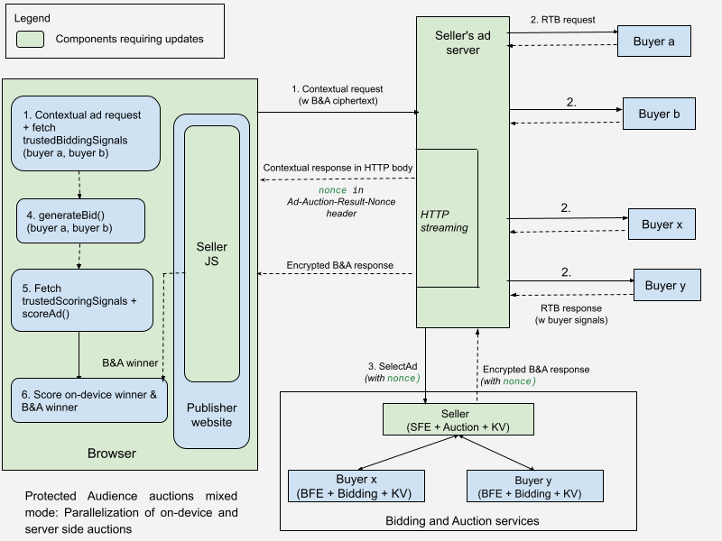
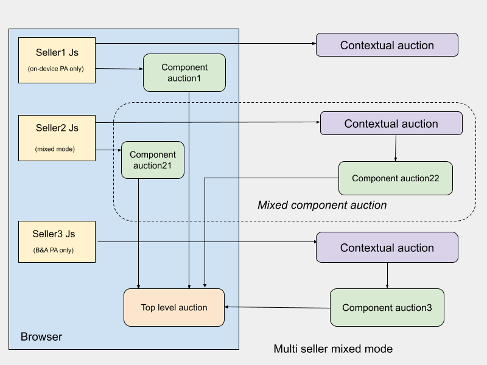

**Authors:** <br>
[Priyanka Chatterjee][1], Google Privacy Sandbox<br> 
[Paul Jensen][2], Google Chrome, Google Privacy Sandbox<br> 
Itay Sharfi, Google Privacy Sandbox

# Protected audience auctions mixed mode

Protected Audience auctions **mixed mode** would allow sellers (SSPs) and buyers (DSPs)
to participate in auctions on their preferred platform, [on-device][3] or in [Bidding & Auction services (B&A)][4]. 
We call this mixing of on-device and off-device auctions together as **mixed mode**.

If sellers run Protected Audience auctions either on-device only or in B&A only, that
might limit partner buyers they can work with, given some buyers may prefer to generate
bids either on-device or B&A. Hence, sellers can choose to support mixed-mode auctions
in order to facilitate DSP partners who may prefer on-device or B&A or both types of
platform for bidding. The auctions in mixed mode would allow sellers to run both on-device
and B&A auctions together in one overall Protected Audience auction.

In any particular seller's mixed component auction, each buyer can choose to bid either
on-device or in B&A, though not both at the same time.

For a [multi-seller auction][5], each seller can run an auction entirely on-device, 
entirely in B&A or both (a seller can further split and run a component auction on-device
for buyers preferring on-device and another component auction in B&A for buyers preferring B&A),
the choice for that is left to the seller. Refer to the [section](#multi--seller-auctions-mixed-mode)
for more details.

In this way, each Protected Audience auction can facilitate mixed mode whether it is a
[single seller auction](#single--seller-auctions-mixed-mode-architecture) or a
[multi-seller auction](#multi--seller-auctions-mixed-mode).


## Seller role in mixed Protected Audience auctions

With mixed Protected Audience auctions, sellers can support single-seller auctions and
multi-seller auctions on-device,in B&A, or both the platforms.

*   If sellers run auctions on-device, partner buyers generate bids on-device.
*   If sellers want to run auctions either in B&A or on-device, mixed mode is an option.

In case of mixed mode, sellers run two separate auction flows to support the following:

*   Buyers generating bids on-device.
*   Buyers generating bids in B&A.

_Note: Sellers require some additional work to support mixed mode. Refer to the [section](#guide-for-sellers-to-support-mixed-mode) for guidance._


## Buyer role in mixed Protected Audience auctions

Buyers can choose to generate bids either on-device, in B&A, or support either of
the platforms on a per auction basis**.

Within a Protected Audience mixed auction, buyers can generate bids either on-device or
in B&A. Note that this is true for single seller auctions and [multi-seller auctions for the web][5].


## Support for mixed mode by types of Protected Auctions

We propose Protected Audience auctions mixed mode for web browsers on desktop and Android.
Protected Auctions mixed mode is not available for Android apps.


<table>
  <tr>
   <td style="background-color: #d9d9d9"><strong>Auction type</strong>
   </td>
   <td style="background-color: #d9d9d9"><strong>Auction strategy</strong>
   </td>
   <td style="background-color: #d9d9d9"><strong>Platforms</strong>
   </td>
   <td style="background-color: #d9d9d9"><strong>Is mixed mode recommended?</strong>
   </td>
  </tr>
  <tr>
   <td rowspan="2">Single-seller auctions
   </td>
   <td>
   </td>
   <td>Web browser on desktop and Android
   </td>
   <td>Yes
   </td>
  </tr>
  <tr>
   <td>
   </td>
   <td>Android app
   </td>
   <td>No 
<p>
<em>Reason: higher latency for auctions on Android apps</em>
   </td>
  </tr>
  <tr>
   <td rowspan="3">Multi-seller auctions
   </td>
   <td><a href="https://github.com/privacysandbox/protected-auction-services-docs/blob/main/bidding_auction_services_multi_seller_auctions.md#device-orchestrated-component-auctions">Device-orchestrated component auctions</a>
   </td>
   <td>Web browser on desktop and Android
   </td>
   <td>
   </td>
  </tr>
  <tr>
   <td><a href="https://github.com/privacysandbox/protected-auction-services-docs/blob/main/bidding_auction_services_multi_seller_auctions.md#server-orchestrated-component-auction">Server-orchestrated component auctions</a>
   </td>
   <td>Android app
<p>
Web browser on desktop and Android
   </td>
   <td>No
<p>
<em>Reason: On-device auctions are not feasible</em>
   </td>
  </tr>
  <tr>
   <td><a href="https://support.google.com/admob/answer/13420272?hl=en">Waterfall and hybrid mediation</a>
   </td>
   <td>Android app
   </td>
   <td>No
   </td>
  </tr>
</table>


## Single-seller auctions mixed mode architecture

### [Recommended] Parallelization of on-device and server-side auctions

Seller's JavaScript on publisher website on browser invokes `getInterestGroupAdAuctionData()`
to get the encrypted B&A payload, and then sends ad request to seller's ad service, 
where the request includes contextual payload and encrypted B&A payload. Sellers
would stream contextual signals back to the browser as soon as they are available,
along with a [nonce][6] to kick off Protected Audience auctions on-device. In parallel,
sellers would call B&A with another nonce** to kick off Protected Audience auctions
in B&A. After receiving a response from B&A, sellers would stream the B&A winner back
to the browser.

_Note: This system architecture would facilitate on-device and B&A auctions in
parallel in one overall protected audience auction, such that no incremental
latency is added._



_In the above diagram:_
*  _Buyers who prefer generating bids on-device: buyer a, buyer b_
*  _Buyers who prefer generating bids in B&A: buyer x, buyer y_


#### Flow

_Note: The parts of the system requiring updates and additional changes required to support mixed mode,
are annotated with **[Change required]**._

##### Seller's JS on browser

*   **[Change required in seller JS]** Seller's tag on the browser decides the mode to run in the
    request path:
    *   On-device only mode
    *   Mixed mode 

*   **[Change required for payload optimization]** In order to fetch the encrypted B&A payload,
       sellers may specify only the partner buyers who prefer B&A as a platform in [`perBuyerConfig`][7]
       for payload optimization. Excluding the interest groups of buyers who prefer generating bids
       on-device, can optimize the B&A payload size. Refer to this [documentation][8] for more details. 

*   The seller's JS on the publisher website on the browser sends one ad request (with contextual
    payload and B&A ciphertext) to support both on-device auctions and B&A auctions. The ad request
    is a JavaScript Fetch initiated from the browser with `AdAuctionHeaders: true`.
    *   If on-device Protected Audience parallelization is enabled, the seller's JS invokes `runAdAuction()`
        first before sending out the contextual request, so that buyer key/value services are looked up
        in parallel to fetch `trustedBiddingSignals`. 


##### Server side auctions

*   **[Change required in seller's ad service]** Seller's ad service must work with partner buyers
       offline to record their choice of platform (on-device or B&A). It is also possible a buyer
       supports both the platforms but indicates the choice of platform through RTB response on
       a per-auction basis.
    *  Seller's ad service must maintain a service configuration with choice of platform
       (on-device or B&A) of buyers. This would facilitate sending the `perBuyerSignals`
       (as part of contextual signals) back to the browser only for on-device buyers. Similarly,
       the seller's ad service can send the `perBuyerSignals` to B&A only for the buyers
       who prefer bid generation in B&A.

*   Upon receiving the contextual ad request from the browser:
      *   Seller's ad service sends contextual / real-time-bidding (RTB) requests to buyers.
          *   _Note: Due to privacy protection, the seller's ad service cannot learn which_
              _buyers have interest groups from the B&A ciphertext._

      *   Sellers can kick off Protected Audience auctions only after the contextual signals (`perBuyerSignals`, `sellerSignals` and `auctionSignals`)
          are available. The `perBuyerSignals` are received in RTB response from on-device buyers and B&A buyers.
          *   On receiving contextual / RTB responses from all buyers, sellers may conduct the contextual ad auction
              in the seller's ad service.

      *   **[Change required in seller's ad service, B&A]** Sellers should use  [HTTP streaming][9]
              to stream contextual signals back to the browser as soon as they are available. This
              would help kick off on-device bid generation and scoring without being blocked on B&A auctions.
              The structure of the server response requires some changes to maintain good parallelization behavior.

          Once contextual signals are available:

            *   Seller's ad service generates a nonce based on [version 4 UUID][10] (128 bits). 

            *   Instead of returning the [`Ad-Auction-Result`][11] HTTP header, return an
                `Ad-Auction-Result-Nonce` header passing the nonce.

            *   Seller's ad service streams contextual signals (and contextual winner if available)
                back to the browser in the HTTP response body back to the JavaScript Fetch initiated
                by the browser with `AdAuctionHeaders: true`. 

            *   Seller's ad service calls B&A ([SellerFrontEnd service][12]) in parallel by sending
                [SelectAdRequest][13] and includes a nonce in [SelectAdRequest.AuctionConfig][14]. 

            *   After Protected Audience auctions conclude in B&A, [SellerFrontEnd service][12] includes
                the nonce in the _encrypted [AuctionResult][15] in [SelectAdResponse][16] (B&A response payload)
                and returns to the seller's ad service.

            *   Once an encrypted B&A response is returned, the seller's ad service can stream that
                back to the browser in the HTTP response body.


##### On browser

*  **[Change required in browser]** Browser accepts `Ad-Auction-Result-Nonce` header. 

*  **[Change required in browser]** Browser verifies it witnessed a Fetch request to the
     seller’s origin with `AdAuctionHeaders: true` that included an `Ad-Auction-Result-Nonce`
     response header with hash of encrypted B&A response. This would be done similar to how 
     [Ad-Auction-Result is verified][17].

*  **[Change required in browser]** Once the encrypted B&A response is received by the browser, 
     the browser verifies the nonce included in the encrypted B&A response with what included in
     the `Ad-Auction-Result-Nonce` header.

*   After Protected Audience auctions conclude on-device, the winner of on-device auction and the
    winner of B&A auction would be compared to decide the final winner. 
    There are two options for the comparison:
    *   **[Supported]** On-device and B&A winners are fed into seller's scoreAd().
    *   **[Not supported]** Alternately, browsers can do the comparison, i.e. compare score between
        B&A winner and on-device winner; instead of feeding these into seller's scoreAd().

*   _Note: No changes required to rendering or reporting flow for on-device auctions._


#### Setting nonce in HTTP header

_Refer to [Chrome and B&A integration explainer](https://github.com/WICG/turtledove/pull/1233/files) for
 additional details around setting the nonce in HTTP header._

Some background around why HTTP streaming and nonce is required.
  *   Web browsers leverage [TLS](https://en.wikipedia.org/wiki/Transport_Layer_Security) to ensure that
      the encrypted B&A response payload is in fact coming from the seller, because TLS authenticates the
      seller’s origin. Given that, B&A response must be sent back to the device, with  [SHA-256](https://en.wikipedia.org/wiki/SHA-2)
      hash of B&A response included in an HTTP response header (Ad-Auction-Result header). This is documented
      in [Chrome and B&A integration explainer][11].

  *   However, the problem is that HTTP headers are available to the browser before the response body. This
      implies that B&A response and header need to be available before contextual signals can be sent back to
      the browser and that leads to higher latency since on-device auctions can not kick off until B&A auctions
      conclude.

  This poses a problem in parallelizing B&A and on-device auctions to achieve overall lower end-to-end auction
  latency. To solve this problem, [parallelization of on-device and server side auctions][26] is proposed.


#### B&A API updates for mixed mode nonce

The following fields will be added to [SelectAdRequest.AuctionConfig][14] and [AuctionResult][15].

```

message AuctionConfig {
  // Existing fields .....

  string mixed_mode_nonce = 13;
}

message AuctionResult {
  // Existing fields .....

  string mixed_mode_nonce = 24;
}

```

### Sequential B&A auction and on-device auction

This is an alternate proposal to [parallelization of on-device and server side auctions][26].

With mixed mode, if sellers do not want to depend on [HTTP streaming][24], they can call
B&A first and then send back contextual signals and B&A response together back in the browser.
In this case, on-device auctions would need to wait for B&A auctions to conclude. Therefore,
this would add an incremental auction latency.

The flow for this proposal is the same as described for [parallelization of on-device and server side auctions][26].
The difference being the following:
*   Seller's ad server doesn't need to depend on HTTP streaming.
*   Seller's ad server doesn't need to create a nonce. 
*   Seller's ad server calls B&A services after contextual signals are available. The request
    payload doesn't include a nonce.
*   Seller's ad server continues to depend on the existing [Ad-Auction-Result HTTP header][11]
    supported by Chrome browser to include a [SHA-256](https://en.wikipedia.org/wiki/SHA-2)
    hash of encrypted B&A response.
*   Seller's ad server should send back contextual signals and the encrypted B&A response
    together back to the browser.
*   On-device auctions kick off only after contextual signals are sent back to the browser.
    Therefore, on-device auctions wait until B&A auctions conclude.


## Multi-seller auctions mixed mode



In case of a [device orchestrated component auction][5], each component level auction:
*   can happen on-device only
*   can happen in B&A only
*   can happen in mixed mode : This is similar to the component seller conducting a
    [single-seller auction ][18]in mixed mode.
    There are two sub component auctions, one to support on-device buyers and the other to support B&A buyers.

The choice for the above is up to the component seller conducting the component-level auction.


### Top-level scoring

The two winning bids from on-device auction and B&A auction can directly feed into top-level scoreAd()
that happens on the browser.

_Note: There is no additional work for sellers to support multi-seller auctions in mixed mode.
If a seller supports mixed mode for single-seller auction, that should be sufficient to support
a component-level auction in mixed mode._


## Guide for sellers to support mixed mode

*   Work with partner buyers to understand the preference of on-device auctions and B&A auctions.

*   Support [single-seller mixed mode][18].
    *   The recommended option for overall lower auction latency is [parallelization of on-device and server side auctions][26]. 
        Refer to the [timeline][19] of support.
    *   Sellers can start integrating with [sequential B&A auction and on-device auction][20]. Then incorporate
        [HTTP streaming and with nonce support][24] as a latency optimization.

*   Support [multi-seller auctions mixed mode](#multi--seller-auctions-mixed-mode).
    *   There is no additional work required for the sellers to support component level auction in mixed mode.


## Timeline for support

*   [Sequential B&A auction and on-device auction][20]: Available 

*   Web browsers and B&A services will support handling nonce: Targeting [January 2025][25]
    *   At this point, sellers will be able to support [parallelization of on-device and server side auctions][26].


## Related Documents

*   [Protected Audience API][3]
*   Bidding and Auction services [architecture][22]
*   [Browser and B&A integration][21]


## Github issues

Adtechs can file issues related to this publication on [Github][23].

[1]: https://github.com/chatterjee-priyanka
[2]: https://github.com/JensenPaul
[3]: https://github.com/WICG/turtledove/blob/main/FLEDGE.md
[4]: https://github.com/privacysandbox/protected-auction-services-docs/blob/main/bidding_auction_services_api.md
[5]: https://github.com/privacysandbox/protected-auction-services-docs/blob/main/bidding_auction_services_multi_seller_auctions.md#device-orchestrated-component-auctions
[6]: https://github.com/WICG/turtledove/blob/main/FLEDGE_browser_bidding_and_auction_API.md#step-1-get-auction-blob-from-browser
[7]: https://github.com/WICG/turtledove/blob/main/FLEDGE_browser_bidding_and_auction_API.md#step-1-get-auction-blob-from-browser
[8]: https://github.com/privacysandbox/protected-auction-services-docs/blob/main/bidding-auction-services-payload-optimization.md#payload-optimization-guide-for-sellers--ssps
[9]: https://en.wikipedia.org/wiki/HTTP_Live_Streaming
[10]: https://www.ietf.org/rfc/rfc4122.html
[11]: https://github.com/WICG/turtledove/blob/main/FLEDGE_browser_bidding_and_auction_API.md#step-3-get-response-blobs-to-browser
[12]: https://github.com/privacysandbox/protected-auction-services-docs/blob/main/bidding_auction_services_api.md#sellerfrontend-service
[13]: https://github.com/privacysandbox/bidding-auction-servers/blob/6830804052778404bdf6758fbd165dd644e91539/api/bidding_auction_servers.proto#L567
[14]: https://github.com/privacysandbox/bidding-auction-servers/blob/6830804052778404bdf6758fbd165dd644e91539/api/bidding_auction_servers.proto#L568
[15]: https://github.com/privacysandbox/bidding-auction-servers/blob/6830804052778404bdf6758fbd165dd644e91539/api/bidding_auction_servers.proto#L259
[16]: https://github.com/privacysandbox/bidding-auction-servers/blob/6830804052778404bdf6758fbd165dd644e91539/api/bidding_auction_servers.proto#L771
[17]: https://github.com/WICG/turtledove/blob/main/FLEDGE_browser_bidding_and_auction_API.md#step-4-complete-auction-in-browser
[18]: #single-seller-auctions-mixed-mode-architecture
[19]: #timeline-for-support
[20]: #sequential-BA-auction-and-on--device-auction
[21]: https://github.com/WICG/turtledove/blob/main/FLEDGE_browser_bidding_and_auction_API.md
[22]: https://github.com/privacysandbox/protected-auction-services-docs/blob/main/bidding_auction_services_api.md#high-level-design
[23]: https://github.com/WICG/protected-auction-services-discussion
[24]: #server-side-auctions
[25]: https://github.com/privacysandbox/protected-auction-services-docs/blob/main/bidding_auction_services_api.md#timelines
[26]: #recommended-parallelization-of-on-device-and-server-side-auctions
